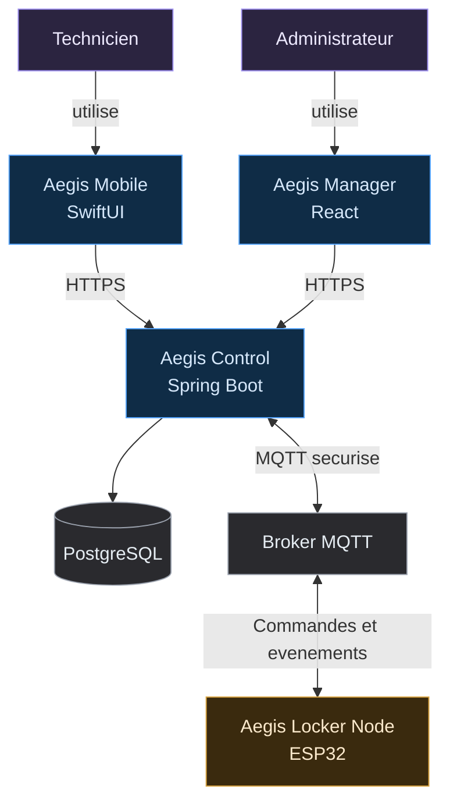

# Aegis diagrams

Use the draw.io MCP connector (`create_diagram`, `search_shapes`) for any diagram documenting Aegis physical hardware, wiring, network topology, or system/component architecture — not the inline SVG visualize tool, which is for conversational explainers only. Diagrams meant for `docs/diagrams/`, the README, or the cahier de conception should go through this connector so they stay editable, versionable, and visually consistent with every other Aegis diagram.

## Format choice

- Wiring topology, network/deployment layout, connector pinouts, floor/enclosure layout → **XML**, with `search_shapes` for electrical/network stencils when a pictorial icon adds clarity (connector, PSU, antenna). Use `routing: "libavoid"` when hand-placed nodes need clean orthogonal wires.
- Whole-system or component architecture (actors + software + infra + hardware, e.g. the README "Architecture du système" diagram), sequence of operations (checkout/return flow, MQTT command/ack/event flow), state machines (readiness, LockerOperation), or ER-style domain diagrams → **Mermaid** (`flowchart TD`, `sequenceDiagram`, `stateDiagram-v2`, `erDiagram`). Add `postLayout: "elk"` once the diagram has real branching or ≥20 nodes. See "System / actor architecture style" below for the exact template.

## Document format (mandatory — match every time)

Every diagram document (anything under `docs/diagrams/`, a diagram-carrying ADR, or a diagram destined for the README) follows the exact shape of the canonical reference, [`docs/diagrams/architecture-globale.md`](../../../docs/diagrams/architecture-globale.md) — regardless of whether the diagram itself is Mermaid or an exported XML/SVG:

1. `# <Title>` — short and specific.
2. **One description paragraph, 1–3 sentences.** What the diagram shows, plus provenance/canonical-status if relevant (e.g. "version canonique, identique au README"). Never a bullet essay.
3. **Exactly one diagram artifact.** One ```mermaid block, or one embedded image — or, for an XML/SVG-based diagram, one **light/dark theme pair** embedded via GitHub's `#gh-light-mode-only`/`#gh-dark-mode-only` fragments (see "Default conceptual style" below); a theme pair still counts as one artifact, it's the same diagram shown twice for two viewers. If a concept genuinely needs several pictorial views (front/side/back, a mechanism cross-section, a topology), compose them into a single combined multi-panel SVG rather than stacking several unrelated `` images under sub-headings — the document embeds one visual (or one visual's light/dark pair), never four different ones.
4. **Legend, only if the diagram uses a category palette** — a short table, category → contents (see "Légende des catégories" in the reference).
5. **Optional short rules/decisions recap — bullets only, ≤5 lines, one sentence each.** Design rationale and discussion history belong in an ADR or the conversation log, not in a diagram doc. Never reproduce a long "Décisions encodées"-style essay.
6. **Optional one-line status** (e.g. "Prototype / exploratoire") only if the diagram is provisional.

Skeleton:

````markdown
# <Title>

<1–3 sentence description>

```mermaid
<one flowchart>
```
<!-- or, for an XML/SVG-based diagram:  -->

## Légende des catégories   <!-- only if a category palette is used -->

| Catégorie | Contenu |
|---|---|
| ... | ... |

## <short rules/decisions recap>   <!-- optional, ≤5 bullets -->

- ...
````

`docs/diagrams/architecture-physique/` is a second worked example — one short index doc plus one doc per diagram (`architecture-physique-vues.md`, `-mecanisme-verrouillage.md`, `-connectivite.md`), each with its own light/dark SVG pair. Do not go back to the old shape it replaced (one doc stacking every SVG under sub-headings plus a long "Décisions encodées" essay).

## Vocabulary

Match the project's current terms exactly — do not reintroduce `master`/`node`:

- **hub** — the cube with the screen, compute, and network/MQTT uplink.
- **cellule** — a node cube: lock, sensor(s), no screen, no radio of its own.
- **alimentation** — the external power supply feeding the hub.

## Conventions

- Color by category, not sequence: hub = one color, cellule(s) = a second, PSU/power = neutral gray. Keep it to 2 colors + gray, same rule as the visualize tool's palette discipline.
- Label every cable with what it actually carries: `power + data`, `power only`, `MQTT/WiFi`. Never leave a connector line unlabeled in a wiring diagram — that's the ambiguity that caused the star-topology mix-up (a single point where 4 lines meet reads as one shared cable, not 4 dedicated ones; give each line its own distinct port/anchor point).
- Star topology = one dedicated port per cellule on the hub, one cable per cellule, no cable shared between cellules. Daisy-chain/loop = one hub port serving multiple cellules on a shared line. Never draw one as if it were the other.
- Keep P0 diagrams (single hub + up to 2 cellules) and product-vision diagrams (multi-cellule scaling) visually distinct — don't imply P0 commits to more hardware than `docs/cahier-conception/scope.md` §11.6/§17.5 actually requires.

## Default conceptual style (light/dark theme pair, mandatory)

For explanatory/conceptual wiring diagrams (as opposed to the electrical-block-diagram style below), every diagram ships as **two complete, single-theme SVG files** — never one file trying to be both:

- `<name>.svg` — light palette (light row below).
- `<name>-dark.svg` — dark palette (dark row below).

Embed both in the markdown doc with GitHub's native mode-fragment syntax so GitHub shows the right one per viewer:

```markdown


```

**Do not** try to do this with one file and an embedded `<style>@media (prefers-color-scheme: dark){…}</style>` block instead — that technique is unreliable (documented to fail in Safari even when it works in Chrome/Firefox) and isn't GitHub's supported mechanism. The two-file `#gh-light-mode-only`/`#gh-dark-mode-only` pair is GitHub's own documented approach (see [github.blog](https://github.blog/developer-skills/github/how-to-make-your-images-in-markdown-on-github-adjust-for-dark-mode-and-light-mode/)) and works everywhere because GitHub does the switching itself via a `<picture>` element — the SVGs themselves stay simple, static, single-theme files. A theme pair counts as one diagram artifact for the "Document format" rule above, not two.

Palette — same shapes/roles in both files, only the colors change:

| Element | Shape | fill (light) | stroke (light) | fill (dark) | stroke (dark) | fontSize |
|---|---|---|---|---|---|---|
| canvas / page background | full-page fill | `#ffffff` | — | `#1e1e1e` | — | — |
| `alimentation` (PSU) | ellipse | `#F5F5F5` | `#666666` | `#3a3a3a` | `#b0b0b0` | 12 |
| `hub` | rounded rect | `#d5e8d4` | `#82b366` | `#3d5a41` | `#8fd382` | 13 |
| `cellule N` | rounded rect | `#f5f5f5` | `#666666` | `#454545` | `#a3a3a3` | 13 |
| door/trappe (if drawn) | rect | `#FAEEDA` | `#854F0B` | `#5a4420` | `#e0a94a` | — |
| connector/plug pictogram | polygon/rect | `#EEEEEE` | `#000000` | `#4a4a4a` | `#d0d0d0` | — |
| rail/bracket bar (+ its label) | rect (+ text) | `#5F5E5A` / `#ffffff` text | — | `#7a7975` / `#ffffff` text | — | 7–9 |
| status LED / port dot (one per cellule, matches hub stroke) | small ellipse | `#82b366` | none | `#8fd382` | none | — |
| cable edge (power + data) | orthogonal edge | — | `#1a73e8` | — | `#6cb2ff` | 11, labeled `power + data` |
| primary label text | — | `#333333` | — | `#e8e8e8` | — | as noted |
| muted/caption text (legend, secondary notes) | — | `#666666` | — | `#b0b0b0` | — | 9–12 |
| door/trappe label text | — | `#412402` | — | `#f5e0b8` | — | — |
| thin leader/callout line | line | — | `#666666` | — | `#999999` | — |

This is the same palette family already in use in `docs/diagrams/architecture-physique/architecture-physique-vues.svg` — reuse those exact values rather than inventing new ones, so every physical diagram in the set looks like one family. Use `edgeStyle=orthogonalEdgeStyle` with `libavoidRouting=1;jettySize=auto` (or pass `routing: "libavoid"`) so cables route cleanly instead of crossing boxes. Give each cellule its own port dot on the hub — never let multiple cable edges share one source point.

For the electrical/engineering-accurate variant (BOM-traceable: reference designators, fuse symbols, ground symbol, connector pinouts) use `search_shapes` for `fuse`, `signal ground`, and plain labeled rectangles for board-level ICs — reserve that style for hardware-spec documents, not the cahier de conception. It still ships as a light/dark pair with the same canvas/text colors above; only the stencil colors returned by `search_shapes` are exempt from the table.

## System / actor architecture style (Mermaid)

For whole-system or component architecture diagrams — actors plus software, infra, and hardware blocks, like the README's "Architecture du système" — use Mermaid `flowchart TD` with `classDef` categories, not draw.io XML. This renders natively in GitHub Markdown, so unlike the XML styles above, **no separate `.svg`/`.png` export is needed** — paste the fenced ```mermaid block directly into the README/ADR/scope doc. The palette below is the dark-mode set (mandatory) — chosen to read clearly on a dark canvas; never substitute lighter pastel values.

Reference template — reproduce this exact style (labels, arrows, palette) every time:



What this encodes, apply it every time:

- **Two-line node labels** via `<br/>`: product/role name on line 1, technology on line 2 (`"Aegis Mobile<br/>SwiftUI"`). Persona nodes (people) stay single-line.
- **Every arrow carries a label** describing what actually crosses it (`-->|HTTPS|`, `<-->|MQTT securise|`, `-->|utilise|`) — never an unlabeled edge between two blocks, same rule as the wiring conventions above.
- **A database is a cylinder** (`DB[("PostgreSQL")]`), not a rectangle. Reserve plain rectangles for software/service/hardware/persona nodes.
- **Exactly 4 categories, one `classDef` each** — don't add a 5th color or cycle colors by position. Reuse these exact hex values every time rather than inventing new ones:

| Category | fill | stroke | text |
|---|---|---|---|
| persona (people) | `#2B2440` | `#9F91F0` | `#EDE9FE` |
| software (iOS/React/Spring) | `#0F2C46` | `#58A6FF` | `#D6E8FB` |
| infra (PostgreSQL/MQTT broker) | `#2A2A2E` | `#9CA3AF` | `#E6EDF3` |
| hardware (ESP32/locker) | `#3A2A0E` | `#D9A441` | `#FCEACD` |

- **Match existing official names exactly** — `Aegis Mobile`, `Aegis Manager`, `Aegis Control`, `Aegis Locker Node`, `Technicien`, `Administrateur` are already defined in `README.md`; never rename them or invent alternates in a new diagram.
- **Never bake a POC-gated architecture into this diagram as if committed.** `hub`/`cellule` is a documented product-vision idea still gated behind `docs/cahier-conception/scope.md` §17.5 (not decided; has a monolithic fallback) — keep `Aegis Locker Node` as the node label until that gate resolves one way or the other. Mixing a gated hypothesis into the "official" system diagram misrepresents P0 as committing to more hardware than it does.

## Where diagrams live and GitHub rendering

**GitHub does not render `.drawio`/XML files as diagrams in the file browser** — it shows raw XML text. So for every diagram meant to actually be seen on github.com (README, ADR, cahier de conception), export and commit:

- the `.drawio` source (editable, kept in sync) under `docs/diagrams/`, matching the filename to the concept (e.g. `hub-cellule-star-topology.drawio`);
- **both** rendered exports — `<name>.svg` (light) and `<name>-dark.svg` (dark) — embedded as the light/dark pair described in "Default conceptual style" above, wherever the diagram needs to be visible.

Never link only the `.drawio` file and call it done — on GitHub that reads as unrendered XML to anyone without the desktop app or the drawio browser extension installed. Never link only one of the two theme exports either — a light-only SVG is exactly the bug this rule exists to prevent (a bright white card the instant it's viewed in GitHub dark mode), and a dark-only one is unreadable for anyone on GitHub light mode.
