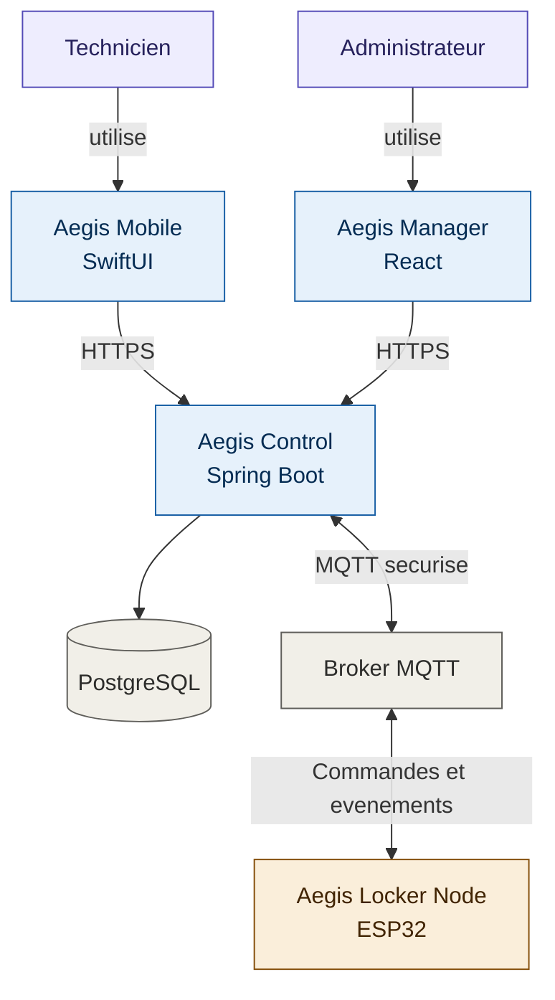

# Aegis diagrams

Use the draw.io MCP connector (`create_diagram`, `search_shapes`) for any diagram documenting Aegis physical hardware, wiring, network topology, or system/component architecture — not the inline SVG visualize tool, which is for conversational explainers only. Diagrams meant for `docs/diagrams/`, the README, or the cahier de conception should go through this connector so they stay editable, versionable, and visually consistent with every other Aegis diagram.

## Format choice

- Wiring topology, network/deployment layout, connector pinouts, floor/enclosure layout → **XML**, with `search_shapes` for electrical/network stencils when a pictorial icon adds clarity (connector, PSU, antenna). Use `routing: "libavoid"` when hand-placed nodes need clean orthogonal wires.
- Whole-system or component architecture (actors + software + infra + hardware, e.g. the README "Architecture du système" diagram), sequence of operations (checkout/return flow, MQTT command/ack/event flow), state machines (readiness, LockerOperation), or ER-style domain diagrams → **Mermaid** (`flowchart TD`, `sequenceDiagram`, `stateDiagram-v2`, `erDiagram`). Add `postLayout: "elk"` once the diagram has real branching or ≥20 nodes. See "System / actor architecture style" below for the exact template.

## Vocabulary

Match the project's current terms exactly — do not reintroduce `master`/`node`:

- **hub** — the cube with the screen, compute, and network/MQTT uplink.
- **cellule** — a node cube: lock, sensor(s), no screen, no radio of its own.
- **alimentation** — the external power supply feeding the hub.

## Conventions

- Color by category, not sequence: hub = one color, cellule(s) = a second, PSU/power = neutral gray. Keep it to 2 colors + gray, same rule as the visualize tool's palette discipline.
- Label every cable with what it actually carries: `power + data`, `power only`, `MQTT/WiFi`. Never leave a connector line unlabeled in a wiring diagram — that's the ambiguity that caused the star-topology mix-up (a single point where 4 lines meet reads as one shared cable, not 4 dedicated ones; give each line its own distinct port/anchor point).
- Star topology = one dedicated port per cellule on the hub, one cable per cellule, no cable shared between cellules. Daisy-chain/loop = one hub port serving multiple cellules on a shared line. Never draw one as if it were the other.
- Keep P0 diagrams (single hub + up to 2 cellules) and product-vision diagrams (multi-cellule scaling) visually distinct — don't imply P0 commits to more hardware than `docs/cahier-conception/scope.md` §11.6/§17.5 actually requires.

## Default conceptual style (reference palette)

For explanatory/conceptual wiring diagrams (as opposed to the electrical-block-diagram style below), use this exact palette every time so diagrams look like one family:

| Element | Shape | fillColor | strokeColor | fontSize |
|---|---|---|---|---|
| `alimentation` (PSU) | ellipse | `#F5F5F5` | `#666666` | 12 |
| `hub` | rounded rect | `#d5e8d4` | `#82b366` | 13 |
| `cellule N` | rounded rect | `#f5f5f5` | `#666666` | 13 |
| port dot (on hub, one per cellule) | 8x8 ellipse | `#82b366` (matches hub stroke) | none | — |
| cable edge (power + data) | orthogonal edge | — | `#1a73e8` | 11, labeled `power + data` |
| PSU → hub edge | orthogonal edge | — | `#666666` | — |
| legend caption | text, centered below | — | fontColor `#666666` | 12 |

Use `edgeStyle=orthogonalEdgeStyle` with `libavoidRouting=1;jettySize=auto` (or pass `routing: "libavoid"`) so cables route cleanly instead of crossing boxes. Give each cellule its own port dot on the hub — never let multiple cable edges share one source point.

For the electrical/engineering-accurate variant (BOM-traceable: reference designators, fuse symbols, ground symbol, connector pinouts) use `search_shapes` for `fuse`, `signal ground`, and plain labeled rectangles for board-level ICs — reserve that style for hardware-spec documents, not the cahier de conception.

## System / actor architecture style (Mermaid)

For whole-system or component architecture diagrams — actors plus software, infra, and hardware blocks, like the README's "Architecture du système" — use Mermaid `flowchart TD` with `classDef` categories, not draw.io XML. This renders natively in GitHub Markdown, so unlike the XML styles above, **no separate `.svg`/`.png` export is needed** — paste the fenced ```mermaid block directly into the README/ADR/scope doc.

Reference template — reproduce this exact style (labels, arrows, palette) every time:



What this encodes, apply it every time:

- **Two-line node labels** via `<br/>`: product/role name on line 1, technology on line 2 (`"Aegis Mobile<br/>SwiftUI"`). Persona nodes (people) stay single-line.
- **Every arrow carries a label** describing what actually crosses it (`-->|HTTPS|`, `<-->|MQTT securise|`, `-->|utilise|`) — never an unlabeled edge between two blocks, same rule as the wiring conventions above.
- **A database is a cylinder** (`DB[("PostgreSQL")]`), not a rectangle. Reserve plain rectangles for software/service/hardware/persona nodes.
- **Exactly 4 categories, one `classDef` each** — don't add a 5th color or cycle colors by position. Reuse these exact hex values every time rather than inventing new ones:

| Category | fill | stroke | text |
|---|---|---|---|
| persona (people) | `#EEEDFE` | `#534AB7` | `#26215C` |
| software (iOS/React/Spring) | `#E6F1FB` | `#185FA5` | `#042C53` |
| infra (PostgreSQL/MQTT broker) | `#F1EFE8` | `#5F5E5A` | `#2C2C2A` |
| hardware (ESP32/locker) | `#FAEEDA` | `#854F0B` | `#412402` |

- **Match existing official names exactly** — `Aegis Mobile`, `Aegis Manager`, `Aegis Control`, `Aegis Locker Node`, `Technicien`, `Administrateur` are already defined in `README.md`; never rename them or invent alternates in a new diagram.
- **Never bake a POC-gated architecture into this diagram as if committed.** `hub`/`cellule` is a documented product-vision idea still gated behind `docs/cahier-conception/scope.md` §17.5 (not decided; has a monolithic fallback) — keep `Aegis Locker Node` as the node label until that gate resolves one way or the other. Mixing a gated hypothesis into the "official" system diagram misrepresents P0 as committing to more hardware than it does.

## Where diagrams live and GitHub rendering

**GitHub does not render `.drawio`/XML files as diagrams in the file browser** — it shows raw XML text. So for every diagram meant to actually be seen on github.com (README, ADR, cahier de conception), export and commit both:

- the `.drawio` source (editable, kept in sync) under `docs/diagrams/`, matching the filename to the concept (e.g. `hub-cellule-star-topology.drawio`);
- a rendered `.png` or `.svg` alongside it, embedded via a normal Markdown image (``) wherever the diagram needs to be visible.

Never link only the `.drawio` file and call it done — on GitHub that reads as unrendered XML to anyone without the desktop app or the drawio browser extension installed.
