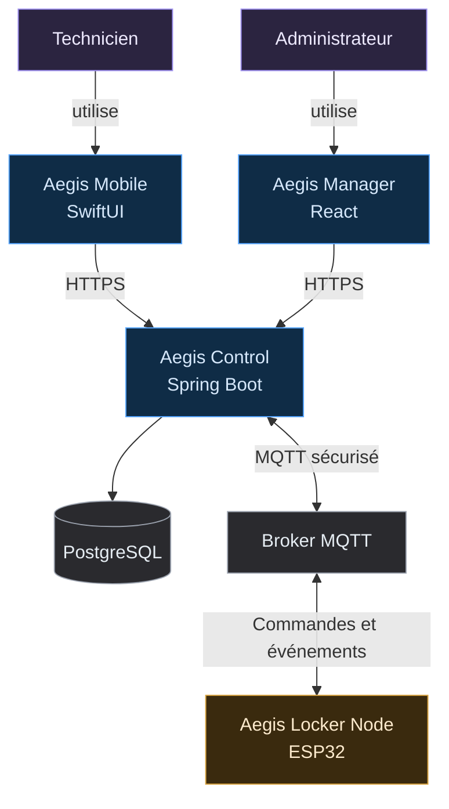
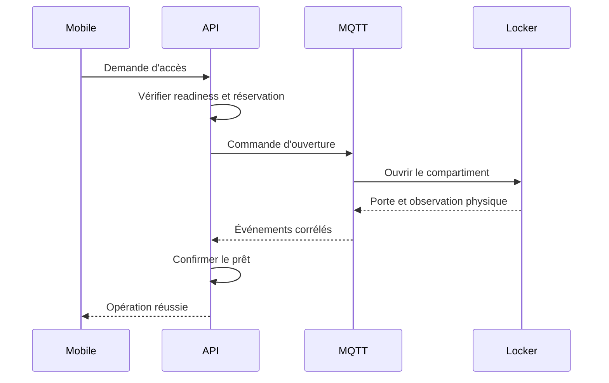

# Aegis

> **Ready assets. Ready teams.**

Aegis est un prototype de **plateforme de disponibilité opérationnelle et de traçabilité d'équipements critiques**. Il combine un casier connecté, une application iOS, une administration Web et un backend central afin que le bon équipement soit disponible, conforme, autorisé et traçable au moment où une équipe technique en a besoin.

Le projet est réalisé dans le cadre du cours **420-5X7-SO — Écosystème connecté** au Cégep de Sorel-Tracy, durant la session d'automne 2026.

| Élément | État actuel |
|---|---|
| Phase | Cadrage produit et architecture |
| Équipe | 2 étudiants |
| Prototype physique | 1 locker, 2 compartiments |
| Marché de référence | Maintenance et services techniques |
| Terrain de validation | Laboratoire technique du Cégep |
| Échéance | Semaine 15, décembre 2026 |

> [!IMPORTANT]
> Aegis est actuellement un prototype académique. Le dépôt documente une vision produit et une architecture extensible, mais ne prétend pas fournir un équipement industriel certifié ni un service prêt pour la production.

---

## Le problème

Dans les équipes de maintenance, d'inspection et de service technique, savoir qu'un équipement existe ne suffit pas. Au moment d'une intervention, il doit également être :

- physiquement présent;
- disponible;
- en état de fonctionnement;
- conforme aux exigences applicables, notamment la calibration;
- autorisé pour la personne qui souhaite l'utiliser;
- attribué et retourné avec une chaîne de possession vérifiable.

Lorsque ces informations sont dispersées entre des feuilles de calcul, des registres, des armoires à clés et la mémoire des employés, plusieurs problèmes apparaissent :

- temps perdu à chercher du matériel;
- interventions retardées;
- équipements utilisés malgré une calibration expirée;
- actifs empruntés sans responsabilité claire;
- retours incomplets, tardifs ou non enregistrés;
- inventaire numérique différent de la réalité physique;
- surachat d'équipements dont l'utilisation réelle est inconnue;
- audits manuels longs et peu fiables.

La question directrice d'Aegis est donc :

> **Comment garantir qu'un équipement critique est présent, conforme, accessible à la bonne personne et traçable pendant tout son cycle d'utilisation?**

---

## Positionnement

Aegis se positionne comme une **Critical Asset Readiness and Chain-of-Custody Platform** destinée en priorité aux petites et moyennes équipes techniques qui partagent des équipements coûteux, calibrés, spécialisés ou essentiels à leurs opérations.

### Marché de référence

- équipes de maintenance industrielle;
- ateliers techniques;
- services d'inspection;
- équipes de terrain;
- laboratoires de mesure;
- organisations possédant de 20 à 200 actifs techniques partagés.

### Équipements visés

- multimètres et appareils de mesure;
- caméras thermiques;
- détecteurs de gaz;
- clés dynamométriques;
- radios et tablettes;
- scanners;
- trousses d'inspection;
- équipements nécessitant une maintenance ou une calibration périodique.

### Acheteurs et utilisateurs

| Rôle | Besoin principal |
|---|---|
| Responsable des opérations | Éviter qu'une intervention soit retardée faute d'équipement prêt |
| Responsable de maintenance | Connaître l'état, l'usage et la disponibilité du parc |
| Responsable qualité | Empêcher l'utilisation d'un équipement non conforme |
| Gestionnaire d'atelier | Réduire les recherches, pertes et audits manuels |
| Technicien | Obtenir rapidement le bon équipement sans dépendre d'un responsable |

Le laboratoire du Cégep demeure un excellent **terrain de prototypage**. Il permet de reproduire les règles d'un environnement professionnel avec du matériel accessible, mais il ne constitue plus à lui seul le marché ni la justification économique du produit.

---

## Proposition de valeur

Aegis ne cherche pas uniquement à indiquer où se trouve un actif ou à ouvrir une serrure à distance.

Avant d'autoriser un retrait, la plateforme vérifie quatre dimensions :

```text
PRÉSENCE
L'actif est-il réellement dans le locker?

DISPONIBILITÉ
Est-il libre, non réservé et non emprunté?

CONFORMITÉ
Est-il utilisable et sa calibration est-elle valide?

AUTORISATION
Cette personne peut-elle accéder à cette classe d'équipement?
```

Si toutes les règles sont satisfaites, Aegis orchestre l'accès physique, confirme le retrait, crée le prêt et conserve la trace de l'opération. Sinon, le système bloque l'action et fournit une raison compréhensible.

La promesse peut se résumer ainsi :

> **Aegis garantit que chaque technicien reçoit un équipement disponible, conforme et traçable pour son intervention.**

---

## Ce qui différencie Aegis

Les casiers connectés et les systèmes de suivi d'actifs existent déjà. La différenciation recherchée par Aegis ne repose donc pas sur la serrure, le RFID ou l'application mobile pris séparément.

Elle repose sur la combinaison suivante :

1. **Readiness plutôt que simple inventaire** — un actif présent peut tout de même être bloqué s'il est non conforme ou non autorisé.
2. **Validation physique** — un clic dans l'application ne suffit pas à confirmer un emprunt ou un retour.
3. **Backend comme autorité métier** — ni l'application ni l'ESP32 ne peuvent décider seuls d'ouvrir un compartiment ou de modifier un prêt.
4. **Chaîne de possession explicite** — chaque retrait et retour est relié à un utilisateur, un actif, un compartiment et une opération.
5. **Architecture indépendante du capteur** — le cœur métier traite des observations; la méthode de détection peut évoluer après expérimentation.
6. **Approche adaptée aux PME** — le prototype explore une solution modulaire et plus accessible qu'une infrastructure industrielle lourde.

---

## Démonstration de référence

Le prototype comprend deux compartiments contenant deux multimètres comparables :

| Compartiment | État physique | Calibration | Résultat Aegis |
|---|---|---|---|
| `A1` | Présent | Valide | `READY` |
| `A2` | Présent | Expirée | `BLOCKED` |

Le scénario principal est le suivant :

1. Un technicien recherche un multimètre dans l'application iOS.
2. Aegis évalue les équipements correspondants.
3. Le multimètre `A2` est présent, mais bloqué parce que sa calibration est expirée.
4. Seul `A1` peut être réservé par le technicien.
5. Le backend vérifie l'identité, l'autorisation, la réservation et l'état de l'actif.
6. Une opération temporaire de retrait est créée.
7. L'ESP32 reçoit l'ordre d'ouvrir uniquement le compartiment `A1`.
8. Le retrait et la fermeture de la porte sont détectés physiquement.
9. Le backend crée le prêt et la chaîne de possession.
10. Au retour, le dépôt de l'actif est confirmé avant que le prêt soit terminé.
11. L'administration Web permet de reconstruire l'ensemble de l'opération.

Ce scénario démontre la valeur produit et l'intégration de toutes les composantes sans nécessiter un prototype industriel de grande taille.

---

## Capacités du prototype

### Aegis Mobile

Application iOS utilisée par le technicien pour :

- s'authentifier;
- consulter les équipements et leur état de readiness;
- connaître la raison d'un blocage;
- réserver un équipement admissible;
- demander l'accès au bon compartiment;
- suivre l'opération de retrait ou de retour;
- consulter son prêt actif.

### Aegis Manager

Application Web utilisée par l'administrateur pour :

- gérer le catalogue et les actifs physiques;
- associer un actif à un identifiant et à un compartiment;
- définir son état opérationnel et sa date de calibration;
- consulter les réservations et les prêts;
- surveiller le locker et ses compartiments;
- consulter les anomalies et la piste d'audit.

### Aegis Control

Backend central responsable de :

- l'authentification et des autorisations;
- l'évaluation de la readiness;
- la cohérence des réservations et des prêts;
- l'orchestration des opérations physiques;
- la communication MQTT;
- l'idempotence des commandes et événements;
- la conservation de la chaîne de possession.

### Aegis Locker Node

Prototype physique responsable de :

- contrôler deux serrures indépendantes;
- observer l'ouverture et la fermeture des portes;
- produire une observation de présence ou de mouvement;
- recevoir les commandes autorisées;
- publier les résultats, événements et états de santé.

---

## Architecture du système



### Règles de confiance

- Le backend est la seule autorité métier.
- Le Web et le mobile ne communiquent jamais directement avec les serrures.
- L'ESP32 exécute des commandes valides, mais ne décide pas qui a le droit d'emprunter.
- Une opération métier n'est confirmée qu'après réception d'observations physiques cohérentes.
- Chaque commande et événement possède un identifiant unique.
- Les doublons MQTT ne doivent pas créer plusieurs prêts ou retours.
- PostgreSQL n'est jamais exposé directement aux clients ni au contrôleur.

### Flux d'un retrait



---

## Modèle métier initial

Le modèle P0 s'articule autour des concepts suivants :

```text
User
AssetModel
Asset
AssetTag
Locker
Compartment
Reservation
Loan
LockerOperation
Device
DeviceCommand
DeviceEvent
AuditEvent
```

La readiness n'est pas un simple champ modifiable sans contrôle. Elle est dérivée de règles portant au minimum sur :

- l'état de disponibilité de l'actif;
- sa présence physique connue;
- son état opérationnel;
- la validité de sa calibration lorsqu'elle est requise;
- le niveau d'accès de l'utilisateur.

Les détails fonctionnels et les frontières du MVP sont définis dans [`docs/cahier-conception/scope.md`](docs/cahier-conception/scope.md).

---

## Prototype physique

```text
Aegis Locker Node
├── ESP32
├── compartiment A1
│   ├── serrure électronique
│   ├── capteur de porte
│   ├── indicateur LED
│   └── mécanisme de détection
├── compartiment A2
│   ├── serrure électronique
│   ├── capteur de porte
│   ├── indicateur LED
│   └── mécanisme de détection
└── alimentation sécurisée
```

### Stratégie de détection

Le RFID UHF demeure une technologie à évaluer, pas une hypothèse imposée au produit.

Le POC doit comparer sa fiabilité dans le meuble réel. Si la lecture n'est pas suffisamment localisée ou répétable, le MVP utilisera une combinaison plus déterministe, par exemple :

```text
QR ou NFC pour identifier l'actif
+
capteur de porte
+
capteur de présence ou de poids
```

Le backend reçoit des **observations physiques normalisées**. Cette séparation permet de changer la technologie du prototype sans réécrire les règles de réservation, de readiness ou de prêt.

---

## Stack technique

| Composante | Technologies principales |
|---|---|
| Administration Web | React, TypeScript, Vite, TanStack Query |
| Application mobile | Swift, SwiftUI, async/await, URLSession |
| Backend | Java, Spring Boot, Spring Security, Spring Data JPA, Bean Validation |
| Base de données | PostgreSQL, Flyway |
| IoT | ESP32, C++ / Arduino Framework |
| Messagerie | MQTT |
| Infrastructure | Docker Compose, reverse proxy HTTPS |
| Documentation | Markdown, Mermaid, ADR |

Le backend est développé comme un **monolithe modulaire organisé par fonctionnalité**. Une architecture microservices n'apporterait aucune valeur proportionnelle au prototype.

Exemple de modules :

```text
com.aegis
├── identity
├── asset
├── readiness
├── reservation
├── loan
├── locker
├── operation
├── device
├── audit
└── shared
```

---

## Organisation du dépôt

```text
aegis/
├── apps/
│   ├── admin-web/
│   └── ios/
├── services/
│   └── api/
├── firmware/
│   └── locker-controller/
├── infra/
│   ├── docker/
│   └── mqtt/
├── docs/
│   ├── journal/
│   ├── cahier-conception/
│   ├── architecture/
│   ├── diagrams/
│   ├── adr/
│   ├── research/
│   └── meetings/
├── .github/
├── README.md
├── CONTRIBUTING.md
├── .editorconfig
└── .gitignore
```

Le service `vision` de l'ancienne structure a été retiré du cœur du produit. Une assistance AI Vision pourra être explorée ultérieurement, mais elle n'est ni une dépendance architecturale ni une capacité du MVP.

---

## Stratégie de développement

Le développement suit des **vertical slices** et commence par un walking skeleton qui prouve la communication entre toutes les plateformes :

```text
PostgreSQL + broker MQTT
        ↓
Spring Boot : health check, migration et consommation MQTT
        ↓
React : état de l'API et du locker
        ↓
Simulateur ou ESP32 : heartbeat
        ↓
iOS : appel HTTPS vers l'API
```

Les tranches métier sont ensuite livrées dans cet ordre :

1. registre d'actifs et calcul de readiness;
2. réservation d'un actif admissible;
3. opération physique de retrait;
4. création automatique du prêt;
5. opération physique de retour;
6. anomalies, audit et durcissement de la sécurité.

### Jalons principaux

| Période | Résultat attendu |
|---|---|
| Semaines 2–3 | Scope, User Story Map, architecture et choix du matériel de POC |
| Semaines 3–4 | Walking skeleton et POC de détection |
| Semaines 5–7 | Identité, actifs, readiness, réservation et IoT |
| Semaines 8–9 | Retrait complet et création du prêt |
| Semaine 10 | Retour complet |
| Semaine 11 | Anomalies, idempotence et sécurité |
| Semaine 12 | Gel fonctionnel du P0 |
| Semaines 13–14 | Stabilisation, documentation et répétitions |
| Semaine 15 | Présentation finale |

---

## Mesures de succès

Le prototype doit démontrer des résultats vérifiables :

- un actif non conforme est bloqué même s'il est physiquement présent;
- un utilisateur insuffisamment autorisé ne peut pas accéder à un actif restreint;
- le bon compartiment est ouvert pour la bonne opération;
- le prêt n'est créé qu'après confirmation physique du retrait;
- le retour n'est complété qu'après confirmation physique du dépôt;
- l'historique permet de reconstruire qui a utilisé quel actif et quand;
- un événement dupliqué ne produit pas une deuxième transition métier;
- l'état logiciel converge en quelques secondes après l'événement physique;
- le parcours réussit au moins 10 retraits et 10 retours consécutifs sans modification manuelle de la base de données.

Les indicateurs commerciaux tels que la réduction des pertes, du temps de recherche ou des interventions retardées sont au cœur du positionnement. Ils devront toutefois être présentés comme **hypothèses à valider**, et non comme bénéfices déjà prouvés par ce prototype académique.

---

## Périmètre résumé

| P0 — obligatoire | P1 — après le parcours complet | Hors scope de la session |
|---|---|---|
| Readiness minimale | Maintenance structurée | Produit industriel certifié |
| Réservation | Notifications | Déploiement massif |
| Retrait et retour physiques | Gestion de kits | SaaS multi-organisation complet |
| Chaîne de possession | Mesure de batterie | Intégrations ERP/CMMS |
| Web, iOS, API et ESP32 | Statistiques simples | IA décisionnelle |
| Sécurité et audit minimal | Écran central | Application Android |

Le document de référence en cas de doute reste le [`scope.md`](docs/cahier-conception/scope.md).

---

## Méthode de travail

Le projet est développé par deux personnes avec :

- GitHub Issues pour les tâches traçables;
- branches courtes par fonctionnalité;
- Pull Requests et revue de code;
- Conventional Commits;
- ADR pour les décisions structurantes;
- journaux de bord hebdomadaires;
- tests automatisés pour les règles métier critiques;
- simulateur IoT afin de ne pas bloquer le logiciel sur le matériel.

Branches recommandées :

```text
feature/*
fix/*
docs/*
research/*
```

Exemples de commits :

```text
feat(readiness): reject assets with expired calibration
feat(operation): correlate checkout events by operation id
research(rfid): document compartment isolation results
docs(scope): clarify detection fallback
```

---

## Documentation

| Document | Rôle |
|---|---|
| [`scope.md`](docs/cahier-conception/scope.md) | Frontières, P0, P1, hors scope et critères de succès |
| `user-story-map.md` | Parcours utilisateurs et ordre des stories |
| `domain-model.md` | Concepts métier, relations et invariants |
| `state-machines.md` | États et transitions des réservations, prêts et opérations |
| `communication.md` | Contrats REST et MQTT |
| `docs/adr/` | Décisions architecturales importantes |
| `docs/journal/` | Évolution réelle du projet semaine après semaine |

Les liens seront activés au fur et à mesure que les documents correspondants seront ajoutés au dépôt.

---

## Équipe et contexte académique

- **Philippe Jordan Monfouayi Mba**
- **Yoël Jimmy Razafindretsa**

**Cours :** 420-5X7-SO — Écosystème connecté  
**Établissement :** Cégep de Sorel-Tracy  
**Session :** Automne 2026

---

## Statut du projet

Aegis se trouve actuellement en **phase de cadrage produit et d'architecture**. Aucune fonctionnalité n'est considérée comme terminée tant qu'elle n'a pas été intégrée et démontrée de bout en bout.

Les prochaines décisions structurantes sont :

1. valider le scope repositionné avec l'équipe et l'enseignant;
2. construire la User Story Map;
3. figer le modèle de domaine et les machines à états;
4. tester la méthode de détection physique;
5. réaliser le walking skeleton Web–API–PostgreSQL–MQTT–ESP32–iOS.
