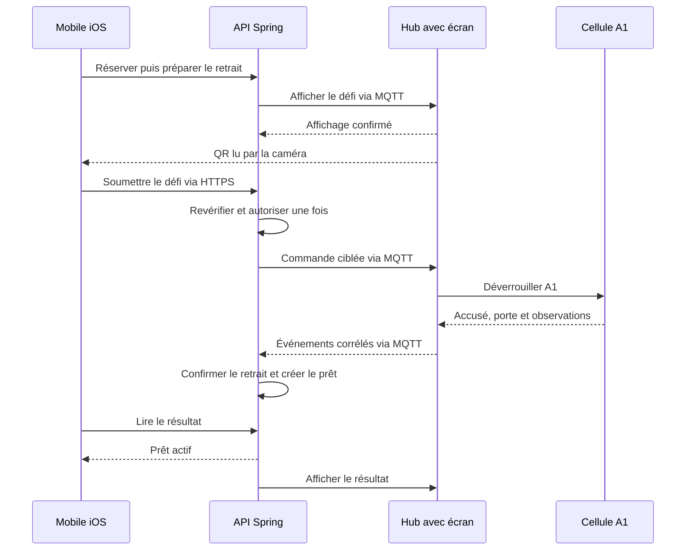
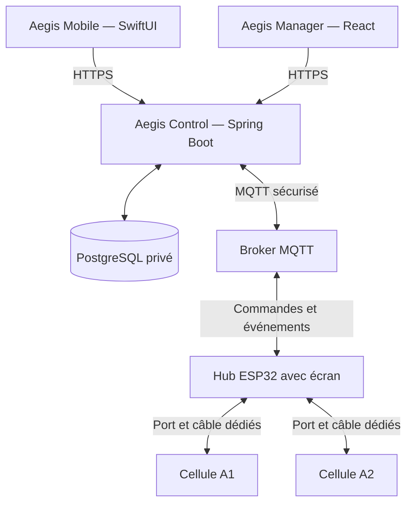

# Aegis

> **Ready assets. Ready teams.**

Aegis est un prototype de **plateforme de disponibilité opérationnelle et de chaîne de possession pour des équipements critiques partagés**. Il relie une application iOS, une administration Web et un casier connecté pour vérifier qu’un équipement est présent, disponible, conforme et autorisé avant son retrait.

Le marché de référence est celui des équipes de maintenance, d’inspection et de services techniques. Le laboratoire du Cégep de Sorel-Tracy constitue le terrain de validation.

| Repère | Situation au 23 septembre 2026 |
|---|---|
| Cours | 420-5X7-SO — Écosystème connecté, automne 2026 |
| Équipe | Philippe Jordan Monfouayi Mba et Yoël Jimmy Razafindretsa |
| Prototype | Un hub avec écran et deux cellules indépendantes, A1 et A2 |
| Estimation matérielle | Repère initial de 500 $ CA; enveloppe finale à décider après nomenclature, inventaire et POC |
| Échéance | Semaine pédagogique 15, le 23 décembre 2026 |

Ce prototype académique vise une démonstration répétable. Les performances, la fiabilité industrielle et les bénéfices commerciaux ne sont pas présentés comme déjà démontrés.

## La valeur démontrée

Un inventaire peut déclarer un outil disponible alors qu’il est emprunté, absent, endommagé, non calibré ou inaccessible à son demandeur. Aegis évalue sa **readiness pour un utilisateur donné** : `READY`, `BLOCKED` ou `UNKNOWN`, avec une raison explicite.

La démonstration utilise deux équipements comparables : A1 est présent, disponible et conforme; A2 est présent mais sa calibration a expiré. Pour un technicien autorisé, A1 peut être réservé et A2 est bloqué avec la raison `CALIBRATION_EXPIRED`.

## Parcours de retrait et de retour

1. Le technicien se connecte sur iOS et consulte les actifs admissibles.
2. Il réserve A1 jusqu’à une heure choisie dans la plage d’exploitation définie par l’administrateur. **La réservation, même distante, n’ouvre aucune porte.**
3. Il prépare son retrait. Le backend fait afficher sur le hub un QR temporaire lié à cette opération et à son compte.
4. Le technicien scanne ce QR. Le backend revérifie les droits, la réservation et les conditions actuelles, puis autorise une commande pour A1 uniquement.
5. Après l’accusé de commande, l’ouverture, le retrait et la fermeture, les observations physiques permettent au backend de créer le prêt.
6. Au retour, un nouveau parcours avec QR puis confirmation physique permet de terminer le prêt. La readiness est recalculée.

Le broker relaie les échanges MQTT du diagramme. Le QR est lu optiquement : le téléphone ne se connecte pas au hub. Un code relayé par photo ou vidéo reste une limite de ce contrôle; il ne constitue pas une garantie absolue de présence physique. Le QR autorise l’accès, tandis que les capteurs confirment le mouvement de l’actif.

## Architecture

| Composante | Responsabilité |
|---|---|
| Mobile — SwiftUI | Authentification, catalogue, réservation, scan QR, suivi du retrait et du retour |
| Web — React/TypeScript | Catalogue, règles de conformité, horaires, supervision et audit |
| API — Java/Spring Boot | Seule autorité métier; monolithe modulaire, transactions et autorisations |
| PostgreSQL/Flyway | Historique, contraintes d’intégrité, migrations, déduplication et outbox |
| MQTT | Échanges authentifiés entre le backend et le hub; canaux distincts pour commandes, événements et statuts |
| Hub et cellules — ESP32/firmware | Affichage, exécution ciblée, acquisition des capteurs et remontée d’observations |

Les clients communiquent uniquement avec l’API. PostgreSQL reste privé. Le hub et les cellules exécutent les commandes autorisées; ils ne créent ni réservation ni prêt et n’accordent aucun droit métier.

## Prototype physique

La **topologie en étoile est retenue** : chaque cellule correspond à un compartiment et possède son propre câble vers un port du hub. Le P0 comporte deux cellules, même si leur fixation prévoit des extensions.

- L’écran du hub fait partie du P0 : QR d’accès, consignes et résultat fourni par le backend.
- Un M12 codé A à 5 contacts est recommandé pour la revue d’équipe; le RJ45 propriétaire étudié initialement demeure une option économique. Le choix final, le brochage et le dimensionnement restent à valider conjointement.
- Deux segments RS-485 indépendants constituent une réalisation proposée de l’étoile. Le protocole local et les composants ne sont pas déclarés validés avant le POC.
- La détection principale prévue est le RFID UHF local par cellule. Sa localisation et sa stabilité doivent être mesurées. Le repli associe identification QR/NFC de l’actif, porte et présence/poids, conformément au scope.

L’[architecture physique](docs/cahier-conception/12-architecture-physique.md) distingue les décisions retenues, les interfaces à réaliser et les essais attendus.
La [nomenclature matérielle candidate](docs/research/nomenclature-materielle-candidate.md)
chiffre toutes les fonctions connues, distingue les prix sourcés des provisions
et calcule une enveloppe de planification. Elle sert à préparer l’inventaire, les
POC et la décision d’équipe; elle ne constitue pas une liste d’achat approuvée.

## Invariants du P0

- Une seule réservation active par technicien et par actif; sa fin reste dans les heures d’exploitation.
- La réservation du demandeur est prise en compte lors du retrait : elle ne bloque pas son propre titulaire.
- Une réservation ou un défi QR ne commande jamais, à lui seul, l’ouverture.
- Une commande expirée, rejouée ou destinée à une autre cellule n’est pas exécutée une seconde fois.
- Le délai physique de 120 secondes commence après autorisation locale; les essais ne le prolongent pas.
- Un prêt commence et se termine uniquement après des observations physiques cohérentes, incluant la fermeture de porte.
- Dépasser `Loan.dueAt` indique un retard et **ne rend jamais l’actif réservable**.
- Le retour d’un actif emprunté n’exige pas qu’il soit `READY` : un actif endommagé ou non calibré doit pouvoir revenir par le parcours autorisé.
- Une anomalie ne peut pas être résolue administrativement sans correction vérifiable de la situation.

## Périmètre et critères de réussite

| P0 | P1 après le parcours complet | P2 / hors engagement de la session |
|---|---|---|
| Identité, catalogue, readiness et horaires | Workflow de maintenance | Kits et interventions |
| Réservation, QR local, retrait et retour | Notifications et statistiques simples | Multi-site et intégrations ERP/CMMS |
| Deux cellules, écran minimal et capteurs | Interfaces enrichies | AI Vision et recommandations |
| Audit, anomalies, idempotence et simulateur | Historique mobile enrichi | Application Android |

La cible finale est **10 retraits et 10 retours consécutifs**, sans intervention manuelle dans PostgreSQL et sans double effet lors du rejeu d’un message. Les refus, expirations, anomalies et redémarrages doivent aussi être démontrés. Les exigences complètes figurent dans le [scope](docs/cahier-conception/02-scope.md).

## Organisation du dépôt et du travail

| Emplacement | Contenu |
|---|---|
| `apps/admin-web/` | Administration React |
| `apps/ios/` | Application SwiftUI |
| `services/api/` | API Spring Boot et migrations Flyway |
| `firmware/locker-controller/` | Firmware du hub et des cellules |
| `infra/docker/`, `infra/mqtt/` | Environnement reproductible et broker |
| `docs/cahier-conception/` | Documents 02–15 ci-dessous |
| `docs/architecture/`, `docs/diagrams/`, `docs/research/` | Dessins, sources des diagrammes et résultats de POC |
| `docs/journal/`, `docs/meetings/` | Travail réellement effectué et décisions de réunion |
| `AGENTS.md`, `.claude/`, `.codex/`, `.agents/skills/` | Configuration partagée de l’assistance au développement |

Philippe porte principalement le logiciel; Jimmy porte principalement le matériel. La capacité garantie de référence est de **11 h/semaine pour Philippe** et **7 h/semaine pour Jimmy**, dont 7 h communes à l’école. La répartition précise du firmware reste à confirmer; le [plan d’exécution](docs/cahier-conception/14-plan-iterations-semaines-4-a-15.md) expose l’hypothèse et la charge de chaque personne.

Le développement iOS nécessitant les Macs de l’école, ses compilations et essais sont prévus pendant ces séances. Les quatre heures hors cours de Philippe servent prioritairement au backend, au Web, au simulateur, aux tests et à la documentation.

Linear est l’outil envisagé pour le backlog opérationnel. Le document 11 conserve la carte des parcours et les références stables des stories; Linear suivra responsables, état et cycle. GitHub conserve code, revues et historique des documents. Claude Code et Codex assistent ces tâches; les deux membres gardent la responsabilité des décisions et des validations.

Le [guide de travail avec les agents et les skills](docs/ai/agentic-workflow.md) explique la séparation entre instructions, skills, sous-agents et outils, ainsi que la stratégie de contexte commune à Claude Code et Codex.

Le travail avance par petites tranches intégrées, avec une tâche d’exécution active par personne, une revue croisée et des preuves de fonctionnement. Les commandes de lancement seront documentées à mesure que les composants seront réellement initialisés et testés; ce README ne suppose pas un environnement déjà opérationnel.

## Documentation de référence

Le scope fixe les engagements. Les autres documents le détaillent; une modification structurante passe par une décision explicite. Les variantes encore proposées sont signalées dans le registre des ADRs.

| Document | Contenu |
|---|---|
| [02 — Scope](docs/cahier-conception/02-scope.md) | P0, limites, exigences et acceptation |
| [03 — Dictionnaire](docs/cahier-conception/03-dictionnaire-de-donnees.md) | Vocabulaire, données et règles métier |
| [04 — Modèle logique](docs/cahier-conception/04-modele-de-donnees-logique.md) | Entités, responsabilités et relations |
| [05 — Machines à états](docs/cahier-conception/05-machines-a-etats.md) | Réservations, prêts, opérations et anomalies |
| [06 — Algorithmes](docs/cahier-conception/06-algorithmes-et-flux-fonctionnels.md) | Décisions et parcours fonctionnels |
| [07 — Flux de données](docs/cahier-conception/07-flux-de-donnees.md) | Échanges entre acteurs, traitements et stockages |
| [08 — PostgreSQL](docs/cahier-conception/08-modele-physique-postgresql.md) | Tables, contraintes, index et transactions |
| [09 — REST](docs/cahier-conception/09-contrats-rest.md) | Routes, payloads, erreurs et idempotence HTTP |
| [10 — MQTT](docs/cahier-conception/10-contrats-mqtt.md) | Topics, messages, sécurité et comportement du hub |
| [11 — Story Map et backlog](docs/cahier-conception/11-user-story-map-p0.md) | Parcours, stories et premiers tickets à saisir |
| [12 — Architecture physique](docs/cahier-conception/12-architecture-physique.md) | Hub, deux cellules, interfaces et vérification matérielle |
| [13 — Décisions d’architecture](docs/cahier-conception/13-registre-adrs-proposes.md) | ADRs, décisions actées et arbitrages restants |
| [14 — Plan d’exécution](docs/cahier-conception/14-plan-iterations-semaines-4-a-15.md) | Capacité par personne, cycles, jalons et organisation Linear |
| [15 — Cahier de conception](docs/cahier-conception/15-cahier-de-conception.md) | Synthèse de validation destinée à la remise académique |
