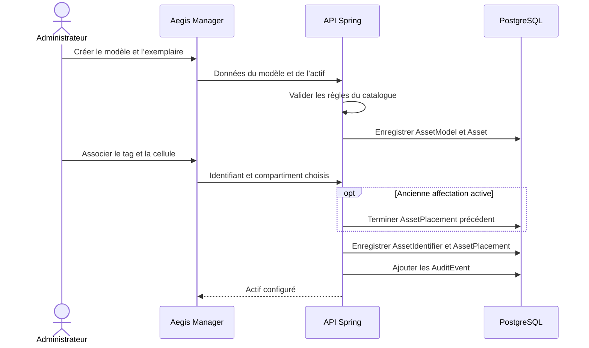
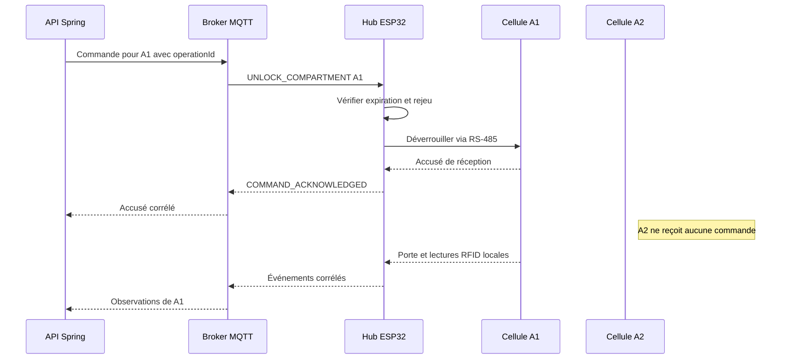
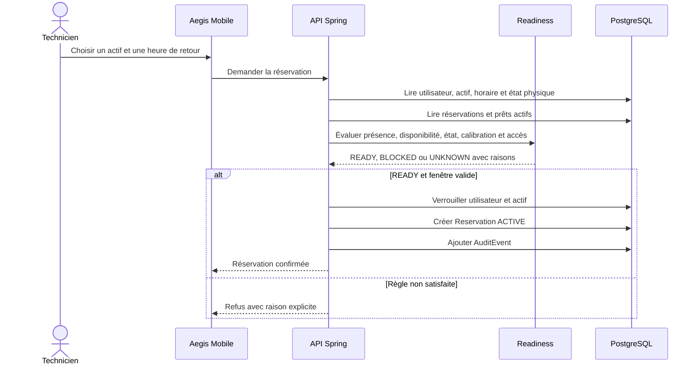
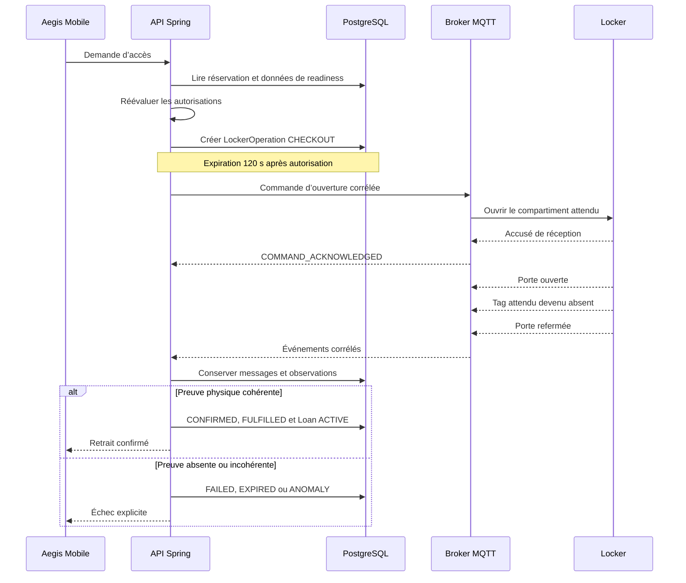
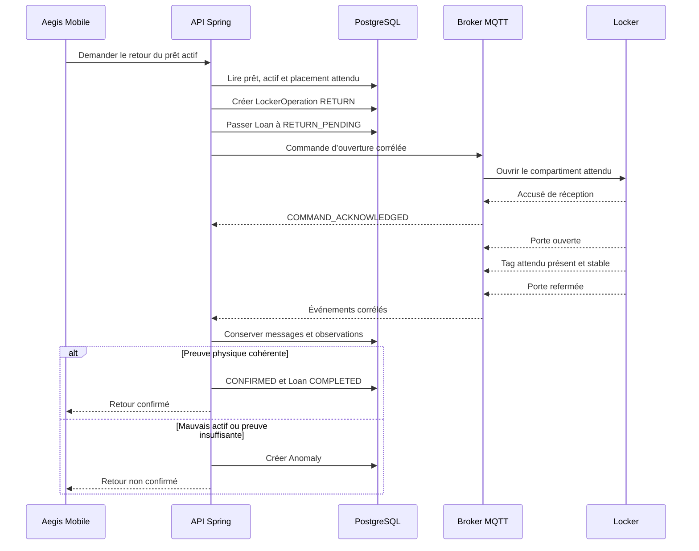
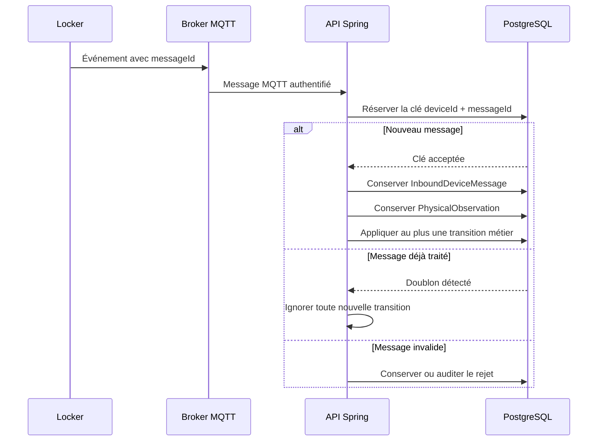
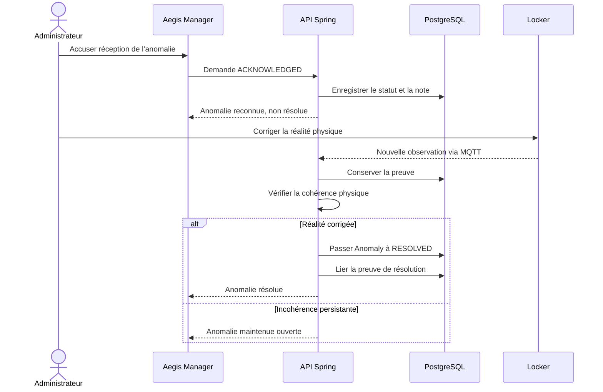

# Aegis — Modèle de données logique

**Cours :** 420-5X7-SO — Écosystème connecté  
**Session :** Automne 2026  
**Équipe :** Philippe Jordan Monfouayi Mba et Yoël Jimmy Razafindretsa  
**Date :** 9 septembre 2026  
**Version :** 0.3 — représentation séquentielle  
**Statut :** Proposition à valider en équipe

---

## 1. Rôle du document

Ce document définit les données nécessaires au P0 d’Aegis, leurs responsabilités, leurs relations et les invariants qu’elles doivent protéger.

Il demeure un modèle logique :

- il décrit les concepts métier et leurs cardinalités;
- il ne fixe pas encore les noms définitifs des tables PostgreSQL;
- il ne remplace pas le dictionnaire de données;
- il ne constitue ni un schéma SQL ni un diagramme d’architecture complet.

Spring Boot demeure l’unique autorité capable de transformer une observation physique en réservation, prêt, retour, readiness ou anomalie.

---

## 2. Approche de représentation

Un grand diagramme relationnel unique n’est volontairement pas utilisé. Avec les concepts du catalogue, du locker, des opérations et de l’audit, il produirait trop de traits croisés et masquerait les règles importantes.

| Besoin | Représentation retenue |
|---|---|
| Connaître les entités et leurs données principales | Tableaux par domaine |
| Lire précisément les cardinalités | Tables de relations |
| Comprendre quand les données sont créées ou modifiées | Diagrammes de séquence Mermaid |
| Comprendre les contraintes métier | Tables d’invariants |

Tous les diagrammes Mermaid de ce document sont donc des **diagrammes de séquence**. Ils montrent un scénario à la fois et limitent le nombre de participants pour rester lisibles.

### 2.1 Cardinalités

| Notation | Signification |
|---|---|
| 1 | Exactement une occurrence |
| 0..1 | Aucune ou une occurrence |
| 0..N | Aucune, une ou plusieurs occurrences |
| 1..N | Une ou plusieurs occurrences |

---

## 3. Domaines du modèle

| Domaine | Racine ou concept central | Concepts associés |
|---|---|---|
| Identité | User | rôle, niveau d’accès, statut |
| Catalogue | Asset | AssetModel, AssetIdentifier, AssetPlacement |
| Locker | Locker | Compartment, LockerDevice |
| Exploitation | OperatingSchedule | OperatingWindow |
| Réservation | Reservation | readiness et fenêtre demandée |
| Chaîne de possession | Loan | retrait confirmé, retour confirmé, retard |
| Opération physique | LockerOperation | commande, accusé, observations, expiration |
| Preuve IoT | InboundDeviceMessage | PhysicalObservation, heartbeat |
| Fiabilité | Anomaly | preuve de résolution |
| Traçabilité | AuditEvent | acteur, cible, décision et résultat |

---

## 4. Identité, catalogue et affectation physique

### 4.1 Concepts

| Concept | Identité logique | Données principales | Responsabilité |
|---|---|---|---|
| User | userId | nom, courriel, mot de passe haché, rôle, niveau maximal, statut | Représenter un administrateur ou un technicien authentifiable |
| AssetModel | assetModelId | nom, fabricant, numéro de modèle, description, calibration par défaut | Décrire une catégorie d’équipement |
| Asset | assetId | code, numéro de série, modèle, niveau requis, état opérationnel, calibration, archivage | Représenter un exemplaire physique individuel |
| AssetIdentifier | assetIdentifierId | actif, type, valeur, statut, dates d’affectation | Associer un tag RFID, NFC ou QR à un actif |
| AssetPlacement | assetPlacementId | actif, compartiment, début, fin, raison | Conserver l’emplacement attendu courant et son historique |

### 4.2 Relations

| Relation | Côté parent | Côté dépendant | Règle |
|---|---|---|---|
| AssetModel — Asset | Un modèle décrit 0..N actifs | Un actif appartient à 1 modèle | Un modèle n’est jamais emprunté directement |
| Asset — AssetIdentifier | Un actif possède 0..N identifiants historiques | Un identifiant appartient à 1 actif | Chaque actif utilisé en P0 possède au moins un tag actif |
| Asset — AssetPlacement | Un actif possède 0..N placements historiques | Un placement concerne 1 actif | Au plus un placement courant par actif |
| Compartment — AssetPlacement | Un compartiment reçoit 0..N placements historiques | Un placement cible 1 compartiment | Au plus un placement courant par compartiment |

La paire type + valeur d’un identifiant actif est unique. Un changement de tag ou de cellule termine l’ancienne affectation au lieu de supprimer l’historique.

### 4.3 Configuration d’un actif

---

## 5. Locker, hub et cellules

### 5.1 Concepts

| Concept | Identité logique | Données principales | Responsabilité |
|---|---|---|---|
| Locker | lockerId | code, nom, emplacement, topologie, dernière présence | Représenter l’unité logique offerte aux utilisateurs |
| Compartment | compartmentId | locker, code, adresse locale, activation, connexion, lecteur RFID, porte, serrure | Représenter une cellule physique indépendante |
| LockerDevice | lockerDeviceId | locker, identité MQTT, firmware, dernier heartbeat, activation | Représenter le hub ESP32 connecté au broker |

### 5.2 Relations

| Relation | Côté parent | Côté dépendant | Règle |
|---|---|---|---|
| Locker — Compartment | Un locker contient 1..N compartiments | Un compartiment appartient à 1 locker | Une cellule physique correspond exactement à un compartiment |
| Locker — LockerDevice | Un locker conserve 0..N devices historiques | Un device appartient à 1 locker | Un seul hub actif commande le locker P0 |
| Compartment — AssetPlacement | Un compartiment possède 0..1 actif attendu courant | Un actif placé possède 1 compartiment attendu | L’affectation attendue n’est pas une preuve de présence |

Le P0 cible un hub maître et deux cellules. Chaque cellule possède une serrure, un capteur de porte, un indicateur et un lecteur RFID UHF local. Les cellules communiquent avec le hub par RS-485 et un protocole Modbus RTU minimal; elles ne possèdent ni Wi-Fi, ni client MQTT, ni autorité métier.

### 5.3 Commande d’une cellule précise

---

## 6. Horaire, readiness et réservation

### 6.1 Concepts

| Concept | Identité logique | Données principales | Responsabilité |
|---|---|---|---|
| OperatingSchedule | operatingScheduleId | locker, fuseau, activation, auteur, modification | Définir la politique horaire d’un locker |
| OperatingWindow | operatingWindowId | horaire, jour, ouverture, fermeture, activation | Définir une plage récurrente |
| ReadinessAssessment | assetId + userId + evaluatedAt | résultat, raisons, données évaluées | Exprimer une décision calculée pour un actif et un utilisateur |
| Reservation | reservationId | utilisateur, actif, état, début, fin demandée, dates de conclusion | Réserver temporairement un actif admissible |

### 6.2 Relations

| Relation | Côté parent | Côté dépendant | Règle |
|---|---|---|---|
| Locker — OperatingSchedule | Un locker conserve 0..N horaires historiques | Un horaire concerne 1 locker | Un seul horaire actif par locker |
| OperatingSchedule — OperatingWindow | Un horaire contient 1..7 plages P0 | Une plage appartient à 1 horaire | Au plus une plage active par jour |
| User — Reservation | Un technicien possède 0..N réservations historiques | Une réservation appartient à 1 technicien | Au plus une réservation ACTIVE par technicien |
| Asset — Reservation | Un actif possède 0..N réservations historiques | Une réservation concerne 1 actif | Au plus une réservation ACTIVE par actif |

La réservation est immédiate dans le P0. Le technicien choisit reservedUntil, mais cette valeur doit être postérieure à reservedFrom et rester dans la plage d’ouverture courante. Il n’existe plus de durée fixe de 20 minutes.

Le fuseau horaire P0 est America/Toronto. Une nouvelle réservation ou opération physique est refusée hors d’une plage ouverte. La fermeture ne complète et n’annule toutefois jamais un prêt déjà actif. Les plages traversant minuit sont exclues du P0.

### 6.3 Calcul de readiness et création de réservation

### 6.4 Règles de readiness

| Entrée | Effet minimal |
|---|---|
| Présence physique inconnue | UNKNOWN avec UNKNOWN_PHYSICAL_STATE |
| Actif absent | BLOCKED avec NOT_PRESENT |
| Réservation ou prêt incompatible | BLOCKED avec NOT_AVAILABLE |
| État MAINTENANCE | BLOCKED avec MAINTENANCE |
| État DAMAGED | BLOCKED avec DAMAGED |
| Calibration expirée | BLOCKED avec CALIBRATION_EXPIRED |
| Niveau insuffisant | BLOCKED avec ACCESS_DENIED |
| Toutes les conditions satisfaites | READY |

La readiness n’est jamais une colonne administrable. Elle est recalculée à la lecture et immédiatement avant toute ouverture.

---

## 7. Retrait et création du prêt

### 7.1 Concepts

| Concept | Identité logique | Données principales | Responsabilité |
|---|---|---|---|
| Loan | loanId | actif, détenteur, opérations de retrait et de retour, statut, retrait, échéance, demande de retour, retour | Représenter la chaîne de possession réelle après un retrait confirmé |
| LockerOperation | operationId | type, statut, utilisateur, actif et identifiant attendus, compartiment, réservation ou prêt, expiration, jalons, échec | Corréler l’intention, la décision backend, la commande et les preuves physiques |

### 7.2 Relations transactionnelles

| Relation | Cardinalité | Règle |
|---|---:|---|
| Reservation — LockerOperation CHECKOUT | 1 vers 0..N tentatives | Chaque tentative de retrait référence exactement une réservation |
| Reservation — Loan | 1 vers 0..1 prêt confirmé | Une réservation ne produit jamais deux prêts |
| User — Loan | 1 vers 0..N prêts historiques | Chaque prêt possède exactement un détenteur |
| Asset — Loan | 1 vers 0..N prêts historiques | Au plus un prêt ACTIVE ou RETURN_PENDING par actif |
| User — LockerOperation | 1 vers 0..N opérations historiques | Chaque opération possède exactement un initiateur |
| Asset — LockerOperation | 1 vers 0..N opérations historiques | Chaque opération attend exactement un actif |
| Compartment — LockerOperation | 1 vers 0..N opérations historiques | Une opération cible exactement un compartiment |
| AssetIdentifier — LockerOperation | 1 vers 0..N opérations historiques | L’opération conserve l’identifiant physique attendu |

La liaison entre Reservation et Loan est traçable par l’opération CHECKOUT : l’opération référence la réservation et le prêt conserve checkoutOperationId.

### 7.3 Flux d’un retrait

### 7.4 Données créées lors du retrait confirmé

| Donnée | Résultat |
|---|---|
| LockerOperation | Passe à CONFIRMED |
| Reservation | Passe à FULFILLED |
| Loan | Est créé avec le statut ACTIVE |
| Loan.checkedOutAt | Reçoit l’instant de confirmation |
| Loan.dueAt | Reprend Reservation.reservedUntil |
| Asset.availabilityStatus | Devient BORROWED par dérivation |
| AuditEvent | Enregistre le retrait et la nouvelle chaîne de possession |

Ces mutations sont atomiques : elles réussissent ensemble ou sont annulées ensemble.

---

## 8. Retour et fin du prêt

### 8.1 Relations

| Relation | Cardinalité | Règle |
|---|---:|---|
| Loan — LockerOperation RETURN | 1 vers 0..N tentatives | Chaque tentative de retour référence exactement un prêt |
| LockerOperation — PhysicalObservation | 1 vers 0..N observations | La confirmation exige une séquence cohérente |
| Loan — LockerOperation confirmée | 1 vers 0..1 opération finale | returnOperationId est renseigné uniquement après confirmation |

### 8.2 Flux d’un retour

Dépasser Loan.dueAt rend le prêt en retard, mais ne le termine jamais. Même si le tag réapparaît dans la cellule, l’actif reste BORROWED tant qu’une opération RETURN complète n’a pas été confirmée.

---

## 9. Messages IoT, observations et idempotence

### 9.1 Concepts

| Concept | Identité logique | Données principales | Responsabilité |
|---|---|---|---|
| LockerCommandEnvelope | messageId | opération, locker, compartiment, type, émission, expiration, version | Porter une commande autorisée vers le locker |
| InboundDeviceMessage | inboundMessageId | device, messageId, topic, type, opération, version, dates, payload, traitement | Conserver le message MQTT brut |
| PhysicalObservation | observationId | message source, opération, locker, compartiment, type, identifiant, valeur, confiance | Représenter un fait physique normalisé |
| DeviceHeartbeat | messageId | locker, firmware, date et données techniques | Signaler que le hub est joignable |

LockerCommandEnvelope et DeviceHeartbeat sont des objets de contrat. Ils ne nécessitent pas obligatoirement une table dédiée : la commande est traçable par LockerOperation et AuditEvent; le heartbeat est conservé comme InboundDeviceMessage.

### 9.2 Relations

| Relation | Cardinalité | Règle |
|---|---:|---|
| LockerDevice — InboundDeviceMessage | 1 vers 0..N messages | Chaque message entrant possède un device reconnu |
| InboundDeviceMessage — PhysicalObservation | 1 vers 0..N observations | Un message peut ne produire aucune observation métier |
| LockerOperation — PhysicalObservation | 1 vers 0..N observations corrélées | Une observation appartient à 0..1 opération |

La paire lockerDeviceId + messageId est unique.

### 9.3 Réception idempotente d’un événement

### 9.4 Preuve RFID minimale

Une lecture RFID isolée n’est pas suffisante.

| Retrait | Retour |
|---|---|
| Commande reconnue | Commande reconnue |
| Porte ouverte | Porte ouverte |
| Tag attendu absent de la bonne cellule | Tag attendu présent dans la bonne cellule |
| Absence stable pendant la fenêtre du POC | Présence stable pendant la fenêtre du POC |
| Porte refermée | Porte refermée |

La valeur de départ du POC est une fenêtre de trois secondes et au moins trois lectures cohérentes. Une lecture ambiguë entre deux cellules produit UNKNOWN_PHYSICAL_STATE ou une anomalie. Le fallback demeure QR ou NFC pour l’identité, combiné au capteur de porte et à un capteur de présence ou de poids.

Le hub publie un heartbeat toutes les 10 secondes. Le backend considère le locker OFFLINE après 30 secondes sans heartbeat valide.

---

## 10. Anomalies et audit

### 10.1 Concepts

| Concept | Identité logique | Données principales | Responsabilité |
|---|---|---|---|
| Anomaly | anomalyId | type, sévérité, statut, opération, actif, cellule, dates, détails, preuve de résolution | Représenter une incohérence nécessitant une correction |
| AuditEvent | auditEventId | type, acteur, cible, opération, date, résultat, détails | Construire une chronologie métier compréhensible |

### 10.2 Relations

| Relation | Cardinalité | Règle |
|---|---:|---|
| LockerOperation — Anomaly | 1 vers 0..1 anomalie liée | L’anomalie explique pourquoi l’opération ne peut pas être confirmée |
| Anomaly — PhysicalObservation | 1 vers 0..1 preuve de résolution | Seule une preuve cohérente permet RESOLVED |
| User — AuditEvent | 1 vers 0..N événements comme acteur | Un événement système peut ne pas avoir d’acteur humain |
| LockerOperation — AuditEvent | 1 vers 0..N traces | Toutes les transitions déterminantes sont auditables |

### 10.3 Accusé et résolution d’une anomalie

Un administrateur peut reconnaître le problème et documenter son intervention. Il ne peut jamais forcer manuellement le statut RESOLVED.

---

## 11. États contrôlés

### 11.1 Readiness

| Type | Valeurs |
|---|---|
| Résultat | READY, BLOCKED, UNKNOWN |
| Raisons | NOT_PRESENT, NOT_AVAILABLE, MAINTENANCE, DAMAGED, CALIBRATION_EXPIRED, ACCESS_DENIED, UNKNOWN_PHYSICAL_STATE |

### 11.2 États transactionnels

| Concept | Valeurs |
|---|---|
| Disponibilité de l’actif | AVAILABLE, RESERVED, BORROWED, UNAVAILABLE |
| État opérationnel | SERVICEABLE, MAINTENANCE, DAMAGED |
| Calibration dérivée | NOT_REQUIRED, VALID, EXPIRED, UNKNOWN |
| Reservation | ACTIVE, FULFILLED, CANCELLED, EXPIRED |
| Loan | ACTIVE, RETURN_PENDING, COMPLETED |
| LockerOperation | REQUESTED, AUTHORIZED, COMMAND_SENT, COMMAND_ACKNOWLEDGED, DOOR_OPENED, OBSERVATION_RECEIVED, CONFIRMED, FAILED, EXPIRED, ANOMALY |
| Anomaly | OPEN, ACKNOWLEDGED, RESOLVED |

---

## 12. Contraintes d’intégrité

| Domaine | Contrainte |
|---|---|
| User | Courriel unique après normalisation |
| Asset | Code d’actif unique |
| AssetIdentifier | Paire type + valeur unique parmi les identifiants actifs |
| AssetPlacement | Un seul placement courant par actif et par compartiment |
| Compartment | Code et adresse locale uniques dans un locker |
| LockerDevice | Un seul device actif par locker dans le P0 |
| OperatingSchedule | Un seul horaire actif par locker |
| OperatingWindow | Au plus une plage active par jour dans le P0; aucune plage chevauchante |
| Reservation | Au plus une ACTIVE par technicien et par actif |
| Reservation | reservedFrom et reservedUntil appartiennent à la même plage ouverte |
| Loan | Au plus un prêt ACTIVE ou RETURN_PENDING par actif |
| LockerOperation | expiresAt vaut authorizedAt + 120 secondes dans le P0 |
| LockerOperation | CHECKOUT référence une réservation; RETURN référence un prêt |
| LockerOperation | Une opération finale ne peut pas être réutilisée |
| InboundDeviceMessage | Paire lockerDeviceId + messageId unique |
| PhysicalObservation | Toute observation conserve le lien vers son message source |
| Anomaly | RESOLVED exige une observation de résolution cohérente |
| AuditEvent | L’historique est ajouté; il n’est pas réécrit rétroactivement |

Les contraintes dépendant d’un statut devront être garanties par une combinaison de validations du domaine, transactions, verrouillage et index partiels PostgreSQL.

---

## 13. Données persistées et données dérivées

| Élément | Nature | Source de vérité |
|---|---|---|
| User, AssetModel, Asset, AssetIdentifier | Persisté | Référentiel PostgreSQL |
| Locker, Compartment, LockerDevice | Persisté | Référentiel et dernières observations |
| OperatingSchedule, OperatingWindow | Persisté | Configuration administrée |
| Reservation, Loan, LockerOperation | Persisté | État transactionnel |
| InboundDeviceMessage, PhysicalObservation | Persisté | Preuve reçue et normalisée |
| Anomaly, AuditEvent | Persisté | Fiabilité et historique |
| Readiness | Dérivé | Actif + utilisateur + état physique + moment |
| CalibrationStatus | Dérivé | calibrationRequired + calibrationDueAt + moment |
| Loan.overdue | Dérivé | statut du prêt + dueAt + moment |
| Locker ONLINE ou OFFLINE | Dérivé | âge du dernier heartbeat |
| Présence d’un actif | Dérivé | dernière séquence physique stable et cohérente |
| Disponibilité d’un actif | Dérivé | réservation, prêt, archivage et blocages applicables |

Une valeur dérivée peut être copiée dans un AuditEvent afin d’expliquer une décision passée. Cette copie ne devient pas la source de vérité actuelle.

---

## 14. Invariants métier protégés

1. Le Web, iOS et l’ESP32 ne définissent jamais directement l’état métier final.
2. Un actif ne possède jamais deux réservations actives simultanées.
3. Un technicien ne possède qu’une réservation active en P0.
4. Une réservation expirée sans retrait confirmé peut libérer l’actif réservé.
5. Une réservation déjà fulfilled n’a plus autorité sur la disponibilité.
6. Un prêt commence uniquement après un retrait physiquement confirmé.
7. Un prêt se termine uniquement après un retour physiquement confirmé.
8. Dépasser dueAt rend le prêt en retard, jamais terminé.
9. La présence RFID seule ne termine jamais un prêt actif.
10. Une commande, son accusé et ses observations partagent le même operationId.
11. Une commande expirée, consommée ou non autorisée est refusée.
12. Un message MQTT rejoué ne crée jamais une deuxième transition métier.
13. Une anomalie ne devient RESOLVED qu’après une preuve physique cohérente.
14. La perte de connexion rend l’état physique incertain sans inventer une présence ou une absence.
15. L’archivage ou le déplacement d’un actif ne détruit jamais sa chaîne de possession.

---

## 15. Limites du modèle logique

Ce document ne fixe pas encore :

- les noms et types SQL définitifs;
- les clés étrangères et index exacts;
- le découpage des modules Spring Boot;
- les routes et DTO REST;
- les payloads MQTT complets;
- les machines à états détaillées;
- les seuils RFID définitifs après le POC;
- le format précis des messages Modbus RTU;
- les mécanismes de rafraîchissement Web et iOS.

Ces choix d’implémentation devront respecter les relations, séquences et invariants définis dans ce modèle.
