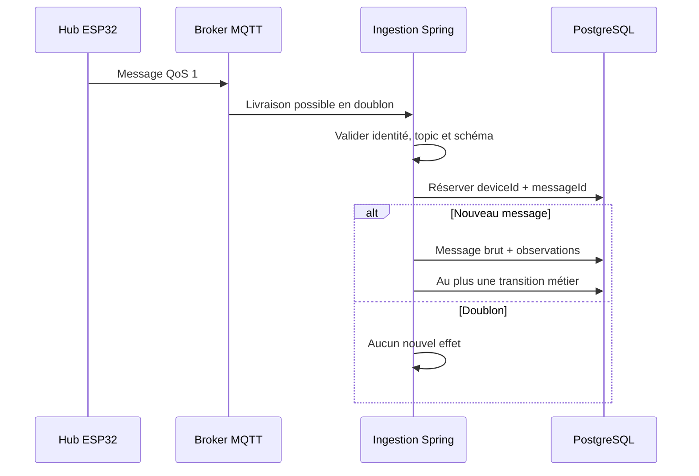

# Aegis — Contrats MQTT détaillés

**Cours :** 420-5X7-SO — Écosystème connecté  
**Équipe :** Philippe Jordan Monfouayi Mba et Yoël Jimmy Razafindretsa  
**Date de révision :** 16 septembre 2026
**Version :** 1.2 — contrôle local QR et étoile

---

## 1. Rôle du document

Ce document fixe le contrat MQTT entre :

- Aegis Control, le backend Spring Boot;
- le broker MQTT;
- Aegis Locker Node, le hub ESP32.

Les cellules ne sont pas des clients MQTT. Elles communiquent exclusivement avec le hub par RS-485 et un protocole local minimal. Le hub traduit leurs états techniques en événements MQTT sans prendre de décision métier.

Le contrat couvre :

- les topics;
- les droits de publication et d’abonnement;
- les niveaux QoS et la rétention;
- les enveloppes JSON;
- les commandes, accusés, observations et heartbeats;
- la déduplication;
- la reprise après déconnexion;
- la sécurité et les tests.

Il ne définit pas les trames RS-485 entre le hub et les cellules.

---

## 2. Autorités et responsabilités

| Composant | Responsabilité | Interdiction |
|---|---|---|
| Backend Spring Boot | Autoriser une opération, produire une commande, interpréter les observations, muter le métier | Ne suppose jamais qu’une publication MQTT équivaut à une exécution |
| Broker MQTT | Authentifier, appliquer les ACL et transporter les messages | Ne décide aucune readiness et ne transforme aucun payload |
| Hub ESP32 | Valider techniquement, dédupliquer, cibler une cellule, actionner et publier les observations | Ne valide jamais l’utilisateur, la réservation ou le prêt |
| Cellule | Actionner serrure, lire porte et RFID, rapporter au hub | Aucun réseau IP, MQTT ou droit métier |

Une commande MQTT est la conséquence d’une LockerOperation déjà autorisée. Elle ne constitue jamais l’autorisation elle-même.

---

## 3. Version et protocole

### 3.1 Version MQTT

Le P0 utilise MQTT 3.1.1 afin de maximiser la compatibilité des bibliothèques ESP32. Le contrat applicatif ne dépend pas des propriétés propres à MQTT 5.

### 3.2 Version du schéma

Tous les messages contiennent :

```json
{
  "schemaVersion": "1.0"
}
```

Règles :

- une major inconnue est rejetée;
- une minor plus récente peut ajouter des champs sans modifier le sens des champs existants;
- le consommateur ignore les champs JSON inconnus d’une minor compatible;
- un champ requis ne devient jamais facultatif dans la même major;
- un changement de type, de sens ou de valeur contrôlée exige une nouvelle major.

### 3.3 Encodage

- UTF-8;
- JSON strict;
- noms en camelCase;
- content-type logique application/json;
- taille maximale P0 : 16 KiB par message;
- profondeur JSON et taille des tableaux bornées avant désérialisation.

---

## 4. Identité et sécurité du device

### 4.1 Identité

Chaque hub possède :

- un deviceKey stable;
- un clientId MQTT unique;
- un nom d’utilisateur propre;
- un secret propre, injecté hors du dépôt;
- un lockerId associé côté backend et broker.

Format recommandé du clientId :

```text
aegis-locker-<deviceKey>
```

L’identité authentifiée est la source de confiance. Un lockerId déclaré dans le payload ne permet jamais à un device d’usurper un autre locker.

### 4.2 Transport

| Environnement | Exigence |
|---|---|
| Broker distant | TLS 1.2 ou supérieur, validation du certificat serveur |
| Docker local isolé avec simulateur | Non chiffré seulement sur réseau privé sans hub réel ni exposition; tokens de test exclusivement |
| Hub réel, même au laboratoire | TLS validé obligatoire, car le QR transporte un secret éphémère |
| PostgreSQL | Aucun accès depuis le broker ou le hub |

Le P0 utilise un nom d’utilisateur et un secret uniques par device au-dessus de TLS. Le mTLS peut être ajouté ultérieurement sans changer les topics ni les payloads.

### 4.3 Secrets

- jamais committés;
- identifiants MQTT et mots de passe jamais inclus dans un payload;
- le token QR est une donnée métier éphémère distincte, autorisée uniquement dans le message d’écran chiffré en transit décrit au §27;
- jamais journalisés;
- stockés par configuration externe côté backend et broker;
- provisionnés dans le stockage non volatil du hub;
- remplaçables sans changer lockerId.

---

## 5. Topics

Pour un locker donné :

```text
aegis/v1/lockers/{lockerId}/commands
aegis/v1/lockers/{lockerId}/events
aegis/v1/lockers/{lockerId}/status
aegis/v1/lockers/{lockerId}/display
```

| Topic | Producteur | Consommateur | Contenu |
|---|---|---|---|
| commands | Backend | Hub ciblé | UNLOCK_COMPARTMENT |
| events | Hub | Backend | ACK, rejet, porte, serrure, RFID, erreur |
| status | Hub ou broker via LWT | Backend | Heartbeat et disponibilité de connexion |
| display | Backend | Hub ciblé | QR temporaire et résultat backend |

Règles :

1. lockerId est un UUID canonique en minuscules dans le topic.
2. Aucun wildcard ne se trouve dans un topic publié.
3. Le backend compare le lockerId du topic, du payload et de l’identité device.
4. Un événement opérationnel publié sur status est rejeté.
5. Un heartbeat publié sur events est rejeté.
6. Les cellules ne possèdent aucun sous-topic MQTT propre.

---

## 6. ACL

### 6.1 Hub

Pour son propre locker, un hub peut :

- s’abonner à commands et display pour son seul locker;
- publier sur events;
- publier sur status.

Il ne peut pas :

- publier sur commands ou display;
- s’abonner aux events ou status d’un autre locker;
- utiliser un wildcard;
- accéder à un topic d’administration du broker.

### 6.2 Backend

Le backend peut :

- publier sur les topics commands et display autorisés par l’ACL `aegis/v1/lockers/+/...` (le topic réellement publié contient un lockerId, jamais `+`);
- s’abonner à aegis/v1/lockers/+/events;
- s’abonner à aegis/v1/lockers/+/status.

Le compte backend est distinct de tous les comptes device.

### 6.3 Principe de refus

Tout droit non explicitement accordé est refusé. Les ACL sont testées avec un compte device réel avant la démonstration.

---

## 7. QoS, retain et sessions

| Message | QoS | Retain | Justification |
|---|---:|---:|---|
| Commande | 1 | false | Livraison au moins une fois; déduplication obligatoire |
| Instruction d’écran | 1 | false | Expiration, session et révision vérifiées même après redélivrance |
| Accusé/rejet d’affichage | 1 | false | Ne constitue pas un ACK de serrure |
| Accusé ou rejet | 1 | false | La décision technique doit atteindre le backend |
| Porte, serrure, RFID, erreur | 1 | false | Les preuves peuvent être redélivrées sans double effet |
| Heartbeat périodique | 0 | false | Fréquent et remplacé après 10 secondes |
| Disponibilité ONLINE | 1 | true | État de connexion actuel visible au nouvel abonné |
| Last Will OFFLINE | 1 | true | Signal rapide de rupture anormale |

### 7.1 Session hub

- clientId stable;
- cleanSession=false;
- keepAlive=30 secondes;
- resubscription si le broker ne restaure pas la session;
- commandes expirées refusées après reconnexion.

Le backend ne compte jamais sur une livraison exactement une fois. Toute livraison QoS 1 peut être dupliquée.

### 7.2 Retain

Une commande ou une instruction d’écran `retain=true` est strictement interdite. Une ancienne commande ne doit jamais être livrée à un hub simplement parce qu’il vient de se reconnecter.

Seuls DEVICE_AVAILABILITY ONLINE et le Last Will OFFLINE sont retenus.

---

## 8. Enveloppes et champs communs

### 8.1 Messages émis par le hub

| Champ | Type | Requis | Règle |
|---|---|---:|---|
| schemaVersion | string | oui | 1.0 |
| messageId | UUID | oui | Nouveau pour chaque fait logique |
| type | string | oui | Autorisé sur le topic |
| lockerId | UUID | oui | Concorde avec identité et topic |
| timestamp | instant UTC | oui | Horloge device synchronisée |
| deviceSessionId | UUID | oui | Nouveau à chaque démarrage |
| sequence | entier >= 0 | oui | Croissant dans la session |
| operationId | UUID | selon type | Requis pour un événement opérationnel |
| compartmentId | UUID | selon type | Requis pour une cellule précise |

messageId est l’identité idempotente. sequence aide au diagnostic et à l’ordre local, mais ne remplace jamais messageId.

### 8.2 Commandes émises par le backend

| Champ | Type | Requis |
|---|---|---:|
| schemaVersion | string | oui |
| messageId | UUID | oui |
| type | UNLOCK_COMPARTMENT | oui |
| operationId | UUID | oui |
| lockerId | UUID | oui |
| compartmentId | UUID | oui |
| issuedAt | instant UTC | oui |
| expiresAt | instant UTC | oui |

La commande ne contient :

- ni identité utilisateur;
- ni rôle;
- ni readiness;
- ni réservation complète;
- ni jeton d’accès;
- ni secret;
- ni identifiant RFID attendu.

Le hub n’a pas besoin de connaître l’actif attendu. Il rapporte les identifiants physiques observés; le backend les compare au domaine.

---

## 9. Commande UNLOCK_COMPARTMENT

Le backend crée cette commande uniquement après consommation atomique du défi QR et revalidation des gardes métier. La préparation ne suffit jamais. Le hub masque le QR de cette opération au début de l’exécution; aucune logique locale ne remplace l’autorisation backend.


Topic :

```text
aegis/v1/lockers/{lockerId}/commands
```

Payload :

```json
{
  "schemaVersion": "1.0",
  "messageId": "55c71961-21a3-4b2e-8b92-7f237e881a20",
  "type": "UNLOCK_COMPARTMENT",
  "operationId": "2f38d3b6-c18f-4a74-aa9a-2d574286013f",
  "lockerId": "d46a74ae-39dc-460b-8af0-38fc791b376a",
  "compartmentId": "1ae77ae3-8490-4f09-9412-a7816b77bff9",
  "issuedAt": "2026-09-16T14:31:00Z",
  "expiresAt": "2026-09-16T14:33:00Z"
}
```

### 9.1 Validation locale

Avant toute action, le hub vérifie :

1. JSON valide et taille acceptable;
2. schemaVersion supportée;
3. champs obligatoires présents;
4. lockerId identique à son identité;
5. compartmentId connu et adressable;
6. horloge synchronisée;
7. instant courant strictement antérieur à expiresAt;
8. messageId et operationId non déjà consommés;
9. aucune autre ouverture locale active;
10. cellule connectée;
11. porte dans un état sûr;
12. alimentation et actionneur disponibles.

Avant l’action irréversible, le hub persiste la commande dans un état local EXECUTING. Après l’actionnement, il enregistre son résultat final ACKNOWLEDGED ou REJECTED. Si le hub redémarre avec une commande restée EXECUTING, il ne réactive jamais la serrure : il publie PREVIOUS_EXECUTION_UNCERTAIN afin que le backend crée ou maintienne une anomalie.

### 9.2 Durée locale de déverrouillage

Le hub impose une durée maximale de déverrouillage indépendante de la connexion réseau. À son expiration, il tente de remettre la serrure dans son état sûr et publie l’état observé.

La valeur exacte dépend du mécanisme de serrure et doit être fixée dans l’ADR matériel. Elle ne peut pas dépasser la fenêtre de LockerOperation.

---

## 10. Accusé de commande

### 10.1 COMMAND_ACKNOWLEDGED

Un accusé positif signifie que le hub a validé la commande, que la cellule ciblée l’a acceptée et que l’actionnement a été engagé ou confirmé techniquement. Il ne prouve pas que la porte a été ouverte ni que l’actif a changé de présence.

```json
{
  "schemaVersion": "1.0",
  "messageId": "b7ce3d98-f78f-4c1a-a96f-36663bdcfe3c",
  "type": "COMMAND_ACKNOWLEDGED",
  "commandMessageId": "55c71961-21a3-4b2e-8b92-7f237e881a20",
  "operationId": "2f38d3b6-c18f-4a74-aa9a-2d574286013f",
  "lockerId": "d46a74ae-39dc-460b-8af0-38fc791b376a",
  "compartmentId": "1ae77ae3-8490-4f09-9412-a7816b77bff9",
  "timestamp": "2026-09-16T14:31:01Z",
  "deviceSessionId": "a36e9e94-b690-4e41-a14c-3cf8032742b0",
  "sequence": 41,
  "result": "ACCEPTED"
}
```

result vaut ACCEPTED ou ALREADY_APPLIED.

Pour une commande dupliquée, le hub republie l’accusé logique connu avec un nouveau messageId d’événement, le même commandMessageId et result=ALREADY_APPLIED. Il ne réactive pas la serrure.

### 10.2 COMMAND_REJECTED

```json
{
  "schemaVersion": "1.0",
  "messageId": "ac370f20-52a2-4e07-9791-f9f64dabdd93",
  "type": "COMMAND_REJECTED",
  "commandMessageId": "55c71961-21a3-4b2e-8b92-7f237e881a20",
  "operationId": "2f38d3b6-c18f-4a74-aa9a-2d574286013f",
  "lockerId": "d46a74ae-39dc-460b-8af0-38fc791b376a",
  "compartmentId": "1ae77ae3-8490-4f09-9412-a7816b77bff9",
  "timestamp": "2026-09-16T14:31:01Z",
  "deviceSessionId": "a36e9e94-b690-4e41-a14c-3cf8032742b0",
  "sequence": 41,
  "reason": "CELL_UNREACHABLE",
  "detail": "La cellule ciblée ne répond pas sur le bus local."
}
```

Raisons P0 :

- INVALID_PAYLOAD;
- UNSUPPORTED_SCHEMA;
- WRONG_LOCKER;
- UNKNOWN_COMPARTMENT;
- CLOCK_NOT_SYNCHRONIZED;
- COMMAND_EXPIRED;
- LOCAL_OPERATION_IN_PROGRESS;
- CELL_UNREACHABLE;
- COMPARTMENT_DISABLED;
- DOOR_STATE_UNSAFE;
- LOCK_ACTUATION_FAILED;
- POWER_STATE_UNSAFE;
- PREVIOUS_EXECUTION_UNCERTAIN;
- INTERNAL_DEVICE_ERROR.

detail est borné à 240 caractères et ne contient aucun secret.

---

## 11. Événements de porte et de serrure

Topic :

```text
aegis/v1/lockers/{lockerId}/events
```

### 11.1 Porte

```json
{
  "schemaVersion": "1.0",
  "messageId": "19dc9b16-b1db-4f26-a48a-073034ea35b8",
  "type": "DOOR_OPENED",
  "operationId": "2f38d3b6-c18f-4a74-aa9a-2d574286013f",
  "lockerId": "d46a74ae-39dc-460b-8af0-38fc791b376a",
  "compartmentId": "1ae77ae3-8490-4f09-9412-a7816b77bff9",
  "timestamp": "2026-09-16T14:31:05Z",
  "deviceSessionId": "a36e9e94-b690-4e41-a14c-3cf8032742b0",
  "sequence": 42,
  "doorState": "OPEN"
}
```

type vaut DOOR_OPENED ou DOOR_CLOSED. doorState doit concorder avec type.

### 11.2 Serrure

type vaut LOCK_UNLOCKED ou LOCK_LOCKED. Le payload remplace doorState par lockState, valant UNLOCKED ou LOCKED.

Un événement de serrure ne remplace pas un événement de porte. Une serrure déverrouillée ne prouve pas que la porte a été ouverte.

---

## 12. Observation RFID

### 12.1 RFID_SCAN_COMPLETED

Chaque cellule lit localement les tags. À la fin d’une fenêtre de stabilisation, le hub publie une preuve positive que la lecture a réellement été exécutée. Cette preuve contient l’état du lecteur et les identifiants observés, y compris un tableau vide lorsqu’aucun tag n’a été détecté.

```json
{
  "schemaVersion": "1.0",
  "messageId": "55bb8489-fe94-4d21-94df-84cb6fca134a",
  "type": "RFID_SCAN_COMPLETED",
  "operationId": "2f38d3b6-c18f-4a74-aa9a-2d574286013f",
  "lockerId": "d46a74ae-39dc-460b-8af0-38fc791b376a",
  "compartmentId": "1ae77ae3-8490-4f09-9412-a7816b77bff9",
  "timestamp": "2026-09-16T14:31:09Z",
  "deviceSessionId": "a36e9e94-b690-4e41-a14c-3cf8032742b0",
  "sequence": 45,
  "windowStartedAt": "2026-09-16T14:31:06Z",
  "windowEndedAt": "2026-09-16T14:31:09Z",
  "readerStatus": "HEALTHY",
  "observedIdentifiers": [
    {
      "identifierType": "RFID_UHF",
      "identifierValue": "E20034120123456789000001",
      "readCount": 3
    }
  ]
}
```

Règles :

- observedIdentifiers contient au maximum 32 entrées dans le P0;
- identifierValue est limité à 255 caractères;
- readCount est compris entre 1 et 65535;
- la fenêtre n’excède pas 10 secondes dans le P0;
- readerStatus vaut HEALTHY, FAULTED ou UNKNOWN;
- un scan FAULTED ou UNKNOWN ne confirme ni présence ni absence;
- le backend compare l’identifiant au tag actif attendu;
- le hub ne reçoit pas l’identifiant attendu dans la commande.

Un tableau vide avec readerStatus=HEALTHY atteste qu’un scan complet n’a observé aucun tag. L’absence de message MQTT ne constitue jamais une preuve d’absence.

### 12.2 Présence et absence normalisées

ASSET_IDENTIFIER_DETECTED, ASSET_PRESENT et ASSET_ABSENT sont des PhysicalObservation produites par le backend à partir de RFID_SCAN_COMPLETED. Le hub n’a pas à connaître l’actif attendu.

Pour le CHECKOUT, le backend exige après la fermeture de porte un RFID_SCAN_COMPLETED couvrant trois secondes, avec lecteur sain et sans le tag attendu dans observedIdentifiers.

Pour le RETURN, il exige un RFID_SCAN_COMPLETED sain contenant au moins trois lectures cohérentes du tag attendu dans la cellule ciblée.

Une détection du même tag dans plusieurs cellules produit une preuve ambiguë et ne confirme aucune opération.

---

## 13. Redémarrage et erreurs device

### 13.1 DEVICE_RESTARTED

Publié après restauration de la connectivité :

```json
{
  "schemaVersion": "1.0",
  "messageId": "ec491081-28bd-46d4-87b2-57da75f670bb",
  "type": "DEVICE_RESTARTED",
  "lockerId": "d46a74ae-39dc-460b-8af0-38fc791b376a",
  "timestamp": "2026-09-16T14:35:00Z",
  "deviceSessionId": "bd6a6594-09f7-4ff5-b0df-dae65da7c249",
  "sequence": 0,
  "resetReason": "WATCHDOG",
  "firmwareVersion": "0.1.0"
}
```

Si une opération physique était en cours, le redémarrage est une preuve d’incertitude. Le backend décide entre FAILED, EXPIRED ou ANOMALY selon les événements déjà reçus; le hub ne conclut rien.

### 13.2 DEVICE_ERROR

Champs additionnels :

- errorCode contrôlé;
- severity : WARNING ou CRITICAL;
- compartmentId facultatif;
- detail borné.

Codes initiaux :

- CELL_COMMUNICATION_LOST;
- RFID_READER_FAULT;
- DOOR_SENSOR_FAULT;
- LOCK_ACTUATOR_FAULT;
- POWER_FAULT;
- CLOCK_SYNC_LOST;
- STORAGE_FAULT.

---

## 14. Heartbeat

Topic :

```text
aegis/v1/lockers/{lockerId}/status
```

Fréquence nominale : toutes les 10 secondes.

```json
{
  "schemaVersion": "1.0",
  "messageId": "9445c92f-95da-4806-a911-ff60db45f713",
  "type": "HEARTBEAT",
  "lockerId": "d46a74ae-39dc-460b-8af0-38fc791b376a",
  "timestamp": "2026-09-16T14:31:10Z",
  "deviceSessionId": "a36e9e94-b690-4e41-a14c-3cf8032742b0",
  "sequence": 46,
  "firmwareVersion": "0.1.0",
  "uptimeSeconds": 4821,
  "clockSynchronized": true,
  "network": {
    "rssiDbm": -57
  },
  "compartments": [
    {
      "compartmentId": "1ae77ae3-8490-4f09-9412-a7816b77bff9",
      "cellAddress": 1,
      "connectionStatus": "CONNECTED",
      "readerStatus": "HEALTHY",
      "doorState": "CLOSED",
      "lockState": "LOCKED"
    }
  ]
}
```

Le backend :

- authentifie le device;
- déduplique messageId;
- met à jour lastSeenAt avec receivedAt;
- conserve timestamp pour diagnostic;
- ne recule pas une projection de compartiment avec une observation plus ancienne;
- calcule ONLINE si le dernier heartbeat valide date de 30 secondes ou moins;
- calcule OFFLINE après plus de 30 secondes.

Le heartbeat ne produit aucune transition de prêt ou de réservation.

---

## 15. Disponibilité et Last Will

### 15.1 ONLINE

Après connexion et synchronisation de l’horloge, le hub publie avec QoS 1 et retain=true :

```json
{
  "schemaVersion": "1.0",
  "messageId": "79adb482-4a28-4bef-8e7a-016574901eee",
  "type": "DEVICE_AVAILABILITY",
  "lockerId": "d46a74ae-39dc-460b-8af0-38fc791b376a",
  "timestamp": "2026-09-16T14:30:00Z",
  "deviceSessionId": "a36e9e94-b690-4e41-a14c-3cf8032742b0",
  "sequence": 0,
  "status": "ONLINE",
  "reason": "CONNECTED"
}
```

### 15.2 OFFLINE par Last Will

Avant la connexion, le hub configure un Last Will sur le même topic avec QoS 1 et retain=true.

Le payload OFFLINE est préparé pour la session. Son timestamp représente la préparation du Will, pas l’instant exact de rupture. Le backend utilise receivedAt comme instant de signalement.

```json
{
  "schemaVersion": "1.0",
  "messageId": "e92228c7-91db-4831-ab79-21dd44f84550",
  "type": "DEVICE_AVAILABILITY",
  "lockerId": "d46a74ae-39dc-460b-8af0-38fc791b376a",
  "timestamp": "2026-09-16T14:29:59Z",
  "deviceSessionId": "a36e9e94-b690-4e41-a14c-3cf8032742b0",
  "sequence": 0,
  "status": "OFFLINE",
  "reason": "CONNECTION_LOST"
}
```

Le Last Will accélère la détection, mais la règle métier de référence reste l’absence de heartbeat valide pendant plus de 30 secondes. Une déconnexion propre publie OFFLINE avant de fermer la session.

---

## 16. Idempotence

### 16.1 Commandes

L’identité d’une commande est messageId. operationId protège en plus contre deux commandes différentes visant le même workflow.

Le hub conserve durablement un journal borné des commandes consommées :

- messageId;
- operationId;
- état local EXECUTING, ACKNOWLEDGED ou REJECTED;
- résultat ACK ou REJECT lorsqu’il est connu;
- raison;
- horodatage.

Rétention P0 recommandée :

- au moins 24 heures;
- au moins les 64 dernières commandes;
- stockage en anneau afin de limiter l’usure de la mémoire flash.

L’état EXECUTING est persisté avant l’actionnement. Après redémarrage, un doublon ne peut pas rouvrir la serrure. Une entrée EXECUTING retrouvée au démarrage devient un rejet PREVIOUS_EXECUTION_UNCERTAIN; elle exige une réconciliation physique plutôt qu’une nouvelle action.

### 16.2 Messages entrants

Le backend réserve la paire lockerDeviceId + messageId dans PostgreSQL avant tout effet. Un conflit d’unicité :

- n’ajoute aucune nouvelle observation;
- n’avance aucune machine à états;
- peut produire une métrique de doublon;
- retourne le résultat technique déjà connu au consommateur interne.

### 16.3 Identifiants distincts

L’idempotence des messages d’écran est indépendante de celle des commandes : afficher un QR ne doit pas consommer le droit technique d’exécuter l’unique `UNLOCK_COMPARTMENT` de la même opération. Les clés sont le type de flux, `messageId` et, pour l’écran, `displayRevision`.


| Identifiant | Portée |
|---|---|
| displayMessageId | Instruction d’écran visée par un accusé; jamais commandMessageId |
| challengeId | Défi local, sans révéler son secret dans les événements |
| displayRevision | Ordre d’affichage monotone pour un locker |
| command.messageId | Intention backend stable, réutilisée à chaque republication |
| event.messageId | Fait device unique |
| commandMessageId | Commande dont un ACK ou REJECT décrit le résultat |
| operationId | Workflow physique complet |
| deviceSessionId | Démarrage courant du hub |
| sequence | Ordre local de diagnostic dans la session |

---

## 17. Ordre, temps et horloge

### 17.1 Horloge

Le hub synchronise son horloge par NTP avant d’accepter une commande. CLOCK_NOT_SYNCHRONIZED provoque un COMMAND_REJECTED.

Le backend demeure l’autorité pour :

- authorizedAt;
- expiresAt;
- checkedOutAt;
- returnedAt;
- receivedAt.

### 17.2 Validation temporelle

- une commande est refusée lorsque now >= expiresAt;
- un événement opérationnel futur de plus de 5 secondes est rejeté;
- un événement opérationnel reçu avec plus de 30 secondes de retard est conservé mais n’avance pas automatiquement une opération sans réévaluation;
- un heartbeat dont timestamp est ancien ne rend pas le locker ONLINE;
- receivedAt permet le diagnostic même si l’horloge device est incorrecte.

### 17.3 Désordre réseau

Le backend ne suppose pas que les messages arrivent dans l’ordre. Il conserve les faits et réévalue :

- la même opération;
- le même locker;
- la même cellule;
- l’accusé de commande;
- l’ouverture puis la fermeture;
- la fenêtre RFID;
- l’absence de contradiction.

Une opération terminale ne régresse jamais.

---

## 18. Reconnexion

Le hub utilise un backoff exponentiel avec jitter :

```text
1 s, 2 s, 4 s, 8 s, 16 s, puis maximum 30 s
```

Après reconnexion :

1. vérifier si la session broker a été restaurée;
2. se réabonner à commands si nécessaire;
3. publier DEVICE_AVAILABILITY ONLINE;
4. publier DEVICE_RESTARTED lorsque le hub a réellement redémarré;
5. publier immédiatement un HEARTBEAT et l’état courant des cellules;
6. traiter les commandes reçues en vérifiant expiresAt et la déduplication;
7. ne jamais inventer une confirmation pour combler une période hors ligne.

Les événements non publiés peuvent être mis en file locale de taille bornée. Les événements de porte, de commande et d’erreur ont priorité sur les mesures de diagnostic. Si la file déborde, le hub publie STORAGE_FAULT après reconnexion et le backend considère toute opération touchée comme incertaine.

---

## 19. Traitement backend

### 19.1 Pipeline



### 19.2 Rejet

Un message lisible mais invalide est conservé avec processingStatus=REJECTED et une raison sûre. Aucun message rejeté ne crée de PhysicalObservation ni de transition métier.

Un payload trop volumineux ou impossible à parser est rejeté avant désérialisation complète. Lorsque messageId ne peut pas être extrait, il est journalisé techniquement sans fabriquer d’identifiant métier.

---

## 20. Matrice des types par topic

| Type | commands | events | status | operationId | compartmentId |
|---|---:|---:|---:|---:|---:|
| UNLOCK_COMPARTMENT | oui | non | non | requis | requis |
| COMMAND_ACKNOWLEDGED | non | oui | non | requis | requis |
| COMMAND_REJECTED | non | oui | non | requis | requis |
| DOOR_OPENED | non | oui | non | requis en opération | requis |
| DOOR_CLOSED | non | oui | non | requis en opération | requis |
| LOCK_UNLOCKED | non | oui | non | requis en opération | requis |
| LOCK_LOCKED | non | oui | non | requis en opération | requis |
| RFID_SCAN_COMPLETED | non | oui | non | requis en opération | requis |
| DEVICE_RESTARTED | non | oui | non | non | non |
| DEVICE_ERROR | non | oui | non | facultatif | facultatif |
| HEARTBEAT | non | non | oui | non | non |
| DEVICE_AVAILABILITY | non | non | oui | non | non |

Un événement de porte ou de RFID hors opération reste permis pour surveiller la réalité physique, mais operationId est alors absent. Il ne confirme aucun prêt. Le backend peut créer une anomalie si cette observation contredit l’état attendu.

---


Les types ajoutés pour l’écran sont exclus des trois topics de commande/état ci-dessus, sauf les accusés d’affichage qui utilisent `events` :

| Type | Topic | operationId | compartmentId |
|---|---|---|---|
| DISPLAY_ACCESS_CHALLENGE | display | requis | requis |
| DISPLAY_OPERATION_STATUS | display | requis | requis |
| ACCESS_CHALLENGE_DISPLAYED | events | requis | requis |
| DISPLAY_REJECTED | events | requis si le message est corrélable | requis si corrélable |

Un message impossible à corréler produit un `DEVICE_ERROR` expurgé, pas un faux `DISPLAY_REJECTED` sans identifiants obligatoires.

## 21. Codes de rejet backend

Lorsqu’un message device est rejeté par l’ingestion, processingError utilise une valeur contrôlée :

- DEVICE_UNKNOWN;
- DEVICE_DISABLED;
- TOPIC_NOT_AUTHORIZED;
- TOPIC_PAYLOAD_LOCKER_MISMATCH;
- PAYLOAD_TOO_LARGE;
- INVALID_JSON;
- REQUIRED_FIELD_MISSING;
- UNSUPPORTED_SCHEMA;
- MESSAGE_TYPE_NOT_ALLOWED_ON_TOPIC;
- INVALID_UUID;
- TIMESTAMP_INVALID;
- TIMESTAMP_OUT_OF_RANGE;
- OPERATION_NOT_FOUND;
- OPERATION_LOCKER_MISMATCH;
- OPERATION_COMPARTMENT_MISMATCH;
- COMMAND_CORRELATION_INVALID;
- TERMINAL_OPERATION_EVENT_IGNORED.

Les erreurs de parsing ne sont jamais publiées vers un topic de commande. Elles sont observées côté backend et dans l’administration lorsque pertinent.

---

## 22. Observabilité

### 22.1 Logs

Ne jamais tracer le token, l’URI QR ou le payload `DISPLAY_ACCESS_CHALLENGE`, y compris dans les logs broker, les callbacks MQTT et les dumps firmware. Les accusés ne recopient pas ce contenu. Si un message entrant illégitime contient un secret, le diagnostic est expurgé avant conservation; la politique d’événements bruts ne justifie pas une fuite de secrets.


Champs de corrélation :

- lockerId;
- lockerDeviceId;
- deviceSessionId;
- messageId;
- commandMessageId;
- operationId;
- compartmentId;
- schemaVersion;
- processingStatus.

Les logs n’incluent aucun secret, mot de passe ou payload complet par défaut.

### 22.2 Métriques

- mqtt_messages_received_total par type;
- mqtt_messages_rejected_total par raison;
- mqtt_duplicates_ignored_total;
- mqtt_command_publish_attempts_total;
- mqtt_command_ack_latency_seconds;
- mqtt_heartbeat_age_seconds;
- mqtt_reconnects_total;
- outbox_pending_count;
- outbox_oldest_pending_age_seconds;
- locker_operations_anomaly_total.

---

## 23. Tests contractuels minimaux

### 23.1 ACL et sécurité

- Le hub ne peut lire que son topic display, et ne peut y publier.
- Aucune ancienne instruction d’écran expirée ou d’un autre démarrage ne s’affiche.
- Les doublons d’écran ne provoquent aucune impulsion de serrure.
- Les révisions anciennes ne remplacent pas un résultat récent.
- L’accusé d’affichage ne fait pas avancer l’opération vers COMMAND_ACKNOWLEDGED.
- Le token n’apparaît ni dans les accusés ni dans les traces.
- Couper l’écran ou retarder son accusé empêche l’autorisation QR; aucun fallback logiciel ne contourne la preuve.


1. Un device peut publier uniquement sur ses topics events et status.
2. Il ne peut pas publier commands.
3. Il ne peut pas lire ou écrire les topics d’un autre locker.
4. Un secret invalide refuse la connexion.
5. Un certificat serveur invalide refuse la connexion distante.

### 23.2 Commande

1. Une commande valide ouvre uniquement la cellule ciblée.
2. retain=true n’est jamais utilisé.
3. Une commande expirée est rejetée.
4. Un lockerId différent est rejeté.
5. Une commande dupliquée republie son résultat sans nouvel actionnement.
6. Un redémarrage du hub n’efface pas immédiatement la déduplication.
7. Une cellule déconnectée produit CELL_UNREACHABLE.

### 23.3 Événements

1. Un ACK référence commandMessageId et operationId.
2. Une porte ouverte ne confirme pas un retrait.
3. Une lecture RFID isolée ne confirme pas une présence.
4. Un RFID_SCAN_COMPLETED sain contenant trois lectures cohérentes peut confirmer un retour après fermeture.
5. Seul un RFID_SCAN_COMPLETED sain et vide du tag attendu peut contribuer à confirmer un checkout après fermeture.
6. L’absence d’un message RFID ne confirme jamais l’absence de l’actif.
7. Une ambiguïté entre cellules produit une anomalie ou UNKNOWN.

### 23.4 Déduplication backend

1. Deux livraisons du même messageId créent une seule ligne canonique.
2. Elles ne créent qu’un ensemble d’observations.
3. Elles n’avancent la machine à états qu’une fois.
4. Deux consommateurs concurrents respectent la contrainte unique.

### 23.5 Heartbeat et reconnexion

1. Le hub publie toutes les 10 secondes.
2. Le backend passe OFFLINE après plus de 30 secondes.
3. Le Last Will accélère l’affichage sans remplacer le seuil métier.
4. La reconnexion republie ONLINE et un heartbeat courant.
5. Une commande mise en file mais expirée n’est pas exécutée.

### 23.6 Panne

1. Coupure après publication backend mais avant commit du dispatcher : la republication conserve messageId.
2. Coupure après actionnement mais avant ACK : le doublon ne réactive pas la serrure.
3. Redémarrage pendant une porte ouverte : l’opération devient incertaine.
4. Débordement de la file locale : erreur visible, aucune confirmation inventée.

---

## 24. Routes de communication interdites

Les flux suivants sont interdits :

- iOS vers MQTT;
- React vers MQTT;
- cellule vers MQTT;
- hub vers PostgreSQL;
- broker vers PostgreSQL;
- commande MQTT sans LockerOperation;
- commande générique d’ouverture sans compartmentId;
- commande retenue;
- payload contenant un jeton utilisateur;
- device déclarant un prêt terminé;
- device déclarant une readiness.

---

## 25. Limites P0

Le contrat ne couvre pas :

- plusieurs hubs pour un même locker;
- orchestration multi-lockers;
- OTA du firmware;
- commandes de maintenance à distance;
- MQTT 5;
- mTLS device;
- télémétrie haute fréquence;
- caméra ou AI Vision;
- plusieurs opérations physiques simultanées;
- protocole RS-485 détaillé.

---

## 26. Critères de conformité

Le contrat est respecté si :

1. chaque hub possède une identité et des ACL propres;
2. le transport distant est chiffré;
3. les commandes utilisent QoS 1 et retain=false;
4. chaque commande possède messageId, operationId et expiresAt;
5. chaque ACK référence commandMessageId;
6. le hub déduplique avant l’actionnement;
7. le backend déduplique avant tout effet;
8. le heartbeat est émis toutes les 10 secondes;
9. OFFLINE est dérivé après plus de 30 secondes sans heartbeat valide;
10. les cellules n’utilisent jamais MQTT;
11. aucune observation ne décide seule d’un prêt;
12. une coupure réseau ne provoque ni double ouverture ni confirmation silencieuse;
13. les tests de doublon, expiration, reconnexion et ACL passent;
14. les payloads réels correspondent aux exemples et schémas de cette version.

## 27. Contrat de l’écran du hub

### 27.1 DISPLAY_ACCESS_CHALLENGE

Topic : `aegis/v1/lockers/{lockerId}/display`. QoS 1, `retain=false`, TLS et ACL requis. Exemple fictif :

```json
{
  "schemaVersion": "1.0",
  "messageId": "fd6c4a94-4ac4-4a91-9249-59347c3b648b",
  "type": "DISPLAY_ACCESS_CHALLENGE",
  "lockerId": "d46a74ae-39dc-460b-8af0-38fc791b376a",
  "compartmentId": "1ae77ae3-8490-4f09-9412-a7816b77bff9",
  "operationId": "2f38d3b6-c18f-4a74-aa9a-2d574286013f",
  "targetDeviceSessionId": "1b24299c-028f-4c9f-a942-1c1ce36be899",
  "displayRevision": 41,
  "issuedAt": "2026-09-16T14:31:00Z",
  "expiresAt": "2026-09-16T14:32:00Z",
  "payload": {
    "challengeId": "9d65cbae-4610-4e40-a314-3b93af07be9c",
    "action": "CHECKOUT",
    "compartmentCode": "A1",
    "token": "<base64url-de-32-octets-aleatoires>"
  }
}
```

Tous les champs montrés sont requis. `action` vaut CHECKOUT ou RETURN. Le hub construit le QR selon ce format :

```text
aegis://local-access?v=1&challengeId=<UUID>&operationId=<UUID>&lockerId=<UUID>&token=<base64url>
```

L’application lit ce format dans son scanner interne. Aucun site Web ni service tiers ne reçoit l’URI. Aucun nom de technicien, email, mot de passe ou jeton de connexion n’est affiché.

L’horloge du hub doit être synchronisée avant affichage. Il vérifie son locker, son `deviceSessionId`, l’échéance et la révision. Il n’étend jamais la durée de 60 secondes proposée. Si la fermeture ou la fin de réservation intervient avant, le backend fournit cette échéance réduite.

### 27.2 Accusé applicatif d’affichage

`ACCESS_CHALLENGE_DISPLAYED`, sur `events`, reprend l’enveloppe hub §8.1 et ajoute :

```json
{
  "displayMessageId": "fd6c4a94-4ac4-4a91-9249-59347c3b648b",
  "challengeId": "9d65cbae-4610-4e40-a314-3b93af07be9c",
  "displayRevision": 41
}
```

Cet extrait est ajouté à l’enveloppe complète, pas publié seul. Il est émis après rendu effectif du QR. Le backend valide le device, la session et la correspondance exacte du message et du défi avant de renseigner `displayedAt`. Un PUBACK MQTT ne suffit pas.

`DISPLAY_REJECTED` utilise la même corrélation (`challengeId` seulement pour un défi) et une raison : `SCREEN_UNAVAILABLE`, `TARGET_SESSION_MISMATCH`, `DISPLAY_EXPIRED`, `STALE_DISPLAY_REVISION` ou `INVALID_DISPLAY_PAYLOAD`. Aucun de ces événements ne contient le token ni `commandMessageId`.

### 27.3 DISPLAY_OPERATION_STATUS

Même enveloppe backend que §27.1, nouveau `messageId`, révision supérieure, échéance d’affichage de 30 secondes, et payload :

```json
{
  "action": "CHECKOUT",
  "compartmentCode": "A1",
  "status": "CONFIRMED",
  "reasonCode": null
}
```

`status` décrit un état backend validé, notamment CONFIRMED, FAILED, EXPIRED ou ANOMALY. Le hub utilise des messages d’interface prédéfinis selon ces codes. Un état local de porte ne produit jamais « retrait confirmé ». Après l’échéance d’affichage, l’écran revient à l’accueil; l’état métier persiste.

Ce message n’exige pas d’accusé applicatif positif au P0; sa distribution reste suivie par le dispatcher et QoS 1. Une erreur d’écran peut produire `DISPLAY_REJECTED` corrélé.

### 27.4 Ordre, reconnexion et purge

Le backend alloue `displayRevision` sous verrou du locker. Le hub conserve la plus grande révision acceptée pendant son démarrage; un doublon identique peut être acquitté à nouveau sans réafficher un QR masqué ou consommé. Une ancienne révision est ignorée.

Un nouveau démarrage efface tout QR et génère un nouveau `deviceSessionId`. Les anciennes instructions ciblant l’ancienne session sont rejetées, même si une session MQTT persistante les restitue. Avant autorisation, une perte de connexion invalide le défi côté backend et masque l’écran côté hub.

L’outbox écran conserve le token sous chiffrement applicatif uniquement jusqu’à consommation, expiration ou invalidation, puis le purge. Les délais et la consommation backend restent la protection finale si un paquet ancien est déjà en transit.

### 27.5 Portée de sécurité et compatibilité

Un code peut être relayé par photo ou vidéo. Ce mécanisme ajoute une barrière à l’ouverture distante; il n’est ni une preuve anti-relais ni un nouveau facteur d’identité indépendant.

Le topic display est séparé pour conserver le contrat UNLOCK_COMPARTMENT. Cette révision définit les nouveaux types avant leur implémentation : mettre à jour hub, simulateur, backend et clients ensemble. Un hub sans capacité d’affichage ne peut pas ouvrir dans ce parcours; aucun ancien chemin direct n’est conservé.
