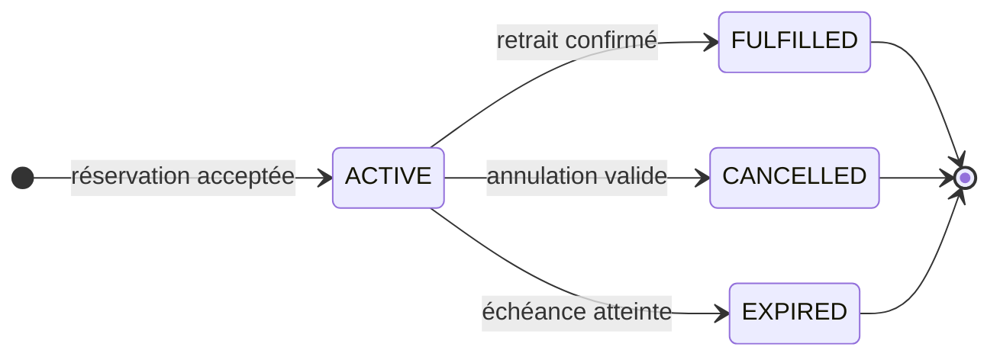
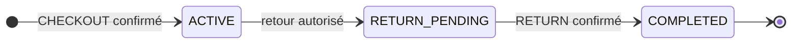
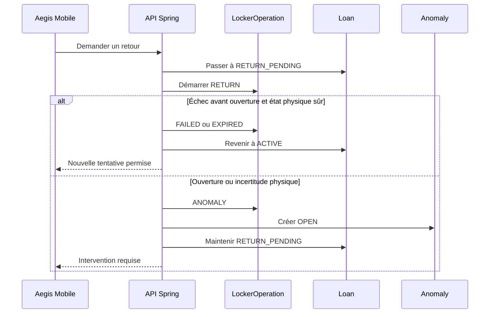
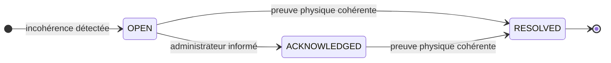

# Aegis — Machines à états métier

**Cours :** 420-5X7-SO — Écosystème connecté  
**Session :** Automne 2026  
**Équipe :** Philippe Jordan Monfouayi Mba et Yoël Jimmy Razafindretsa  
**Date :** 16 septembre 2026  
**Version :** 1.1  

---

## 1. Rôle du document

Ce document définit les cycles de vie métier du P0 d’Aegis.

Il précise :

- les états autorisés;
- les événements qui provoquent une transition;
- les conditions nécessaires;
- les effets transactionnels;
- les états terminaux;
- le comportement attendu en cas d’échec, d’expiration, de doublon ou d’incertitude physique.

Les machines décrites sont :

1. Reservation;
2. Loan;
3. LockerOperation;
4. Anomaly.

La readiness, la disponibilité, le retard et l’état en ligne du locker ne possèdent pas leur propre machine : ce sont des valeurs dérivées.

---

## 2. Principes communs

### 2.1 Autorité

Seul le backend Spring Boot peut appliquer une transition métier.

Le Web, iOS, MQTT et le locker peuvent :

- demander une action;
- transmettre une commande;
- produire une observation;
- afficher un résultat.

Ils ne peuvent jamais imposer directement un nouvel état à une réservation, un prêt, une opération ou une anomalie.

### 2.2 Atomicité

Une transition et ses effets obligatoires sont enregistrés dans une même transaction PostgreSQL.

Exemples :

- confirmer un retrait confirme l’opération, accomplit la réservation et crée le prêt;
- confirmer un retour confirme l’opération et complète le prêt;
- créer une anomalie termine l’opération concernée et bloque la conclusion silencieuse du workflow.

Si un effet obligatoire échoue, toute la transaction est annulée.

### 2.3 Idempotence

Chaque commande ou événement possède un identifiant stable. Un événement déjà traité peut être reconnu et audité, mais ne peut pas produire une deuxième transition.

Toute tentative de transition vérifie également l’état courant attendu. Une transition déjà appliquée retourne le résultat existant au lieu de répéter ses effets.

### 2.4 États terminaux

| Concept | États terminaux |
|---|---|
| Reservation | FULFILLED, CANCELLED, EXPIRED |
| Loan | COMPLETED |
| LockerOperation | CONFIRMED, FAILED, EXPIRED, ANOMALY |
| Anomaly | RESOLVED |

Un objet terminal n’est jamais réactivé. Une nouvelle tentative crée une nouvelle LockerOperation ou une nouvelle Anomaly.

---

## 3. Machine à états de Reservation

### 3.1 Vue

### 3.2 Définition des états

| État | Signification | Effet sur l’actif |
|---|---|---|
| ACTIVE | L’actif est réservé au technicien jusqu’à reservedUntil | La disponibilité dérivée est RESERVED |
| FULFILLED | Le retrait a été physiquement confirmé et un prêt a été créé | La disponibilité dérivée devient BORROWED |
| CANCELLED | Le technicien a annulé avant le retrait | L’actif peut redevenir AVAILABLE après recalcul |
| EXPIRED | La fenêtre est terminée sans retrait confirmé | L’actif peut redevenir AVAILABLE après recalcul |

### 3.3 Transitions

| État source | Événement | Garde obligatoire | État cible | Effets |
|---|---|---|---|---|
| Création | Demande acceptée | Utilisateur actif, rôle TECHNICIAN, actif READY, fenêtre valide, aucune réservation ACTIVE concurrente | ACTIVE | Enregistrer createdAt, reservedFrom, reservedUntil et l’audit |
| ACTIVE | CHECKOUT confirmé | LockerOperation CHECKOUT cohérente et prêt créé dans la même transaction | FULFILLED | Enregistrer fulfilledAt |
| ACTIVE | Annulation du titulaire | Aucun CHECKOUT non terminal ou incertain | CANCELLED | Enregistrer cancelledAt et recalculer la disponibilité |
| ACTIVE | reservedUntil atteint | Aucun retrait confirmé et aucune opération CHECKOUT non terminale ou en anomalie | EXPIRED | Enregistrer expiredAt et recalculer la disponibilité |

### 3.4 Règles de cohérence

- Une réservation refusée n’est jamais créée comme ACTIVE.
- Un technicien ne possède au plus qu’une réservation ACTIVE.
- Un actif ne possède au plus qu’une réservation ACTIVE.
- reservedFrom et reservedUntil appartiennent à la même plage d’exploitation ouverte.
- Une réservation FULFILLED n’expire jamais après coup.
- L’échéance d’une réservation ne termine jamais un Loan.
- Une opération CHECKOUT autorisée obtient sa propre fenêtre de 120 secondes.
- Tant qu’un CHECKOUT non terminal ou physiquement incertain existe, l’expiration de la réservation est différée afin d’éviter une course entre le minuteur et la preuve physique.
- Lorsque cette opération se termine sans retrait, la réservation reste ACTIVE si sa fenêtre est encore valide; sinon elle passe à EXPIRED.

---

## 4. Machine à états de Loan

### 4.1 Parcours nominal

Le retour vers ACTIVE après un échec sûr est défini dans la table de transitions plutôt que dans le diagramme afin de conserver une lecture linéaire.

### 4.2 Définition des états

| État | Signification | Responsabilité |
|---|---|---|
| ACTIVE | L’actif a été retiré et demeure attribué au technicien | Le titulaire reste responsable de l’actif |
| RETURN_PENDING | Une opération de retour est autorisée ou la réalité physique doit encore être clarifiée | L’actif demeure BORROWED et indisponible |
| COMPLETED | Le retour de l’actif attendu a été physiquement confirmé | La chaîne de possession est terminée |

### 4.3 Transitions

| État source | Événement | Garde obligatoire | État cible | Effets |
|---|---|---|---|---|
| Création | CHECKOUT confirmé | Reservation FULFILLED et LockerOperation CHECKOUT CONFIRMED | ACTIVE | Enregistrer checkedOutAt, dueAt et checkoutOperationId |
| ACTIVE | RETURN autorisé | Prêt du demandeur, locker disponible, horaire valide, aucune autre opération de retour active | RETURN_PENDING | Enregistrer returnRequestedAt et créer LockerOperation RETURN |
| RETURN_PENDING | RETURN confirmé | Actif attendu présent de manière stable dans la bonne cellule et porte refermée | COMPLETED | Enregistrer returnedAt et returnOperationId |
| RETURN_PENDING | Échec sûr avant ouverture | Aucune ouverture, aucune exécution possible et état physique connu inchangé | ACTIVE | Fermer l’opération en FAILED ou EXPIRED et permettre une nouvelle tentative |
| RETURN_PENDING | Interaction physique ou incertitude | Porte ouverte, commande possiblement exécutée, device perdu ou état incohérent | RETURN_PENDING | Terminer l’opération en ANOMALY et créer une Anomaly OPEN |
| RETURN_PENDING | Nouvelle tentative de récupération | Opération précédente terminale, aucune autre tentative active et correction physique amorcée | RETURN_PENDING | Créer une nouvelle LockerOperation RETURN |
| RETURN_PENDING | Correction prouvant qu’aucun dépôt n’a eu lieu | Porte fermée, actif attendu absent et chaîne de possession inchangée | ACTIVE | Résoudre l’anomalie et maintenir le titulaire comme responsable |

### 4.4 Règle validée pour les échecs de retour

### 4.5 Retard

Le dépassement de dueAt ne provoque aucune transition.

Le prêt :

- reste ACTIVE ou RETURN_PENDING;
- reçoit la propriété dérivée overdue = true;
- maintient l’actif BORROWED;
- demeure visible dans l’audit et les interfaces;
- ne passe à COMPLETED qu’après une preuve de retour cohérente.

### 4.6 Récupération après anomalie

Une LockerOperation terminée en ANOMALY reste terminale.

Après correction physique :

- si la preuve démontre qu’aucun dépôt n’a eu lieu et que l’actif demeure absent de la cellule, le Loan peut revenir à ACTIVE;
- si un nouveau workflow RETURN confirme le dépôt de l’actif attendu, le Loan passe à COMPLETED;
- si la réalité demeure incertaine, le Loan reste RETURN_PENDING;
- une nouvelle tentative utilise toujours une nouvelle LockerOperation;
- la preuve ayant permis la récupération est liée à l’Anomaly et auditée.

---

## 5. Machine à états de LockerOperation

### 5.1 Parcours nominal

```mermaid
stateDiagram-v2
    direction LR
    [*] --> REQUESTED : action utilisateur
    REQUESTED --> AUTHORIZED : règles validées
    AUTHORIZED --> COMMAND_SENT : commande publiée
    COMMAND_SENT --> COMMAND_ACKNOWLEDGED : hub accepte
    COMMAND_ACKNOWLEDGED --> DOOR_OPENED : porte observée ouverte
    DOOR_OPENED --> OBSERVATION_RECEIVED : preuve physique reçue
    OBSERVATION_RECEIVED --> CONFIRMED : séquence cohérente
    CONFIRMED --> [*]
```

Les sorties anormales sont volontairement décrites dans une table séparée afin de ne pas transformer le diagramme en réseau de flèches.

### 5.2 Définition des états

| État | Preuve nécessaire pour y entrer | Signification |
|---|---|---|
| REQUESTED | Demande utilisateur reçue | Une intention existe, mais aucune ouverture n’est encore permise |
| AUTHORIZED | Identité, accès, horaire, réservation ou prêt, readiness et absence de conflit validés | Le backend autorise une commande limitée dans le temps |
| COMMAND_SENT | Publication MQTT réussie | La commande a quitté le backend |
| COMMAND_ACKNOWLEDGED | Accusé positif corrélé du hub | Le hub a accepté la commande, sans prouver l’ouverture |
| DOOR_OPENED | Observation DOOR_OPENED dans la cellule attendue | Une interaction physique a commencé |
| OBSERVATION_RECEIVED | Observation RFID et état de porte reçus | Le backend possède des éléments à évaluer |
| CONFIRMED | Séquence complète et cohérente | Le retrait ou le retour est confirmé |
| FAILED | Échec explicite sans incertitude physique | Aucun effet métier final n’est appliqué |
| EXPIRED | Délai écoulé avec certitude qu’aucune interaction physique ambiguë n’a eu lieu | L’opération n’est plus utilisable |
| ANOMALY | Interaction incohérente ou réalité physique incertaine | Une intervention et une preuve de correction sont nécessaires |

### 5.3 Transitions nominales

| Source | Événement | Garde | Cible | Jalon enregistré |
|---|---|---|---|---|
| REQUESTED | Autorisation accordée | Toutes les règles métier sont satisfaites | AUTHORIZED | authorizedAt et expiresAt |
| AUTHORIZED | Publication MQTT réussie | Commande unique, cible précise, non expirée | COMMAND_SENT | commandSentAt |
| COMMAND_SENT | Accusé positif | messageId et operationId correspondent | COMMAND_ACKNOWLEDGED | acknowledgedAt |
| COMMAND_ACKNOWLEDGED | Porte ouverte | Bonne cellule et événement valide | DOOR_OPENED | Observation et horodatage |
| DOOR_OPENED | Observation reçue | Message valide, non dupliqué et corrélé | OBSERVATION_RECEIVED | PhysicalObservation |
| OBSERVATION_RECEIVED | Séquence complète | Porte refermée et tag attendu dans l’état requis | CONFIRMED | confirmedAt et effets métier atomiques |

### 5.4 Sorties anormales

| État courant | Situation | État terminal | Effet associé |
|---|---|---|---|
| REQUESTED | Authentification, accès, readiness, horaire, réservation ou prêt invalide | FAILED | Refus audité, aucune commande |
| AUTHORIZED | Publication impossible avant toute possibilité d’exécution | FAILED | Aucun effet physique |
| AUTHORIZED | Délai dépassé avant publication | EXPIRED | Commande interdite |
| COMMAND_SENT | Hub rejette explicitement la commande sans déverrouiller | FAILED | COMMAND_REJECTED audité |
| COMMAND_SENT ou COMMAND_ACKNOWLEDGED | Délai dépassé, locker en ligne et porte certainement restée fermée | EXPIRED | Échec sûr |
| COMMAND_SENT ou COMMAND_ACKNOWLEDGED | Device hors ligne ou exécution impossible à déterminer | ANOMALY | DEVICE_OFFLINE_DURING_OPERATION |
| DOOR_OPENED | Porte non refermée avant expiresAt | ANOMALY | DOOR_NOT_CLOSED_BEFORE_EXPIRY |
| DOOR_OPENED ou OBSERVATION_RECEIVED | Actif attendu non observé | ANOMALY | EXPECTED_ASSET_NOT_OBSERVED |
| DOOR_OPENED ou OBSERVATION_RECEIVED | Mauvais actif observé | ANOMALY | UNEXPECTED_ASSET_OBSERVED |
| OBSERVATION_RECEIVED | Lectures contradictoires ou localisation ambiguë | ANOMALY | INCONSISTENT_PHYSICAL_STATE |

### 5.5 Expiration

expiresAt est fixé à authorizedAt + 120 secondes.

Le délai ne suffit pas à choisir entre EXPIRED et ANOMALY :

| Situation au moment du délai | Résultat |
|---|---|
| Commande jamais envoyée | EXPIRED |
| Rejet explicite et aucune ouverture | FAILED |
| Porte connue fermée pendant toute l’opération | EXPIRED |
| Porte ouverte au moins une fois | ANOMALY |
| Device devenu hors ligne après l’envoi | ANOMALY |
| État physique impossible à déterminer | ANOMALY |

La sécurité dépend donc de la preuve disponible, pas uniquement du chronomètre.

### 5.6 Traitement des événements

- Un événement portant un autre operationId ne fait pas avancer l’opération.
- Un message dupliqué ne reproduit aucune transition.
- Un événement correspondant à un état déjà dépassé est conservé comme preuve technique, puis ignoré pour la transition.
- Un événement futur impossible ne fait pas sauter plusieurs états sans validation de chaque preuve.
- Plusieurs observations RFID peuvent être accumulées dans OBSERVATION_RECEIVED sans changer le statut à chaque lecture.
- Une fois terminale, l’opération ne change plus d’état.

---

## 6. Machine à états de Anomaly

### 6.1 Vue

### 6.2 Définition des états

| État | Signification | Action humaine permise |
|---|---|---|
| OPEN | L’incohérence est active et non reconnue | Consulter, investiguer et commencer la correction |
| ACKNOWLEDGED | Un administrateur a reconnu le problème | Ajouter une note et effectuer la correction physique |
| RESOLVED | Le backend possède une preuve cohérente de correction | Consulter l’historique uniquement |

### 6.3 Transitions

| Source | Événement | Garde | Cible | Effets |
|---|---|---|---|---|
| Création | Incohérence détectée | Type, cible et détails connus | OPEN | Enregistrer detectedAt et AuditEvent |
| OPEN | Accusé administratif | Administrateur authentifié | ACKNOWLEDGED | Conserver l’auteur, la date et la note |
| OPEN ou ACKNOWLEDGED | Nouvelle preuve physique | Observation cohérente avec l’état attendu | RESOLVED | Lier resolutionEvidenceObservationId et resolvedAt |

### 6.4 Règles

- L’administrateur ne peut jamais sélectionner RESOLVED.
- ACKNOWLEDGED n’affirme pas que le problème est corrigé.
- Une anomalie peut être résolue automatiquement avant d’être reconnue si une preuve physique suffisante arrive.
- Une anomalie RESOLVED n’est pas rouverte.
- Une récidive crée une nouvelle Anomaly liée aux nouvelles preuves.
- Si l’anomalie concerne un Loan RETURN_PENDING, sa résolution applique aussi la règle de récupération définie à la section 4.6.

---

## 7. Synchronisation entre les machines

Les états ne sont pas modifiés indépendamment lorsqu’une même décision concerne plusieurs agrégats.

| Situation | Reservation | LockerOperation | Loan | Anomaly |
|---|---|---|---|---|
| Réservation acceptée | ACTIVE | — | — | — |
| CHECKOUT autorisé | ACTIVE | AUTHORIZED | — | — |
| CHECKOUT confirmé | FULFILLED | CONFIRMED | Créé ACTIVE | — |
| CHECKOUT échoué sans interaction | ACTIVE ou EXPIRED selon l’heure | FAILED ou EXPIRED | — | — |
| CHECKOUT physiquement incertain | Maintenue pour bloquer la concurrence | ANOMALY | Non créé tant que le retrait n’est pas prouvé | OPEN |
| RETURN autorisé | FULFILLED | AUTHORIZED | RETURN_PENDING | — |
| RETURN échoué avant ouverture, état sûr | FULFILLED | FAILED ou EXPIRED | ACTIVE | — |
| RETURN physiquement incertain | FULFILLED | ANOMALY | RETURN_PENDING | OPEN |
| Nouvelle tentative RETURN confirmée | FULFILLED | CONFIRMED | COMPLETED | RESOLVED si la preuve corrige l’anomalie |

Lorsqu’un CHECKOUT devient physiquement incertain, le workflow ne fabrique pas un prêt à partir d’une supposition. L’actif doit être replacé dans sa cellule et l’anomalie résolue avant une nouvelle tentative. La réservation redevient utilisable si sa fenêtre reste ouverte; sinon elle passe à EXPIRED.

### 7.1 Transaction de retrait confirmé

Une seule transaction :

1. verrouille l’opération, la réservation et l’actif;
2. vérifie que l’événement n’a pas déjà été traité;
3. passe LockerOperation à CONFIRMED;
4. passe Reservation à FULFILLED;
5. crée Loan en ACTIVE;
6. ajoute les AuditEvent;
7. valide l’ensemble ou effectue un rollback complet.

### 7.2 Transaction de retour confirmé

Une seule transaction :

1. verrouille l’opération, le prêt et l’actif;
2. vérifie la séquence physique;
3. passe LockerOperation à CONFIRMED;
4. passe Loan à COMPLETED;
5. renseigne returnedAt et returnOperationId;
6. résout les anomalies corrigées par cette preuve;
7. ajoute les AuditEvent;
8. valide l’ensemble ou effectue un rollback complet.

---

## 8. Temps et événements automatiques

| Élément | Délai ou fréquence | Effet |
|---|---:|---|
| Reservation.reservedUntil | Choisi par le technicien dans la plage ouverte | EXPIRED uniquement si aucun CHECKOUT actif ou incertain |
| LockerOperation.expiresAt | 120 secondes après authorizedAt | EXPIRED si la situation est sûre; ANOMALY si elle est incertaine |
| Loan.dueAt | Copié depuis Reservation.reservedUntil | overdue devient vrai; aucun changement de statut |
| DeviceHeartbeat | Toutes les 10 secondes | Met à jour lastSeenAt |
| Locker OFFLINE | Après 30 secondes sans heartbeat valide | Bloque une nouvelle ouverture et peut créer une anomalie pendant une opération |

Les transitions liées au temps peuvent être évaluées par une tâche planifiée et de nouveau lors de chaque commande sensible. Cette double vérification évite de dépendre exclusivement du scheduler.

---

## 9. Concurrence et transitions interdites

### 9.1 Protection de concurrence

- La création d’une réservation verrouille ou contraint l’actif et le technicien.
- La confirmation d’un CHECKOUT verrouille la réservation, l’actif et l’opération.
- La confirmation d’un RETURN verrouille le prêt, l’actif et l’opération.
- Une contrainte PostgreSQL protège l’unicité des réservations et prêts actifs.
- Le backend vérifie l’état attendu dans la même transaction que la mise à jour.

### 9.2 Exemples de transitions interdites

| Tentative | Résultat |
|---|---|
| CANCELLED vers ACTIVE | Refusée; créer une nouvelle réservation |
| EXPIRED vers FULFILLED | Refusée |
| FULFILLED vers CANCELLED | Refusée |
| COMPLETED vers RETURN_PENDING | Refusée |
| FAILED vers COMMAND_SENT | Refusée; créer une nouvelle opération |
| EXPIRED vers AUTHORIZED | Refusée; créer une nouvelle opération |
| ANOMALY vers CONFIRMED | Refusée; résoudre puis utiliser une nouvelle opération si nécessaire |
| RESOLVED vers OPEN | Refusée; créer une nouvelle anomalie |

---

## 10. Audit obligatoire des transitions

Chaque transition déterminante produit un AuditEvent contenant au minimum :

- l’ancien état;
- le nouvel état;
- l’événement déclencheur;
- l’acteur humain ou système;
- l’identifiant de l’objet;
- operationId lorsqu’il existe;
- l’horodatage;
- la décision ou le motif du refus;
- les identifiants des preuves physiques utilisées.

Les payloads MQTT bruts demeurent dans InboundDeviceMessage. L’AuditEvent explique la décision métier; il ne duplique pas inutilement le message technique.

---

## 11. Cas minimaux à tester

| Machine | Cas attendu |
|---|---|
| Reservation | Création valide |
| Reservation | Refus si actif non READY |
| Reservation | Refus d’une deuxième réservation active par actif |
| Reservation | Refus d’une deuxième réservation active par technicien |
| Reservation | Annulation |
| Reservation | Expiration sans retrait |
| Reservation | Expiration différée pendant un CHECKOUT autorisé |
| Loan | Création uniquement après CHECKOUT confirmé |
| Loan | overdue sans changement de statut |
| Loan | Retour confirmé |
| Loan | Échec avant ouverture ramenant le prêt à ACTIVE |
| Loan | Incertitude après ouverture maintenant RETURN_PENDING |
| Loan | Résolution sans dépôt ramenant le prêt à ACTIVE |
| Loan | Nouvelle tentative RETURN confirmée après anomalie |
| LockerOperation | Parcours nominal complet |
| LockerOperation | Commande explicitement rejetée |
| LockerOperation | Expiration sûre avant ouverture |
| LockerOperation | Perte du device après envoi |
| LockerOperation | Porte non fermée avant expiration |
| LockerOperation | Tag attendu absent ou mauvais tag |
| LockerOperation | CHECKOUT incertain exigeant la remise en cellule avant une nouvelle tentative |
| LockerOperation | Message MQTT dupliqué |
| LockerOperation | Événement avec mauvais operationId |
| Anomaly | Accusé sans résolution |
| Anomaly | Refus d’une résolution manuelle |
| Anomaly | Résolution automatique avec preuve cohérente |

---

## 12. Décisions intégrées

| Décision | Application dans les machines |
|---|---|
| Une réservation ACTIVE par technicien | Garde de création de Reservation |
| Durée personnalisée dans les heures d’ouverture | Garde ACTIVE et transition EXPIRED |
| Opération de 120 secondes | Calcul de LockerOperation.expiresAt |
| COMMAND_ACKNOWLEDGED distinct | État obligatoire avant DOOR_OPENED |
| RFID local combiné à la porte | Garde de CONFIRMED |
| Message MQTT idempotent | Une seule transition par deviceId + messageId |
| Retour échoué avant ouverture | Loan revient à ACTIVE si l’état physique est sûrement inchangé |
| Retour après ouverture ou incertain | Loan reste RETURN_PENDING et une Anomaly est créée |
| Retard du prêt | Propriété dérivée, pas un nouvel état |
| Résolution d’anomalie | Preuve physique obligatoire; aucune résolution administrative forcée |

---

## 13. Limites du document

Ce document ne définit pas :

- les classes Java ou annotations JPA;
- les contraintes et index SQL exacts;
- les routes REST;
- les payloads MQTT détaillés;
- les mécanismes de rafraîchissement des interfaces;
- le câblage du hub et des cellules;
- la durée RFID finale après le POC.

Toute implémentation doit cependant respecter les états, gardes, effets atomiques et transitions interdites décrits ici.
