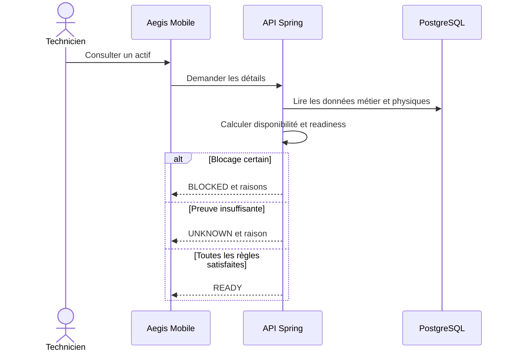
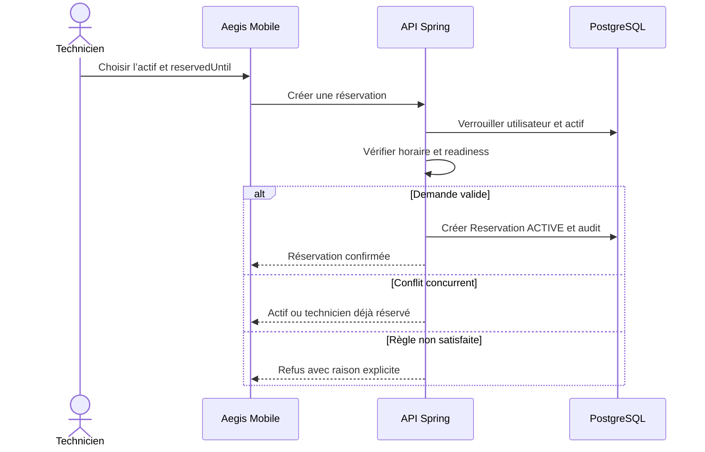
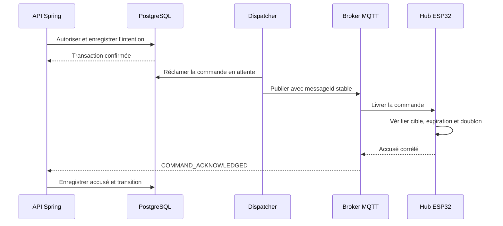
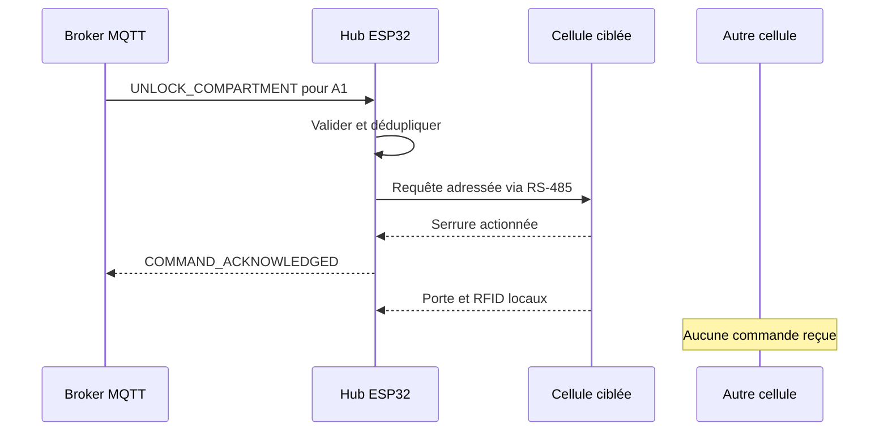
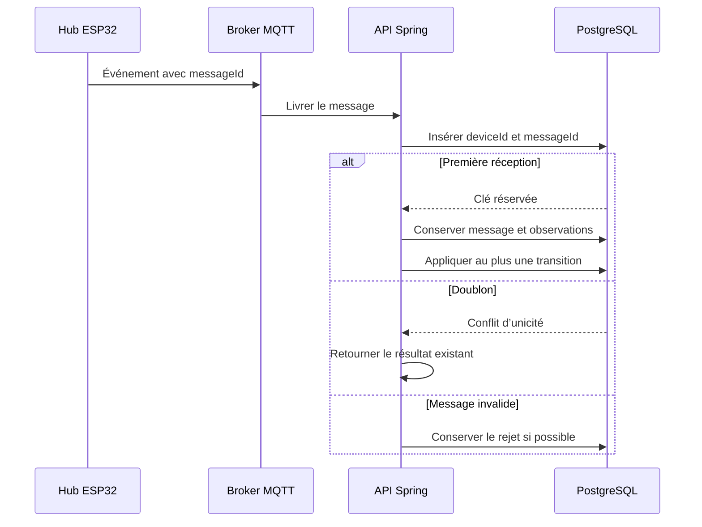
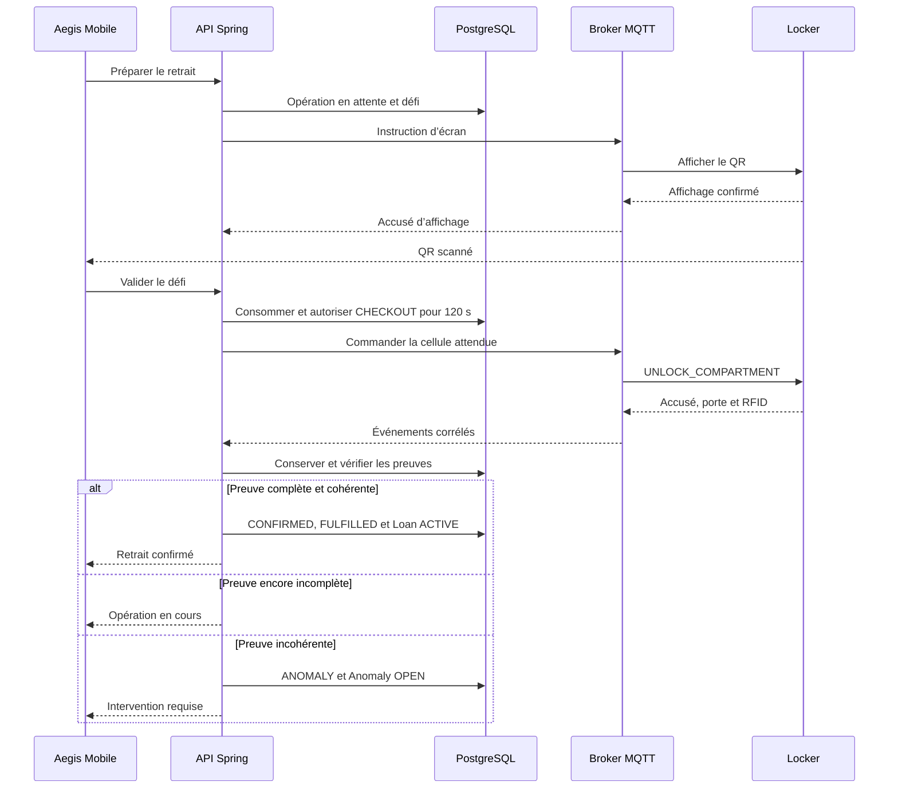
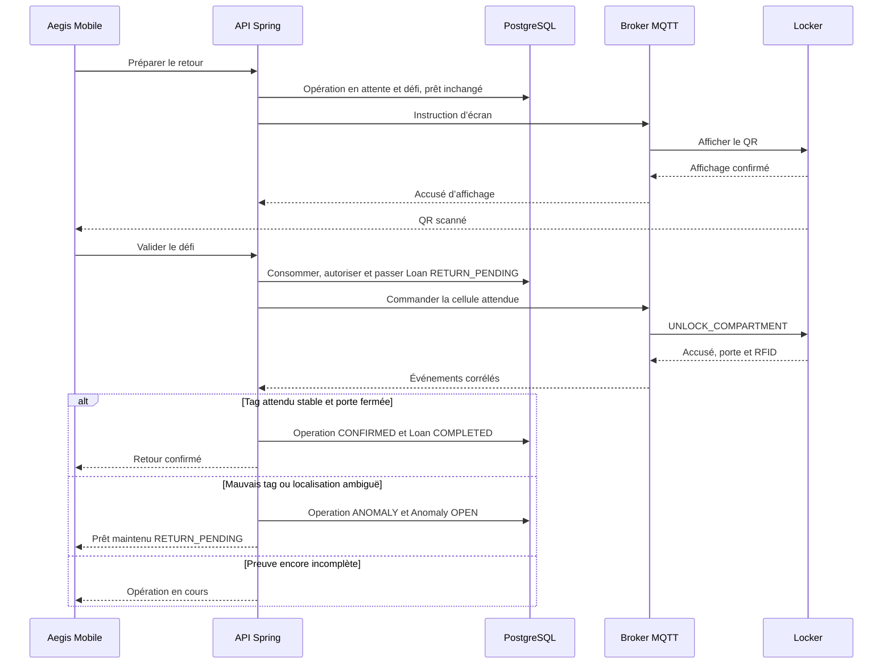
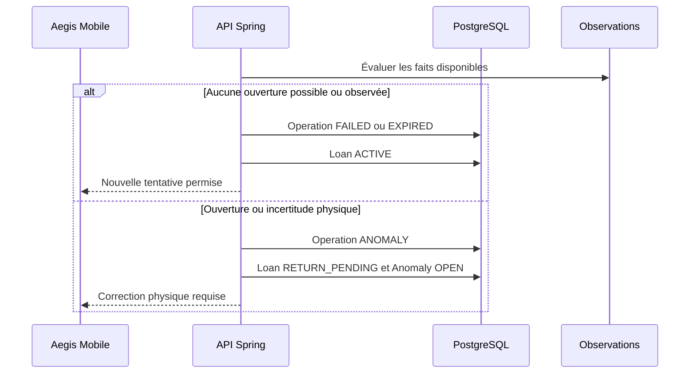
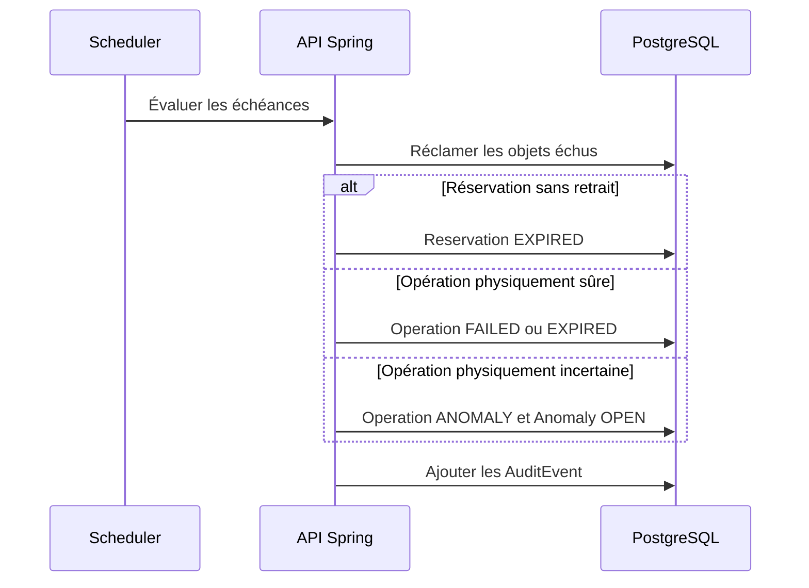
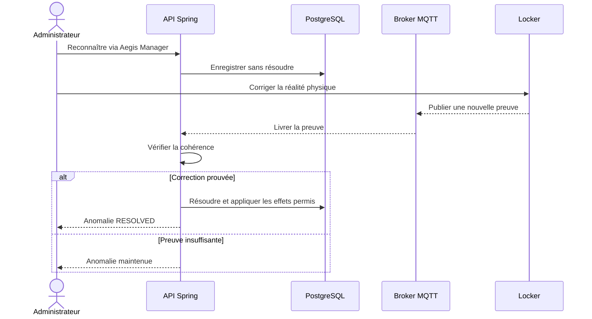

# Aegis — Algorithmes et flux fonctionnels

**Cours :** 420-5X7-SO — Écosystème connecté  
**Session :** Automne 2026  
**Équipe :** Philippe Jordan Monfouayi Mba et Yoël Jimmy Razafindretsa  
**Date de révision :** 16 septembre 2026
**Mise à jour ciblée :** 23 septembre 2026 — outbox et protections QR approuvées.
**Version :** 1.2 — contrôle local QR et étoile

---

## 1. Rôle du document

Ce document décrit comment Aegis prend ses décisions et exécute ses parcours P0.

Il transforme le périmètre, le dictionnaire de données, le modèle logique et les machines à états en règles d’exécution vérifiables. Il définit notamment :

- le calcul de la readiness;
- la création et l’expiration d’une réservation;
- l’autorisation d’un retrait ou d’un retour;
- l’émission fiable d’une commande d’ouverture;
- le traitement idempotent des messages MQTT;
- la validation des preuves physiques;
- la création et la fin de la chaîne de possession;
- le traitement du temps, des déconnexions et des anomalies.

Ce document reste indépendant des classes Java, des routes REST, des tables SQL et des payloads MQTT exacts. Ceux-ci devront implémenter les algorithmes présentés sans en affaiblir les gardes.

### 1.1 Sources de référence

Les règles proviennent, dans cet ordre, de :

1. `docs/cahier-conception/02-scope.md`, version 0.3;
2. `03-dictionnaire-de-donnees.md`;
3. `04-modele-de-donnees-logique.md`;
4. `05-machines-a-etats.md`;
5. `README.md`.

En cas de divergence, le scope prévaut et la divergence doit être corrigée dans les autres documents.

---

## 2. Frontières d’autorité

### 2.1 Règle centrale

Le backend Spring Boot est la seule autorité métier.

| Composant | Peut faire | Ne peut pas faire |
|---|---|---|
| Aegis Mobile | Demander, afficher, suivre une opération | Autoriser une ouverture ou confirmer un prêt |
| Aegis Manager | Administrer les données, reconnaître une anomalie | Forcer une readiness ou résoudre une anomalie |
| Backend Spring Boot | Valider, autoriser, transitionner, auditer | Considérer une intention comme une preuve physique |
| Broker MQTT | Transporter les messages autorisés | Interpréter les règles métier |
| Hub ESP32 | Valider techniquement et relayer une commande | Décider si un utilisateur ou un actif est admissible |
| Cellule | Actionner, mesurer et rapporter localement | Communiquer directement avec MQTT ou modifier un état métier |

### 2.2 Séparation des faits et des décisions

| Nature | Exemple | Traitement |
|---|---|---|
| Intention | « Je veux retirer cet actif » | Démarre une évaluation |
| Décision | « Cette ouverture est autorisée pendant 120 secondes » | Produite uniquement par le backend |
| Commande | « Déverrouiller A1 » | Exécutée par le hub et la cellule |
| Observation | « La porte A1 est fermée et le tag X est absent » | Conservée comme preuve |
| Transition métier | « Le retrait est confirmé; le prêt commence » | Appliquée uniquement par le backend |

Aucune observation isolée ne constitue automatiquement une transition métier.

---

## 3. Conventions algorithmiques

### 3.1 Résultat d’une décision

Chaque commande applicative retourne l’un des résultats suivants :

| Résultat | Signification |
|---|---|
| `ACCEPTED` | La demande a été appliquée et son nouvel état est connu |
| `IN_PROGRESS` | Une opération physique est autorisée ou en attente de preuves |
| `REJECTED` | Une garde métier ou de sécurité a échoué |
| `CONFLICT` | L’état a changé ou une opération concurrente existe |
| `ALREADY_APPLIED` | La même intention a déjà produit son effet; le résultat existant est retourné |
| `ANOMALY_REQUIRES_ACTION` | La réalité physique n’est pas suffisamment sûre pour conclure |

Les contrats REST pourront mapper ces résultats à des statuts HTTP, sans modifier leur sens métier.

### 3.2 Horodatage

- Tous les instants persistés sont en UTC.
- Les heures d’exploitation sont interprétées dans `America/Toronto` pour le P0.
- Le backend utilise son horloge comme référence pour `authorizedAt`, `expiresAt`, `fulfilledAt`, `checkedOutAt` et `returnedAt`.
- Un timestamp fourni par un device est une donnée de preuve; il ne remplace pas `receivedAt`.
- Les comparaisons temporelles utilisent un instant capturé une seule fois au début de la transaction.

### 3.3 Verrouillage et ordre d’accès

Les opérations concurrentes verrouillent toujours les objets dans un ordre stable afin de limiter les interblocages :

1. utilisateur;
2. actif;
3. réservation ou prêt;
4. locker puis compartiment;
5. LockerOperation;
6. LocalAccessChallenge, si concerné;
7. anomalie, si nécessaire.

La ligne d’idempotence REST propre à la requête est acquise avant les agrégats. Les handlers MQTT, les jobs et les actions humaines suivent le même ordre d’agrégats.

Les contraintes PostgreSQL demeurent la dernière barrière contre les doublons, même lorsque les vérifications applicatives ont déjà été exécutées.

### 3.4 Principe de nouvelle tentative

- Une requête applicative répétée avec la même clé d’idempotence retourne le résultat existant.
- Une nouvelle tentative physique après une opération terminale crée un nouvel `operationId`.
- Une republication technique d’une même commande conserve le même `messageId` et le même `operationId`.
- Aucun statut terminal n’est réactivé.

---

## 4. Algorithme de readiness

### 4.1 But

La readiness répond à cette question :

> Cet actif est-il réellement prêt, conforme et autorisé pour cet utilisateur maintenant?

Elle est recalculée à la lecture, à la réservation et immédiatement avant une ouverture. Elle n’est jamais modifiée par un administrateur.

### 4.2 Entrées

| Entrée | Données utiles |
|---|---|
| User | statut, rôle, maximumAccessLevel |
| Asset | archivage, état opérationnel, calibration, niveau requis |
| Disponibilité | réservation active, prêt non terminé |
| AssetPlacement | compartiment actuellement attendu |
| AssetIdentifier | identifiant physique actif attendu |
| État physique | présence localisée, santé du lecteur, porte, fraîcheur des observations |
| Contexte | lecture générale, nouvelle réservation ou retrait d’une réservation existante |

Le contexte sert uniquement à reconnaître qu’une réservation détenue par le même technicien est compatible avec son propre retrait. Elle demeure incompatible pour les autres utilisateurs.

### 4.3 Priorité des résultats

1. Une condition qui prouve que l’actif ne peut pas être utilisé produit `BLOCKED`.
2. En l’absence de blocage certain, une preuve physique insuffisante produit `UNKNOWN`.
3. `READY` est retourné uniquement si toutes les conditions sont satisfaites.

Cette priorité permet de retourner `BLOCKED` lorsqu’un actif est clairement endommagé, même si son lecteur RFID est momentanément indisponible : il est déjà certain que l’actif n’est pas prêt.

### 4.4 Matrice de décision

| Condition | Résultat ou raison ajoutée |
|---|---|
| Utilisateur désactivé ou rôle incompatible | Demande rejetée avant l’évaluation |
| Actif archivé ou administrativement indisponible | `BLOCKED / NOT_AVAILABLE` |
| Prêt `ACTIVE` ou `RETURN_PENDING` | `BLOCKED / NOT_AVAILABLE` |
| Réservation active incompatible avec l’utilisateur ou l’action | `BLOCKED / NOT_AVAILABLE` |
| Actif absent de sa cellule | `BLOCKED / NOT_PRESENT` |
| Actif en maintenance | `BLOCKED / MAINTENANCE` |
| Actif endommagé | `BLOCKED / DAMAGED` |
| Calibration obligatoire et échue | `BLOCKED / CALIBRATION_EXPIRED` |
| Niveau d’accès insuffisant | `BLOCKED / ACCESS_DENIED` |
| Locker hors ligne, cellule déconnectée, lecteur défaillant ou localisation ambiguë | `UNKNOWN / UNKNOWN_PHYSICAL_STATE` |
| Toutes les conditions satisfaites | `READY` |

Un actif actif dont `calibrationRequired = true` doit posséder une échéance de calibration. L’API d’administration refuse une configuration qui briserait cet invariant; un actif incomplet reste indisponible plutôt que d’être évalué comme prêt.

### 4.5 Pseudocode

```text
function evaluateReadiness(assetId, userId, context, now):
    user  = loadActiveUser(userId)
    asset = loadActiveAsset(assetId)

    require user.status == ACTIVE

    reasons = []
    physicalUnknown = false

    availabilityCompatible = isAvailabilityCompatible(asset, context, user)

    if not availabilityCompatible:
        reasons += NOT_AVAILABLE

    if asset.operationalStatus == MAINTENANCE:
        reasons += MAINTENANCE

    if asset.operationalStatus == DAMAGED:
        reasons += DAMAGED

    if asset.calibrationRequired and now >= asset.calibrationDueAt:
        reasons += CALIBRATION_EXPIRED

    if user.maximumAccessLevel < asset.requiredAccessLevel:
        reasons += ACCESS_DENIED

    physical = evaluateCurrentPresence(asset, now)

    if physical == ABSENT:
        reasons += NOT_PRESENT

    if physical == UNKNOWN:
        physicalUnknown = true

    if reasons is not empty:
        return BLOCKED with distinct(reasons)

    if physicalUnknown:
        return UNKNOWN with UNKNOWN_PHYSICAL_STATE

    return READY with no reason
```

### 4.6 Flux de consultation



---

## 5. Création d’une réservation

### 5.1 Préconditions

Une réservation P0 est immédiate. `reservedFrom` correspond à l’instant d’acceptation et le technicien choisit `reservedUntil`.

La demande est admissible seulement si :

- l’utilisateur est actif et possède le rôle `TECHNICIAN`;
- le locker possède un horaire actif;
- l’instant courant appartient à une plage ouverte;
- `reservedUntil` est postérieur à l’instant courant;
- `reservedUntil` ne dépasse pas la fermeture de cette même plage;
- le technicien ne possède aucune autre réservation `ACTIVE`;
- l’actif ne possède aucune réservation `ACTIVE`;
- l’actif ne possède aucun prêt non terminé;
- la readiness vaut `READY` dans le contexte d’une nouvelle réservation.

### 5.2 Pseudocode transactionnel

```text
function createReservation(userId, assetId, requestedUntil, requestKey):
    now = clock.now()

    if requestKey already completed:
        return existing result

    begin transaction
        lock user then asset

        require active TECHNICIAN
        window = requireOpenOperatingWindow(asset.lockerId, now)
        require now < requestedUntil <= window.closesAt

        require no ACTIVE reservation for user
        require no ACTIVE reservation for asset
        require no non-completed loan for asset

        readiness = evaluateReadiness(asset, user, RESERVATION, now)
        require readiness.result == READY

        create Reservation(
            status = ACTIVE,
            reservedFrom = now,
            reservedUntil = requestedUntil
        )

        append AuditEvent(RESERVATION_CREATED)
        save requestKey result
    commit

    return ACCEPTED with reservation
```

### 5.3 Concurrence

La vérification préalable améliore le message retourné, mais elle ne garantit pas l’unicité. L’insertion doit être protégée par des contraintes PostgreSQL empêchant :

- deux réservations `ACTIVE` pour le même actif;
- deux réservations `ACTIVE` pour le même technicien.

Si deux demandes valides arrivent simultanément, une seule est acceptée. L’autre retourne `CONFLICT` après rollback, sans réservation partielle.

### 5.4 Flux de décision



### 5.5 Annulation

Une réservation `ACTIVE` peut être annulée par son titulaire si aucune commande de serrure n’a été autorisée et si aucune incertitude physique n’existe. Si une opération attend son QR, la même transaction termine cette opération en `FAILED` avec `RESERVATION_CANCELLED`, invalide le défi et programme l’effacement de l’écran. Une opération déjà autorisée ou une anomalie physique bloque cette annulation.

La répétition avec la même clé d’idempotence rejoue le résultat initial; elle ne recrée pas de défi.
---

## 6. Autorisation d’une opération physique

### 6.1 Garde commune au locker

Avant toute commande d’ouverture, le backend vérifie :

- l’identité et le rôle de l’initiateur;
- la plage d’exploitation courante;
- l’état `ONLINE` du hub;
- l’état `CONNECTED` de la cellule;
- l’état `HEALTHY` du lecteur RFID local;
- une porte connue `CLOSED`;
- une serrure dans un état connu compatible;
- une affectation active de l’actif à la cellule;
- un identifiant physique actif pour l’actif;
- l’absence d’une anomalie bloquante non résolue;
- l’absence d’une autre opération physique non terminale sur le locker.

Le P0 sérialise les ouvertures au niveau du locker : un seul compartiment peut avoir une opération physique non terminale à la fois. Cette règle est volontairement plus stricte qu’un verrou par cellule et protège la démonstration contre deux séquences physiques concurrentes.

### 6.2 Garde propre au retrait

Une opération `CHECKOUT` exige aussi :

- une réservation `ACTIVE` appartenant au demandeur;
- le même actif que celui de la réservation;
- un instant antérieur à `reservedUntil`;
- aucun prêt non terminé pour l’actif;
- une readiness réévaluée comme `READY`, en considérant la réservation du titulaire comme compatible.

### 6.3 Garde propre au retour

Une opération `RETURN` exige aussi :

- un prêt `ACTIVE` appartenant au demandeur;
- aucun autre retour non terminal pour ce prêt;
- la même affectation physique attendue que celle utilisée pour l’actif;
- l’absence d’une opération précédente non terminale.

Si le prêt est déjà `RETURN_PENDING`, une nouvelle tentative est permise uniquement lorsque l’opération précédente est terminale et que la procédure de récupération autorise cette nouvelle tentative.

### 6.4 Préparation sans ouverture

```text
function prepareOperation(type, userId, sourceId, requestKey):
    authenticate and authorize caller
    begin transaction
        acquire REST idempotency row bound to caller, method, URI and request hash
        if completed identical request: return stored response
        load and lock aggregates in canonical order
        verify common locker guards and type-specific guards
        enforce preparation rate limit
        create operation REQUESTED
        create random 256-bit token
        create challenge PENDING bound to operation and current hub session
        challenge.expiresAt = min(now + 60 seconds, currentClosingTime,
                                  reservedUntil for CHECKOUT)
        require challenge.expiresAt > now
        persist SHA-256(token) in challenge
        persist encrypted display payload in hub_display_outbox
        operation.status = AWAITING_LOCAL_PROOF
        keep authorizedAt, localProofValidatedAt and operation.expiresAt null
        keep Loan unchanged
        append audit without token
        save 202 response containing operation and challenge metadata only
    commit
    return stored response
```

La préparation n’insère **aucune ligne dans `command_outbox`**. Une réservation peut être effectuée à distance; elle ne lance pas automatiquement cette préparation.

Le dispatcher d’écran publie le QR au seul hub concerné, via le topic privé `display`, avec TLS, QoS 1 et `retain=false`. Le message cible le démarrage courant du hub et porte une révision croissante d’écran. Le hub vérifie sa cible et son échéance avant affichage, puis émet `ACCESS_CHALLENGE_DISPLAYED` sans le secret.

### 6.5 Validation locale et autorisation atomique

```text
function authorizeLocal(operationId, challengeId, token, caller, requestKey):
    authenticate and authorize caller
    begin transaction
        acquire REST idempotency row bound to caller, method, URI and request hash
        if completed identical request: return stored response
        lock user, asset, reservation or loan, locker, compartment, operation, challenge
        now = trustedBackendClock.now() after all lock waits
        require caller owns operation
        require operation.status == AWAITING_LOCAL_PROOF
        require challenge.operationId == operationId
        require challenge.status == PENDING
        require now < challenge.expiresAt
        require challenge.displayedAt != null
        require same enabled hub and deviceSessionId, with fresh health
        compare SHA-256(token) to tokenHash in constant time
        re-evaluate current identity, access, schedule and all operation guards
        exclude this operation when checking absence of OTHER operations

        consume challenge, set consumedAt and closedAt = now
        operation.status = AUTHORIZED
        operation.localProofValidatedAt = operation.authorizedAt = now
        operation.expiresAt = now + 120 seconds
        for RETURN: change ACTIVE loan to RETURN_PENDING
                    or retain authorized recovery RETURN_PENDING
        create exactly one durable UNLOCK_COMPARTMENT in command_outbox
        purge QR ciphertext from display outbox
        append audit without token
        store idempotent 202 result
    commit
    return 202 operation view without token
```

La validation ne fait aucun appel réseau dans la transaction SQL. Un rollback ne consomme pas le défi et ne laisse pas de commande isolée. L’accusé d’affichage peut arriver après le scan : `LOCAL_PROOF_NOT_DISPLAYED` est alors transitoire; le mobile réessaie avec une nouvelle clé après confirmation de l’affichage.

Un secret erroné incrémente `failedAttempts` dans une transaction **effectivement validée**, même si l’API renvoie un refus. Ne pas annuler ce compteur par une exception entraînant un rollback. Au cinquième échec, invalider le défi et terminer l’opération en `FAILED`. Une requête provenant d’un autre compte ne peut pas consommer le défi ni épuiser ces essais.

Les refus devenus définitifs (expiration, nouvelle session du hub, réservation annulée, garde devenue invalide) ferment le défi, terminent l’opération sans ouverture et programment un nouvel état d’écran. Un simple secret erroné laisse le défi utilisable tant que les limites ne sont pas atteintes. La limite retenue est de cinq secrets erronés soumis par défi; une lecture caméra sans soumission ne compte pas. La fréquence des préparations est limitée par utilisateur et casier selon un seuil configurable à qualifier contre les rafales et les cycles normaux. Un rejeu idempotent ne compte pas comme nouvelle préparation. L’ancien plafond de trois préparations en quinze minutes est abandonné conformément à l’ADR-009; la limitation elle-même n’est pas supprimée.

### 6.6 Portée de la preuve et affichage

Le QR prouve l’accès au code frais de l’écran. Il peut être relayé par photo ou vidéo; il ne garantit pas à lui seul la présence physique de la personne authentifiée. Aucun critère de pays ou d’adresse IP ne remplace cette règle.

Après autorisation, le hub masque le QR lorsqu’il reçoit la commande correspondante. Après une transition terminale validée en base, le backend crée une instruction `DISPLAY_OPERATION_STATUS`. Le téléphone observe la même vérité par le polling REST existant. Aucune notification push supplémentaire n’est nécessaire au P0.

---

## 7. Émission fiable de la commande MQTT

Ce flux s’applique uniquement après consommation du défi. L’opération doit être `AUTHORIZED`, `localProofValidatedAt` renseigné, et son défi `CONSUMED`. Le dispatcher ne transforme jamais une simple demande ou une instruction d’écran en commande de serrure.


### 7.1 Risque traité

PostgreSQL et le broker MQTT ne partagent pas une transaction atomique. Aegis doit donc éviter deux états dangereux :

- une opération autorisée sans commande jamais publiée;
- une commande exécutée alors que le backend a perdu sa trace.

### 7.2 Règle de fiabilité

L’autorisation enregistre dans la transaction PostgreSQL une intention de commande durable contenant au minimum :

- un `messageId` stable;
- l’`operationId`;
- le locker et le compartiment cibles;
- le type `UNLOCK_COMPARTMENT`;
- `issuedAt`, `expiresAt` et `schemaVersion`;
- son état de publication.

Une tâche du monolithe Spring publie ensuite cette intention depuis l’**outbox transactionnelle PostgreSQL**, conformément à l’ADR-005 accepté. Une autre stratégie nécessiterait une décision explicite conservant ces propriétés; aucune transaction SQL n’attend la réponse du matériel.

### 7.3 Pseudocode du dispatcher

```text
function dispatchPendingCommand(commandId):
    command = claim pending command
    operation = load operation

    if operation is terminal or now >= operation.expiresAt:
        mark command CANCELLED
        expire operation safely if applicable
        return

    publish command using its existing messageId

    begin transaction
        lock operation and command
        if operation.status == AUTHORIZED:
            operation.status = COMMAND_SENT
            operation.commandSentAt = now
            append AuditEvent(COMMAND_SENT)
        mark command DISPATCHED
    commit
```

Si le worker s’arrête après la publication mais avant le commit, il peut republier exactement la même commande. Le hub doit reconnaître le `messageId` ou l’`operationId` déjà consommé et ne jamais déverrouiller deux fois pour la même commande.

Une commande d’ouverture est toujours publiée avec `retain = false`. Le hub refuse toute commande expirée, destinée à un autre locker ou déjà consommée.

### 7.4 Séquence de publication



---

## 8. Exécution dans le hub et la cellule

### 8.1 Validation technique par le hub

Le hub accepte une commande seulement si :

- son identité correspond au `lockerId` ciblé;
- le contrat et `schemaVersion` sont supportés;
- `messageId`, `operationId` et `compartmentId` sont présents;
- l’instant d’expiration n’est pas dépassé;
- la commande n’a jamais été consommée;
- la cellule existe et répond sur son port RS-485 dédié;
- aucune autre ouverture locale n’est en cours;
- les conditions électriques et matérielles permettent une exécution sûre.

Cette validation est technique. Le hub ne réévalue jamais l’utilisateur, la réservation, le prêt ou la readiness.

### 8.2 Exécution locale

```text
function handleUnlockCommand(command):
    validate envelope and local safety

    if duplicate command:
        republish previous acknowledgement
        do not unlock again
        return

    if invalid or unsafe:
        publish COMMAND_REJECTED with reason
        return

    persist command EXECUTING durably before any physical action
    send addressed unlock request to target cell over its dedicated RS-485 port

    if cell accepts:
        persist command ACKNOWLEDGED locally
        publish COMMAND_ACKNOWLEDGED
        enforce maximum unlock duration
        relay door, lock and RFID observations
    else if cell explicitly guarantees no execution:
        persist REJECTED and publish COMMAND_REJECTED
    else:
        retain uncertain EXECUTING, publish DEVICE_ERROR, never retry the impulse blindly
```

Une entrée EXECUTING retrouvée après redémarrage interdit un nouvel actionnement; elle exige une réconciliation physique selon le contrat MQTT.

### 8.3 Ciblage d’une cellule



---

## 9. Réception idempotente des messages MQTT

### 9.1 Validation de l’enveloppe

Avant toute transition, le backend vérifie :

- que le device est reconnu et actif;
- que le topic autorisé correspond au device et au locker;
- que le payload et sa version sont supportés;
- que `messageId` est présent;
- que `operationId` est présent lorsque le type l’exige;
- que le locker, le compartiment et l’opération sont cohérents;
- que les horodatages respectent la tolérance définie par le contrat;
- que le type d’événement est permis sur ce topic.

Un message rejeté ne produit aucune transition métier. Lorsque son enveloppe est suffisamment lisible, il est conservé avec un statut de traitement `REJECTED` afin de faciliter le diagnostic.

### 9.2 Déduplication

La paire `(lockerDeviceId, messageId)` est réservée avant tout effet. Une contrainte unique PostgreSQL garantit qu’un seul traitement gagne en présence de consommateurs concurrents.

```text
function ingestDeviceMessage(deviceIdentity, topic, rawPayload):
    receivedAt = clock.now()
    envelope = minimallyParse(rawPayload)

    begin transaction
        validate device, topic and envelope

        inserted = insert InboundDeviceMessage
                   using unique(deviceId, messageId)

        if not inserted:
            return ALREADY_APPLIED without business transition

        observations = normalize(envelope)
        persist observations

        if envelope carries heartbeat:
            update lastSeenAt

        if envelope references operation:
            lock operation and affected aggregates
            evaluate all accumulated evidence
            apply at most one valid state advancement

        mark message PROCESSED
    commit
```

### 9.3 Événements retardés ou désordonnés

L’algorithme ne conclut pas uniquement selon l’ordre d’arrivée réseau. Il conserve les faits puis vérifie leur cohérence temporelle et causale :

- même `operationId`;
- même locker et même cellule;
- événements produits après l’autorisation;
- accusé de commande valide;
- ouverture puis fermeture de la bonne porte;
- preuve RFID stable dans la fenêtre attendue;
- aucun événement contradictoire.

Un événement arrivé tardivement peut compléter un ensemble de preuves encore valide. Il ne peut jamais modifier une opération déjà terminale.

### 9.4 Séquence idempotente



---

## 10. Évaluation de la preuve physique

### 10.1 Conditions communes

Une preuve de retrait ou de retour est admissible seulement si :

1. la commande a été reconnue par le hub;
2. la bonne porte a été observée ouverte;
3. la même porte a ensuite été observée fermée;
4. le lecteur RFID de la cellule est déclaré sain;
5. les observations concernent l’identifiant actif attendu;
6. la localisation n’est pas contredite par une autre cellule;
7. la fenêtre de stabilisation est complète;
8. tous les faits sont liés à la même opération non terminale.

### 10.2 Fenêtre RFID initiale

La valeur initiale du POC est une fenêtre de trois secondes après la fermeture de la porte.

| Type d’opération | Preuve stable exigée |
|---|---|
| `CHECKOUT` | Le tag attendu est absent pendant toute la fenêtre, le lecteur est sain et aucune autre cellule ne le localise de façon ambiguë |
| `RETURN` | Le tag attendu est lu au moins trois fois de façon cohérente dans la cellule ciblée pendant la fenêtre |

Le POC peut ajuster la puissance, le nombre de lectures et la durée. Il ne peut pas retirer les exigences de porte refermée, de lecteur sain et de localisation cohérente.

### 10.3 Pseudocode

```text
function evaluatePhysicalProof(operation, observations):
    require operation.status is non-terminal

    if no valid acknowledgement:
        return INCOMPLETE

    if no target-cell DOOR_OPENED after acknowledgement:
        return INCOMPLETE

    if no target-cell DOOR_CLOSED after opening:
        return INCOMPLETE

    if reader unhealthy or observations ambiguous:
        return INCONSISTENT

    window = observations during stabilization after door close

    if operation.type == CHECKOUT:
        if expected tag absent for the complete window:
            return COHERENT_CHECKOUT
        if wrong or conflicting identity observed:
            return INCONSISTENT
        return INCOMPLETE

    if operation.type == RETURN:
        if expected tag has at least 3 consistent target-cell reads:
            return COHERENT_RETURN
        if wrong or conflicting identity observed:
            return INCONSISTENT
        return INCOMPLETE
```

Une preuve `INCOMPLETE` avant `expiresAt` maintient l’opération en cours. Une preuve `INCONSISTENT` après une interaction physique produit une anomalie. À l’expiration, l’algorithme de la section 14 décide entre `EXPIRED` et `ANOMALY`.

---

## 11. Confirmation d’un retrait

### 11.1 Effets atomiques

La confirmation exige une opération autorisée par un défi consommé. Ajouter à la même transaction une instruction d’écran sans secret portant le résultat confirmé; l’envoi MQTT intervient après commit.


Une preuve `COHERENT_CHECKOUT` provoque dans une seule transaction :

1. le verrouillage de l’opération, de la réservation et de l’actif;
2. une nouvelle vérification de l’état courant et de l’idempotence;
3. le passage de `LockerOperation` à `CONFIRMED`;
4. le passage de `Reservation` à `FULFILLED`;
5. la création d’un `Loan` à `ACTIVE`;
6. la copie de `Reservation.reservedUntil` dans `Loan.dueAt`;
7. l’enregistrement des références aux preuves physiques;
8. l’ajout des événements d’audit.

Tout échec annule l’ensemble.

### 11.2 Pseudocode

```text
function confirmCheckout(operationId):
    now = clock.now()

    begin transaction
        lock user, asset, reservation, locker, compartment, operation

        if operation.status == CONFIRMED:
            return ALREADY_APPLIED with existing loan

        require operation.type == CHECKOUT
        require operation is non-terminal
        require reservation.status == ACTIVE
        require no non-completed loan for asset

        proof = evaluatePhysicalProof(operation, stored observations)
        require proof == COHERENT_CHECKOUT

        operation.status = CONFIRMED
        operation.confirmedAt = now

        reservation.status = FULFILLED
        reservation.fulfilledAt = now

        loan = create Loan(
            status = ACTIVE,
            checkedOutAt = now,
            dueAt = reservation.reservedUntil,
            checkoutOperationId = operation.id
        )

        append audit events and proof references
    commit

    return ACCEPTED with loan
```

### 11.3 Flux nominal



### 11.4 Interdictions

- La disparition d’un tag sans porte ouverte ne crée pas de prêt.
- Une commande reconnue sans preuve RFID ne crée pas de prêt.
- Une réservation expirée avant l’autorisation ne peut pas être accomplie.
- Une opération terminale ne peut pas créer un second prêt.
- Une incertitude de retrait ne fabrique jamais une chaîne de possession par supposition.

---

## 12. Confirmation d’un retour

### 12.1 Effets atomiques

Le QR seul ne termine aucun prêt. Ajouter à la transaction de confirmation une instruction d’écran sans secret; le hub affiche le succès seulement après cette décision backend.


Une preuve `COHERENT_RETURN` provoque dans une seule transaction :

1. le verrouillage de l’opération, du prêt et de l’actif;
2. le passage de `LockerOperation` à `CONFIRMED`;
3. le passage de `Loan` à `COMPLETED`;
4. l’enregistrement de `returnedAt` et `returnOperationId`;
5. la résolution des anomalies que cette preuve corrige réellement;
6. l’ajout des événements d’audit;
7. le recalcul de la disponibilité et de la readiness.

### 12.2 Pseudocode

```text
function confirmReturn(operationId):
    now = clock.now()

    begin transaction
        lock user, asset, loan, locker, compartment, operation

        if operation.status == CONFIRMED:
            return ALREADY_APPLIED with completed loan

        require operation.type == RETURN
        require operation is non-terminal
        require loan.status == RETURN_PENDING

        proof = evaluatePhysicalProof(operation, stored observations)
        require proof == COHERENT_RETURN

        operation.status = CONFIRMED
        operation.confirmedAt = now

        loan.status = COMPLETED
        loan.returnedAt = now
        loan.returnOperationId = operation.id

        resolve only anomalies proven corrected by this evidence
        append audit events and proof references
    commit

    return ACCEPTED with completed loan
```

### 12.3 Flux nominal et refus



### 12.4 Règle fondamentale

La simple présence de l’actif dans sa cellule ne termine jamais un prêt. Il faut une opération `RETURN` corrélée comprenant l’autorisation, l’ouverture, la présence stable de l’actif attendu et la fermeture de la porte.

Un actif observé présent alors que son prêt est encore ouvert demeure `BORROWED` et produit l’anomalie `ASSET_PRESENT_WITH_ACTIVE_LOAN`.

---

## 13. Échec d’un retour

### 13.1 Distinction obligatoire

Le résultat dépend de la certitude physique, pas uniquement du type d’erreur.

| Situation | LockerOperation | Loan | Anomaly |
|---|---|---|---|
| Refus avant publication | `FAILED` | Retour à `ACTIVE` | Aucune |
| Publication impossible et aucune exécution possible | `FAILED` ou `EXPIRED` | Retour à `ACTIVE` | Aucune |
| Rejet explicite du hub sans déverrouillage | `FAILED` | Retour à `ACTIVE` | Audit du rejet |
| Porte certainement restée fermée jusqu’à l’expiration | `EXPIRED` | Retour à `ACTIVE` | Aucune |
| Porte ouverte au moins une fois | `ANOMALY` | Reste `RETURN_PENDING` | `OPEN` |
| Hub perdu après l’envoi | `ANOMALY` | Reste `RETURN_PENDING` | `OPEN` |
| État physique contradictoire ou inconnu | `ANOMALY` | Reste `RETURN_PENDING` | `OPEN` |

### 13.2 Algorithme

```text
function concludeFailedReturn(operation, evidence, now):
    begin transaction
        lock loan and operation

        if operation is terminal:
            return existing result

        if evidence proves no unlock and no door opening:
            operation.status = FAILED or EXPIRED
            loan.status = ACTIVE
            append safe-failure audit
        else:
            operation.status = ANOMALY
            loan.status = RETURN_PENDING
            create Anomaly(status = OPEN, evidence = evidence)
            append uncertainty audit
    commit
```

### 13.3 Séquence de décision



---

## 14. Algorithmes temporels

Les règles temporelles sont exécutées par une tâche planifiée et réévaluées au début de chaque action sensible. Cette double vérification évite de dépendre uniquement du scheduler.

### 14.1 Expiration d’une réservation

```text
function expireReservation(reservationId, now):
    begin transaction
        lock affected aggregates in canonical order
        if reservation.status != ACTIVE or now < reservedUntil: return
        operation = latest CHECKOUT for reservation
        if operation.status == AWAITING_LOCAL_PROOF:
            expire its challenge, set operation EXPIRED, enqueue screen clear
        else if operation is authorized non-terminal or physically uncertain:
            defer expiration until physical operation is classified
            return
        set reservation EXPIRED, expiredAt = now
        append audit
    commit
```

Le report ne concerne pas l’attente QR. Une réservation `FULFILLED` ne libère jamais un actif emprunté. Si le retrait, autorisé avant `reservedUntil`, est confirmé après cette échéance, le prêt peut être créé déjà en retard; il reste ouvert jusqu’au retour confirmé.

### 14.2 Expiration d’une LockerOperation

```text
function expireOperation(operationId, now):
    begin transaction
        lock affected aggregates in canonical order
        if operation is terminal: return
        if operation.status == AWAITING_LOCAL_PROOF:
            if now < challenge.expiresAt: return
            challenge = EXPIRED, closedAt = now
            operation = EXPIRED, terminalAt = now
            purge QR ciphertext and enqueue terminal screen message
            keep Loan unchanged
            append audit
            commit and return
        if authorizedAt is null or now < operation.expiresAt: return
        classify physical execution evidence
        if command never sent: EXPIRED
        else if explicit rejection before unlock: FAILED
        else if certainty of no physical effect: EXPIRED
        else: ANOMALY with incident
        apply existing checkout or return consequences atomically
        enqueue backend-confirmed screen status and append audit
    commit
```

Un redémarrage ou une perte de connexion avant autorisation invalide le défi et produit un échec sûr. Après autorisation ou publication, la classification repose sur les preuves d’exécution; on ne suppose pas une absence d’effet physique.

### 14.3 Prêt en retard

```text
overdue = loan.status != COMPLETED and now > loan.dueAt
```

Le retard ne déclenche aucune transition. Le prêt reste `ACTIVE` ou `RETURN_PENDING`, et l’actif reste `BORROWED`.

### 14.4 État en ligne du locker

```text
if no valid heartbeat has ever been received:
    deviceStatus = UNKNOWN
else if now - lastSeenAt > 30 seconds:
    deviceStatus = OFFLINE
else:
    deviceStatus = ONLINE
```

Le hub publie un heartbeat toutes les 10 secondes. Un locker `OFFLINE` refuse toute nouvelle opération. Si la déconnexion survient après l’envoi d’une commande et que l’exécution est incertaine, l’opération passe à `ANOMALY`.

### 14.5 Évaluation coordonnée



---

## 15. Récupération d’une anomalie

### 15.1 Reconnaissance administrative

Un administrateur peut :

- consulter les preuves et la chronologie;
- passer l’anomalie de `OPEN` à `ACKNOWLEDGED`;
- documenter son intervention;
- corriger la réalité physique.

Il ne peut jamais sélectionner `RESOLVED`.

### 15.2 Résolution par preuve

Le backend résout une anomalie uniquement lorsqu’une nouvelle preuve physique cohérente démontre la correction.

| Contexte | Preuve requise | Conséquence métier |
|---|---|---|
| CHECKOUT incertain | Actif attendu de nouveau présent, porte fermée et localisation stable | Anomalie résolue; aucun prêt créé; réservation réévaluée |
| RETURN incertain sans dépôt | Actif attendu absent, porte fermée et état cohérent | Anomalie résolue; Loan revient à `ACTIVE` |
| RETURN incertain avec dépôt | Nouvelle opération RETURN complète et cohérente | Anomalie résolue; Loan passe à `COMPLETED` |
| Réalité toujours ambiguë | Preuve insuffisante ou contradictoire | Anomalie maintenue `OPEN` ou `ACKNOWLEDGED` |

Une détection spontanée de présence pendant un prêt ne remplace pas une nouvelle opération `RETURN`.

### 15.3 Pseudocode

```text
function evaluateAnomalyResolution(anomalyId, newEvidence):
    begin transaction
        lock anomaly and affected aggregates

        if anomaly.status == RESOLVED:
            return ALREADY_APPLIED

        resolution = classifyResolution(anomaly, newEvidence)

        if resolution == NOT_PROVEN:
            keep current status
            append diagnostic audit if relevant
            return ANOMALY_REQUIRES_ACTION

        apply the permitted Loan or Reservation consequence
        anomaly.status = RESOLVED
        anomaly.resolvedAt = now
        anomaly.resolutionEvidenceObservationId = newEvidence.id
        append AuditEvent(ANOMALY_RESOLVED_BY_EVIDENCE)
    commit
```

### 15.4 Séquence de récupération



---

## 16. Audit fonctionnel

### 16.1 Événements obligatoires

Les décisions suivantes produisent un `AuditEvent` :

- défi créé, affiché, consommé, refusé, expiré ou invalidé : `LOCAL_CHALLENGE_CREATED`, `LOCAL_CHALLENGE_DISPLAYED`, `LOCAL_CHALLENGE_CONSUMED`, `LOCAL_CHALLENGE_REJECTED`, `LOCAL_CHALLENGE_EXPIRED`, `LOCAL_CHALLENGE_INVALIDATED`; ne conserver que les identifiants, dates, acteur, résultat et raison, jamais le token;
- authentification acceptée ou refus sensible;
- calcul de readiness utilisé pour une décision;
- réservation créée, annulée, accomplie ou expirée;
- opération demandée, autorisée, refusée ou expirée;
- commande publiée, reconnue ou rejetée;
- ouverture et fermeture déterminantes;
- retrait ou retour confirmé;
- anomalie créée, reconnue ou résolue;
- doublon MQTT ignoré lorsqu’il est utile au diagnostic;
- changement `ONLINE` vers `OFFLINE` ou retour en ligne.

### 16.2 Contenu minimal

Chaque événement déterminant conserve :

- le type d’événement;
- l’acteur humain ou système;
- la cible et son identifiant;
- l’ancien et le nouvel état lorsque pertinent;
- `operationId` lorsqu’il existe;
- l’instant backend;
- le résultat et la raison;
- les identifiants des preuves utilisées.

Le payload MQTT brut reste dans `InboundDeviceMessage`. L’audit explique la décision métier sans recopier inutilement la preuve technique.

---

## 17. Invariants transactionnels

| Invariant | Protection algorithmique | Protection de données attendue |
|---|---|---|
| Une réservation active par actif | Vérification sous verrou | Contrainte unique conditionnelle |
| Une réservation active par technicien | Vérification sous verrou | Contrainte unique conditionnelle |
| Un prêt non terminé par actif | Vérification sous verrou | Contrainte unique conditionnelle |
| Une opération physique active par locker | Autorisation sérialisée | Verrou ou contrainte équivalente |
| Un message device traité une fois | Réservation de clé avant effet | Unique sur deviceId + messageId |
| Un retrait crée au plus un prêt | État attendu et idempotence | Unicité de checkoutOperationId |
| Un prêt est terminé une seule fois | État attendu et verrou du prêt | Unicité de returnOperationId |
| Une commande garde une identité stable | Réutilisation du même messageId | Persistance durable de l’intention |
| Une anomalie n’est pas fermée manuellement | Aucun cas d’usage de résolution manuelle | Preuve de résolution obligatoire |

Une vérification applicative seule n’est pas suffisante pour les invariants concurrents. Une contrainte SQL seule n’est pas suffisante pour produire un message métier compréhensible. Les deux niveaux sont complémentaires.

---

## 18. Résultats visibles par scénario

| Scénario | Résultat attendu côté utilisateur | État métier final |
|---|---|---|
| Actif conforme et autorisé | Réservation confirmée | Reservation `ACTIVE` |
| Calibration expirée | Raison visible | Aucune réservation |
| Niveau insuffisant | Accès refusé | Aucune réservation ou opération autorisée |
| Deux réservations concurrentes | Une réussite, un conflit | Une seule Reservation `ACTIVE` |
| Retrait complet | Confirmation et prêt actif | Reservation `FULFILLED`, Loan `ACTIVE` |
| Retour complet | Confirmation de restitution | Loan `COMPLETED` |
| Réservation non utilisée | Expiration visible | Reservation `EXPIRED` |
| Prêt après `dueAt` | Retard visible | Loan inchangé, `overdue = true` |
| Commande dupliquée | Aucun second déverrouillage | Opération inchangée |
| Événement dupliqué | Aucun second effet métier | Message reconnu comme doublon |
| Porte ouverte sans preuve cohérente | Intervention requise | Operation `ANOMALY` |
| Retour échoué avant ouverture | Nouvelle tentative permise | Loan `ACTIVE` |
| Retour incertain après ouverture | Intervention requise | Loan `RETURN_PENDING`, Anomaly `OPEN` |
| Correction administrative sans preuve | Anomalie non résolue | `OPEN` ou `ACKNOWLEDGED` |

---

## 19. Cas algorithmiques minimaux à tester

### 19.1 Readiness et réservation

- chaque raison de readiness séparément;
- plusieurs raisons simultanées sans doublon;
- priorité d’un blocage certain sur une incertitude physique;
- réservation du titulaire compatible avec son propre retrait;
- refus avant l’ouverture de la plage;
- refus après la fermeture ou au-delà de `closesAt`;
- changement d’heure dans `America/Toronto`;
- concurrence sur le même actif;
- concurrence sur le même technicien;
- répétition avec la même clé d’idempotence.

### 19.2 Commande et device

- Réservation distante : aucune commande et aucun déverrouillage.
- Préparation distante : QR affiché mais serrure inchangée.
- Scan valide : une seule commande après revalidation de toutes les gardes.
- Token modifié, autre compte, autre opération, expiration, rejeu : aucune nouvelle commande.
- Deux scans simultanés et rollback SQL : pas de consommation ou de commande partielle.
- Défi expiré avant toute commande : pas d’anomalie physique artificielle et prêt inchangé.
- Redémarrage, écran indisponible, ACK d’affichage perdu : refus explicite sans ouverture.
- Rejeu d’un ancien message d’écran après succès : QR non réaffiché.


- reprise du dispatcher après arrêt entre publication et commit;
- republication avec le même `messageId`;
- refus d’une commande expirée;
- refus d’une commande pour un autre locker;
- ciblage exclusif de la cellule attendue;
- perte de la liaison RS-485;
- absence de second déverrouillage pour une commande dupliquée.

### 19.3 Preuve physique

- retrait nominal avec absence stable;
- retour nominal avec trois lectures cohérentes;
- fermeture absente;
- lecteur RFID défaillant;
- tag attendu lu dans deux cellules;
- mauvais tag;
- événements arrivés dans un ordre réseau différent;
- événement retardé après état terminal;
- expiration avant et après ouverture.

### 19.4 Chaîne de possession et anomalie

- atomicité de la confirmation du retrait;
- rollback si la création du prêt échoue;
- atomicité de la confirmation du retour;
- prêt en retard sans disponibilité libérée;
- retour sûr vers `ACTIVE` avant toute ouverture;
- maintien `RETURN_PENDING` après incertitude;
- refus d’une résolution administrative directe;
- résolution avec preuve cohérente;
- nouvelle tentative utilisant un nouvel `operationId`.

---

## 20. Propriétés de conformité du P0

L’implémentation est conforme à ce document si elle respecte simultanément les propriétés suivantes :

1. aucune interface ou aucun device ne peut écrire directement un état métier final;
2. aucune réservation n’est créée sans readiness `READY` et horaire valide;
3. toute ouverture provient d’une LockerOperation autorisée et non expirée;
4. toute commande et tout événement sont idempotents;
5. aucune lecture RFID isolée ne confirme un retrait ou un retour;
6. tout retrait confirmé accomplit la réservation et crée exactement un prêt dans une transaction;
7. tout retour confirmé termine exactement un prêt dans une transaction;
8. l’expiration d’une réservation ou l’échéance d’un prêt ne simule jamais un retour;
9. une interaction physique incertaine produit une anomalie au lieu d’un état optimiste;
10. aucune anomalie n’est résolue sans preuve physique cohérente;
11. les décisions et leurs preuves peuvent être reconstruites dans l’audit;
12. un message rejoué ne produit aucun effet métier supplémentaire.

---

## 21. Limites du document

Ce document ne fixe pas :

- les noms définitifs des routes et codes d’erreur REST;
- les schémas JSON et les topics MQTT détaillés;
- la structure exacte de l’outbox et des tables PostgreSQL;
- la stratégie de notification temps réel du Web et d’iOS;
- les tolérances d’horloge du device;
- les seuils RFID définitifs après le POC;
- les registres et trames Modbus RTU exacts;
- les composants électriques du hub et des cellules.

Ces choix techniques peuvent évoluer sans modifier les décisions métier, les preuves minimales, les effets atomiques et les comportements d’échec définis ici.
