# Aegis — Diagrammes de flux de données

**Cours :** 420-5X7-SO — Écosystème connecté  
**Session :** Automne 2026  
**Équipe :** Philippe Jordan Monfouayi Mba et Yoël Jimmy Razafindretsa  
**Date de révision :** 16 septembre 2026
**Version :** 1.2 — contrôle local QR et étoile

---

## 1. Rôle du document

Ce document décrit les données qui circulent dans Aegis, leur direction, leur canal, leur destination et leur autorité d’écriture.

Il répond aux questions suivantes :

- quelles données entrent dans le système;
- quels composants les transportent;
- quels processus les utilisent;
- dans quels magasins logiques elles sont conservées;
- quelles données ressortent vers les utilisateurs et le locker;
- quelles frontières de confiance elles traversent;
- quels flux sont interdits par l’architecture.

Ce document est lié au dictionnaire de données métier. Il ne décrit pas les algorithmes de décision, les transitions détaillées, les colonnes SQL ni les payloads JSON définitifs.

### 1.1 Sources de référence

Les flux respectent :

1. `docs/cahier-conception/scope.md`, version 0.3;
2. `03-dictionnaire-de-donnees.md`;
3. `04-modele-de-donnees-logique.md`;
4. `05-machines-a-etats.md`;
5. `06-algorithmes-et-flux-fonctionnels.md`;
6. `README.md`.

---

## 2. Méthode de représentation

### 2.1 Niveaux retenus

| Niveau | But |
|---|---|
| DFD-0 | Montrer Aegis comme un système complet et ses échanges externes |
| DFD-1 | Décomposer les échanges par domaine fonctionnel |
| Catalogue des flux | Nommer chaque transfert et le rattacher au dictionnaire |
| Matrice d’autorité | Montrer qui peut produire, lire ou transporter chaque donnée |

### 2.2 Choix visuel

Les flux sont présentés sous forme de séquences Mermaid séparées afin de conserver des lignes courtes et une direction claire. Chaque flèche représente un transfert de données, pas une décision algorithmique.

L’ordre vertical facilite la lecture, mais ne définit pas à lui seul les règles métier. Les règles d’acceptation et les transitions appartiennent aux documents sur les algorithmes et les machines à états.

### 2.3 Symboles et identifiants

| Préfixe | Élément |
|---|---|
| `E` | Entité externe |
| `P` | Processus logique du backend |
| `D` | Magasin logique de données |
| `H` | Flux HTTPS |
| `S` | Flux interne vers PostgreSQL |
| `M` | Flux MQTT |
| `R` | Flux local RS-485 |

Tous les magasins `D1` à `D8` appartiennent à une seule instance PostgreSQL dans le P0. Ils représentent des responsabilités logiques et non des bases de données séparées.

---

## 3. Éléments du DFD

### 3.1 Entités externes

| ID | Entité | Données fournies | Données reçues |
|---|---|---|---|
| `E1` | Technicien | Identifiants de connexion, recherches, réservations, demandes de retrait et de retour | Readiness, réservations, opérations, prêts, refus et anomalies |
| `E2` | Administrateur | Identifiants, catalogue, actifs, affectations, calibration, horaires et reconnaissance d’anomalie | État du parc, locker, prêts, opérations, anomalies et audit |
| `E3` | Hub ESP32 | Accusés, heartbeats, états de portes, états des serrures, observations RFID et erreurs | Commandes d’ouverture autorisées et expirantes |

Les cellules ne sont pas des entités MQTT indépendantes. Elles échangent uniquement avec le hub sur le bus local.

### 3.2 Processus logiques du backend

| ID | Processus | Responsabilité liée aux données |
|---|---|---|
| `P1` | Identité et accès | Vérifier l’identité, produire un contexte authentifié et appliquer les rôles |
| `P2` | Catalogue et readiness | Administrer les actifs et produire leur représentation opérationnelle |
| `P3` | Réservations | Recevoir une intention de réservation et exposer son état |
| `P4` | Prêts et opérations physiques | Corréler les demandes, commandes, preuves, retraits et retours |
| `P5` | Passerelle IoT | Émettre les commandes et ingérer les messages du locker |
| `P6` | Audit et anomalies | Conserver et exposer les décisions, incohérences et preuves de résolution |

Ces processus sont des modules d’un monolithe Spring Boot. Ils ne sont pas des microservices.

### 3.3 Magasins logiques

| ID | Magasin | Concepts principaux |
|---|---|---|
| `D1` | Identités et accès | User, rôle, niveau d’accès, matériel d’authentification |
| `D2` | Catalogue d’actifs | AssetModel, Asset, AssetIdentifier |
| `D3` | Locker et affectations | Locker, LockerDevice, Compartment, AssetPlacement |
| `D4` | Horaires d’exploitation | OperatingSchedule, OperatingWindow |
| `D5` | Transactions métier | Reservation, Loan, LockerOperation |
| `D6` | Preuves IoT | InboundDeviceMessage, PhysicalObservation, heartbeat reçu |
| `D7` | Fiabilité et traçabilité | Anomaly, AuditEvent |
| `D8` | Commandes à publier | Intention durable de commande et état de distribution |

`D8` est un magasin technique associé à l’outbox transactionnel décrit dans le document 06. Il ne devient pas une nouvelle autorité métier.

---

#### Magasins supplémentaires du contrôle local

| Magasin | Contenu | Accès |
|---|---|---|
| `D9` — Défis locaux | LocalAccessChallenge, empreinte et consommation | Validation backend seulement |
| `D10` — Outbox écran | HubDisplayMessage et charge utile chiffrée | Dispatcher écran seulement |

Le broker reçoit temporairement le secret du QR. Son ACL et ses logs doivent respecter cette sensibilité; TLS est requis sur le trajet vers le hub réel.

## 4. DFD-0 — Vue globale

### 4.1 Flux complet du système

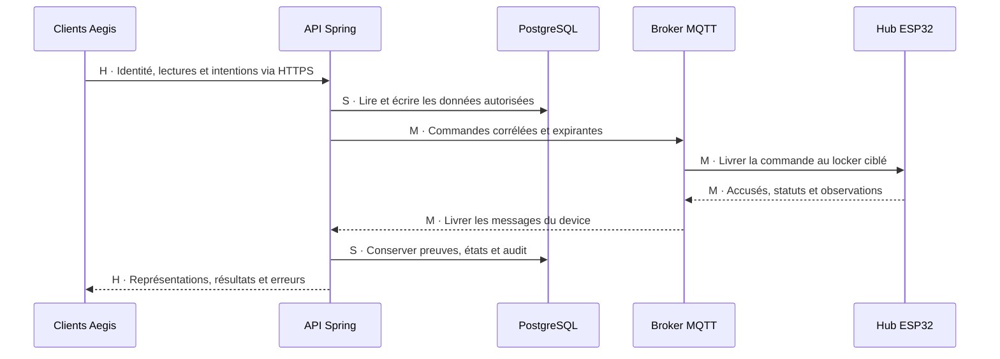

### 4.2 Lecture du DFD-0

| Point | Règle |
|---|---|
| Entrée humaine | Passe toujours par Aegis Mobile ou Aegis Manager puis par l’API |
| Autorité métier | Toutes les décisions finales sont produites dans Spring Boot |
| Persistance | PostgreSQL est accessible uniquement par le backend |
| Commande physique | Une commande autorisée traverse le broker avant d’atteindre le hub |
| Observation physique | Une observation traverse le hub et le broker avant son ingestion |
| Restitution aux clients | Les clients reçoivent une vue backend; jamais un message MQTT brut |

### 4.3 Acteurs et interfaces

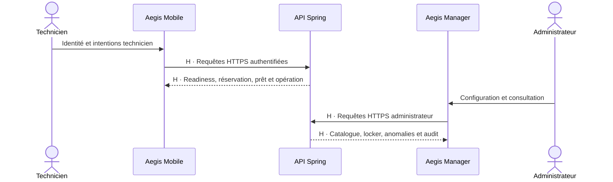

Les applications clientes ne s’échangent aucune donnée directement.

---

## 5. DFD-1 — Identité et accès

### 5.1 Flux

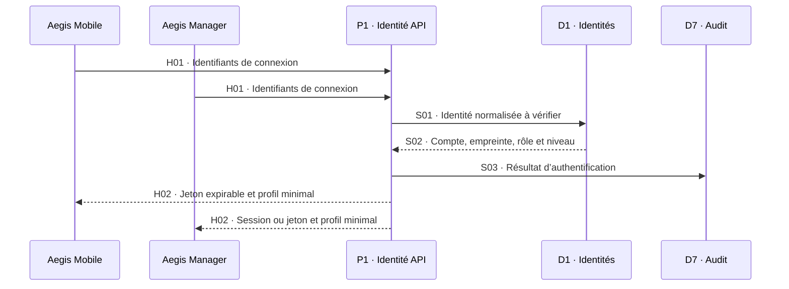

### 5.2 Données transportées

| Flux | Contenu logique | Données exclues |
|---|---|---|
| `H01` | email, mot de passe, métadonnées minimales de requête | Empreinte du mot de passe, secrets serveur |
| `S01` | email normalisé et contexte de vérification | Mot de passe dans les journaux |
| `S02` | User, état du compte, rôle, niveau maximal, empreinte sécurisée | Mot de passe en clair |
| `S03` | succès ou refus, userId si connu, instant et motif non sensible | Mot de passe, jeton complet |
| `H02` | jeton ou session expirable, userId, rôle, maximumAccessLevel | Empreinte du mot de passe, secrets MQTT |

L’application iOS conserve son jeton dans le Keychain. Le mécanisme précis de session Web sera défini dans le contrat REST et l’ADR d’authentification.

---

## 6. DFD-1 — Administration du catalogue et du locker

### 6.1 Flux de configuration

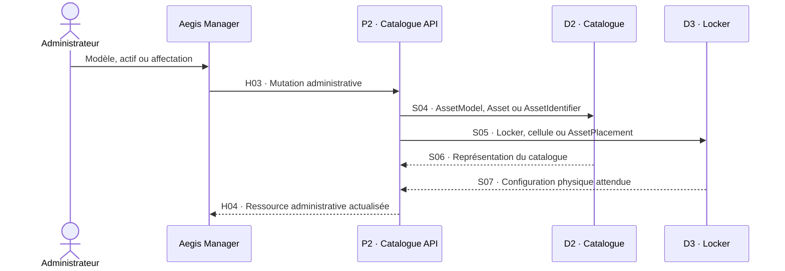

### 6.2 Flux de calibration et d’état opérationnel

| Origine | Destination | Données |
|---|---|---|
| Aegis Manager | `P2` | operationalStatus, calibrationRequired, calibrationDueAt, requiredAccessLevel |
| `P2` | `D2` | Nouvelle configuration valide et auteur de la modification |
| `D2` | `P2` | Actif actualisé, état dérivable et dates d’archivage |
| `P2` | `D7` | AuditEvent du changement déterminant |
| `P2` | Aegis Manager | État enregistré ou erreur de validation |

L’administrateur configure les données source. Il n’envoie jamais une valeur `ready` à l’API.

### 6.3 Flux d’horaire

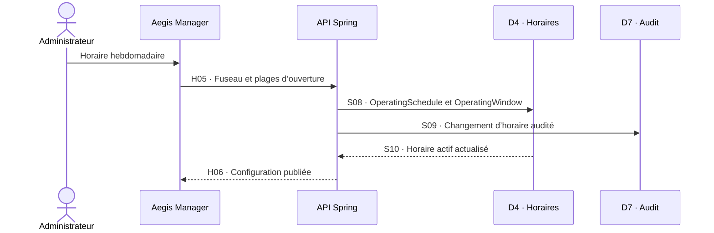

---

## 7. DFD-1 — Consultation des actifs et de la readiness

### 7.1 Flux de lecture

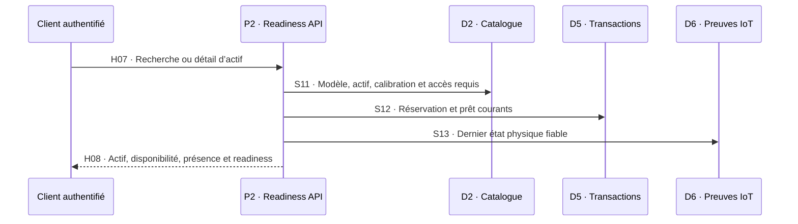

### 7.2 Représentation retournée

| Groupe | Données principales |
|---|---|
| Identité de l’actif | assetId, assetCode, modèle, description utile |
| Disponibilité | AVAILABLE, RESERVED, BORROWED ou UNAVAILABLE |
| Conformité | operationalStatus, calibrationRequired, calibrationDueAt, calibrationStatus |
| Présence | état connu, compartiment attendu, instant de dernière observation |
| Readiness | READY, BLOCKED ou UNKNOWN, raisons et evaluatedAt |
| Accès | Résultat pour l’utilisateur authentifié; aucune règle secrète exposée |

Le client reçoit une représentation calculée par le backend. Il ne reconstitue pas la readiness à partir de champs bruts.

---

## 8. DFD-1 — Réservation

### 8.1 Flux de création

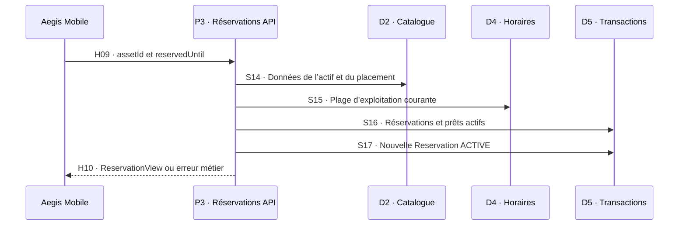

### 8.2 Flux de consultation et d’annulation

| Flux | Source | Destination | Données |
|---|---|---|---|
| `H11` | Aegis Mobile | `P3` | Demande de réservation active du technicien |
| `H12` | `P3` | Aegis Mobile | ReservationView et état courant |
| `H13` | Aegis Mobile | `P3` | reservationId et intention d’annulation |
| `S18` | `P3` | `D5` | Statut CANCELLED et cancelledAt |
| `H14` | `P3` | Aegis Mobile | Résultat d’annulation ou conflit |

Le Web peut consulter les réservations, mais il ne reproduit pas le parcours technicien de création P0.

---

## 9. DFD-1 — Demande d’opération physique

### 9.1 Préparation, affichage et validation

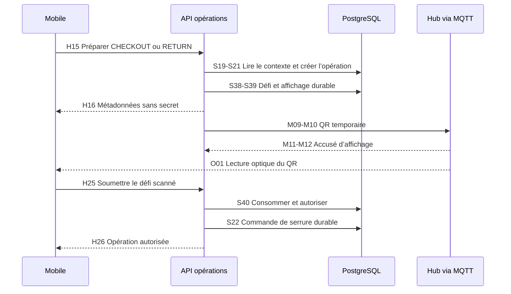

`S40` et `S22`, le passage éventuel du prêt à `RETURN_PENDING`, l’audit et la réponse idempotente appartiennent à une seule transaction. Le flux optique `O01` part de l’écran; le secret n’est jamais fourni au téléphone par une réponse REST.

Le QR ne transmet ni mot de passe ni identité personnelle. Ses identifiants visibles ne sont pas des autorisations. Son token reste secret jusqu’à son scan; sa validité est contrôlée exclusivement par le backend.

### 9.2 Données de corrélation

| Donnée | Origine | Portée |
|---|---|---|
| requestId ou clé d’idempotence | Client | Requête applicative répétable |
| reservationId | `D5` | Retrait demandé |
| loanId | `D5` | Retour demandé |
| operationId | `P4` | Workflow physique complet |
| commandMessageId | `D8` | Publication et déduplication de la commande |
| lockerId | `D3` | Device réseau attendu |
| compartmentId | `D3` | Cellule physique ciblée |
| expectedAssetIdentifier | `D2` | Tag attendu dans les preuves |
| challengeId | `D9` | Défi unique de cette opération |
| displayMessageId | `D10` | Instruction d’écran acquittée par le hub |
| deviceSessionId | Hub enregistré | Démarrage autorisé à afficher le défi |
| displayRevision | Locker | Ordre des instructions d’écran |

---

## 10. DFD-1 — Distribution d’une commande

### 10.1 Du backend à la cellule

Cette distribution commence uniquement après consommation du défi et revalidation des gardes métier. Une simple réservation ou une préparation ne produit pas `S22`.

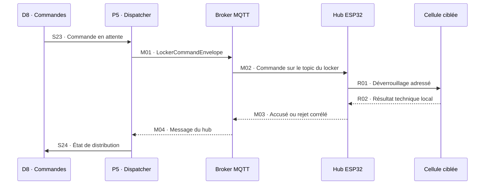

### 10.2 Données de la commande MQTT

| Groupe | Données |
|---|---|
| Identité | messageId, operationId, schemaVersion |
| Cible | lockerId, compartmentId |
| Action | type = UNLOCK_COMPARTMENT |
| Temps | issuedAt, expiresAt |
| Transport | topic `aegis/v1/lockers/{lockerId}/commands` |

La commande ne contient ni mot de passe utilisateur, ni jeton client, ni décision de readiness complète. Elle transporte uniquement l’autorisation technique minimale nécessaire à son exécution.

---

## 11. DFD-1 — Observations locales et messages MQTT

### 11.1 De la cellule au backend

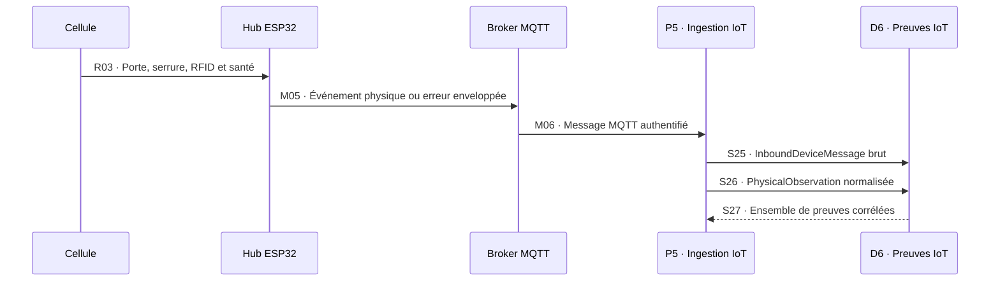

### 11.2 Flux locaux RS-485

| Flux | Direction | Données minimales |
|---|---|---|
| `R01` | Hub → cellule | Adresse de cellule, action de serrure, identifiant local de corrélation |
| `R02` | Cellule → hub | Commande acceptée ou refusée, code technique |
| `R03` | Cellule → hub | doorState, lockState, identifiants RFID détectés, santé du lecteur |
| `R04` | Hub ↔ cellule | Poll de présence, statut de connexion et diagnostic minimal |

Une cellule n’obtient jamais l’identité du technicien, son niveau d’accès, la réservation ou le prêt complet.

### 11.3 Types de messages remontés

| Famille | Topic logique | Contenu |
|---|---|---|
| Accusé de commande | `.../events` | messageId, operationId, type, résultat, cellule, timestamp, schemaVersion |
| Porte et serrure | `.../events` | operationId si pertinent, cellule, état observé et timestamp |
| Observation d’actif | `.../events` | operationId si pertinent, cellule, identifiant détecté ou état normalisé |
| Heartbeat | `.../status` | lockerId, messageId, firmwareVersion, timestamp et santé minimale |
| Erreur device | `.../events` ou `.../status` selon le contrat | Type, code, cellule concernée et contexte technique non secret |

Les noms et payloads exacts seront fixés dans le contrat MQTT détaillé.

---

## 12. DFD-1 — Projection des preuves vers l’état métier

### 12.1 Des messages reçus aux vues clientes

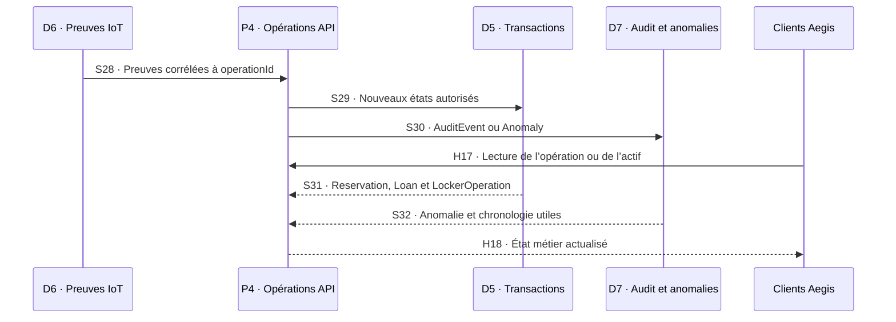

Le flux `H18` reste un flux HTTPS contrôlé par le backend. Le choix entre polling, Server-Sent Events ou WebSocket modifiera le mode de livraison, mais ne permettra jamais au client de consommer directement MQTT.

### 12.2 Séparation obligatoire

| Couche | Donnée | Utilisation |
|---|---|---|
| Technique brute | InboundDeviceMessage.rawPayload | Diagnostic et déduplication |
| Observation normalisée | PhysicalObservation | Preuve physique interprétable |
| État métier | Reservation, Loan, LockerOperation | Vérité transactionnelle |
| Explication métier | AuditEvent | Chronologie compréhensible |
| Écart actif | Anomaly | Intervention et résolution par preuve |

Le passage d’une couche à la suivante est contrôlé par le backend; un payload MQTT brut n’est jamais exposé comme état métier final.

---

## 13. DFD-1 — Heartbeat et état du locker

### 13.1 Flux de santé

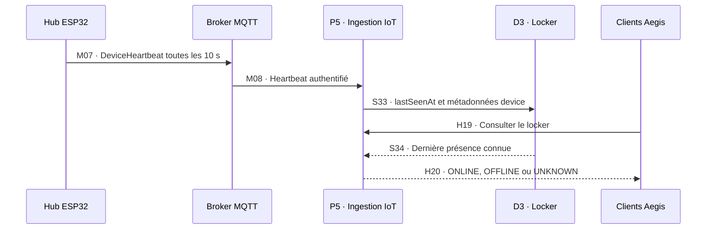

Le statut est dérivé par le backend. Dans le P0, l’absence de heartbeat valide pendant plus de 30 secondes produit `OFFLINE`.

### 13.2 Santé d’une cellule

| Origine | Transit | Destination | Données |
|---|---|---|---|
| Cellule | RS-485 | Hub | Adresse, réponse, lecteur RFID, porte, serrure |
| Hub | MQTT status/events | `P5` | cellAddress, connectionStatus, rfidReaderStatus, timestamp |
| `P5` | Persistance privée | `D3` et `D6` | Dernier état connu et message source |
| API | HTTPS | Aegis Manager | État interprété du compartiment sans payload brut inutile |

---

## 14. DFD-1 — Audit et anomalies

### 14.1 Consultation et reconnaissance

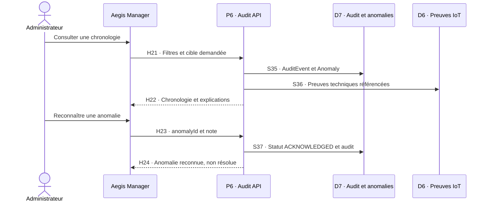

### 14.2 Résolution

La résolution ne provient pas d’un flux administratif. Elle provient d’une nouvelle preuve physique cohérente reçue par `M05`, conservée par `S25` et `S26`, puis référencée par l’anomalie.

| Flux interdit | Motif |
|---|---|
| Aegis Manager → `Anomaly.status = RESOLVED` | Une intervention humaine n’est pas une preuve physique |
| Aegis Manager → `Loan.status = COMPLETED` | Le retour doit être physiquement confirmé |
| Aegis Manager → `Asset.ready = true` | La readiness est dérivée |

---

## 15. Catalogue des flux HTTPS

| ID | Source → destination | Données | Sensibilité |
|---|---|---|---|
| `H01` | Mobile/Manager → `P1` | Identifiants de connexion | Critique, transitoire |
| `H02` | `P1` → Mobile/Manager | Session ou jeton expirable, profil minimal | Critique |
| `H03` | Manager → `P2` | Mutation de modèle, actif, identifiant ou affectation | Interne |
| `H04` | `P2` → Manager | Ressource administrative actualisée | Interne |
| `H05` | Manager → API | Fuseau et plages d’exploitation | Interne |
| `H06` | API → Manager | Horaire actif actualisé | Interne |
| `H07` | Client → `P2` | Recherche, filtre ou assetId | Interne |
| `H08` | `P2` → Client | AssetView et ReadinessAssessment | Interne |
| `H09` | Mobile → `P3` | assetId, reservedUntil, clé d’idempotence | Sensible métier |
| `H10` | `P3` → Mobile | ReservationView ou refus | Sensible métier |
| `H11` | Mobile → `P3` | Lecture de la réservation active | Sensible métier |
| `H12` | `P3` → Mobile | ReservationView | Sensible métier |
| `H13` | Mobile → `P3` | Intention d’annulation | Sensible métier |
| `H14` | `P3` → Mobile | Résultat de l’annulation | Sensible métier |
| `H15` | Mobile → `P4` | Demande CHECKOUT ou RETURN | Critique opérationnel |
| `H16` | `P4` → Mobile | operationId, statut, challengeId et localProofExpiresAt; expiresAt nul avant autorisation | Critique opérationnel |
| `H17` | Client → `P4` | Lecture d’une opération, réservation, prêt ou actif | Sensible métier |
| `H18` | `P4` → Client | État métier actualisé | Sensible métier |
| `H19` | Client → `P5` | Lecture du statut du locker | Interne |
| `H20` | `P5` → Client | ONLINE, OFFLINE ou UNKNOWN et états utiles | Interne |
| `H21` | Manager → `P6` | Cible, période et filtres d’audit | Sensible |
| `H22` | `P6` → Manager | AuditEvent, Anomaly et références utiles | Sensible |
| `H23` | Manager → `P6` | anomalyId et note d’accusé | Sensible |
| `H24` | `P6` → Manager | AnomalyView actualisée | Sensible |
| `H25` | Mobile → `P4` | operationId, challengeId, token scanné, clé d’idempotence | Secret transitoire, jamais journalisé |
| `H26` | `P4` → Mobile | LockerOperationView autorisée ou refus, sans token | Sensible |

Toutes les requêtes applicatives distantes utilisent HTTPS. Les entrées sont validées et les réponses sont filtrées selon le rôle et la propriété des ressources.

---

## 16. Catalogue des flux PostgreSQL

| ID | Processus ↔ magasin | Données principales | Mode |
|---|---|---|---|
| `S01`–`S02` | `P1` ↔ `D1` | User, rôle, niveau, statut et empreinte | Lecture contrôlée |
| `S03` | `P1` → `D7` | Résultat d’authentification | Ajout |
| `S04` | `P2` → `D2` | AssetModel, Asset, AssetIdentifier | Écriture transactionnelle |
| `S05` | `P2` → `D3` | Locker, Compartment, AssetPlacement | Écriture transactionnelle |
| `S06`–`S07` | `D2`/`D3` → `P2` | Catalogue et configuration physique | Lecture |
| `S08`–`S10` | API ↔ `D4`, API → `D7` | OperatingSchedule, OperatingWindow et audit | Lecture/écriture |
| `S11` | `D2` → `P2` | État, calibration et niveau d’accès requis | Lecture |
| `S12` | `D5` → `P2` | Réservation et prêt courants | Lecture |
| `S13` | `D6` → `P2` | Présence et santé physique fiables | Lecture |
| `S14`–`S17` | `P3` ↔ `D2`/`D4`/`D5` | Contexte et Reservation | Transaction |
| `S18` | `P3` → `D5` | Annulation d’une Reservation | Transaction |
| `S19`–`S22` | `P4` ↔ `D3`/`D5`/`D8` | LockerOperation et commande durable | Transaction |
| `S23`–`S24` | `D8` ↔ `P5` | Commande à distribuer et statut | Lecture/écriture technique |
| `S25` | `P5` → `D6` | InboundDeviceMessage | Ajout idempotent |
| `S26` | `P5` → `D6` | PhysicalObservation | Ajout |
| `S27`–`S32` | `D5`/`D6`/`D7` ↔ `P4` | Preuves, états, anomalies et audit | Transaction/lecture |
| `S33`–`S34` | `P5` ↔ `D3` | lastSeenAt et état de device | Écriture/lecture |
| `S35`–`S37` | `P6` ↔ `D6`/`D7` | Chronologie, preuve et reconnaissance | Lecture/transaction |
| `S38` | `P4` ↔ `D9` | Défi, empreinte, cible, dates et essais | Transaction |
| `S39` | `P4`/`P5` ↔ `D10` | Message d’écran chiffré, envoi, accusé et purge | Transaction/traitement |
| `S40` | `P4` ↔ `D5`/`D9` | Consommation et autorisation | Même transaction que S22 |

PostgreSQL ne reçoit aucune connexion directe d’iOS, de React, du broker, du hub ou d’une cellule.

---

## 17. Catalogue des flux MQTT

| ID | Direction | Topic logique | Données |
|---|---|---|---|
| `M01` | `P5` → broker | `aegis/v1/lockers/{lockerId}/commands` | LockerCommandEnvelope |
| `M02` | Broker → hub | `.../commands` | Même commande autorisée |
| `M03` | Hub → broker | `.../events` | CommandAcknowledgement ou CommandRejected |
| `M04` | Broker → `P5` | `.../events` | Accusé ou rejet à ingérer |
| `M05` | Hub → broker | `.../events` ou `.../status` | Porte, serrure, RFID ou erreur device |
| `M06` | Broker → `P5` | `.../events` ou `.../status` | Événement ou erreur authentifié |
| `M07` | Hub → broker | `aegis/v1/lockers/{lockerId}/status` | DeviceHeartbeat |
| `M08` | Broker → `P5` | `.../status` | Heartbeat à ingérer |
| `M09`–`M10` | `P5` → broker → hub ciblé | `.../display` | DISPLAY_ACCESS_CHALLENGE ou DISPLAY_OPERATION_STATUS |
| `M11`–`M12` | Hub → broker → `P5` | `.../events` | ACCESS_CHALLENGE_DISPLAYED ou DISPLAY_REJECTED; sans token |

Chaque enveloppe pertinente contient `messageId`, `lockerId`, `timestamp` et `schemaVersion`. `operationId` et `compartmentId` sont obligatoires lorsque le message concerne une opération ou une cellule précise.

Les commandes utilisent `retain = false`. Les choix définitifs de QoS, session, Last Will, certificats et politique de reconnexion appartiennent au contrat MQTT.

---

## 18. Autorité de production et de lecture

| Donnée | Producteur autorisé | Lecteurs principaux | Autorité finale |
|---|---|---|---|
| Identifiants de connexion | Utilisateur | `P1` uniquement | `P1` et `D1` pour le compte |
| Rôle et niveau d’accès | Administration autorisée ou données de démo | `P1`, `P2`, `P4` | Backend |
| AssetModel et Asset | Administrateur via `P2` | Web, Mobile, readiness | Backend/PostgreSQL |
| AssetIdentifier et AssetPlacement | Administrateur via `P2` | `P2`, `P4`, `P5` | Backend/PostgreSQL |
| État de porte, serrure et tag | Cellule via hub | `P5`, `P2`, `P4`, Web filtré | Observation conservée par le backend |
| ReadinessAssessment | `P2` | Mobile, Web, `P3`, `P4` | Backend dérivé |
| Reservation | `P3` | Mobile, Web, `P4` | Backend/PostgreSQL |
| Loan | `P4` | Mobile, Web, `P2` | Backend/PostgreSQL |
| LockerOperation | `P4` | Mobile, Web, `P5`, `P6` | Backend/PostgreSQL |
| LockerCommandEnvelope | `P5` depuis une opération autorisée | Broker et hub ciblé | Backend pour l’autorisation |
| InboundDeviceMessage | Hub via broker | `P5`, diagnostic autorisé | Backend pour l’ingestion |
| PhysicalObservation | `P5` depuis un message valide | `P2`, `P4`, `P6` | Backend pour la normalisation |
| Anomaly | `P6` ou `P4` | Web et processus concernés | Backend; résolution par preuve uniquement |
| AuditEvent | Processus backend | Administrateur autorisé | Backend/PostgreSQL |

Le mot « producteur » indique l’origine de la donnée. Il ne donne pas automatiquement le droit d’imposer son interprétation métier.

---

## 19. Frontières de confiance

### 19.1 Frontières traversées

| ID | Frontière | Flux | Protection minimale |
|---|---|---|---|
| `TB1` | Mobile/Manager ↔ API publique | `H01` à `H26` | HTTPS, authentification, autorisation serveur, validation et limitation des abus |
| `TB2` | API ↔ PostgreSQL privé | `S01` à `S40` | Réseau privé, compte applicatif limité, requêtes paramétrées, transactions |
| `TB3` | API/dispatcher ↔ broker | `M01`, `M04`, `M06`, `M08`, `M09`, `M12` | MQTT authentifié et chiffré, permissions minimales de topics |
| `TB4` | Broker ↔ hub | `M02`, `M03`, `M05`, `M07`, `M10`, `M11` | Identité propre au device, TLS, ACL par locker, expiration et déduplication |
| `TB5` | Hub ↔ cellules locales | `R01` à `R04` | Adressage unique, contrôle d’intégrité, timeouts et détection de déconnexion |
| `TB6` | Écran du hub → caméra mobile | `O01` | Format strict, validation backend, courte durée et usage unique; relais possible |

### 19.2 Changement de niveau de confiance

| Donnée reçue | Niveau initial | Après validation backend |
|---|---|---|
| Champ d’un formulaire | Non fiable | Commande applicative validée |
| Jeton client | Non fiable avant vérification | Contexte utilisateur authentifié |
| Message MQTT | Fait technique non validé | InboundDeviceMessage accepté ou rejeté |
| Lecture RFID | Observation isolée | PhysicalObservation normalisée |
| Ensemble d’observations | Preuve candidate | Preuve cohérente ou anomalie |
| Note d’administrateur | Information humaine | Audit; jamais preuve de résolution à elle seule |

---

### 19.3 Frontière optique et câble de cellule

`O01` (écran du hub → caméra iOS) est une entrée non fiable à valider, pas une connexion réseau. Le mobile parse le format Aegis attendu; il n’ouvre aucune URL arbitraire. Une photo relayée reste possible.

Les liaisons `R01/R02` empruntent chacune le port dédié d’une cellule dans l’étoile. Le connecteur RJ45 transporte un câblage Aegis propriétaire; il ne fournit ni IP, ni Ethernet, ni PoE standard. Les trames d’une cellule ne doivent jamais être attribuées à l’autre port.

## 20. Classification des données

| Classe | Exemples | Règle de circulation |
|---|---|---|
| Critique d’authentification | Mots de passe, empreintes, jetons, secrets device | Jamais dans MQTT, l’audit, les URLs ou les payloads de diagnostic |
| Personnelle | Nom, email, userId, historique de possession | HTTPS authentifié; accès selon le rôle et la propriété |
| Métier sensible | Réservation, prêt, opération, refus, anomalie | API et stockage privés; exposition minimale aux clients |
| Physique sensible | Identifiant RFID, compartiment, porte, serrure | MQTT/RS-485 limités et vues Web filtrées |
| Technique | Version firmware, schéma, codes d’erreur, heartbeat | Visible uniquement aux composants et administrateurs concernés |
| Audit | Acteur, cible, décision, preuves référencées | Ajout contrôlé; aucune réécriture silencieuse |

Le payload brut peut contenir des identifiants physiques. Son exposition est plus restrictive que celle d’une vue opérationnelle normalisée.

---

## 21. Flux explicitement interdits

- Renvoyer le token ou l’image QR dans une réponse REST, un audit, une route de diagnostic ou des logs.
- Transformer un accusé d’affichage en accusé de commande de serrure.
- Envoyer une commande de serrure depuis une opération `AWAITING_LOCAL_PROOF`.

| Source | Destination interdite | Pourquoi |
|---|---|---|
| Aegis Mobile | PostgreSQL | Contournerait l’API, les règles métier et l’audit |
| Aegis Manager | PostgreSQL | Permettrait des mutations non autorisées |
| Aegis Mobile ou Manager | Broker MQTT | Exposerait les topics et permettrait de contourner le backend |
| Aegis Mobile ou Manager | Hub ou cellule | Permettrait une commande physique directe |
| Broker MQTT | Reservation, Loan ou readiness | Le broker transporte; il ne décide pas |
| Hub ESP32 | PostgreSQL | Le device ne possède pas d’accès aux données métier |
| Hub ESP32 | Statut final d’un prêt | Le hub rapporte des faits; le backend conclut |
| Cellule | Broker MQTT | Toutes les communications réseau passent par le hub |
| Cellule | Identité ou droits de l’utilisateur | La cellule ne reçoit que le minimum technique |
| Administrateur | Anomaly `RESOLVED` | La résolution exige une preuve physique cohérente |
| Scheduler | Loan `COMPLETED` | Une échéance n’est pas un retour physique |
| Observation RFID isolée | Loan ou Reservation | Une lecture unique ne suffit pas à conclure |

---

## 22. Corrélation et traçabilité de bout en bout

### 22.1 Chaîne de corrélation

| Étape | Identifiant conservé | Lien suivant |
|---|---|---|
| Requête cliente | requestId ou clé d’idempotence | reservationId ou operationId |
| Réservation | reservationId | LockerOperation CHECKOUT |
| Prêt | loanId | LockerOperation RETURN |
| Opération physique | operationId | commandMessageId et observations |
| Commande | commandMessageId | Accusé du hub |
| Message entrant | messageId + lockerDeviceId | inboundMessageId |
| Observation normalisée | observationId | operationId et éventuelle anomalyId |
| Anomalie | anomalyId | resolutionEvidenceObservationId |
| Audit | auditEventId | subjectId et operationId |

### 22.2 Flux corrélé d’un retrait

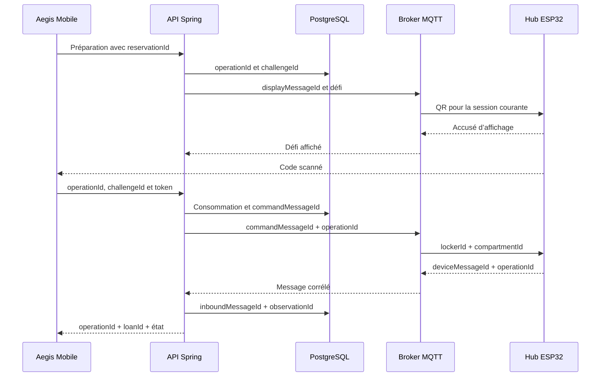

Un identifiant de corrélation facilite le suivi, mais ne remplace jamais l’autorisation, la validation du contenu ou la preuve physique.

---

## 23. Couverture du dictionnaire de données

`LocalAccessChallenge` est porté par D9 et H25/S38/S40. `HubDisplayMessage` est porté par D10 et M09–M12. Le retour visuel iOS utilise H17/H18; le résultat sur écran utilise DISPLAY_OPERATION_STATUS. Aucun transport de notification push n’est ajouté.

| Concept du dictionnaire | Magasin | Flux entrants principaux | Flux sortants principaux |
|---|---|---|---|
| User | `D1` | `H01`, administration préparée | `H02`, `S02` |
| AccessLevel | `D1`, `D2` | Configuration utilisateur/actif | `H08`, décisions internes |
| AssetModel | `D2` | `H03`, `S04` | `H04`, `H08` |
| Asset | `D2` | `H03`, `S04` | `H04`, `H08`, `S11` |
| AssetIdentifier | `D2` | `H03`, `S04` | `S14`, `S19`, commandes corrélées |
| Locker | `D3` | Configuration et `S33` | `H20`, `S19`, topics MQTT |
| Compartment | `D3` | `H03`, `R03`, `S33` | `H04`, `H20`, `R01` |
| AssetPlacement | `D3` | `H03`, `S05` | `S14`, `S19` |
| LockerDevice | `D3` | Enregistrement et `M07` | Validation de `M03` à `M08` |
| OperatingSchedule | `D4` | `H05`, `S08` | `H06`, `S15` |
| OperatingWindow | `D4` | `H05`, `S08` | `H06`, `S15` |
| ReadinessAssessment | Dérivé | `S11`, `S12`, `S13` | `H08`, audit de décision |
| Reservation | `D5` | `H09`, `S17`, `S18` | `H10`, `H12`, `S20` |
| Loan | `D5` | Preuve de retrait via `S28`–`S30` | `H18`, `S20`, audit |
| LockerOperation | `D5` | `H15`, `S21`, événements corrélés | `H16`, `H18`, `M01` |
| LockerCommandEnvelope | `D8` puis MQTT | `S22`, `S23` | `M01`, `M02` |
| InboundDeviceMessage | `D6` | `M04`, `M06`, `M08`, `S25` | Diagnostic et normalisation |
| PhysicalObservation | `D6` | `S26` depuis les messages valides | `S27`, `S28`, `S36` |
| DeviceHeartbeat | `D6` et projection `D3` | `M07`, `M08` | `S33`, `H20` |
| Anomaly | `D7` | `S30`, `H23`, preuve de résolution | `H22`, `H24`, `S32` |
| AuditEvent | `D7` | Tous les processus autorisés | `H22`, chronologie interne |

---

## 24. Propriétés de conformité du DFD

Le système respecte ce document lorsque :

1. tous les clients distants passent par l’API HTTPS;
2. PostgreSQL n’est accessible que par le backend;
3. seul le backend produit une commande MQTT d’ouverture;
4. le hub est le seul device MQTT du locker;
5. chaque cellule communique uniquement avec le hub;
6. les données métier complètes ne sont jamais envoyées à une cellule;
7. les messages entrants sont conservés avant ou avec leurs effets métier;
8. les observations normalisées restent distinctes des payloads bruts;
9. les clients reçoivent des vues métier et non des messages MQTT bruts;
10. les données sensibles sont filtrées à chaque frontière;
11. requestId, operationId et messageId permettent une corrélation de bout en bout;
12. aucune donnée externe ne devient une vérité métier sans validation backend;
13. toute résolution d’anomalie conserve une référence vers sa preuve;
14. les flux réels peuvent être rattachés à un concept du dictionnaire.

---

## 25. Limites du document

Ce document ne fixe pas :

- les routes, méthodes et codes HTTP;
- la structure exacte des DTO REST;
- les schémas JSON MQTT;
- les noms de tables et colonnes PostgreSQL;
- les politiques de rétention;
- les choix définitifs de QoS, session et Last Will MQTT;
- la stratégie finale de rafraîchissement des clients;
- les registres et trames Modbus RTU;
- les seuils RFID finaux après le POC;
- le détail électrique ou mécanique du locker.

Ces éléments peuvent être précisés dans leurs contrats et modèles physiques sans créer de nouveaux flux interdits ni déplacer l’autorité métier hors du backend.
