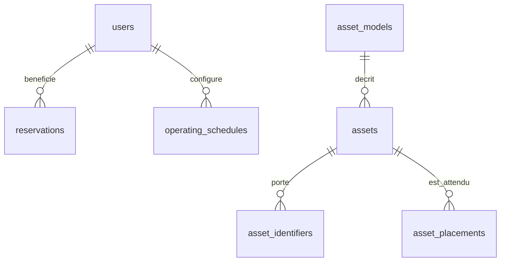
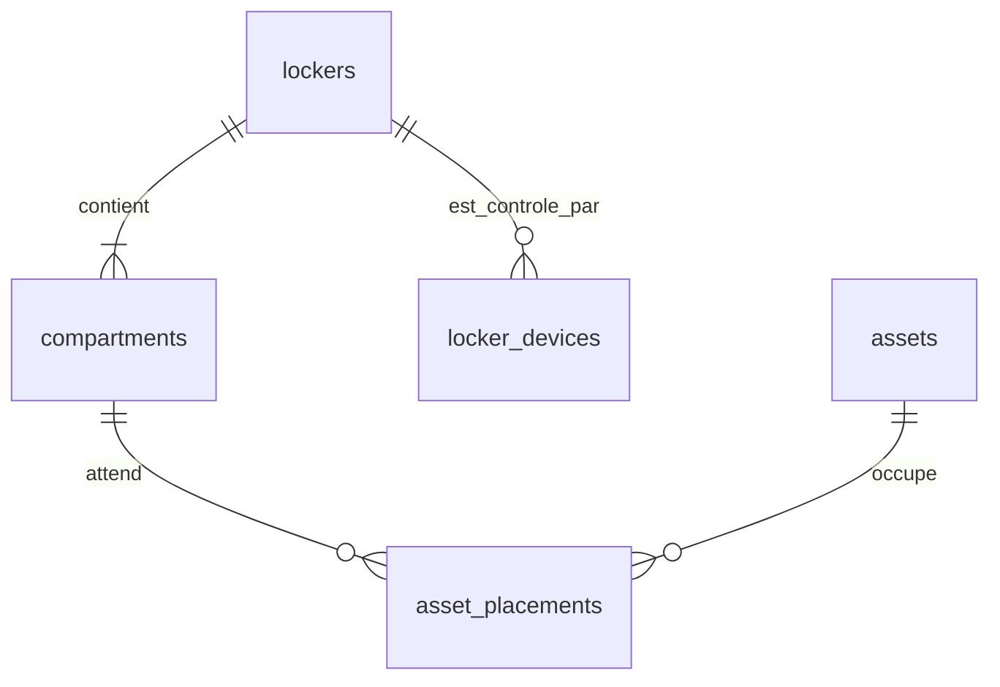
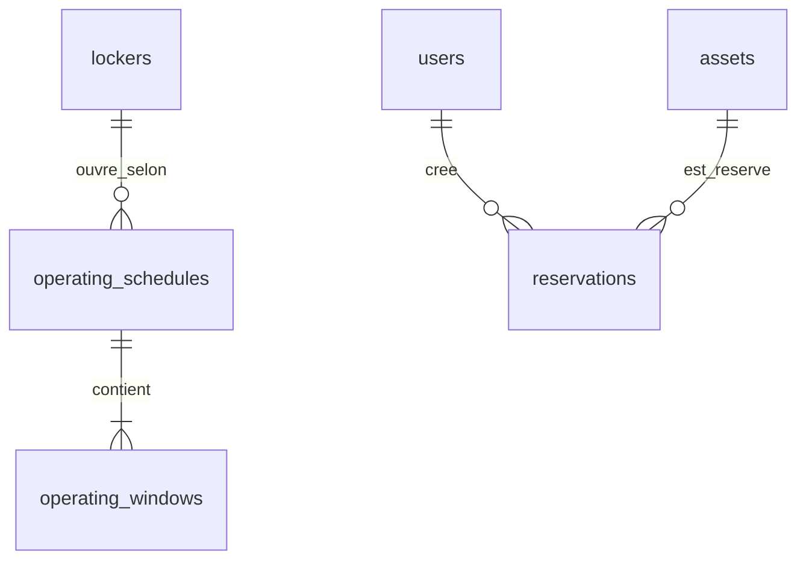
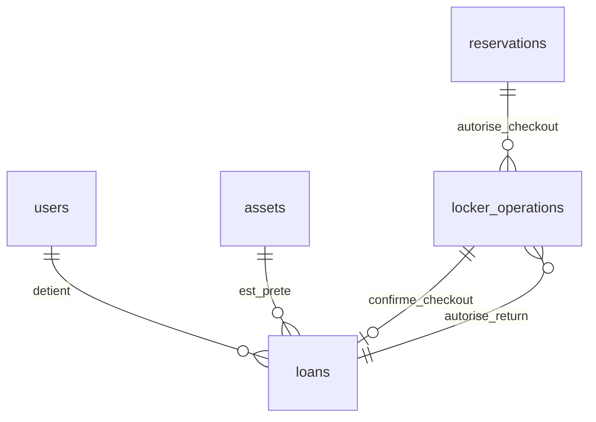
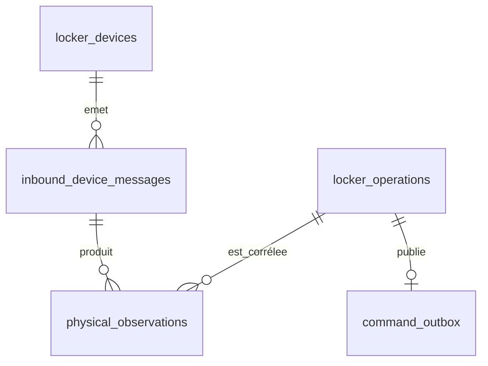
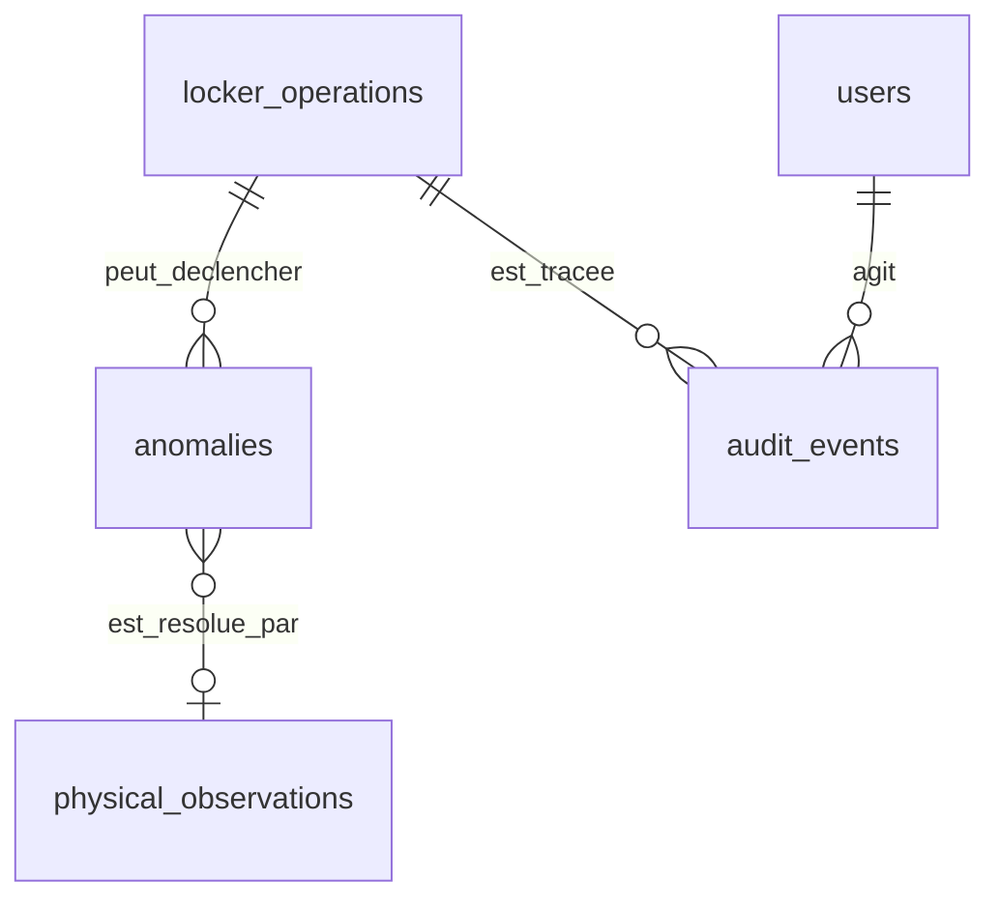

# Aegis — Modèle physique PostgreSQL

**Cours :** 420-5X7-SO — Écosystème connecté  
**Équipe :** Philippe Jordan Monfouayi Mba et Yoël Jimmy Razafindretsa  
**Date de révision :** 16 septembre 2026
**Mise à jour ciblée :** 23 septembre 2026 — statut des paramètres QR et de RS-485; SQL inchangé.
**Version :** 1.2 — contrôle local QR et étoile

---

## 1. Rôle et décisions de traduction

Ce document transforme les documents 03 à 07 en un modèle relationnel PostgreSQL exécutable. Il fixe les noms de tables, les colonnes, les types, les clés, les contraintes, les index et les règles d’accès nécessaires au P0.

Les règles métier restent portées par le backend Spring Boot. PostgreSQL constitue la dernière barrière contre les doublons, les relations invalides et les courses concurrentes; il ne devient pas une autorité de décision physique.

### 1.1 Décisions physiques

| Décision | Choix P0 | Justification |
|---|---|---|
| Schéma | `aegis` | Isoler les données du produit et qualifier les objets dans les migrations. |
| Identifiants | `uuid` | Identifiants stables, non séquentiels et partageables dans REST/MQTT. |
| Instants | `timestamptz` | Stocker des instants UTC; l’affichage applique le fuseau du locker. |
| Plages horaires | `time without time zone` + `smallint` | Une plage est locale au fuseau de son `operating_schedule`; le jour suit ISO-8601, de 1 lundi à 7 dimanche. |
| États contrôlés | `text` + `CHECK` | Éviter les migrations d’énumération PostgreSQL pour chaque ajout d’état, tout en conservant un vocabulaire SQL strict. |
| Payload MQTT | `bytea` brut + `jsonb` décodé | Préserver les octets utiles au diagnostic et le JSON valide; expurger tout secret reçu illégitimement avant conservation et signaler cette expurgation. |
| Readiness et disponibilité | Non persistées comme vérité courante | Elles sont dérivées des données de référence, des transactions et des observations. |
| Historique des transitions | `audit_events` | Chaque transition déterminante est auditée; une seconde table d’historique ne duplique pas l’audit métier. |
| Suppression | Archivage ou désactivation | Les FK restent protégées par défaut; le passé d’une chaîne de possession n’est pas supprimé. |

### 1.2 Portée du schéma

Le modèle est multi-locker par construction, même si le P0 utilise un locker et deux compartiments. Il ne contient pas de table `readiness`, `availability` ou `overdue` : ces valeurs sont calculées au moment de la lecture ou de la décision. Le mécanisme exact de jeton doit être fixé par le contrat REST et un ADR de sécurité. Le présent schéma ne persiste aucune session; si un refresh token révocable est retenu, une migration dédiée devra ajouter son stockage sous forme hachée.

---

## 2. ERD par domaine

La révision conserve les vues relationnelles existantes; le contrôle local ajoute les relations suivantes, présentées séparément pour éviter un diagramme surchargé :

| Parent | Relation ajoutée | Cardinalité |
|---|---|---|
| locker_operations | local_access_challenges | 1 vers 0..1 |
| locker_devices | local_access_challenges | 1 vers 0..N historiques |
| locker_operations | hub_display_outbox | 1 vers 0..N |
| local_access_challenges | hub_display_outbox de type défi | 1 vers 1 pour une préparation acceptée |
| hub_display_outbox | inbound_device_messages corrélés | 1 vers 0..N |


Les ERD sont volontairement courts. Les attributs détaillés et les types exacts se trouvent au chapitre 4.

### 2.1 Identité et catalogue



### 2.2 Locker et affectation physique



### 2.3 Horaires et réservations



### 2.4 Chaîne de possession et opérations



### 2.5 Commandes et preuves IoT



### 2.6 Anomalies et traçabilité



---

## 3. Règles de nommage et conventions SQL

- Les tables et colonnes sont en `snake_case`; les noms métier REST/MQTT restent en `camelCase` dans leurs contrats.
- Tous les identifiants sont des UUID générés par PostgreSQL avec `gen_random_uuid()` ou fournis par le backend lorsqu’une corrélation doit être connue avant l’insertion.
- Tous les instants sont des `timestamptz`. L’application ouvre ses connexions avec le fuseau UTC et ne compare jamais un timestamp device comme s’il était l’horloge d’autorité.
- Les états et types contrôlés sont en majuscules avec `_`.
- Les FK utilisent `ON DELETE RESTRICT` par défaut. Le produit désactive ou archive les objets; une suppression physique doit d’abord respecter les dépendances historiques.
- Les colonnes `status`, `last_seen_at`, `door_state`, `lock_state` et `connection_status` qui reflètent le matériel sont des projections mises à jour par l’ingestion backend. Les messages et observations restent la preuve historique.

---

## 4. Schéma relationnel normatif

Le bloc suivant est la référence de nommage et de typage. Les migrations Flyway peuvent le découper en fichiers, mais elles doivent produire le même schéma logique.

### 4.1 Initialisation

```sql
CREATE EXTENSION IF NOT EXISTS pgcrypto;

CREATE SCHEMA IF NOT EXISTS aegis;

SET search_path TO aegis, public;
```

### 4.2 Identité

#### `users`

Compte humain authentifiable. `archived_at` ne remplace pas `status` : un compte peut être désactivé sans être archivé.

```sql
CREATE TABLE users (
    id                    uuid PRIMARY KEY DEFAULT public.gen_random_uuid(),
    display_name          text NOT NULL,
    email                 text NOT NULL,
    password_hash         text NOT NULL,
    role                  text NOT NULL,
    maximum_access_level  text NOT NULL,
    status                text NOT NULL DEFAULT 'ACTIVE',
    created_at            timestamptz NOT NULL DEFAULT now(),
    archived_at           timestamptz NULL,

    CONSTRAINT ck_users_display_name_non_blank
        CHECK (btrim(display_name) <> ''),
    CONSTRAINT ck_users_email_non_blank
        CHECK (btrim(email) <> '' AND email = btrim(email)),
    CONSTRAINT ck_users_password_hash_non_blank
        CHECK (btrim(password_hash) <> ''),
    CONSTRAINT ck_users_role
        CHECK (role IN ('ADMIN', 'TECHNICIAN')),
    CONSTRAINT ck_users_access_level
        CHECK (maximum_access_level IN ('STANDARD', 'RESTRICTED')),
    CONSTRAINT ck_users_status
        CHECK (status IN ('ACTIVE', 'DISABLED')),
    CONSTRAINT ck_users_archived_disabled
        CHECK (archived_at IS NULL OR status = 'DISABLED')
);
```

### 4.3 Catalogue

#### `asset_models`

```sql
CREATE TABLE asset_models (
    id                          uuid PRIMARY KEY DEFAULT public.gen_random_uuid(),
    name                        text NOT NULL,
    manufacturer                text NULL,
    model_number                text NULL,
    description                 text NULL,
    default_calibration_required boolean NOT NULL DEFAULT false,
    created_at                  timestamptz NOT NULL DEFAULT now(),
    updated_at                  timestamptz NOT NULL DEFAULT now(),
    archived_at                 timestamptz NULL,

    CONSTRAINT ck_asset_models_name_non_blank
        CHECK (btrim(name) <> '')
);
```

#### `assets`

La readiness, la présence et la disponibilité ne sont pas des colonnes de cette table.

```sql
CREATE TABLE assets (
    id                    uuid PRIMARY KEY DEFAULT public.gen_random_uuid(),
    asset_model_id        uuid NOT NULL,
    asset_code            text NOT NULL,
    serial_number         text NULL,
    required_access_level text NOT NULL,
    operational_status    text NOT NULL DEFAULT 'SERVICEABLE',
    calibration_required  boolean NOT NULL,
    calibration_due_at    timestamptz NULL,
    created_at            timestamptz NOT NULL DEFAULT now(),
    updated_at            timestamptz NOT NULL DEFAULT now(),
    archived_at           timestamptz NULL,

    CONSTRAINT fk_assets_asset_model
        FOREIGN KEY (asset_model_id) REFERENCES asset_models (id),
    CONSTRAINT ck_assets_code_non_blank
        CHECK (btrim(asset_code) <> ''),
    CONSTRAINT ck_assets_access_level
        CHECK (required_access_level IN ('STANDARD', 'RESTRICTED')),
    CONSTRAINT ck_assets_operational_status
        CHECK (operational_status IN ('SERVICEABLE', 'MAINTENANCE', 'DAMAGED')),
    CONSTRAINT ck_assets_calibration_pair
        CHECK (
            (calibration_required = false AND calibration_due_at IS NULL)
            OR
            (calibration_required = true AND calibration_due_at IS NOT NULL)
        )
);
```

#### `asset_identifiers`

La paire `(identifier_type, identifier_value)` est unique seulement parmi les identifiants actifs. Les anciennes associations restent consultables.

```sql
CREATE TABLE asset_identifiers (
    id               uuid PRIMARY KEY DEFAULT public.gen_random_uuid(),
    asset_id         uuid NOT NULL,
    identifier_type  text NOT NULL,
    identifier_value text NOT NULL,
    active           boolean NOT NULL DEFAULT true,
    assigned_at      timestamptz NOT NULL DEFAULT now(),
    revoked_at       timestamptz NULL,

    CONSTRAINT fk_asset_identifiers_asset
        FOREIGN KEY (asset_id) REFERENCES assets (id),
    CONSTRAINT ck_asset_identifiers_type
        CHECK (identifier_type IN ('RFID_UHF', 'NFC', 'QR')),
    CONSTRAINT ck_asset_identifiers_value_non_blank
        CHECK (btrim(identifier_value) <> ''),
    CONSTRAINT ck_asset_identifiers_lifecycle
        CHECK (
            (active = true AND revoked_at IS NULL)
            OR
            (active = false AND revoked_at IS NOT NULL)
        ),
    CONSTRAINT ck_asset_identifiers_dates
        CHECK (revoked_at IS NULL OR revoked_at >= assigned_at),
    CONSTRAINT uq_asset_identifiers_id_asset
        UNIQUE (id, asset_id)
);
```

### 4.4 Locker et matériel

#### `lockers`

`status` et `last_seen_at` sont une projection rapide de la santé du device actif. La source historique demeure `inbound_device_messages`.

```sql
CREATE TABLE lockers (
    id            uuid PRIMARY KEY DEFAULT public.gen_random_uuid(),
    code          text NOT NULL,
    name          text NOT NULL,
    topology      text NOT NULL,
    display_revision bigint NOT NULL DEFAULT 0 CHECK (display_revision >= 0),
    status        text NOT NULL DEFAULT 'UNKNOWN',
    last_seen_at  timestamptz NULL,
    created_at    timestamptz NOT NULL DEFAULT now(),
    updated_at    timestamptz NOT NULL DEFAULT now(),

    CONSTRAINT ck_lockers_code_non_blank
        CHECK (btrim(code) <> ''),
    CONSTRAINT ck_lockers_name_non_blank
        CHECK (btrim(name) <> ''),
    CONSTRAINT ck_lockers_topology
        CHECK (topology IN ('MONOLITHIC', 'HUB_CELL')),
    CONSTRAINT ck_lockers_status
        CHECK (status IN ('ONLINE', 'OFFLINE', 'UNKNOWN'))
);
```

#### `compartments`

`local_address` est l’adresse logique de cellule. `hub_port` identifie sa liaison point à point dans l’étoile RS-485 retenue par l’ADR-002; les deux cellules ont des ports distincts. Une cellule physique correspond à un compartiment métier.

```sql
CREATE TABLE compartments (
    id                   uuid PRIMARY KEY DEFAULT public.gen_random_uuid(),
    locker_id            uuid NOT NULL,
    code                 text NOT NULL,
    local_address        smallint NOT NULL,
    hub_port             smallint NOT NULL CHECK (hub_port > 0),
    enabled              boolean NOT NULL DEFAULT true,
    connection_status    text NOT NULL DEFAULT 'UNKNOWN',
    rfid_reader_status   text NOT NULL DEFAULT 'UNKNOWN',
    door_state           text NOT NULL DEFAULT 'UNKNOWN',
    lock_state           text NOT NULL DEFAULT 'UNKNOWN',
    last_observed_at     timestamptz NULL,
    created_at           timestamptz NOT NULL DEFAULT now(),
    updated_at           timestamptz NOT NULL DEFAULT now(),

    CONSTRAINT fk_compartments_locker
        FOREIGN KEY (locker_id) REFERENCES lockers (id),
    CONSTRAINT ck_compartments_code_non_blank
        CHECK (btrim(code) <> ''),
    CONSTRAINT ck_compartments_local_address
        CHECK (local_address BETWEEN 1 AND 247),
    CONSTRAINT ck_compartments_connection_status
        CHECK (connection_status IN ('CONNECTED', 'DISCONNECTED', 'UNKNOWN')),
    CONSTRAINT ck_compartments_reader_status
        CHECK (rfid_reader_status IN ('HEALTHY', 'FAULTED', 'UNKNOWN')),
    CONSTRAINT ck_compartments_door_state
        CHECK (door_state IN ('OPEN', 'CLOSED', 'UNKNOWN')),
    CONSTRAINT ck_compartments_lock_state
        CHECK (lock_state IN ('LOCKED', 'UNLOCKED', 'UNKNOWN')),
    CONSTRAINT uq_compartments_hub_port UNIQUE (locker_id, hub_port),
    CONSTRAINT uq_compartments_id_locker
        UNIQUE (id, locker_id)
);
```

#### `locker_devices`

Un seul device actif commande un locker en P0. Les anciens devices sont désactivés, jamais réaffectés silencieusement.

```sql
CREATE TABLE locker_devices (
    id                 uuid PRIMARY KEY DEFAULT public.gen_random_uuid(),
    locker_id          uuid NOT NULL,
    device_key         text NOT NULL,
    device_session_id  uuid NULL,
    firmware_version   text NOT NULL,
    connection_status  text NOT NULL DEFAULT 'UNKNOWN',
    last_seen_at       timestamptz NULL,
    registered_at      timestamptz NOT NULL DEFAULT now(),
    disabled_at        timestamptz NULL,
    updated_at         timestamptz NOT NULL DEFAULT now(),

    CONSTRAINT uq_locker_devices_id_locker UNIQUE (id, locker_id),
    CONSTRAINT fk_locker_devices_locker
        FOREIGN KEY (locker_id) REFERENCES lockers (id),
    CONSTRAINT ck_locker_devices_key_non_blank
        CHECK (btrim(device_key) <> ''),
    CONSTRAINT ck_locker_devices_firmware_non_blank
        CHECK (btrim(firmware_version) <> ''),
    CONSTRAINT ck_locker_devices_connection_status
        CHECK (connection_status IN ('ONLINE', 'OFFLINE', 'UNKNOWN'))
);
```

#### `asset_placements`

Une ligne active (`removed_at IS NULL`) représente l’emplacement attendu, pas une preuve de présence.

```sql
CREATE TABLE asset_placements (
    id             uuid PRIMARY KEY DEFAULT public.gen_random_uuid(),
    asset_id       uuid NOT NULL,
    compartment_id uuid NOT NULL,
    assigned_at    timestamptz NOT NULL DEFAULT now(),
    removed_at     timestamptz NULL,
    reason         text NOT NULL,

    CONSTRAINT fk_asset_placements_asset
        FOREIGN KEY (asset_id) REFERENCES assets (id),
    CONSTRAINT fk_asset_placements_compartment
        FOREIGN KEY (compartment_id) REFERENCES compartments (id),
    CONSTRAINT ck_asset_placements_reason_non_blank
        CHECK (btrim(reason) <> ''),
    CONSTRAINT ck_asset_placements_dates
        CHECK (removed_at IS NULL OR removed_at >= assigned_at)
);
```

### 4.5 Horaires

#### `operating_schedules`

Un horaire possède une version historique et une seule version active par locker.

```sql
CREATE TABLE operating_schedules (
    id                uuid PRIMARY KEY DEFAULT public.gen_random_uuid(),
    locker_id         uuid NOT NULL,
    time_zone         text NOT NULL DEFAULT 'America/Toronto',
    active            boolean NOT NULL DEFAULT true,
    created_by_user_id uuid NOT NULL,
    created_at        timestamptz NOT NULL DEFAULT now(),
    archived_at       timestamptz NULL,

    CONSTRAINT fk_operating_schedules_locker
        FOREIGN KEY (locker_id) REFERENCES lockers (id),
    CONSTRAINT fk_operating_schedules_creator
        FOREIGN KEY (created_by_user_id) REFERENCES users (id),
    CONSTRAINT ck_operating_schedules_timezone
        CHECK (btrim(time_zone) <> ''),
    CONSTRAINT ck_operating_schedules_active_archive
        CHECK (
            (active = true AND archived_at IS NULL)
            OR
            (active = false AND archived_at IS NOT NULL)
        )
);
```

#### `operating_windows`

Le P0 exclut les plages traversant minuit. Pour un jour activé, `opens_at` doit être strictement antérieur à `closes_at`; pour un jour fermé, les deux heures restent nulles. `day_of_week` suit ISO-8601, avec lundi à 1 et dimanche à 7.

```sql
CREATE TABLE operating_windows (
    id                   uuid PRIMARY KEY DEFAULT public.gen_random_uuid(),
    operating_schedule_id uuid NOT NULL,
    day_of_week          smallint NOT NULL,
    opens_at             time without time zone NULL,
    closes_at            time without time zone NULL,
    enabled              boolean NOT NULL DEFAULT true,

    CONSTRAINT fk_operating_windows_schedule
        FOREIGN KEY (operating_schedule_id) REFERENCES operating_schedules (id),
    CONSTRAINT ck_operating_windows_day
        CHECK (day_of_week BETWEEN 1 AND 7),
    CONSTRAINT ck_operating_windows_order
        CHECK (
            (enabled = true
                AND opens_at IS NOT NULL
                AND closes_at IS NOT NULL
                AND opens_at < closes_at)
            OR
            (enabled = false
                AND opens_at IS NULL
                AND closes_at IS NULL)
        )
);
```

### 4.6 Transactions métier

#### `reservations`

Les dates de conclusion sont conservées pour expliquer le cycle de vie. Un statut terminal ne peut être activé sans sa date correspondante.

```sql
CREATE TABLE reservations (
    id             uuid PRIMARY KEY DEFAULT public.gen_random_uuid(),
    asset_id       uuid NOT NULL,
    user_id        uuid NOT NULL,
    status         text NOT NULL DEFAULT 'ACTIVE',
    reserved_from  timestamptz NOT NULL,
    reserved_until timestamptz NOT NULL,
    created_at     timestamptz NOT NULL DEFAULT now(),
    cancelled_at   timestamptz NULL,
    fulfilled_at   timestamptz NULL,
    expired_at     timestamptz NULL,

    CONSTRAINT fk_reservations_asset
        FOREIGN KEY (asset_id) REFERENCES assets (id),
    CONSTRAINT fk_reservations_user
        FOREIGN KEY (user_id) REFERENCES users (id),
    CONSTRAINT ck_reservations_status
        CHECK (status IN ('ACTIVE', 'FULFILLED', 'CANCELLED', 'EXPIRED')),
    CONSTRAINT ck_reservations_interval
        CHECK (reserved_from < reserved_until),
    CONSTRAINT ck_reservations_terminal_date
        CHECK (
            (status = 'ACTIVE' AND num_nonnulls(cancelled_at, fulfilled_at, expired_at) = 0)
            OR
            (status = 'FULFILLED' AND num_nonnulls(cancelled_at, fulfilled_at, expired_at) = 1 AND fulfilled_at IS NOT NULL)
            OR
            (status = 'CANCELLED' AND num_nonnulls(cancelled_at, fulfilled_at, expired_at) = 1 AND cancelled_at IS NOT NULL)
            OR
            (status = 'EXPIRED' AND num_nonnulls(cancelled_at, fulfilled_at, expired_at) = 1 AND expired_at IS NOT NULL)
        ),
    CONSTRAINT ck_reservations_dates_after_creation
        CHECK (
            (cancelled_at IS NULL OR cancelled_at >= created_at)
            AND (fulfilled_at IS NULL OR fulfilled_at >= created_at)
            AND (expired_at IS NULL OR expired_at >= created_at)
        ),
    CONSTRAINT uq_reservations_id_asset_user
        UNIQUE (id, asset_id, user_id)
);
```

#### `locker_operations`

Une opération `CHECKOUT` référence une réservation; une opération `RETURN` référence un prêt. `expires_at` est fixe à 120 secondes après `authorized_at` dans le P0.

```sql
CREATE TABLE locker_operations (
    id                           uuid PRIMARY KEY DEFAULT public.gen_random_uuid(),
    type                         text NOT NULL,
    status                       text NOT NULL DEFAULT 'REQUESTED',
    user_id                      uuid NOT NULL,
    asset_id                     uuid NOT NULL,
    locker_id                    uuid NOT NULL,
    compartment_id               uuid NOT NULL,
    reservation_id               uuid NULL,
    loan_id                      uuid NULL,
    expected_asset_identifier_id uuid NOT NULL,
    created_at                   timestamptz NOT NULL DEFAULT now(),
    authorized_at                timestamptz NULL,
    local_proof_validated_at      timestamptz NULL,
    expires_at                   timestamptz NULL,
    command_sent_at              timestamptz NULL,
    acknowledged_at              timestamptz NULL,
    door_opened_at               timestamptz NULL,
    observation_received_at      timestamptz NULL,
    confirmed_at                 timestamptz NULL,
    terminal_at                  timestamptz NULL,
    failure_reason               text NULL,

    CONSTRAINT fk_locker_operations_user
        FOREIGN KEY (user_id) REFERENCES users (id),
    CONSTRAINT fk_locker_operations_asset
        FOREIGN KEY (asset_id) REFERENCES assets (id),
    CONSTRAINT fk_locker_operations_compartment_locker
        FOREIGN KEY (compartment_id, locker_id)
        REFERENCES compartments (id, locker_id),
    CONSTRAINT fk_locker_operations_checkout_reservation
        FOREIGN KEY (reservation_id, asset_id, user_id)
        REFERENCES reservations (id, asset_id, user_id),
    CONSTRAINT fk_locker_operations_expected_identifier
        FOREIGN KEY (expected_asset_identifier_id, asset_id)
        REFERENCES asset_identifiers (id, asset_id),
    CONSTRAINT ck_locker_operations_type
        CHECK (type IN ('CHECKOUT', 'RETURN')),
    CONSTRAINT ck_locker_operations_status
        CHECK (status IN (
            'REQUESTED', 'AWAITING_LOCAL_PROOF', 'AUTHORIZED', 'COMMAND_SENT', 'COMMAND_ACKNOWLEDGED',
            'DOOR_OPENED', 'OBSERVATION_RECEIVED', 'CONFIRMED',
            'FAILED', 'EXPIRED', 'ANOMALY'
        )),
    CONSTRAINT ck_locker_operations_source
        CHECK (
            (type = 'CHECKOUT' AND reservation_id IS NOT NULL AND loan_id IS NULL)
            OR
            (type = 'RETURN' AND reservation_id IS NULL AND loan_id IS NOT NULL)
        ),
    CONSTRAINT ck_locker_operations_local_proof
        CHECK (
            (authorized_at IS NULL) = (local_proof_validated_at IS NULL)
            AND (authorized_at IS NULL OR local_proof_validated_at = authorized_at)
            AND (status NOT IN ('REQUESTED', 'AWAITING_LOCAL_PROOF') OR authorized_at IS NULL)
        ),
    CONSTRAINT uq_locker_operations_id_locker UNIQUE (id, locker_id),
    CONSTRAINT ck_locker_operations_authorization_pair
        CHECK ((authorized_at IS NULL) = (expires_at IS NULL)),
    CONSTRAINT ck_locker_operations_expiration
        CHECK (
            expires_at IS NULL
            OR expires_at = authorized_at + interval '120 seconds'
        ),
    CONSTRAINT ck_locker_operations_chronology
        CHECK (
            (authorized_at IS NULL OR authorized_at >= created_at)
            AND (expires_at IS NULL OR expires_at >= authorized_at)
            AND (command_sent_at IS NULL OR authorized_at IS NOT NULL)
            AND (acknowledged_at IS NULL OR command_sent_at IS NOT NULL)
            AND (door_opened_at IS NULL OR acknowledged_at IS NOT NULL)
            AND (observation_received_at IS NULL OR door_opened_at IS NOT NULL)
        ),
    CONSTRAINT ck_locker_operations_status_jalons
        CHECK (
            (status NOT IN ('AUTHORIZED', 'COMMAND_SENT', 'COMMAND_ACKNOWLEDGED', 'DOOR_OPENED', 'OBSERVATION_RECEIVED', 'CONFIRMED') OR authorized_at IS NOT NULL)
            AND (status NOT IN ('COMMAND_SENT', 'COMMAND_ACKNOWLEDGED', 'DOOR_OPENED', 'OBSERVATION_RECEIVED', 'CONFIRMED') OR command_sent_at IS NOT NULL)
            AND (status NOT IN ('COMMAND_ACKNOWLEDGED', 'DOOR_OPENED', 'OBSERVATION_RECEIVED', 'CONFIRMED') OR acknowledged_at IS NOT NULL)
            AND (status NOT IN ('DOOR_OPENED', 'OBSERVATION_RECEIVED', 'CONFIRMED') OR door_opened_at IS NOT NULL)
            AND (status NOT IN ('OBSERVATION_RECEIVED', 'CONFIRMED') OR observation_received_at IS NOT NULL)
        ),
    CONSTRAINT ck_locker_operations_terminal
        CHECK ((status IN ('CONFIRMED', 'FAILED', 'EXPIRED', 'ANOMALY')) = (terminal_at IS NOT NULL)),
    CONSTRAINT ck_locker_operations_confirmation
        CHECK ((status = 'CONFIRMED') = (confirmed_at IS NOT NULL)),
    CONSTRAINT ck_locker_operations_failure_reason
        CHECK ((status IN ('FAILED', 'EXPIRED', 'ANOMALY')) = (failure_reason IS NOT NULL)),
    CONSTRAINT ck_locker_operations_terminal_date
        CHECK (terminal_at IS NULL OR terminal_at >= created_at),
    CONSTRAINT uq_locker_operations_id_asset_user
        UNIQUE (id, asset_id, user_id)
);
```

#### `loans`

`due_at` reprend l’échéance de réservation, même si la confirmation physique arrive après cette échéance : un prêt peut donc commencer déjà en retard. Aucun CHECK ne doit exiger `due_at > checked_out_at`.

`return_requested_at` est conservé même après un échec sûr ramenant le prêt à `ACTIVE`; `return_operation_id` n’est renseigné qu’après confirmation.

```sql
CREATE TABLE loans (
    id                    uuid PRIMARY KEY DEFAULT public.gen_random_uuid(),
    asset_id              uuid NOT NULL,
    holder_user_id        uuid NOT NULL,
    checkout_operation_id uuid NOT NULL,
    return_operation_id   uuid NULL,
    status                text NOT NULL DEFAULT 'ACTIVE',
    checked_out_at        timestamptz NOT NULL,
    due_at                timestamptz NOT NULL,
    return_requested_at   timestamptz NULL,
    returned_at           timestamptz NULL,
    created_at            timestamptz NOT NULL DEFAULT now(),

    CONSTRAINT fk_loans_asset
        FOREIGN KEY (asset_id) REFERENCES assets (id),
    CONSTRAINT fk_loans_holder
        FOREIGN KEY (holder_user_id) REFERENCES users (id),
    CONSTRAINT fk_loans_checkout_operation
        FOREIGN KEY (checkout_operation_id) REFERENCES locker_operations (id),
    CONSTRAINT fk_loans_return_operation
        FOREIGN KEY (return_operation_id) REFERENCES locker_operations (id),
    CONSTRAINT ck_loans_status
        CHECK (status IN ('ACTIVE', 'RETURN_PENDING', 'COMPLETED')),
    CONSTRAINT ck_loans_dates
        CHECK (
            (return_requested_at IS NULL OR return_requested_at >= checked_out_at)
            AND (returned_at IS NULL OR returned_at >= checked_out_at)
        ),
    CONSTRAINT ck_loans_status_effects
        CHECK (
            (status = 'ACTIVE' AND returned_at IS NULL AND return_operation_id IS NULL)
            OR
            (status = 'RETURN_PENDING' AND return_requested_at IS NOT NULL AND returned_at IS NULL AND return_operation_id IS NULL)
            OR
            (status = 'COMPLETED' AND return_requested_at IS NOT NULL AND returned_at IS NOT NULL AND return_operation_id IS NOT NULL)
        ),
    CONSTRAINT ck_loans_return_operation_distinct
        CHECK (return_operation_id IS NULL OR return_operation_id <> checkout_operation_id),
    CONSTRAINT uq_loans_id_asset_holder
        UNIQUE (id, asset_id, holder_user_id)
);
```

La FK de `loan_id` et la FK composite de cohérence du retour sont ajoutées après la création de `loans`, car `locker_operations` et `loans` se référencent dans les deux sens pour conserver les deux navigations métier.

```sql
ALTER TABLE locker_operations
    ADD CONSTRAINT fk_locker_operations_return_loan
        FOREIGN KEY (loan_id, asset_id, user_id)
        REFERENCES loans (id, asset_id, holder_user_id);
```


#### `local_access_challenges`

Une préparation acceptée crée un défi pour une opération précise. Les liens utilisateur/actif/cellule/action sont immuables sur l’opération; les FK composites lient aussi le défi au bon locker et au bon hub. Le secret aléatoire de 256 bits n’est pas conservé en clair.

```sql
CREATE TABLE local_access_challenges (
    id uuid PRIMARY KEY DEFAULT public.gen_random_uuid(),
    operation_id uuid NOT NULL UNIQUE,
    locker_id uuid NOT NULL,
    locker_device_id uuid NOT NULL,
    target_device_session_id uuid NOT NULL,
    token_hash bytea NOT NULL UNIQUE CHECK (octet_length(token_hash) = 32),
    status text NOT NULL DEFAULT 'PENDING',
    created_at timestamptz NOT NULL,
    expires_at timestamptz NOT NULL,
    displayed_at timestamptz NULL,
    consumed_at timestamptz NULL,
    closed_at timestamptz NULL,
    failed_attempts smallint NOT NULL DEFAULT 0 CHECK (failed_attempts BETWEEN 0 AND 5),
    CONSTRAINT fk_local_challenge_operation
        FOREIGN KEY (operation_id, locker_id) REFERENCES locker_operations (id, locker_id),
    CONSTRAINT fk_local_challenge_device
        FOREIGN KEY (locker_device_id, locker_id) REFERENCES locker_devices (id, locker_id),
    CONSTRAINT uq_local_challenge_id_operation UNIQUE (id, operation_id),
    CONSTRAINT ck_local_challenge_status
        CHECK (status IN ('PENDING', 'CONSUMED', 'EXPIRED', 'INVALIDATED')),
    CONSTRAINT ck_local_challenge_window
        CHECK (expires_at > created_at AND expires_at <= created_at + interval '60 seconds'),
    CONSTRAINT ck_local_challenge_closed
        CHECK ((status = 'PENDING') = (closed_at IS NULL)),
    CONSTRAINT ck_local_challenge_consumed
        CHECK ((status = 'CONSUMED') = (consumed_at IS NOT NULL)),
    CONSTRAINT ck_local_challenge_consumption_time
        CHECK (
            consumed_at IS NULL OR
            (displayed_at IS NOT NULL AND consumed_at >= displayed_at
             AND consumed_at >= created_at AND consumed_at < expires_at
             AND closed_at = consumed_at)
        ),
    CONSTRAINT ck_local_challenge_dates
        CHECK (
            (displayed_at IS NULL OR (displayed_at >= created_at AND displayed_at < expires_at))
            AND (closed_at IS NULL OR closed_at >= created_at)
        ),
    CONSTRAINT ck_local_challenge_attempts
        CHECK (status <> 'PENDING' OR failed_attempts < 5)
);
```

Les bornes de 60 secondes après création et 5 secrets erronés correspondent aux paramètres retenus par l’ADR-009 le 23 septembre 2026. Le SQL ci-dessus ne change pas; toute modification ultérieure de ces bornes après bootstrap exigera une migration et une mise à jour cohérente des contrats.

#### `hub_display_outbox`

Cette outbox est distincte de `command_outbox`, dont l’unicité `operation_id` reste réservée au déverrouillage. Les payloads d’affichage sont chiffrés par l’application (chiffrement authentifié, clé externe à PostgreSQL). Le ciphertext, son nonce et son tag d’authentification forment une enveloppe dans `encrypted_payload`. Les identifiants de ligne/cible sont liés comme données authentifiées.

```sql
CREATE TABLE hub_display_outbox (
    id uuid PRIMARY KEY DEFAULT public.gen_random_uuid(),
    message_id uuid NOT NULL UNIQUE,
    operation_id uuid NOT NULL,
    locker_id uuid NOT NULL,
    locker_device_id uuid NOT NULL,
    target_device_session_id uuid NOT NULL,
    challenge_id uuid NULL,
    message_type text NOT NULL,
    display_revision bigint NOT NULL CHECK (display_revision > 0),
    topic text NOT NULL CHECK (btrim(topic) <> ''),
    schema_version text NOT NULL DEFAULT '1.0',
    encrypted_payload bytea NULL,
    encryption_key_id text NOT NULL CHECK (btrim(encryption_key_id) <> ''),
    issued_at timestamptz NOT NULL,
    expires_at timestamptz NOT NULL,
    status text NOT NULL DEFAULT 'PENDING',
    attempt_count integer NOT NULL DEFAULT 0 CHECK (attempt_count >= 0),
    next_attempt_at timestamptz NOT NULL DEFAULT now(),
    claim_until timestamptz NULL,
    published_at timestamptz NULL,
    acknowledged_at timestamptz NULL,
    last_error text NULL,
    created_at timestamptz NOT NULL DEFAULT now(),
    CONSTRAINT fk_display_operation
        FOREIGN KEY (operation_id, locker_id) REFERENCES locker_operations (id, locker_id),
    CONSTRAINT fk_display_device
        FOREIGN KEY (locker_device_id, locker_id) REFERENCES locker_devices (id, locker_id),
    CONSTRAINT fk_display_challenge
        FOREIGN KEY (challenge_id, operation_id) REFERENCES local_access_challenges (id, operation_id),
    CONSTRAINT uq_display_revision UNIQUE (locker_id, display_revision),
    CONSTRAINT ck_display_type
        CHECK (message_type IN ('DISPLAY_ACCESS_CHALLENGE', 'DISPLAY_OPERATION_STATUS')),
    CONSTRAINT ck_display_challenge
        CHECK ((message_type = 'DISPLAY_ACCESS_CHALLENGE') = (challenge_id IS NOT NULL)),
    CONSTRAINT ck_display_dates CHECK (expires_at > issued_at),
    CONSTRAINT ck_display_status
        CHECK (status IN ('PENDING', 'CLAIMED', 'DISPATCHED', 'ACKNOWLEDGED', 'REJECTED', 'CANCELLED')),
    CONSTRAINT ck_display_claim
        CHECK ((status = 'CLAIMED') = (claim_until IS NOT NULL)),
    CONSTRAINT ck_display_sendable_payload
        CHECK (status NOT IN ('PENDING', 'CLAIMED', 'DISPATCHED') OR encrypted_payload IS NOT NULL)
);
```

Une seule instruction de défi par opération; les retries conservent le même `message_id` et la même révision. Le statut final peut produire une autre instruction, avec une révision supérieure. À consommation, expiration ou invalidation, arrêter la distribution du QR, libérer son éventuel claim et purger `encrypted_payload`; ne garder que les métadonnées. Un message déjà en vol reste inutilisable grâce aux contrôles du backend et aux contrôles de révision/session du hub.


### 4.7 Outbox de commande

#### `command_outbox`

Cette table est la matérialisation de `D8`. Une ligne correspond à une commande d’ouverture durable, avec un `message_id` qui ne change jamais lors des reprises.

```sql
CREATE TABLE command_outbox (
    id              uuid PRIMARY KEY DEFAULT public.gen_random_uuid(),
    message_id      uuid NOT NULL,
    operation_id    uuid NOT NULL,
    locker_id       uuid NOT NULL,
    compartment_id  uuid NOT NULL,
    command_type    text NOT NULL,
    topic           text NOT NULL,
    schema_version  text NOT NULL,
    issued_at       timestamptz NOT NULL,
    expires_at      timestamptz NOT NULL,
    payload         jsonb NOT NULL,
    status          text NOT NULL DEFAULT 'PENDING',
    attempt_count   integer NOT NULL DEFAULT 0,
    next_attempt_at timestamptz NOT NULL DEFAULT now(),
    claimed_at      timestamptz NULL,
    claim_until     timestamptz NULL,
    published_at    timestamptz NULL,
    acknowledged_at timestamptz NULL,
    last_error      text NULL,
    created_at      timestamptz NOT NULL DEFAULT now(),

    CONSTRAINT fk_command_outbox_operation
        FOREIGN KEY (operation_id) REFERENCES locker_operations (id),
    CONSTRAINT fk_command_outbox_compartment_locker
        FOREIGN KEY (compartment_id, locker_id)
        REFERENCES compartments (id, locker_id),
    CONSTRAINT uq_command_outbox_message
        UNIQUE (message_id),
    CONSTRAINT uq_command_outbox_operation
        UNIQUE (operation_id),
    CONSTRAINT ck_command_outbox_type
        CHECK (command_type = 'UNLOCK_COMPARTMENT'),
    CONSTRAINT ck_command_outbox_topic_non_blank
        CHECK (btrim(topic) <> ''),
    CONSTRAINT ck_command_outbox_schema_non_blank
        CHECK (btrim(schema_version) <> ''),
    CONSTRAINT ck_command_outbox_dates
        CHECK (expires_at > issued_at),
    CONSTRAINT ck_command_outbox_status
        CHECK (status IN ('PENDING', 'CLAIMED', 'DISPATCHED', 'ACKNOWLEDGED', 'REJECTED', 'CANCELLED')),
    CONSTRAINT ck_command_outbox_attempts
        CHECK (attempt_count >= 0),
    CONSTRAINT ck_command_outbox_claim
        CHECK (
            (status = 'CLAIMED' AND claim_until IS NOT NULL)
            OR
            (status <> 'CLAIMED' AND claim_until IS NULL)
        ),
    CONSTRAINT ck_command_outbox_ack
        CHECK (
            status NOT IN ('ACKNOWLEDGED', 'REJECTED')
            OR (published_at IS NOT NULL AND acknowledged_at IS NOT NULL)
        )
);
```

`payload` contient uniquement le contrat de commande minimal : `messageId`, `operationId`, `lockerId`, `compartmentId`, `type`, `issuedAt`, `expiresAt` et `schemaVersion`. Aucun mot de passe, jeton utilisateur ou secret MQTT n’y est stocké.

### 4.8 Preuves IoT

#### `inbound_device_messages`

Une seule ligne canonique est conservée par paire `(locker_device_id, message_id)`. Un doublon n’est donc pas réinséré; il produit au besoin un `AuditEvent` `MQTT_MESSAGE_DUPLICATE_IGNORED`.

```sql
CREATE TABLE inbound_device_messages (
    id                uuid PRIMARY KEY DEFAULT public.gen_random_uuid(),
    locker_device_id  uuid NOT NULL,
    message_id        uuid NOT NULL,
    topic             text NOT NULL,
    message_type      text NOT NULL,
    operation_id      uuid NULL,
    command_message_id uuid NULL,
    display_message_id uuid NULL,
    schema_version    text NOT NULL,
    occurred_at       timestamptz NOT NULL,
    received_at       timestamptz NOT NULL DEFAULT now(),
    raw_payload       bytea NOT NULL,
    parsed_payload    jsonb NULL,
    processing_status text NOT NULL DEFAULT 'RECEIVED',
    processing_error  text NULL,

    CONSTRAINT fk_inbound_messages_device
        FOREIGN KEY (locker_device_id) REFERENCES locker_devices (id),
    CONSTRAINT fk_inbound_messages_operation
        FOREIGN KEY (operation_id) REFERENCES locker_operations (id),
    CONSTRAINT fk_inbound_messages_command
        FOREIGN KEY (command_message_id) REFERENCES command_outbox (message_id),
    CONSTRAINT fk_inbound_messages_display
        FOREIGN KEY (display_message_id) REFERENCES hub_display_outbox (message_id),
    CONSTRAINT ck_inbound_messages_display_correlation
        CHECK (
            (message_type IN ('ACCESS_CHALLENGE_DISPLAYED', 'DISPLAY_REJECTED') AND display_message_id IS NOT NULL AND operation_id IS NOT NULL)
            OR (message_type NOT IN ('ACCESS_CHALLENGE_DISPLAYED', 'DISPLAY_REJECTED') AND display_message_id IS NULL)
        ),
    CONSTRAINT uq_inbound_messages_device_message
        UNIQUE (locker_device_id, message_id),
    CONSTRAINT ck_inbound_messages_topic_non_blank
        CHECK (btrim(topic) <> ''),
    CONSTRAINT ck_inbound_messages_type
        CHECK (message_type IN (
            'HEARTBEAT', 'DEVICE_AVAILABILITY',
            'ACCESS_CHALLENGE_DISPLAYED', 'DISPLAY_REJECTED',
            'COMMAND_ACKNOWLEDGED', 'COMMAND_REJECTED',
            'DOOR_OPENED', 'DOOR_CLOSED', 'LOCK_UNLOCKED', 'LOCK_LOCKED',
            'RFID_SCAN_COMPLETED',
            'DEVICE_RESTARTED', 'DEVICE_ERROR'
        )),
    CONSTRAINT ck_inbound_messages_schema_non_blank
        CHECK (btrim(schema_version) <> ''),
    CONSTRAINT ck_inbound_messages_status
        CHECK (processing_status IN ('RECEIVED', 'PROCESSED', 'REJECTED')),
    CONSTRAINT ck_inbound_messages_status_without_operation
        CHECK (
            message_type NOT IN ('HEARTBEAT', 'DEVICE_AVAILABILITY')
            OR operation_id IS NULL
        ),
    CONSTRAINT ck_inbound_messages_command_correlation
        CHECK (
            (message_type IN ('COMMAND_ACKNOWLEDGED', 'COMMAND_REJECTED')
                AND command_message_id IS NOT NULL)
            OR
            (message_type NOT IN ('COMMAND_ACKNOWLEDGED', 'COMMAND_REJECTED')
                AND command_message_id IS NULL)
        ),
    CONSTRAINT ck_inbound_messages_error
        CHECK (processing_status <> 'REJECTED' OR processing_error IS NOT NULL)
);
```

#### `physical_observations`

Les observations sont normalisées à partir d’un message valide. `value_json` supporte une valeur booléenne, textuelle ou numérique sans imposer une technologie de détection au domaine.

```sql
CREATE TABLE physical_observations (
    id                 uuid PRIMARY KEY DEFAULT public.gen_random_uuid(),
    inbound_message_id uuid NOT NULL,
    locker_id          uuid NOT NULL,
    compartment_id     uuid NULL,
    operation_id       uuid NULL,
    type               text NOT NULL,
    observed_at        timestamptz NOT NULL,
    identifier_value   text NULL,
    value_json         jsonb NULL,
    confidence         numeric(5,4) NULL,
    created_at         timestamptz NOT NULL DEFAULT now(),

    CONSTRAINT fk_physical_observations_message
        FOREIGN KEY (inbound_message_id) REFERENCES inbound_device_messages (id),
    CONSTRAINT fk_physical_observations_compartment_locker
        FOREIGN KEY (compartment_id, locker_id)
        REFERENCES compartments (id, locker_id),
    CONSTRAINT fk_physical_observations_operation
        FOREIGN KEY (operation_id) REFERENCES locker_operations (id),
    CONSTRAINT ck_physical_observations_type
        CHECK (type IN (
            'DOOR_OPENED', 'DOOR_CLOSED', 'LOCK_UNLOCKED', 'LOCK_LOCKED',
            'ASSET_PRESENT', 'ASSET_ABSENT', 'ASSET_IDENTIFIER_DETECTED',
            'DEVICE_RESTARTED'
        )),
    CONSTRAINT ck_physical_observations_compartment
        CHECK (
            type = 'DEVICE_RESTARTED'
            OR compartment_id IS NOT NULL
        ),
    CONSTRAINT ck_physical_observations_identifier
        CHECK (
            type <> 'ASSET_IDENTIFIER_DETECTED'
            OR identifier_value IS NOT NULL
        ),
    CONSTRAINT ck_physical_observations_confidence
        CHECK (confidence IS NULL OR confidence BETWEEN 0.0000 AND 1.0000)
);
```

### 4.9 Anomalies et audit

#### `anomalies`

Une anomalie active est résolue uniquement par une observation de résolution. `ACKNOWLEDGED` signifie reconnue, jamais corrigée.

```sql
CREATE TABLE anomalies (
    id                               uuid PRIMARY KEY DEFAULT public.gen_random_uuid(),
    type                             text NOT NULL,
    severity                         text NOT NULL,
    status                           text NOT NULL DEFAULT 'OPEN',
    locker_operation_id              uuid NULL,
    asset_id                         uuid NULL,
    compartment_id                   uuid NULL,
    detected_at                      timestamptz NOT NULL DEFAULT now(),
    acknowledged_at                  timestamptz NULL,
    acknowledged_by_user_id          uuid NULL,
    acknowledgement_note             text NULL,
    resolved_at                      timestamptz NULL,
    resolution_evidence_observation_id uuid NULL,
    resolution_note                  text NULL,
    details                          jsonb NOT NULL DEFAULT '{}'::jsonb,

    CONSTRAINT fk_anomalies_operation
        FOREIGN KEY (locker_operation_id) REFERENCES locker_operations (id),
    CONSTRAINT fk_anomalies_asset
        FOREIGN KEY (asset_id) REFERENCES assets (id),
    CONSTRAINT fk_anomalies_compartment
        FOREIGN KEY (compartment_id) REFERENCES compartments (id),
    CONSTRAINT fk_anomalies_acknowledger
        FOREIGN KEY (acknowledged_by_user_id) REFERENCES users (id),
    CONSTRAINT fk_anomalies_resolution_observation
        FOREIGN KEY (resolution_evidence_observation_id) REFERENCES physical_observations (id),
    CONSTRAINT ck_anomalies_type
        CHECK (type IN (
            'EXPECTED_ASSET_NOT_OBSERVED', 'UNEXPECTED_ASSET_OBSERVED',
            'ASSET_PRESENT_WITH_ACTIVE_LOAN',
            'DOOR_NOT_CLOSED_BEFORE_EXPIRY', 'COMMAND_REJECTED',
            'DEVICE_OFFLINE_DURING_OPERATION', 'INCONSISTENT_PHYSICAL_STATE'
        )),
    CONSTRAINT ck_anomalies_severity
        CHECK (severity IN ('LOW', 'MEDIUM', 'HIGH')),
    CONSTRAINT ck_anomalies_status
        CHECK (status IN ('OPEN', 'ACKNOWLEDGED', 'RESOLVED')),
    CONSTRAINT ck_anomalies_acknowledgement_note
        CHECK (acknowledgement_note IS NULL OR btrim(acknowledgement_note) <> ''),
    CONSTRAINT ck_anomalies_resolution_note
        CHECK (resolution_note IS NULL OR btrim(resolution_note) <> ''),
    CONSTRAINT ck_anomalies_lifecycle
        CHECK (
            (status = 'OPEN'
                AND acknowledged_at IS NULL
                AND acknowledged_by_user_id IS NULL
                AND acknowledgement_note IS NULL
                AND resolved_at IS NULL
                AND resolution_evidence_observation_id IS NULL
                AND resolution_note IS NULL)
            OR
            (status = 'ACKNOWLEDGED'
                AND acknowledged_at IS NOT NULL
                AND acknowledged_by_user_id IS NOT NULL
                AND acknowledgement_note IS NOT NULL
                AND btrim(acknowledgement_note) <> ''
                AND resolved_at IS NULL
                AND resolution_evidence_observation_id IS NULL
                AND resolution_note IS NULL)
            OR
            (status = 'RESOLVED'
                AND resolved_at IS NOT NULL
                AND resolution_evidence_observation_id IS NOT NULL
                AND resolution_note IS NOT NULL
                AND btrim(resolution_note) <> ''
                AND (
                    num_nonnulls(acknowledged_at, acknowledged_by_user_id, acknowledgement_note) = 0
                    OR num_nonnulls(acknowledged_at, acknowledged_by_user_id, acknowledgement_note) = 3
                ))
        ),
    CONSTRAINT ck_anomalies_dates
        CHECK (
            (acknowledged_at IS NULL OR acknowledged_at >= detected_at)
            AND (resolved_at IS NULL OR resolved_at >= detected_at)
        )
);
```

#### `audit_events`

L’audit est append-only du point de vue de l’application. `from_state` et `to_state` sont renseignés pour les transitions; les événements de consultation ou d’authentification peuvent les laisser nuls.

```sql
CREATE TABLE audit_events (
    id                       uuid PRIMARY KEY DEFAULT public.gen_random_uuid(),
    event_type               text NOT NULL,
    actor_user_id            uuid NULL,
    subject_type             text NOT NULL,
    subject_id               uuid NOT NULL,
    operation_id             uuid NULL,
    inbound_message_id       uuid NULL,
    physical_observation_id  uuid NULL,
    from_state               text NULL,
    to_state                 text NULL,
    result                   text NULL,
    reason                   text NULL,
    details                  jsonb NOT NULL DEFAULT '{}'::jsonb,
    occurred_at              timestamptz NOT NULL DEFAULT now(),

    CONSTRAINT fk_audit_events_actor
        FOREIGN KEY (actor_user_id) REFERENCES users (id),
    CONSTRAINT fk_audit_events_operation
        FOREIGN KEY (operation_id) REFERENCES locker_operations (id),
    CONSTRAINT fk_audit_events_message
        FOREIGN KEY (inbound_message_id) REFERENCES inbound_device_messages (id),
    CONSTRAINT fk_audit_events_observation
        FOREIGN KEY (physical_observation_id) REFERENCES physical_observations (id),
    CONSTRAINT ck_audit_events_type
        CHECK (event_type IN (
            'AUTHENTICATION_SUCCEEDED', 'AUTHENTICATION_REJECTED',
            'ASSET_CREATED', 'ASSET_UPDATED', 'ASSET_ARCHIVED',
            'ASSET_IDENTIFIER_ASSIGNED', 'ASSET_PLACEMENT_CHANGED',
            'SCHEDULE_UPDATED', 'READINESS_EVALUATED',
            'RESERVATION_CREATED', 'RESERVATION_CANCELLED',
            'RESERVATION_FULFILLED', 'RESERVATION_EXPIRED',
            'OPERATION_REQUESTED', 'OPERATION_AUTHORIZED',
            'LOCAL_CHALLENGE_CREATED', 'LOCAL_CHALLENGE_DISPLAYED',
            'LOCAL_CHALLENGE_CONSUMED', 'LOCAL_CHALLENGE_REJECTED',
            'LOCAL_CHALLENGE_EXPIRED', 'LOCAL_CHALLENGE_INVALIDATED',
            'COMMAND_SENT', 'COMMAND_ACKNOWLEDGED', 'COMMAND_REJECTED',
            'DOOR_OPENED', 'OBSERVATION_RECEIVED',
            'OPERATION_CONFIRMED', 'OPERATION_FAILED', 'OPERATION_EXPIRED',
            'LOAN_RETURN_STARTED', 'LOAN_RETURN_REVERTED_SAFE', 'LOAN_COMPLETED',
            'ANOMALY_CREATED',
            'ANOMALY_ACKNOWLEDGED', 'ANOMALY_RESOLVED',
            'CHECKOUT_CONFIRMED', 'RETURN_CONFIRMED',
            'MQTT_MESSAGE_DUPLICATE_IGNORED',
            'LOCKER_ONLINE', 'LOCKER_OFFLINE'
        )),
    CONSTRAINT ck_audit_events_subject_type
        CHECK (subject_type IN (
            'USER', 'ASSET_MODEL', 'ASSET', 'ASSET_IDENTIFIER',
            'LOCKER', 'COMPARTMENT', 'OPERATING_SCHEDULE',
            'OPERATING_WINDOW', 'RESERVATION', 'LOAN',
            'LOCKER_OPERATION', 'COMMAND_OUTBOX',
            'LOCAL_ACCESS_CHALLENGE', 'HUB_DISPLAY_OUTBOX',
            'INBOUND_DEVICE_MESSAGE', 'PHYSICAL_OBSERVATION', 'ANOMALY'
        )),
    CONSTRAINT ck_audit_events_result
        CHECK (result IS NULL OR result IN (
            'ACCEPTED', 'IN_PROGRESS', 'REJECTED', 'CONFLICT',
            'ALREADY_APPLIED', 'ANOMALY_REQUIRES_ACTION'
        )),
    CONSTRAINT ck_audit_events_state_pair
        CHECK (
            (from_state IS NULL AND to_state IS NULL)
            OR (
                from_state IS NOT NULL
                AND to_state IS NOT NULL
                AND btrim(from_state) <> ''
                AND btrim(to_state) <> ''
            )
        )
);
```

### 4.10 Idempotence REST

#### `rest_idempotency_keys`

Une clé est liée à l’acteur, à la route logique et au hash de la requête. La réponse est enregistrée dans la même transaction que la mutation métier.

```sql
CREATE TABLE rest_idempotency_keys (
    id              uuid PRIMARY KEY DEFAULT public.gen_random_uuid(),
    actor_user_id   uuid NOT NULL,
    endpoint        text NOT NULL,
    idempotency_key text NOT NULL,
    request_hash    bytea NOT NULL,
    status          text NOT NULL DEFAULT 'IN_PROGRESS',
    response_status smallint NULL,
    response_body   jsonb NULL,
    resource_type   text NULL,
    resource_id     uuid NULL,
    created_at      timestamptz NOT NULL DEFAULT now(),
    completed_at    timestamptz NULL,
    expires_at      timestamptz NOT NULL,

    CONSTRAINT fk_rest_idempotency_actor
        FOREIGN KEY (actor_user_id) REFERENCES users (id),
    CONSTRAINT ck_rest_idempotency_endpoint
        CHECK (btrim(endpoint) <> ''),
    CONSTRAINT ck_rest_idempotency_key_length
        CHECK (char_length(idempotency_key) BETWEEN 1 AND 128),
    CONSTRAINT ck_rest_idempotency_hash
        CHECK (octet_length(request_hash) = 32),
    CONSTRAINT ck_rest_idempotency_status
        CHECK (status IN ('IN_PROGRESS', 'COMPLETED')),
    CONSTRAINT ck_rest_idempotency_response_status
        CHECK (response_status IS NULL OR response_status BETWEEN 200 AND 599),
    CONSTRAINT ck_rest_idempotency_dates
        CHECK (
            (completed_at IS NULL OR completed_at >= created_at)
            AND expires_at > created_at
        ),
    CONSTRAINT ck_rest_idempotency_lifecycle
        CHECK (
            (status = 'IN_PROGRESS'
                AND completed_at IS NULL
                AND response_status IS NULL
                AND response_body IS NULL)
            OR
            (status = 'COMPLETED'
                AND completed_at IS NOT NULL
                AND response_status IS NOT NULL)
        ),
    CONSTRAINT ck_rest_idempotency_resource_pair
        CHECK ((resource_type IS NULL) = (resource_id IS NULL)),
    CONSTRAINT uq_rest_idempotency_scope
        UNIQUE (actor_user_id, endpoint, idempotency_key)
);
```

---

## 5. Index et protection des invariants

Les PK et contraintes `UNIQUE` créent leurs index B-tree de support. Les index ci-dessous sont les index explicites nécessaires aux accès métier et aux invariants concurrents.

### 5.1 Index uniques et index partiels d’invariant

```sql
-- Identité et catalogue
CREATE UNIQUE INDEX ux_users_email_ci
    ON users (lower(email));

CREATE UNIQUE INDEX ux_asset_models_name_ci
    ON asset_models (lower(name))
    WHERE archived_at IS NULL;

CREATE UNIQUE INDEX ux_assets_code_ci
    ON assets (lower(asset_code));

CREATE UNIQUE INDEX ux_assets_serial_number
    ON assets (serial_number)
    WHERE serial_number IS NOT NULL;

CREATE UNIQUE INDEX ux_asset_identifiers_active_value
    ON asset_identifiers (identifier_type, identifier_value)
    WHERE active = true;

-- Locker et affectation attendue
CREATE UNIQUE INDEX ux_lockers_code_ci
    ON lockers (lower(code));

CREATE UNIQUE INDEX ux_compartments_locker_code
    ON compartments (locker_id, code);

CREATE UNIQUE INDEX ux_compartments_locker_address
    ON compartments (locker_id, local_address);

CREATE UNIQUE INDEX ux_locker_devices_device_key
    ON locker_devices (device_key);

CREATE UNIQUE INDEX ux_locker_devices_one_active_per_locker
    ON locker_devices (locker_id)
    WHERE disabled_at IS NULL;

CREATE UNIQUE INDEX ux_asset_placements_one_current_per_asset
    ON asset_placements (asset_id)
    WHERE removed_at IS NULL;

CREATE UNIQUE INDEX ux_asset_placements_one_current_per_compartment
    ON asset_placements (compartment_id)
    WHERE removed_at IS NULL;

-- Un seul horaire actif et une seule fenêtre configurée par jour
CREATE UNIQUE INDEX ux_operating_schedules_one_active_per_locker
    ON operating_schedules (locker_id)
    WHERE active = true;

CREATE UNIQUE INDEX ux_operating_windows_one_per_day
    ON operating_windows (operating_schedule_id, day_of_week);

-- Une réservation active par actif et par technicien
CREATE UNIQUE INDEX ux_reservations_one_active_per_asset
    ON reservations (asset_id)
    WHERE status = 'ACTIVE';

CREATE UNIQUE INDEX ux_reservations_one_active_per_user
    ON reservations (user_id)
    WHERE status = 'ACTIVE';

-- Un prêt non terminé par actif
CREATE UNIQUE INDEX ux_loans_one_open_per_asset
    ON loans (asset_id)
    WHERE status IN ('ACTIVE', 'RETURN_PENDING');

-- Une seule opération physique non terminale par locker
CREATE UNIQUE INDEX ux_locker_operations_one_open_per_locker
    ON locker_operations (locker_id)
    WHERE status IN (
        'REQUESTED', 'AWAITING_LOCAL_PROOF', 'AUTHORIZED', 'COMMAND_SENT',
        'COMMAND_ACKNOWLEDGED', 'DOOR_OPENED', 'OBSERVATION_RECEIVED'
    );

-- Une seule anomalie non résolue par opération
CREATE UNIQUE INDEX ux_anomalies_one_open_per_operation
    ON anomalies (locker_operation_id)
    WHERE locker_operation_id IS NOT NULL
      AND status IN ('OPEN', 'ACKNOWLEDGED');
```

Ces index partiels protègent notamment les invariants suivants même si deux transactions passent simultanément la vérification applicative :

1. une paire d’identifiant physique active ne peut pas être attribuée à deux actifs;
2. un actif et un compartiment ne peuvent pas avoir deux placements courants;
3. un locker ne peut pas avoir deux devices maîtres, deux horaires actifs ou deux opérations physiques actives;
4. un actif ne peut pas être réservé deux fois ni posséder deux prêts ouverts;
5. une opération ne peut pas accumuler deux anomalies actives concurrentes.


Les défis en attente occupent également l’unique opération ouverte du locker. Ajouter :

```sql
CREATE UNIQUE INDEX ux_display_one_challenge_per_operation
    ON hub_display_outbox (operation_id)
    WHERE message_type = 'DISPLAY_ACCESS_CHALLENGE';

CREATE INDEX ix_local_challenges_pending_expiry
    ON local_access_challenges (expires_at)
    WHERE status = 'PENDING';

CREATE INDEX ix_display_claimable
    ON hub_display_outbox (next_attempt_at, created_at)
    WHERE status IN ('PENDING', 'DISPATCHED');
```

### 5.2 Index de lecture et de traitement

```sql
CREATE INDEX ix_assets_model_status
    ON assets (asset_model_id, operational_status);

CREATE INDEX ix_asset_identifiers_asset_active
    ON asset_identifiers (asset_id)
    WHERE active = true;

CREATE INDEX ix_asset_placements_current_asset
    ON asset_placements (asset_id, compartment_id)
    WHERE removed_at IS NULL;

CREATE INDEX ix_operating_windows_schedule_day
    ON operating_windows (operating_schedule_id, day_of_week, opens_at);

CREATE INDEX ix_reservations_active_until
    ON reservations (reserved_until, id)
    WHERE status = 'ACTIVE';

CREATE INDEX ix_reservations_user_status
    ON reservations (user_id, status, reserved_until DESC);

CREATE INDEX ix_loans_holder_status
    ON loans (holder_user_id, status, due_at);

CREATE INDEX ix_locker_operations_reservation
    ON locker_operations (reservation_id, created_at DESC)
    WHERE reservation_id IS NOT NULL;

CREATE INDEX ix_locker_operations_loan
    ON locker_operations (loan_id, created_at DESC)
    WHERE loan_id IS NOT NULL;

CREATE INDEX ix_locker_operations_expiration
    ON locker_operations (expires_at, id)
    WHERE status IN (
        'AUTHORIZED', 'COMMAND_SENT',
        'COMMAND_ACKNOWLEDGED', 'DOOR_OPENED', 'OBSERVATION_RECEIVED'
    );

CREATE INDEX ix_command_outbox_claimable
    ON command_outbox (next_attempt_at, created_at, id)
    WHERE status IN ('PENDING', 'CLAIMED');

CREATE INDEX ix_inbound_messages_device_received
    ON inbound_device_messages (locker_device_id, received_at DESC);

CREATE INDEX ix_inbound_messages_operation_received
    ON inbound_device_messages (operation_id, received_at)
    WHERE operation_id IS NOT NULL;

CREATE INDEX ix_inbound_messages_command_message
    ON inbound_device_messages (command_message_id, received_at)
    WHERE command_message_id IS NOT NULL;

CREATE INDEX ix_physical_observations_operation_time
    ON physical_observations (operation_id, observed_at)
    WHERE operation_id IS NOT NULL;

CREATE INDEX ix_physical_observations_compartment_time
    ON physical_observations (compartment_id, observed_at DESC)
    WHERE compartment_id IS NOT NULL;

CREATE INDEX ix_physical_observations_identifier_time
    ON physical_observations (identifier_value, observed_at DESC)
    WHERE identifier_value IS NOT NULL;

CREATE INDEX ix_anomalies_status_detected
    ON anomalies (status, detected_at DESC);

CREATE INDEX ix_anomalies_asset_status
    ON anomalies (asset_id, status)
    WHERE asset_id IS NOT NULL;

CREATE INDEX ix_audit_events_subject_time
    ON audit_events (subject_type, subject_id, occurred_at DESC);

CREATE INDEX ix_audit_events_operation_time
    ON audit_events (operation_id, occurred_at)
    WHERE operation_id IS NOT NULL;

CREATE INDEX ix_audit_events_time
    ON audit_events (occurred_at DESC, id DESC);

CREATE INDEX ix_rest_idempotency_expiry
    ON rest_idempotency_keys (expires_at);
```

---

## 6. Contraintes que PostgreSQL ne déduit pas seul

- Lier le défi à l’initiateur et à un contexte d’opération immuable; vérifier que la session ciblée du device est encore courante.
- Borner son échéance par l’horaire et la réservation; vérifier l’échéance à la validation, sans attendre un job périodique.
- Consommer le défi et créer la commande en une transaction, en interdisant tout autre chemin d’insertion de commande.
- Ne publier le QR que tant que son défi et son opération attendent la preuve; allouer les révisions sous verrou du locker.


Les FK et les `CHECK` protègent les valeurs dans une ligne et les liens déclarés. Les règles suivantes nécessitent en plus une transaction backend, parce qu’elles comparent plusieurs lignes, plusieurs tables ou une preuve temporelle.

| Règle métier | Protection PostgreSQL | Protection applicative obligatoire |
|---|---|---|
| L’actif est `READY` avant une réservation | FK et états de l’actif | Recalcul readiness dans la transaction, juste avant insertion. |
| `reserved_until` est dans la plage ouverte du jour | Types et ordre des dates | Résoudre le fuseau, la plage active et la fermeture dans la transaction. |
| Le prêt ne commence qu’après preuve de checkout | FK vers l’opération | Verrouiller opération/réservation/actif, évaluer les observations, puis créer le prêt. |
| Le retour cible la bonne cellule et le bon actif | FK composites pour prêt, actif et compartiment | Vérifier le placement actif et la séquence physique. |
| L’identifiant attendu est actif au moment de l’autorisation | FK composite vers l’actif | Vérifier `active = true` sous verrou; ne pas utiliser seulement une FK historique. |
| `operation_id` concorde avec topic, locker, cellule et message | FK individuelles | Valider l’enveloppe MQTT avant toute observation ou transition. |
| Une observation est postérieure à l’autorisation | `timestamptz` | Comparer `occurred_at`, `received_at`, `authorized_at` avec la tolérance du contrat. |
| Un événement tardif ne régresse pas l’état | Aucun `CHECK` | Transition monotone sous verrou; les faits tardifs restent conservés. |
| Une anomalie `RESOLVED` possède une preuve réellement cohérente | FK + `CHECK` de présence | Classifier la preuve et appliquer la résolution dans la même transaction. |
| La réponse REST correspond au hash de la requête | `rest_idempotency_keys` unique | Comparer le hash; un même couple route/acteur/clé avec un autre corps retourne `409`. |

Un trigger peut être ajouté plus tard pour des contrôles purement relationnels, mais il ne doit pas déplacer les décisions de readiness, de preuve ou de transition hors du domaine Spring Boot.

---

## 7. Transactions et concurrence

### 7.1 Niveau d’isolation et ordre de verrouillage

Le niveau P0 est `READ COMMITTED`, avec verrouillage pessimiste explicite des agrégats concernés. Une isolation `SERIALIZABLE` globale augmenterait les retries sans remplacer les index partiels; elle n’est pas nécessaire au parcours ciblé.

Quand plusieurs agrégats sont requis, le backend les verrouille dans cet ordre stable :

1. `users`;
2. `assets`;
3. `reservations` ou `loans`;
4. `lockers`;
5. `compartments`;
6. `locker_operations`;
7. `local_access_challenges`, si concerné;
8. `anomalies`.

Les lectures de garde utilisent `SELECT ... FOR UPDATE` sur les lignes existantes. Le verrou de la ligne `lockers` sérialise le parcours physique; l’index partiel reste la barrière finale lorsqu’aucune opération ouverte n’existait encore.

### 7.2 Création d’une réservation

Dans une seule transaction :

1. calculer `now` une seule fois côté backend;
2. prendre la clé REST et son `request_hash`;
3. verrouiller l’utilisateur puis l’actif;
4. charger et verrouiller la réservation active éventuelle et le prêt ouvert éventuel;
5. vérifier rôle, horaire, accès, calibration, présence, statut opérationnel et readiness;
6. insérer `reservations` et `audit_events`;
7. enregistrer la réponse dans `rest_idempotency_keys`;
8. valider la transaction.

Une violation `23505` sur un index d’invariant est convertie en `CONFLICT`; la transaction est annulée et aucune réservation partielle ne reste visible.

### 7.3 Préparation puis autorisation locale

**Transaction de préparation :** vérifier et verrouiller le contexte, créer l’opération `AWAITING_LOCAL_PROOF`, le défi `PENDING` et son affichage chiffré dans `hub_display_outbox`. Incrémenter `lockers.display_revision` sous verrou. Ne créer aucune commande de serrure et ne pas modifier le prêt.

**Transaction de validation QR :** verrouiller utilisateur, actif, réservation/prêt, locker, compartiment, opération puis défi; vérifier l’initiateur, le hash constant-time, l’affichage, la session, l’expiration et toutes les gardes métier courantes. Consommer le défi; passer l’opération à `AUTHORIZED`; renseigner `local_proof_validated_at = authorized_at`, `expires_at = authorized_at + 120 secondes`; passer le prêt à `RETURN_PENDING` pour un retour; insérer l’unique `command_outbox`; purger le ciphertext du QR et enregistrer audit/réponse idempotente. Tout est validé ou annulé ensemble.

Les refus avec incrément d’essais doivent être commités. Une erreur applicative ne doit pas annuler ce compteur. Le même `Idempotency-Key` et la même requête rejouent la réponse initiale; une autre clé après consommation ne produit aucune commande supplémentaire.

Aucun appel MQTT dans une transaction SQL. Le contrôle des relations `CONSUMED ↔ AUTHORIZED` et l’immuabilité du contexte exigent le service transactionnel et ses tests; les CHECK et FK ci-dessus ne suffisent pas à garantir ces règles intertables.

### 7.4 Confirmation d’un checkout

L’ingestion verrouille l’opération et les agrégats concernés, puis :

- refuse une opération terminale ou retourne son résultat déjà enregistré;
- vérifie la commande reconnue, la porte ouverte, la porte refermée et l’absence stable du tag attendu;
- passe l’opération à `CONFIRMED`;
- passe la réservation à `FULFILLED`;
- crée exactement un `loan` `ACTIVE`, avec `due_at = reservations.reserved_until`;
- ajoute `OPERATION_CONFIRMED`, `RESERVATION_FULFILLED` et `CHECKOUT_CONFIRMED` selon le niveau d’audit choisi;
- valide tous les effets ensemble.

La FK `loans.checkout_operation_id` et son index unique empêchent un second prêt pour la même opération. L’index partiel sur `loans` empêche un second prêt ouvert pour le même actif.

### 7.5 Confirmation d’un retour

L’ingestion verrouille opération, prêt et actif, vérifie la preuve stable du tag attendu dans le compartiment cible, puis passe l’opération à `CONFIRMED`, le prêt à `COMPLETED`, renseigne `returned_at` et `return_operation_id`, résout uniquement les anomalies effectivement corrigées et ajoute l’audit.

Un retour échoué avant toute ouverture peut remettre le prêt à `ACTIVE` dans la même transaction. Après ouverture, perte du device ou état ambigu, l’opération devient `ANOMALY`, le prêt reste `RETURN_PENDING` et une anomalie `OPEN` est créée.

Les confirmations de retrait et de retour ajoutent également une instruction `DISPLAY_OPERATION_STATUS` dans la transaction métier. Cette instruction ne contient pas le secret du défi.

### 7.6 Expiration et événements désordonnés

Avant autorisation, seule l’échéance du défi s’applique : son expiration termine l’opération en `EXPIRED`, sans modifier le prêt. Une réservation atteignant `reserved_until` pendant l’attente QR expire aussi; l’attente QR ne reporte pas sa fin. Le report existant reste limité aux opérations déjà autorisées ou physiquement incertaines.


- Le scheduler ne confirme jamais un prêt et ne simule jamais un retour.
- Une réservation expirée est différée tant qu’un checkout déjà autorisé non terminal ou incertain existe.
- Une opération échue devient `EXPIRED` seulement si l’absence d’interaction est certaine; sinon elle devient `ANOMALY`.
- Les observations sont conservées même si elles arrivent dans un ordre réseau différent. L’évaluation porte sur leurs dates, leur corrélation et leur cohérence, pas seulement sur l’ordre d’insertion.
- Une observation tardive ne peut pas modifier une opération terminale.
- Le statut projeté d’un compartiment n’est régressé que si l’observation reçue est au moins aussi récente que `last_observed_at`; la preuve brute est toujours conservée.

### 7.7 Retries

Les transactions qui échouent sur `40P01` (deadlock) ou `40001` (serialization failure si une isolation supérieure est utilisée) peuvent être rejouées par le service. Le retry conserve la même clé REST et le même `operation_id` lorsqu’il existe; il ne republie jamais une nouvelle commande pour la même opération.

---

## 8. Idempotence REST et MQTT

### 8.1 Idempotence REST

Les mutations suivantes exigent une clé `Idempotency-Key` : création de réservation, annulation, autorisation de checkout, autorisation de retour, reconnaissance d’anomalie et toute commande équivalente ajoutée au P0. La clé est limitée à 128 caractères.

Flux :

1. normaliser la route logique et calculer un SHA-256 du corps canonique;
2. tenter d’insérer `(actor_user_id, endpoint, idempotency_key, request_hash)` avec `status = 'IN_PROGRESS'`;
3. si l’insertion gagne, exécuter la mutation, enregistrer la réponse et passer la clé à `COMPLETED` dans la même transaction;
4. si la clé existe, attendre la fin de la transaction gagnante, verrouiller sa ligne et comparer le hash;
5. avec le même hash, retourner exactement `response_status` et `response_body` déjà enregistrés;
6. avec un hash différent, retourner `409 IDEMPOTENCY_KEY_REUSED` sans modifier le métier.

Une erreur métier déterministe peut elle aussi être enregistrée comme réponse, afin qu’une répétition ne produise pas un résultat différent pendant la durée de rétention. Les clés sont conservées au moins 24 heures; leur purge est une opération de maintenance distincte et ne doit pas toucher aux tables métier.

Les requêtes GET sont naturellement sans effet; elles n’utilisent pas cette table.

### 8.2 Idempotence MQTT entrant

L’identité d’un message entrant est `(locker_device_id, message_id)`. Le `locker_device_id` provient de l’identité technique du device et non d’une simple valeur de payload.

Dans une transaction :

1. authentifier le device et vérifier le topic autorisé;
2. parser le minimum nécessaire pour obtenir `message_id`, `message_type`, la version et `command_message_id` pour un accusé de commande;
3. insérer `inbound_device_messages`;
4. si la contrainte `uq_inbound_messages_device_message` est en conflit, ne produire aucune observation ni transition et, si utile, ajouter `MQTT_MESSAGE_DUPLICATE_IGNORED`;
5. pour un nouveau message, conserver `raw_payload`, normaliser les observations, mettre à jour la projection de santé et appliquer au plus une progression de machine à états;
6. marquer le message `PROCESSED` ou `REJECTED`;
7. valider.

Le doublon n’est pas stocké comme une deuxième ligne canonique, ce qui permet à la contrainte unique de jouer son rôle directement. Sa détection est observable dans l’audit lorsque le diagnostic le justifie.

### 8.3 Idempotence de commande MQTT sortante

Une commande est identifiée par `command_outbox.message_id` et `operation_id`. Le dispatcher :

- publie toujours le payload déjà persisté;
- réutilise le même `message_id` après un crash ou un timeout;
- utilise `retain = false`;
- ne publie pas une opération terminale ou expirée;
- marque la ligne `DISPATCHED` après publication;
- marque `ACKNOWLEDGED` ou `REJECTED` quand l’accusé corrélé est ingéré.

Si le worker s’arrête après la publication et avant le commit, la reprise peut publier à nouveau le même payload. Le hub déduplique localement par `message_id` ou `operation_id`, renvoie l’accusé connu et n’actionne pas deux fois la serrure.

---

## 9. Transactional outbox

Les mécanismes de claim/retry s’appliquent séparément aux commandes de serrure et aux instructions d’écran. L’accusé d’affichage référence `display_message_id`; il ne passe jamais une opération en `COMMAND_ACKNOWLEDGED`. Les clés de chiffrement de l’outbox écran ne sont pas stockées dans PostgreSQL. Le dispatcher masque les payloads sensibles dans ses logs et purge le QR dès qu’il devient inutilisable.


### 9.1 Propriété recherchée

PostgreSQL et MQTT ne partagent pas de commit atomique. L’autorisation doit donc rendre durable l’intention de commande dans la même transaction que l’opération métier. Le dispatcher ne lit et ne publie que des intentions déjà committées.

### 9.2 Réclamation concurrente

Le worker réclame une ligne sans attendre un autre worker :

```sql
WITH candidate AS (
    SELECT id
    FROM aegis.command_outbox
    WHERE (
        status = 'PENDING'
        OR (status = 'CLAIMED' AND claim_until < now())
    )
      AND next_attempt_at <= now()
    ORDER BY created_at, id
    FOR UPDATE SKIP LOCKED
    LIMIT 1
)
UPDATE aegis.command_outbox AS command
SET status = 'CLAIMED',
    attempt_count = command.attempt_count + 1,
    claimed_at = now(),
    claim_until = now() + interval '15 seconds'
FROM candidate
WHERE command.id = candidate.id
RETURNING command.*;
```

Le claim est une courte transaction. La publication MQTT se fait hors transaction SQL. Après publication, le worker ouvre une nouvelle transaction, verrouille la commande et l’opération, puis :

- marque `DISPATCHED` et renseigne `published_at` si l’opération est encore autorisée;
- marque `CANCELLED` si l’opération a expiré sans possibilité d’exécution;
- crée l’audit correspondant;
- programme `next_attempt_at` et conserve `last_error` en cas d’échec récupérable.

Le délai de lease de 15 secondes est un choix d’exploitation P0; il ne doit pas être confondu avec les 120 secondes de validité physique de l’opération.

### 9.3 Accusé et erreur

L’ingestion d’un `COMMAND_ACKNOWLEDGED` ou `COMMAND_REJECTED` vérifie `operation_id`, le `command_message_id` référant au `message_id` de l’outbox, le locker, le type et la fenêtre de validité. Elle met à jour `command_outbox` et `locker_operations` dans la même transaction que l’insertion du message entrant. Un accusé dupliqué ne change rien.

Une perte du dispatcher après publication n’est pas interprétée comme un échec sûr. Le système assume une livraison au moins une fois et s’appuie sur l’identité stable de commande et la déduplication du hub.

---

## 10. Protections contre les N+1

Les données persistées sont séparées par domaine, mais les vues REST doivent être composées en lots. La règle est de ne jamais sérialiser des entités JPA en parcourant des relations `LAZY` une par une.

### 10.1 Stratégie de lecture

- Les endpoints de liste retournent des DTO/projections SQL, pas des entités JPA.
- La liste des actifs charge en une requête le modèle, le placement courant, l’identifiant actif, la réservation active et le prêt ouvert; la readiness est calculée dans le service à partir de cette projection.
- Pour la dernière observation, utiliser un `LEFT JOIN LATERAL` ou une projection dédiée sur `physical_observations`, avec les index `ix_physical_observations_identifier_time` et `ix_physical_observations_compartment_time`.
- Le détail d’une opération charge opérations, preuves, anomalies et audit par identifiants de lot; aucun appel ne doit faire une requête par observation.
- Les anomalies et audits associés à plusieurs ressources utilisent `WHERE ... IN (:ids)` ou une requête jointe paginée.
- Les associations JPA nécessaires au domaine utilisent `@EntityGraph` ou une requête explicite `JOIN FETCH`; ils ne sont pas laissés à la navigation implicite du serializer.
- La session SQL est fermée après mapping des DTO; `OpenEntityManagerInView` est désactivé pour rendre un N+1 visible pendant le développement.

### 10.2 Requête de liste indicative

La projection suivante illustre le principe; elle ne devient pas une vue SQL obligatoire. Le choix de la dernière preuve doit respecter la fenêtre temporelle et la sémantique de présence du service.

```sql
SELECT
    a.id,
    a.asset_code,
    am.name AS asset_model_name,
    a.required_access_level,
    a.operational_status,
    a.calibration_required,
    a.calibration_due_at,
    placement.compartment_id,
    active_identifier.identifier_type,
    active_identifier.identifier_value,
    reservation.id AS active_reservation_id,
    loan.id AS open_loan_id,
    latest_observation.observed_at AS last_physical_observation_at
FROM aegis.assets AS a
JOIN aegis.asset_models AS am
  ON am.id = a.asset_model_id
LEFT JOIN LATERAL (
    SELECT p.compartment_id
    FROM aegis.asset_placements AS p
    WHERE p.asset_id = a.id
      AND p.removed_at IS NULL
    LIMIT 1
) AS placement ON true
LEFT JOIN LATERAL (
    SELECT ai.identifier_type, ai.identifier_value
    FROM aegis.asset_identifiers AS ai
    WHERE ai.asset_id = a.id
      AND ai.active = true
    ORDER BY ai.assigned_at DESC
    LIMIT 1
) AS active_identifier ON true
LEFT JOIN LATERAL (
    SELECT r.id
    FROM aegis.reservations AS r
    WHERE r.asset_id = a.id
      AND r.status = 'ACTIVE'
    LIMIT 1
) AS reservation ON true
LEFT JOIN LATERAL (
    SELECT l.id
    FROM aegis.loans AS l
    WHERE l.asset_id = a.id
      AND l.status IN ('ACTIVE', 'RETURN_PENDING')
    LIMIT 1
) AS loan ON true
LEFT JOIN LATERAL (
    SELECT po.observed_at
    FROM aegis.physical_observations AS po
    WHERE po.compartment_id = placement.compartment_id
    ORDER BY po.observed_at DESC, po.id DESC
    LIMIT 1
) AS latest_observation ON true
WHERE a.archived_at IS NULL
ORDER BY a.asset_code;
```

### 10.3 Détection et test

- Les tests d’intégration comptent les requêtes SQL pour les endpoints de liste et de détail.
- Une liste de 1 et une liste de 50 actifs doivent rester dans un nombre fixe de requêtes métier, hors préparation de transaction.
- Les tests vérifient qu’un serializer ne déclenche aucune requête après la fermeture de la transaction.
- `hibernate.default_batch_fetch_size` peut être fixé à 50 comme filet de sécurité, mais ne remplace pas les projections et les jointures explicites.
- Les rapports lourds utilisent pagination par curseur ou par `(occurred_at, id)`; ils ne chargent jamais tout l’audit en mémoire.

---

## 11. Stratégie Flyway

### 11.1 Organisation des migrations

Les migrations sont versionnées, forward-only et exécutées par le backend au démarrage contrôlé ou par un job de déploiement dédié. `spring.jpa.hibernate.ddl-auto=validate` est utilisé; Hibernate ne crée ni ne modifie le schéma.

Découpage recommandé :

| Migration | Contenu |
|---|---|
| `V001__create_schema_and_extensions.sql` | `pgcrypto`, schéma `aegis`, conventions initiales. |
| `V002__create_identity_and_catalog.sql` | `users`, `asset_models`, `assets`, `asset_identifiers`. |
| `V003__create_lockers_and_placements.sql` | `lockers`, `compartments`, `locker_devices`, `asset_placements`. |
| `V004__create_operating_schedules.sql` | `operating_schedules`, `operating_windows` et leurs index. |
| `V005__create_reservations.sql` | `reservations` et index d’unicité active. |
| `V006__create_operations_and_loans.sql` | `locker_operations`, `loans`, FK circulaire ajoutée après les deux tables. |
| `V007__create_command_outbox.sql` | `command_outbox`, `local_access_challenges`, `hub_display_outbox` et index de claim, si aucune migration n’a encore été appliquée. |
| `V008__create_device_messages_and_observations.sql` | `inbound_device_messages`, `physical_observations`. |
| `V009__create_anomalies_and_audit.sql` | `anomalies`, `audit_events`. |
| `V010__create_rest_idempotency.sql` | `rest_idempotency_keys`. |
| `V011__create_read_indexes.sql` | Index de lecture et index partiels restant. |
| `V012__seed_demo_reference_data.sql` | Facultatif et réservé à l’environnement de démonstration; comptes et UUIDs fixes documentés. |

Si V001–V012 existent déjà dans une base, ajouter une migration V013 dédiée : nouvelles tables/colonnes, enums textuels CHECK, FK et index partiel des opérations ouvertes. Déployer pendant une pause sans opération physique active; traiter explicitement les lignes historiques sans preuve QR. Ne pas inventer des preuves pour satisfaire le nouveau CHECK. Ce document décrit le schéma cible neuf, pas un ALTER rétroactif prêt à exécuter sur des données existantes.

Les numéros ne sont pas réécrits après application. Une correction ajoute `V013`, `V014`, etc.; elle ne modifie pas le fichier déjà enregistré dans `flyway_schema_history`.

### 11.2 DDL transactionnel et index concurrents

La plupart des `CREATE TABLE`, `ALTER TABLE` et index du P0 peuvent être exécutés dans la transaction Flyway. Une migration qui utilise `CREATE INDEX CONCURRENTLY` doit être séparée, marquée `executeInTransaction=false` dans la configuration Flyway et ne doit contenir aucune autre instruction transactionnelle.

Pour le P0 initial, les index peuvent être créés dans `V011` avant l’ouverture du trafic. Pour une base déjà volumineuse, la procédure est :

1. ajouter d’abord les colonnes nullable ou la nouvelle table;
2. déployer un code compatible avec l’ancien et le nouveau modèle;
3. backfiller par lots contrôlés;
4. ajouter les contraintes après nettoyage;
5. créer les index lourds de façon concurrente;
6. supprimer l’ancien chemin dans une migration ultérieure.

### 11.3 Vérifications CI et déploiement

- Tester un `migrate` depuis une base vide avec la même version majeure PostgreSQL que l’environnement de démonstration.
- Tester une seconde exécution sans changement et vérifier qu’elle est idempotente du point de vue Flyway.
- Tester une montée depuis le dernier schéma versionné, pas uniquement depuis zéro.
- Exécuter les tests de contraintes, de courses concurrentes, de rollback transactionnel et de double livraison MQTT.
- Vérifier les checksums Flyway et refuser les migrations modifiées après application.
- Sauvegarder la base avant toute migration qui retire ou transforme une donnée; le rollback applicatif se fait par une nouvelle migration compensatoire, jamais par réécriture destructive de l’historique.
- Garder les secrets de connexion et les certificats MQTT hors des migrations et du dépôt.

### 11.4 Données de démonstration

Les comptes de démo, un locker et deux compartiments peuvent être insérés par un script ou `V012` dans un profil de démonstration. Cette migration ne doit pas contenir de secret en clair : les mots de passe sont pré-hachés pour l’environnement local ou injectés par une étape de provisionnement sécurisée. Les données matérielles réelles ne sont pas mélangées aux migrations structurelles.

---

## 12. Sécurité, rétention et exploitation

### 12.1 Rôles PostgreSQL

Le compte applicatif possède uniquement les droits nécessaires sur `aegis`. Les clients, le broker MQTT, le hub et les cellules n’ont aucun accès PostgreSQL.

L’application ne reçoit pas le droit de supprimer ou de modifier `audit_events`. Si une correction d’audit est nécessaire, elle crée un nouvel événement de rectification. Une politique de rétention peut archiver les payloads bruts dans une procédure séparée, sans supprimer l’audit métier ou la chaîne de possession exigée par le P0.

### 12.2 Observabilité minimale

Les logs applicatifs utilisent `operation_id`, `message_id`, `inbound_message_id`, `reservation_id` et `loan_id` comme corrélations. Ils ne journalisent ni `password_hash`, ni token client, ni secret MQTT, ni payload brut complet lorsque celui-ci contient une donnée physique sensible.

Les métriques recommandées sont : profondeur de l’outbox, âge de la plus ancienne commande `PENDING`, nombre de retries, temps entre publication et accusé, nombre de doublons MQTT, opérations `ANOMALY`, âge du dernier heartbeat et violations de contrainte d’invariant.

---

## 13. Correspondance avec les documents 03 à 07

| Concept logique | Table physique | Nature |
|---|---|---|
| `User` | `users` | Persisté |
| `AssetModel` | `asset_models` | Persisté |
| `Asset` | `assets` | Persisté |
| `AssetIdentifier` | `asset_identifiers` | Persisté avec historique actif/révoqué |
| `Locker` | `lockers` | Persisté avec projection de santé |
| `Compartment` | `compartments` | Persisté avec projections physiques |
| `AssetPlacement` | `asset_placements` | Persisté avec historique |
| `LockerDevice` | `locker_devices` | Persisté avec projection de connexion |
| `OperatingSchedule` | `operating_schedules` | Persisté avec historique |
| `OperatingWindow` | `operating_windows` | Persisté |
| `Reservation` | `reservations` | Persisté et transactionnel |
| `Loan` | `loans` | Persisté et transactionnel |
| `LockerOperation` | `locker_operations` | Persisté et terminalisable |
| `LockerCommandEnvelope` | `command_outbox` | Intention durable puis message MQTT |
| `InboundDeviceMessage` | `inbound_device_messages` | Preuve brute dédupliquée |
| `PhysicalObservation` | `physical_observations` | Preuve normalisée |
| `Anomaly` | `anomalies` | Persisté et résoluble par preuve |
| `AuditEvent` | `audit_events` | Append-only métier |
| Idempotence REST | `rest_idempotency_keys` | Réponse déterministe par clé |
| `ReadinessAssessment` | Projection calculée, éventuellement copiée dans `audit_events.details` | Dérivé, non administrable |
| Disponibilité, calibration, retard, statut locker | Calculs backend + colonnes de projection matériel | Dérivé |

Le type `ASSET_PRESENT_WITH_ACTIVE_LOAN` reste distinct : il indique qu’une présence physique a été observée alors que la chaîne de possession demeure ouverte. Cette observation ne termine jamais le prêt sans opération `RETURN` confirmée.

---

## 14. Critères de conformité du modèle physique

- Une préparation en attente QR est couverte par l’unicité du locker.
- Une double validation concurrente consomme exactement une fois le défi et crée une commande.
- Le rollback annule consommation, autorisation et commande ensemble.
- Aucun token en clair dans les tables, logs, audits ou réponses REST; les payloads écran sont chiffrés puis purgés.
- Le schéma admet une confirmation physique après `due_at` sans terminer artificiellement le prêt.


Le modèle est conforme si :

1. aucune interface ni aucun device ne peut écrire directement un état métier final;
2. les réservations et prêts ouverts sont protégés par index partiels;
3. un seul workflow physique actif existe par locker;
4. une commande durable est créée dans la même transaction que l’autorisation;
5. une republication MQTT réutilise son `message_id` et ne crée pas de deuxième effet;
6. toute observation conserve un message source;
7. tout prêt possède une opération de checkout confirmée;
8. tout prêt terminé possède une opération de retour confirmée;
9. une anomalie résolue référence une observation de résolution;
10. les transitions déterminantes et les refus peuvent être reconstruits par l’audit;
11. les listes REST sont servies par projections ou lectures groupées sans N+1;
12. une base vide et une mise à niveau d’une base existante sont reproductibles par Flyway.

---

## 15. Limites et évolutions hors P0

Ce modèle ne fixe pas encore :

- les schémas JSON complets des topics MQTT;
- les QoS, certificats, Last Will et politique de reconnexion définitifs;
- le seuil final de lecture RFID ou le remplacement par QR/NFC/poids;
- une gestion SaaS multi-organisation;
- les qualifications multiples et politiques d’accès configurables;
- la rétention longue durée et le partitionnement de l’audit;
- les sessions opaques ou la révocation centralisée de JWT;
- les opérations concurrentes sur plusieurs compartiments d’un même locker.

Toute évolution doit conserver les propriétés d’autorité backend, de preuve physique, d’idempotence, d’audit et de migrations forward-only.
