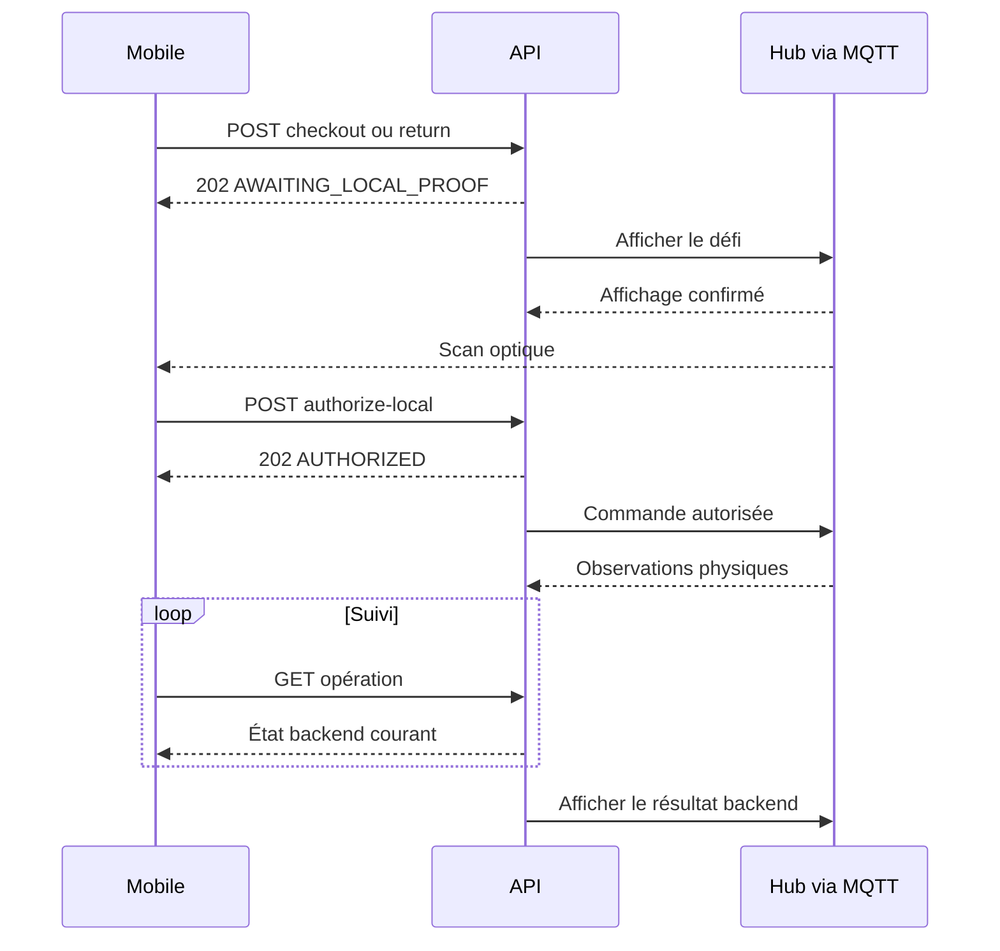

# Aegis — Contrats REST détaillés

**Cours :** 420-5X7-SO — Écosystème connecté  
**Équipe :** Philippe Jordan Monfouayi Mba et Yoël Jimmy Razafindretsa  
**Date de révision :** 16 septembre 2026
**Version :** 1.2 — contrôle local QR et étoile

---

## 1. Rôle du document

Ce document fixe le contrat HTTPS entre :

- Aegis Mobile, développé en SwiftUI;
- Aegis Manager, développé en React;
- Aegis Control, développé avec Spring Boot.

Il traduit le scope et les documents 03 à 08 en routes, autorisations, représentations JSON, statuts HTTP et erreurs stables. Il ne décrit pas les messages MQTT, qui possèdent leur propre contrat.

En cas de contradiction, l’ordre de priorité est :

1. le scope validé;
2. les ADR acceptés;
3. le présent contrat;
4. les documents 03 à 08;
5. l’implémentation.

L’implémentation ne devient jamais la nouvelle référence par accident. Toute divergence observée doit être corrigée dans le code ou approuvée et reportée dans le contrat.

---

## 2. Principes obligatoires

1. Le backend Spring Boot est la seule autorité métier.
2. Le Web et iOS expriment des intentions; ils ne calculent ni ne forcent la readiness.
3. Aucun endpoint ne permet de déclarer directement un prêt terminé, une opération confirmée ou une anomalie résolue.
4. Un retrait ou un retour est asynchrone : la requête crée une LockerOperation, puis le client suit son état.
5. Les clients ne reçoivent aucun payload MQTT brut.
6. Les mutations sensibles sont idempotentes.
7. Les contrôles d’autorisation s’effectuent côté serveur sur chaque requête.
8. Un technicien ne peut lire que ses réservations, prêts et opérations.
9. Une ressource appartenant à un autre technicien est présentée comme introuvable afin d’éviter son énumération.
10. Les erreurs métier utilisent des codes stables indépendants du texte affiché.

---

## 3. Conventions générales

| Élément | Convention |
|---|---|
| URL de base | /api/v1 |
| Transport | HTTPS hors environnement local |
| Requête et réponse | application/json; charset=utf-8 |
| Erreur | application/problem+json |
| Noms JSON | camelCase |
| Identifiants | UUID sous forme de chaîne |
| Instants | RFC 3339 en UTC, par exemple 2026-09-16T14:30:00Z |
| Dates locales | Non utilisées dans les décisions métier |
| Heures d’exploitation | HH:mm:ss interprété dans le timeZone de l’horaire |
| Jour de semaine | MONDAY à SUNDAY |
| Valeur absente | Champ omis ou null uniquement lorsque le schéma l’autorise |
| Version majeure | Dans le chemin; une rupture exige /api/v2 |
| Taille de page | 20 par défaut, 100 maximum |

Les champs inconnus d’une requête sont rejetés avec VALIDATION_ERROR. Cette règle évite qu’une faute de frappe soit silencieusement ignorée.

Les clients doivent tolérer l’ajout de nouveaux champs dans une réponse v1. Ils ne doivent pas tolérer une valeur inconnue d’une énumération contrôlant un workflow : elle est journalisée et affichée comme état indisponible jusqu’à la mise à jour du client.

---

## 4. Authentification et contexte de sécurité

### 4.1 Jeton d’accès P0

Après une connexion réussie, le backend émet un jeton d’accès signé et expirable :

- le client le traite comme une chaîne opaque;
- sa durée P0 est de 60 minutes;
- il transporte au minimum userId, role, maximumAccessLevel, issuedAt, expiresAt et un identifiant de jeton;
- aucun refresh token n’est émis dans le P0;
- l’expiration du jeton n’altère jamais une réservation ou un prêt existant;
- l’utilisateur se reconnecte après expiration.

Le mécanisme de signature, la rotation des clés et les claims techniques exacts doivent être consignés dans l’ADR d’authentification. Ils ne doivent pas devenir une dépendance du code des clients.

### 4.2 Stockage côté client

| Client | Règle |
|---|---|
| iOS | Jeton stocké dans le Keychain; jamais dans UserDefaults. |
| Web | Jeton conservé en mémoire; jamais dans localStorage ou sessionStorage. |
| Tous | Jeton supprimé localement lors de la déconnexion. |

### 4.3 En-tête

```http
Authorization: Bearer <access-token>
```

Une absence de jeton, un jeton invalide ou expiré produit 401. Un jeton valide sans rôle ou droit suffisant produit 403.

### 4.4 Profil minimal

| Champ | Type | Requis | Valeurs ou règle |
|---|---|---:|---|
| id | UUID | oui | Identifiant utilisateur |
| displayName | string | oui | 1 à 120 caractères |
| email | string | oui | Adresse normalisée |
| role | string | oui | ADMIN ou TECHNICIAN |
| maximumAccessLevel | string | oui | STANDARD ou RESTRICTED |

---

## 5. Autorisations

| Capacité | Public | TECHNICIAN | ADMIN |
|---|---:|---:|---:|
| Santé minimale de l’API | oui | oui | oui |
| Connexion | oui | oui | oui |
| Profil courant | non | oui | oui |
| Catalogue technicien et readiness personnelle | non | oui | non |
| Créer ou annuler sa réservation | non | oui | non |
| Demander retrait ou retour | non | oui | non |
| Lire sa réservation, son prêt et ses opérations | non | oui | non |
| Lire le statut utile du locker | non | oui | oui |
| Administrer modèles, actifs, tags et placements | non | non | oui |
| Administrer les horaires | non | non | oui |
| Lire toutes les réservations, prêts et opérations | non | non | oui |
| Lire et reconnaître les anomalies | non | non | oui |
| Lire l’audit | non | non | oui |
| Forcer READY, CONFIRMED, COMPLETED ou RESOLVED | non | non | non |

Un compte ADMIN n’est pas implicitement un technicien. Les comptes de démonstration utilisent des rôles distincts.

---

## 6. En-têtes transversaux

### 6.1 Corrélation

Le client peut envoyer :

```http
X-Request-Id: 5f4bc22e-66a4-48ef-8bf3-6e7184d71c30
```

Le backend retourne toujours un X-Request-Id valide. Il réutilise celui du client lorsqu’il est valide, sinon il en génère un. Cet identifiant apparaît dans les logs et dans traceId des erreurs.

### 6.2 Idempotence

Les routes indiquées comme sensibles exigent :

```http
Idempotency-Key: aac9e0c9-1bb4-48d4-8b55-ccf75a9a73d7
```

La clé :

- contient de 1 à 128 caractères;
- est unique pour l’utilisateur et la route logique;
- est conservée au moins 24 heures;
- doit être réutilisée lorsque le client répète exactement la même intention.

Une réponse rejouée ajoute :

```http
Idempotency-Replayed: true
```

### 6.3 Localisation d’une nouvelle ressource

Une réponse 201 ou 202 retourne Location lorsque la ressource possède une route de lecture.

---

## 7. Représentation des erreurs

Toutes les erreurs suivent cette structure :

```json
{
  "type": "https://aegis.local/problems/asset-not-ready",
  "title": "Actif non prêt",
  "status": 422,
  "code": "ASSET_NOT_READY",
  "detail": "L'actif ne peut pas être réservé dans son état actuel.",
  "instance": "/api/v1/reservations",
  "traceId": "5f4bc22e-66a4-48ef-8bf3-6e7184d71c30",
  "timestamp": "2026-09-16T14:30:00Z",
  "reasons": ["CALIBRATION_EXPIRED"],
  "violations": []
}
```

| Champ | Type | Requis | Rôle |
|---|---|---:|---|
| type | URI | oui | Catégorie stable du problème |
| title | string | oui | Libellé court localisable |
| status | integer | oui | Statut HTTP |
| code | string | oui | Code applicatif stable |
| detail | string | oui | Explication sûre pour le client |
| instance | string | oui | Chemin de la requête |
| traceId | UUID/string | oui | Corrélation de diagnostic |
| timestamp | instant | oui | Heure backend |
| reasons | string[] | non | Raisons métier contrôlées |
| violations | array | non | Erreurs champ par champ |

Une violation contient field, code et message. Elle ne contient jamais la valeur d’un mot de passe, d’un jeton ou d’un secret.

---

## 8. Représentations communes

### 8.1 ReadinessAssessment

| Champ | Type | Requis |
|---|---|---:|
| assetId | UUID | oui |
| evaluatedForUserId | UUID | oui |
| result | READY, BLOCKED ou UNKNOWN | oui |
| reasons | ReadinessReason[] | oui |
| evaluatedAt | instant | oui |

ReadinessReason :

- NOT_PRESENT;
- NOT_AVAILABLE;
- MAINTENANCE;
- DAMAGED;
- CALIBRATION_EXPIRED;
- ACCESS_DENIED;
- UNKNOWN_PHYSICAL_STATE.

Plusieurs raisons peuvent coexister. READY exige un tableau reasons vide.

### 8.2 AssetView du technicien

| Champ | Type | Requis |
|---|---|---:|
| id | UUID | oui |
| assetCode | string | oui |
| model | AssetModelSummary | oui |
| requiredAccessLevel | AccessLevel | oui |
| operationalStatus | SERVICEABLE, MAINTENANCE ou DAMAGED | oui |
| calibration | CalibrationView | oui |
| availability | AVAILABLE, RESERVED, BORROWED ou UNAVAILABLE | oui |
| presence | PRESENT, ABSENT ou UNKNOWN | oui |
| readiness | ReadinessAssessment | oui |
| placement | PlacementSummary ou null | oui |

Le technicien ne reçoit jamais identifierValue, le payload RFID brut, le mot de passe MQTT ou des détails sur un autre titulaire.

Exemple :

```json
{
  "id": "300e72fd-118c-4d1f-af9c-7fb61e89f62c",
  "assetCode": "MM-001",
  "model": {
    "id": "a09aa622-fba1-4457-8f67-7f123284e132",
    "name": "Multimètre 1",
    "manufacturer": "Fluke",
    "modelNumber": "117"
  },
  "requiredAccessLevel": "STANDARD",
  "operationalStatus": "SERVICEABLE",
  "calibration": {
    "required": true,
    "dueAt": "2026-12-01T05:00:00Z",
    "status": "VALID"
  },
  "availability": "AVAILABLE",
  "presence": "PRESENT",
  "readiness": {
    "assetId": "300e72fd-118c-4d1f-af9c-7fb61e89f62c",
    "evaluatedForUserId": "75acc15f-fc23-45d9-857d-b543694e4fc2",
    "result": "READY",
    "reasons": [],
    "evaluatedAt": "2026-09-16T14:30:00Z"
  },
  "placement": {
    "lockerId": "d46a74ae-39dc-460b-8af0-38fc791b376a",
    "lockerCode": "AEGIS-DEMO-01",
    "compartmentId": "1ae77ae3-8490-4f09-9412-a7816b77bff9",
    "compartmentCode": "A1"
  }
}
```

### 8.3 ReservationView

| Champ | Type | Requis |
|---|---|---:|
| id | UUID | oui |
| asset | AssetSummary | oui |
| userId | UUID | oui |
| status | ACTIVE, FULFILLED, CANCELLED ou EXPIRED | oui |
| reservedFrom | instant | oui |
| reservedUntil | instant | oui |
| createdAt | instant | oui |
| cancelledAt | instant ou null | oui |
| fulfilledAt | instant ou null | oui |
| expiredAt | instant ou null | oui |
| availableActions | string[] | oui |

### 8.4 LoanView

| Champ | Type | Requis |
|---|---|---:|
| id | UUID | oui |
| asset | AssetSummary | oui |
| holderUserId | UUID | oui |
| status | ACTIVE, RETURN_PENDING ou COMPLETED | oui |
| checkedOutAt | instant | oui |
| dueAt | instant | oui |
| overdue | boolean | oui |
| returnRequestedAt | instant ou null | oui |
| returnedAt | instant ou null | oui |
| checkoutOperationId | UUID | oui |
| returnOperationId | UUID ou null | oui |
| availableActions | string[] | oui |

### 8.5 LockerOperationView

| Champ | Type | Requis |
|---|---|---:|
| id | UUID | oui |
| type | CHECKOUT ou RETURN | oui |
| status | LockerOperationStatus | oui |
| userId | UUID | oui |
| assetId | UUID | oui |
| lockerId | UUID | oui |
| compartmentId | UUID | oui |
| reservationId | UUID ou null | oui |
| loanId | UUID ou null | oui |
| createdAt | instant | oui |
| authorizedAt | instant ou null | oui |
| localAccessChallengeId | UUID ou null | oui |
| localProofExpiresAt | instant ou null | oui |
| localProofDisplayedAt | instant ou null | oui |
| localProofValidatedAt | instant ou null | oui |
| requiredAction | SCAN_HUB_QR, WAIT ou NONE | oui |
| expiresAt | instant ou null | oui |
| commandSentAt | instant ou null | oui |
| acknowledgedAt | instant ou null | oui |
| doorOpenedAt | instant ou null | oui |
| observationReceivedAt | instant ou null | oui |
| confirmedAt | instant ou null | oui |
| terminalAt | instant ou null | oui |
| failureReason | string ou null | oui |
| anomalyId | UUID ou null | oui |

LockerOperationStatus :

- REQUESTED;
- AWAITING_LOCAL_PROOF;
- AUTHORIZED;
- COMMAND_SENT;
- COMMAND_ACKNOWLEDGED;
- DOOR_OPENED;
- OBSERVATION_RECEIVED;
- CONFIRMED;
- FAILED;
- EXPIRED;
- ANOMALY.

### 8.6 LockerStatusView

| Champ | Type | Requis |
|---|---|---:|
| lockerId | UUID | oui |
| code | string | oui |
| name | string | oui |
| topology | MONOLITHIC ou HUB_CELL | oui |
| connectionStatus | ONLINE, OFFLINE ou UNKNOWN | oui |
| lastSeenAt | instant ou null | oui |
| evaluatedAt | instant | oui |
| compartments | CompartmentStatusView[] | oui |

Un CompartmentStatusView contient id, code, enabled, connectionStatus, rfidReaderStatus, doorState, lockState et lastObservedAt. Il ne contient pas de message MQTT brut.

### 8.7 AnomalyView

| Champ | Type | Requis |
|---|---|---:|
| id | UUID | oui |
| type | AnomalyType | oui |
| severity | LOW, MEDIUM ou HIGH | oui |
| status | OPEN, ACKNOWLEDGED ou RESOLVED | oui |
| lockerOperationId | UUID ou null | oui |
| assetId | UUID ou null | oui |
| compartmentId | UUID ou null | oui |
| detectedAt | instant | oui |
| acknowledgedAt | instant ou null | oui |
| acknowledgedBy | UserSummary ou null | oui |
| acknowledgementNote | string ou null | oui |
| resolvedAt | instant ou null | oui |
| resolutionEvidenceObservationId | UUID ou null | oui |
| resolutionNote | string ou null | oui |
| summary | string | oui |

Les détails techniques sensibles ne sont inclus que dans la vue de détail administrateur.

---

## 9. Catalogue des endpoints

### 9.1 Public et profil

| Méthode | Route | Accès | Résultat |
|---|---|---|---|
| GET | /system/health | Public | Santé minimale |
| POST | /auth/login | Public | Jeton et profil |
| GET | /auth/me | Authentifié | Profil courant |

### 9.2 Technicien

Route supplémentaire : `POST /locker-operations/{operationId}/authorize-local` — initiateur uniquement, `Idempotency-Key`, réponse 202, détails §15.5.


| Méthode | Route | Résultat |
|---|---|---|
| GET | /assets | Catalogue avec readiness personnelle |
| GET | /assets/{assetId} | Détail avec readiness personnelle |
| POST | /reservations | Créer une réservation |
| GET | /me/reservation | Réservation active du technicien |
| GET | /reservations/{reservationId} | Réservation appartenant au technicien |
| POST | /reservations/{reservationId}/cancel | Annuler une réservation inutilisée |
| POST | /reservations/{reservationId}/checkout | Commencer un retrait |
| GET | /me/loan | Prêt ouvert du technicien |
| GET | /loans/{loanId} | Prêt appartenant au technicien |
| POST | /loans/{loanId}/return | Commencer un retour |
| POST | /locker-operations/{operationId}/authorize-local | Consommer le QR et autoriser l’opération préparée |
| GET | /locker-operations/{operationId} | Progression de sa propre opération |
| GET | /lockers/{lockerId}/status | État utile du locker |

### 9.3 Administration

| Méthode | Route | Résultat |
|---|---|---|
| GET | /admin/asset-models | Liste des modèles |
| POST | /admin/asset-models | Créer un modèle |
| GET | /admin/asset-models/{modelId} | Détail d’un modèle |
| PUT | /admin/asset-models/{modelId} | Remplacer les champs modifiables |
| POST | /admin/asset-models/{modelId}/archive | Archiver un modèle |
| GET | /admin/assets | Liste administrative des actifs |
| POST | /admin/assets | Créer un actif |
| GET | /admin/assets/{assetId} | Détail administratif |
| PUT | /admin/assets/{assetId} | Remplacer les champs modifiables |
| POST | /admin/assets/{assetId}/archive | Archiver un actif |
| POST | /admin/assets/{assetId}/identifiers | Assigner un identifiant |
| POST | /admin/assets/{assetId}/identifiers/{identifierId}/revoke | Révoquer un identifiant |
| PUT | /admin/assets/{assetId}/placement | Définir le placement attendu |
| GET | /admin/lockers | Liste des lockers |
| GET | /admin/lockers/{lockerId}/operating-schedule | Horaire actif |
| PUT | /admin/lockers/{lockerId}/operating-schedule | Remplacer l’horaire actif |
| GET | /admin/reservations | Réservations filtrées |
| GET | /admin/reservations/{reservationId} | Détail d’une réservation |
| GET | /admin/loans | Prêts filtrés |
| GET | /admin/loans/{loanId} | Détail d’un prêt |
| GET | /admin/locker-operations | Opérations filtrées |
| GET | /admin/locker-operations/{operationId} | Détail d’une opération |
| GET | /admin/anomalies | Anomalies filtrées |
| GET | /admin/anomalies/{anomalyId} | Détail et preuve |
| POST | /admin/anomalies/{anomalyId}/acknowledge | Reconnaître sans résoudre |
| GET | /admin/audit-events | Chronologie paginée |

---

## 10. Santé et authentification

### 10.1 GET /system/health

Réponse 200 :

```json
{
  "status": "UP",
  "service": "aegis-control",
  "version": "0.1.0",
  "timestamp": "2026-09-16T14:30:00Z"
}
```

Cette route ne révèle ni URL interne, ni version PostgreSQL, ni identité MQTT, ni secret. Les sondes détaillées restent internes au déploiement.

### 10.2 POST /auth/login

Requête :

```json
{
  "email": "technician@aegis.demo",
  "password": "mot-de-passe-transitoire"
}
```

Validations :

- email requis, normalisé et limité à 320 caractères;
- password requis et limité en taille avant hachage;
- message identique pour compte absent, désactivé ou mot de passe invalide.

Réponse 200 :

```json
{
  "accessToken": "<opaque-to-client>",
  "tokenType": "Bearer",
  "expiresIn": 3600,
  "expiresAt": "2026-09-16T15:30:00Z",
  "user": {
    "id": "75acc15f-fc23-45d9-857d-b543694e4fc2",
    "displayName": "Technicien Démo",
    "email": "technician@aegis.demo",
    "role": "TECHNICIAN",
    "maximumAccessLevel": "STANDARD"
  }
}
```

Erreurs : 400 VALIDATION_ERROR, 401 AUTH_INVALID_CREDENTIALS, 429 RATE_LIMITED.

### 10.3 GET /auth/me

Retourne 200 avec le profil minimal. Cette route permet au client de réhydrater son contexte sans décoder le jeton.

---

## 11. Catalogue technicien et readiness

### 11.1 GET /assets

Paramètres :

| Paramètre | Type | Défaut | Règle |
|---|---|---|---|
| q | string | absent | Recherche sur code et nom, 1 à 100 caractères |
| readiness | enum | absent | READY, BLOCKED ou UNKNOWN |
| availability | enum | absent | AVAILABLE, RESERVED, BORROWED ou UNAVAILABLE |
| page | integer | 0 | Minimum 0 |
| size | integer | 20 | 1 à 100 |
| sort | enum | assetCode,asc | assetCode ou modelName |

Chaque élément est un AssetView évalué pour l’utilisateur authentifié. La réponse inclut evaluatedAt; le client ne réutilise pas une readiness ancienne pour décider une action.

Réponse :

```json
{
  "items": [],
  "page": 0,
  "size": 20,
  "totalItems": 0,
  "totalPages": 0
}
```

### 11.2 GET /assets/{assetId}

Retourne 200 avec AssetView. Erreurs : 404 ASSET_NOT_FOUND.

La présence d’un actif dans le catalogue ne signifie pas qu’il est réservable. La propriété readiness fournit la décision courante.

---

## 12. Administration du catalogue

### 12.1 AssetModel

CreateAssetModelRequest et UpdateAssetModelRequest :

| Champ | Type | Requis | Validation |
|---|---|---:|---|
| name | string | oui | 1 à 160 caractères |
| manufacturer | string ou null | oui | Maximum 120 |
| modelNumber | string ou null | oui | Maximum 120 |
| description | string ou null | oui | Maximum 2000 |
| defaultCalibrationRequired | boolean | oui | — |

POST /admin/asset-models retourne 201 et exige Idempotency-Key.

PUT /admin/asset-models/{modelId} retourne 200. Un PUT identique est un no-op métier et ne crée pas un second événement ASSET_UPDATED.

POST /admin/asset-models/{modelId}/archive retourne 200. Il est refusé avec 409 ASSET_MODEL_IN_USE si un actif non archivé l’utilise.

### 12.2 Asset

CreateAssetRequest et UpdateAssetRequest :

| Champ | Type | Requis | Validation |
|---|---|---:|---|
| assetModelId | UUID | oui | Modèle actif |
| assetCode | string | oui | 1 à 64, unique sans casse |
| serialNumber | string ou null | oui | Maximum 120 |
| requiredAccessLevel | enum | oui | STANDARD ou RESTRICTED |
| operationalStatus | enum | oui | SERVICEABLE, MAINTENANCE ou DAMAGED |
| calibrationRequired | boolean | oui | — |
| calibrationDueAt | instant ou null | oui | Requis si calibrationRequired=true |

POST /admin/assets retourne 201 et exige Idempotency-Key.

PUT /admin/assets/{assetId} retourne 200. La readiness n’est jamais acceptée dans la requête.

POST /admin/assets/{assetId}/archive exige Idempotency-Key. L’archivage est refusé lorsqu’une réservation active, un prêt ouvert ou une opération non terminale concerne l’actif.

### 12.3 Identifiant physique

POST /admin/assets/{assetId}/identifiers

```json
{
  "type": "RFID_UHF",
  "value": "E20034120123456789000001"
}
```

Réponse 201. Idempotency-Key obligatoire.

Erreurs particulières :

- 409 IDENTIFIER_ALREADY_ASSIGNED;
- 409 ASSET_OPERATION_IN_PROGRESS;
- 422 IDENTIFIER_TYPE_UNSUPPORTED.

POST /admin/assets/{assetId}/identifiers/{identifierId}/revoke exige une clé d’idempotence. Une révocation ne supprime pas l’historique. Elle est refusée pendant une opération physique utilisant cet identifiant.

### 12.4 Placement attendu

PUT /admin/assets/{assetId}/placement

```json
{
  "compartmentId": "1ae77ae3-8490-4f09-9412-a7816b77bff9",
  "reason": "Affectation initiale pour la démonstration"
}
```

Réponse 200 avec le placement actif.

La mutation est refusée si :

- le compartiment est désactivé;
- un autre actif possède déjà ce placement;
- l’actif possède une réservation active, un prêt ouvert ou une opération non terminale;
- le compartiment n’appartient pas au locker visé par la configuration.

---

## 13. Horaire d’exploitation

### 13.1 GET /admin/lockers/{lockerId}/operating-schedule

Retourne l’horaire actif, son fuseau et exactement sept jours ordonnés de MONDAY à SUNDAY.

### 13.2 PUT /admin/lockers/{lockerId}/operating-schedule

```json
{
  "timeZone": "America/Toronto",
  "windows": [
    {"dayOfWeek": "MONDAY", "enabled": true, "opensAt": "09:00:00", "closesAt": "17:00:00"},
    {"dayOfWeek": "TUESDAY", "enabled": true, "opensAt": "09:00:00", "closesAt": "17:00:00"},
    {"dayOfWeek": "WEDNESDAY", "enabled": true, "opensAt": "09:00:00", "closesAt": "17:00:00"},
    {"dayOfWeek": "THURSDAY", "enabled": true, "opensAt": "09:00:00", "closesAt": "17:00:00"},
    {"dayOfWeek": "FRIDAY", "enabled": true, "opensAt": "09:00:00", "closesAt": "17:00:00"},
    {"dayOfWeek": "SATURDAY", "enabled": false, "opensAt": null, "closesAt": null},
    {"dayOfWeek": "SUNDAY", "enabled": false, "opensAt": null, "closesAt": null}
  ]
}
```

Règles :

- les sept jours sont présents exactement une fois;
- un jour activé exige opensAt < closesAt;
- un jour fermé exige les deux heures à null;
- une plage ne traverse pas minuit dans le P0;
- le fuseau doit être un identifiant IANA accepté;
- une nouvelle version d’horaire remplace la version active sans supprimer l’historique.

Réponse 200 avec la nouvelle version active.

---

## 14. Réservations

### 14.1 POST /reservations

Idempotency-Key obligatoire.

Requête :

```json
{
  "assetId": "300e72fd-118c-4d1f-af9c-7fb61e89f62c",
  "reservedUntil": "2026-09-16T20:30:00Z"
}
```

Le backend :

1. utilise son horloge pour reservedFrom;
2. verrouille l’utilisateur et l’actif;
3. vérifie l’unique réservation active du technicien et de l’actif;
4. vérifie l’absence de prêt ouvert;
5. traduit reservedUntil dans le fuseau du locker;
6. vérifie qu’elle se situe dans la plage ouverte courante;
7. recalcule la readiness;
8. crée la réservation et l’audit dans la même transaction.

Réponse 201 :

```http
Location: /api/v1/reservations/7b726e56-2a19-44de-887b-d3e2bfc8bf28
```

Le corps est ReservationView.

Erreurs particulières :

| Statut | Code |
|---:|---|
| 403 | ASSET_ACCESS_DENIED |
| 409 | USER_ALREADY_HAS_ACTIVE_RESERVATION |
| 409 | ASSET_ALREADY_RESERVED |
| 409 | ASSET_HAS_OPEN_LOAN |
| 422 | ASSET_NOT_READY |
| 422 | OUTSIDE_OPERATING_HOURS |
| 422 | RESERVATION_END_AFTER_CLOSING |

### 14.2 GET /me/reservation

Retourne 200 avec l’unique réservation ACTIVE du technicien.

S’il n’en possède aucune : 404 ACTIVE_RESERVATION_NOT_FOUND.

### 14.3 GET /reservations/{reservationId}

Le technicien ne peut lire que sa propre réservation. Un administrateur utilise la route administrative.

### 14.4 POST /reservations/{reservationId}/cancel

Idempotency-Key obligatoire. Corps vide ou objet JSON vide.

Réponse 200 avec ReservationView CANCELLED.

Une répétition avec la même clé rejoue la première réponse. Une réservation déjà CANCELLED avec une nouvelle clé retourne 200 et ALREADY_APPLIED dans l’audit. Une réservation FULFILLED ou EXPIRED retourne 409 RESERVATION_NOT_CANCELLABLE.

L’annulation est refusée si une opération CHECKOUT déjà autorisée ou une incertitude physique existe. Une opération `AWAITING_LOCAL_PROOF` est terminée en `FAILED` et son défi invalidé atomiquement avec l’annulation de la réservation; aucune serrure n’a été commandée.

---

## 15. Retrait, retour et suivi asynchrone

### 15.1 Préparer un retrait

`POST /reservations/{reservationId}/checkout`

Accès : `TECHNICIAN` propriétaire. `Idempotency-Key` obligatoire; corps vide.

Le backend vérifie l’horaire, la réservation, la readiness tenant compte de la réservation du titulaire et les gardes physiques. Il crée l’opération `AWAITING_LOCAL_PROOF`, le défi et l’instruction d’écran. **Il ne crée aucune commande de serrure.** La route de réservation elle-même ne lance pas cette préparation.

Réponse `202 Accepted`, `Location: /api/v1/locker-operations/{id}`, `Retry-After: 1` et `Cache-Control: no-store`.

Exemple des champs de suivi de `LockerOperationView` (les autres champs obligatoires de §8.5 restent présents dans la réponse complète) :

```json
{
  "id": "2f38d3b6-c18f-4a74-aa9a-2d574286013f",
  "type": "CHECKOUT",
  "status": "AWAITING_LOCAL_PROOF",
  "localAccessChallengeId": "9d65cbae-4610-4e40-a314-3b93af07be9c",
  "localProofExpiresAt": "2026-09-16T14:32:00Z",
  "localProofDisplayedAt": null,
  "localProofValidatedAt": null,
  "authorizedAt": null,
  "expiresAt": null,
  "requiredAction": "SCAN_HUB_QR"
}
```

L’API ne fournit ni token, ni image QR, ni URI du QR. `localProofDisplayedAt` est renseigné à réception de l’accusé applicatif du hub. La caméra peut attendre cet accusé avant d’accepter le scan.

### 15.2 Préparer un retour

`POST /loans/{loanId}/return`

Accès : titulaire du prêt; clé d’idempotence obligatoire; corps vide.

Même préparation que le retrait, pour un prêt `ACTIVE`, ou une nouvelle tentative de récupération `RETURN_PENDING` explicitement admissible après une opération précédente terminale. Pendant l’attente QR, le prêt garde son état courant. L’opération attend son défi sans commande de serrure.

Réponse `202` avec `Location` et `LockerOperationView`. Le passage de `ACTIVE` à `RETURN_PENDING` intervient seulement lors de l’autorisation locale en §15.5.

### 15.3 Lecture du prêt

`GET /me/loan` retourne le prêt courant de l’utilisateur dans le parcours P0; aucun prêt ouvert donne `404 ACTIVE_LOAN_NOT_FOUND`. `GET /loans/{loanId}` exige que l’utilisateur soit le titulaire.

L’échéance `dueAt` dépassée indique un retard; elle ne clôture jamais le prêt et ne libère jamais l’actif. Si plusieurs prêts par technicien sont admis ultérieurement, remplacer explicitement la vue singulière par une collection; ne pas déduire une contrainte SQL nouvelle de cet écran P0.

### 15.4 Lecture d’une opération

`GET /locker-operations/{operationId}`

Accès au propriétaire; aucune donnée secrète du défi. Polling toutes les secondes tant que non terminal, avec `Retry-After: 1`.

| État | Affichage mobile | requiredAction |
|---|---|---|
| `AWAITING_LOCAL_PROOF` | Se rendre au hub et scanner son QR; échéance visible | `SCAN_HUB_QR` |
| Autorisée / commande / porte / observation | Progression de l’opération | `WAIT` |
| `CONFIRMED`, `FAILED`, `EXPIRED`, `ANOMALY` | Résultat et rafraîchissement des vues métier | `NONE` |



Le mobile ne contacte jamais le broker. La confirmation visuelle est une mise à jour de l’application ouverte, pas une notification APNS ajoutée au P0.

### 15.5 Valider le QR et autoriser

`POST /locker-operations/{operationId}/authorize-local`

Accès : **initiateur authentifié de l’opération**. `Idempotency-Key` obligatoire. Limite stricte de taille; HTTPS et `Cache-Control: no-store`.

```json
{
  "challengeId": "9d65cbae-4610-4e40-a314-3b93af07be9c",
  "token": "<base64url-de-32-octets-aleatoires>"
}
```

L’application extrait ces champs du QR Aegis attendu et vérifie que les identifiants visibles correspondent à l’opération affichée; elle ne suit pas une URL arbitraire. Ces vérifications clientes facilitent l’usage; le serveur refait toutes les vérifications.

Le backend vérifie propriétaire, type/cible liés à l’opération, défi `PENDING`, affichage confirmé, session courante du hub, secret, échéance et toutes les gardes métier. Dans une transaction : consommation unique, opération `AUTHORIZED`, `localProofValidatedAt = authorizedAt`, délai physique de 120 s, passage éventuel du prêt à `RETURN_PENDING`, commande durable, audit et résultat idempotent.

Réponse `202`, `Location` identique, `LockerOperationView` avec `requiredAction=WAIT`. Un succès HTTP n’est pas une confirmation du mouvement physique.

| HTTP | Code stable | Effet |
|---|---|---|
| 400 | `LOCAL_PROOF_MALFORMED` | Format invalide; aucune commande |
| 404 | `OPERATION_NOT_FOUND` | Inexistante ou appartenant à un autre utilisateur |
| 403 | `LOCAL_PROOF_INVALID` | Secret faux; essai compté pour l’initiateur |
| 409 | `LOCAL_PROOF_NOT_DISPLAYED` | Attendre l’accusé d’affichage; nouvel essai avec nouvelle clé |
| 409 | `LOCAL_PROOF_CONTEXT_MISMATCH` | Défi d’une autre opération/cible |
| 409 | `LOCAL_PROOF_ALREADY_USED` | Consommé; aucune deuxième commande |
| 409 | `LOCAL_PROOF_INVALIDATED` | Défi invalidé ou opération non admissible |
| 410 | `LOCAL_PROOF_EXPIRED` | Échéance dépassée; nouvelle préparation nécessaire |
| 429 | `LOCAL_PROOF_RATE_LIMITED` | Limite atteinte, avec `Retry-After` |
| 409 | Codes de gardes métier existants | État, droits métier, réservation, horaire ou matériel devenus incompatibles |

La même clé et le même corps rejouent la réponse initiale; une réponse refusée rejouée ne recompte pas les essais. Un corps différent avec la même clé est rejeté. La nouvelle clé après consommation donne un refus, jamais un second déverrouillage. Le token n’est pas copié dans la table d’idempotence : seul le hash de la requête canonique y figure.

Le délai du défi est proposé à 60 secondes maximum, borné par l’horaire et la réservation. Limites proposées : 5 secrets erronés par défi et 3 préparations par utilisateur et locker sur 15 minutes. Un tiers ne peut épuiser les essais du titulaire. Ces protections limitent l’abus, sans empêcher totalement un compte autorisé de monopoliser une réservation.

---

## 16. Statut du locker

### 16.1 GET /lockers/{lockerId}/status

Accessible au technicien et à l’administrateur. Retourne LockerStatusView.

ONLINE signifie qu’un heartbeat valide date de 30 secondes ou moins. OFFLINE signifie plus de 30 secondes. UNKNOWN signifie qu’aucune preuve suffisante n’existe.

Cette lecture ne garantit pas qu’une ouverture sera autorisée : l’autorisation recalcule toutes les gardes dans sa transaction.

---

## 17. Administration des transactions

Les routes suivantes sont en lecture seule :

- GET /admin/reservations;
- GET /admin/reservations/{reservationId};
- GET /admin/loans;
- GET /admin/loans/{loanId};
- GET /admin/locker-operations;
- GET /admin/locker-operations/{operationId}.

Filtres communs :

| Paramètre | Valeurs |
|---|---|
| status | État contrôlé de la ressource |
| assetId | UUID |
| userId | UUID |
| lockerId | UUID pour les opérations |
| from | Instant inclusif |
| to | Instant exclusif |
| page, size | Pagination |

Ces routes ne permettent jamais de modifier un état. Il n’existe aucune route administrative de type complete-loan, confirm-operation ou force-return.

---

## 18. Anomalies

### 18.1 Liste et détail

GET /admin/anomalies accepte status, type, severity, assetId, lockerOperationId, from, to, page et size.

GET /admin/anomalies/{anomalyId} retourne AnomalyView et, dans une section evidence, les observations normalisées utiles. Les payloads bruts restent exclus.

### 18.2 Reconnaissance

POST /admin/anomalies/{anomalyId}/acknowledge

Idempotency-Key obligatoire.

```json
{
  "note": "Inspection du compartiment planifiée avec le responsable du laboratoire."
}
```

La note contient de 1 à 500 caractères.

Réponse 200 avec AnomalyView au statut ACKNOWLEDGED.

Erreurs :

- 409 ANOMALY_ALREADY_RESOLVED;
- 409 ANOMALY_NOT_ACKNOWLEDGEABLE;
- 400 VALIDATION_ERROR.

Il n’existe pas de route resolve. Seule l’ingestion d’une preuve physique cohérente peut faire passer l’anomalie à RESOLVED.

---

## 19. Audit

### 19.1 GET /admin/audit-events

Cette route utilise une pagination par curseur stable.

Filtres :

- eventType;
- subjectType;
- subjectId;
- operationId;
- actorUserId;
- from inclusif;
- to exclusif;
- limit de 1 à 100;
- cursor opaque retourné par le backend.

Réponse :

```json
{
  "items": [],
  "nextCursor": null,
  "hasMore": false
}
```

Un AuditEventView contient id, eventType, actor, subjectType, subjectId, operationId, fromState, toState, result, reason, occurredAt et details filtrés.

Le curseur encode au minimum occurredAt et id. Le client le traite comme opaque.

---

## 20. Idempotence détaillée

### 20.1 Routes exigeant Idempotency-Key

- `POST /locker-operations/{operationId}/authorize-local`.


- POST /reservations;
- POST /reservations/{id}/cancel;
- POST /reservations/{id}/checkout;
- POST /loans/{id}/return;
- POST /admin/asset-models;
- POST /admin/asset-models/{id}/archive;
- POST /admin/assets;
- POST /admin/assets/{id}/archive;
- POST /admin/assets/{id}/identifiers;
- POST /admin/assets/{assetId}/identifiers/{identifierId}/revoke;
- POST /admin/anomalies/{id}/acknowledge.

### 20.2 Résultats

| Situation | Réponse |
|---|---|
| Nouvelle clé et requête valide | Exécution puis réponse enregistrée |
| Même clé, même route, même corps | Réponse originale exacte + Idempotency-Replayed |
| Même clé, même route, corps différent | 409 IDEMPOTENCY_KEY_REUSED |
| Clé absente sur route obligatoire | 400 IDEMPOTENCY_KEY_REQUIRED |
| Première transaction encore bloquée au-delà du délai HTTP | 409 IDEMPOTENCY_REQUEST_IN_PROGRESS avec Retry-After |

La canonicalisation du hash inclut la méthode, la route logique, les paramètres de chemin et le corps JSON normalisé. Elle exclut X-Request-Id.

Les PUT sont idempotents par définition. Une répétition identique ne crée pas un second effet métier ou audit inutile.

---

## 21. Codes HTTP et erreurs stables

| HTTP | Code principal | Sens |
|---:|---|---|
| 200 | OK | Lecture ou mutation synchrone réussie |
| 201 | CREATED | Ressource créée |
| 202 | OPERATION_ACCEPTED | Workflow physique créé |
| 400 | VALIDATION_ERROR | Format ou champ invalide |
| 400 | IDEMPOTENCY_KEY_REQUIRED | Clé obligatoire absente |
| 401 | AUTH_INVALID_CREDENTIALS | Connexion refusée |
| 401 | AUTH_TOKEN_INVALID | Jeton invalide |
| 401 | AUTH_TOKEN_EXPIRED | Jeton expiré |
| 403 | FORBIDDEN | Rôle insuffisant |
| 403 | ASSET_ACCESS_DENIED | Niveau d’accès insuffisant |
| 404 | RESOURCE_NOT_FOUND | Ressource absente ou non visible |
| 409 | IDEMPOTENCY_KEY_REUSED | Clé réutilisée avec autre intention |
| 409 | CONCURRENT_MODIFICATION | Course détectée |
| 409 | ASSET_ALREADY_RESERVED | Réservation active existante |
| 409 | USER_ALREADY_HAS_ACTIVE_RESERVATION | Limite P0 atteinte |
| 409 | ASSET_HAS_OPEN_LOAN | Prêt ouvert existant |
| 409 | LOCKER_OPERATION_IN_PROGRESS | Locker déjà engagé |
| 409 | RESERVATION_NOT_CANCELLABLE | État incompatible |
| 409 | LOAN_NOT_RETURNABLE | État incompatible |
| 409 | COMPARTMENT_STATE_UNSAFE | Porte, serrure ou cellule incompatible |
| 422 | ASSET_NOT_READY | Readiness autre que READY |
| 422 | OUTSIDE_OPERATING_HOURS | Action hors plage |
| 422 | RESERVATION_END_AFTER_CLOSING | Échéance trop tardive |
| 422 | PHYSICAL_STATE_UNKNOWN | Preuve courante insuffisante |
| 429 | RATE_LIMITED | Trop de requêtes |
| 500 | INTERNAL_ERROR | Erreur inattendue corrélée |
| 503 | LOCKER_OFFLINE | Locker temporairement indisponible |
| 503 | DEVICE_UNAVAILABLE | Cellule ou lecteur indisponible |

Une violation de contrainte PostgreSQL connue est traduite vers un code métier stable. Le nom d’une contrainte SQL, une stack trace ou un message du driver ne sont jamais renvoyés au client.

---

## 22. Pagination, tri et filtres

### 22.1 Pagination par page

Le catalogue et les listes administratives simples utilisent page et size. Le tri doit inclure id comme second critère stable.

### 22.2 Pagination par curseur

L’audit et les chronologies potentiellement volumineuses utilisent un curseur opaque. Un curseur invalide retourne 400 INVALID_CURSOR.

### 22.3 Recherche

La recherche utilisateur :

- retire les espaces extérieurs;
- refuse une chaîne vide;
- limite la taille avant toute requête SQL;
- utilise des paramètres SQL, jamais une concaténation;
- échappe les caractères propres à la stratégie de recherche.

---

## 23. Sécurité HTTP

### 23.1 CORS

- origines exactes configurées par environnement;
- aucune origine joker avec des credentials;
- méthodes et en-têtes explicitement autorisés;
- aucun accès CORS nécessaire pour l’application iOS native;
- préflight mis en cache pour une durée raisonnable.

### 23.2 Validation et sérialisation

- Bean Validation à l’entrée;
- limite de taille du corps;
- listes bornées;
- rejet des champs inconnus;
- aucune désérialisation polymorphique fournie par le client;
- aucune entité JPA sérialisée directement;
- DTO de sortie explicites.

### 23.3 Protection des secrets

Le secret QR et le corps de `authorize-local` sont exclus des logs HTTP, traces APM, analytics mobile, captures de diagnostic, réponses d’erreur, audits et exemples de données réelles. Ne créer aucune route de lecture du QR, même réservée à l’administrateur. Le scan prouve seulement l’accès au code frais; le relais par photo ou vidéo reste un risque.


Ne sont jamais retournés :

- passwordHash;
- secret ou mot de passe MQTT;
- clé de signature;
- payload MQTT brut;
- token d’un autre client;
- configuration interne PostgreSQL;
- stack trace.

### 23.4 Limites de débit P0

| Famille | Limite cible |
|---|---|
| POST /auth/login | 5 tentatives par minute et par combinaison IP/compte |
| Mutations sensibles | 10 par minute et par utilisateur |
| Lectures authentifiées | 120 par minute et par utilisateur |
| Santé | 60 par minute et par IP |

Un environnement local peut assouplir ces valeurs, mais la démonstration distante conserve une protection.

---

## 24. Performance et cohérence

- Les listes utilisent des projections et non la navigation paresseuse d’entités JPA.
- Une page de 1 ou 50 actifs doit conserver un nombre borné de requêtes SQL.
- OpenEntityManagerInView est désactivé.
- La readiness de chaque élément possède le même evaluatedAt de lot lorsque la page est calculée dans un même snapshot applicatif.
- Les mutations sensibles utilisent une transaction courte et ne gardent jamais une connexion SQL ouverte en attendant MQTT.
- Le checkout et le retour retournent 202 dès que l’opération et l’outbox sont committées.
- Les réponses peuvent utiliser gzip ou Brotli au niveau du proxy, sans changer le contrat JSON.

---

## 25. Routes explicitement interdites

Les routes suivantes ne doivent pas exister :

```text
PUT  /assets/{id}/readiness
PUT  /assets/{id}/availability
POST /locker-operations/{id}/confirm
POST /loans/{id}/complete
POST /anomalies/{id}/resolve
POST /lockers/{id}/unlock
POST /compartments/{id}/unlock
GET  /mqtt/messages/raw
```

Une ouverture passe obligatoirement par une réservation ou un prêt valide et par la création backend d’une LockerOperation.

---

## 26. Tests contractuels minimaux

### 26.1 Authentification

1. Les deux comptes de démonstration peuvent se connecter.
2. Un compte désactivé reçoit la même erreur qu’un mot de passe invalide.
3. Un jeton expiré reçoit 401 sans modifier une ressource.
4. Un technicien ne peut appeler aucune route /admin.

### 26.2 Autorisation et confidentialité

1. Un technicien ne peut lire la réservation, le prêt ou l’opération d’un autre.
2. Un AssetView technicien ne contient aucun identifiant RFID brut.
3. Une erreur ne contient ni stack trace ni nom de contrainte SQL.
4. Un administrateur ne peut pas confirmer une opération ou résoudre une anomalie.

### 26.3 Réservation

1. Un actif READY peut être réservé dans la plage ouverte.
2. Une calibration expirée produit 422 et CALIBRATION_EXPIRED.
3. Un niveau insuffisant produit 403 ASSET_ACCESS_DENIED.
4. Une seconde réservation active du technicien produit 409.
5. reservedUntil après la fermeture produit 422.
6. Deux requêtes concurrentes pour le même actif créent exactement une réservation.

### 26.4 Idempotence

1. Deux appels identiques avec la même clé retournent la même réponse.
2. La même clé avec un corps différent retourne 409.
3. Un retry de checkout ne crée ni deuxième opération ni deuxième commande.
4. La purge d’une clé expirée ne supprime aucune ressource métier.

### 26.5 Checkout et retour

- Réservation ou préparation depuis un autre réseau : aucun déverrouillage sans scan valide.
- Aucune réponse de préparation, lecture ou erreur ne contient le token ou une image du QR.
- Défi lié à l’initiateur, à l’opération et au hub; refus des substitutions, délais expirés et rejeux.
- Deux scans concurrents : une consommation et une commande; rollback complet si erreur SQL.
- Changement des droits, calibration, horaire ou santé après affichage : gardes réévaluées.
- Expiration ou annulation pendant l’attente : prêt inchangé, écran effacé, réservation traitée normalement.
- Nouveau démarrage du hub : ancien défi refusé.
- Appareil photo refusé ou écran illisible : erreur explicite, sans bouton de contournement.


1. Les routes retournent 202 et Location.
2. Le client peut suivre tous les états via GET LockerOperation.
3. Un locker OFFLINE empêche la création d’une nouvelle commande.
4. Une opération terminale n’est pas réutilisable.
5. Aucun endpoint REST ne peut créer ou terminer directement un prêt.

### 26.6 Administration

1. Un horaire contient exactement sept jours.
2. Un jour fermé possède des heures nulles.
3. Un actif avec workflow ouvert ne peut être archivé ou déplacé.
4. Une anomalie peut être ACKNOWLEDGED mais jamais RESOLVED par REST.

---

## 27. Limites du contrat P0

Le P0 ne comprend pas :

- inscription publique;
- récupération autonome de mot de passe;
- refresh token;
- authentification sociale;
- gestion avancée des utilisateurs;
- WebSocket ou Server-Sent Events;
- téléchargement du payload MQTT brut;
- API publique pour intégrations externes;
- bulk import;
- multi-organisation;
- action administrative de force sur une chaîne de possession.

Le polling HTTP à une seconde est retenu pour suivre une LockerOperation. Cette décision limite la complexité du P0 sans donner au client un accès direct à MQTT.

---

## 28. Critères de conformité

Cette révision modifie la sémantique de préparation de `checkout`/`return` et ajoute un état obligatoire. Tous les clients, simulateurs et tests doivent être mis à jour ensemble avant une démo. Aucun ancien chemin d’ouverture directe n’est conservé comme compatibilité cachée.


Le contrat est respecté si :

1. toutes les routes sont sous /api/v1;
2. chaque route applique le rôle et la propriété attendus;
3. les DTO n’exposent aucun secret ni entité JPA brute;
4. la readiness est calculée côté backend pour l’utilisateur courant;
5. toute mutation physique retourne une opération asynchrone;
6. les mutations sensibles sont idempotentes;
7. les erreurs utilisent application/problem+json et un code stable;
8. aucune route interdite n’existe;
9. l’administrateur ne peut pas résoudre une anomalie;
10. le contrat est couvert par des tests d’intégration ou des tests OpenAPI;
11. les clients Web et iOS consomment les mêmes états et codes;
12. les décisions physiques restent corrélées à MQTT sans exposer MQTT aux clients.
