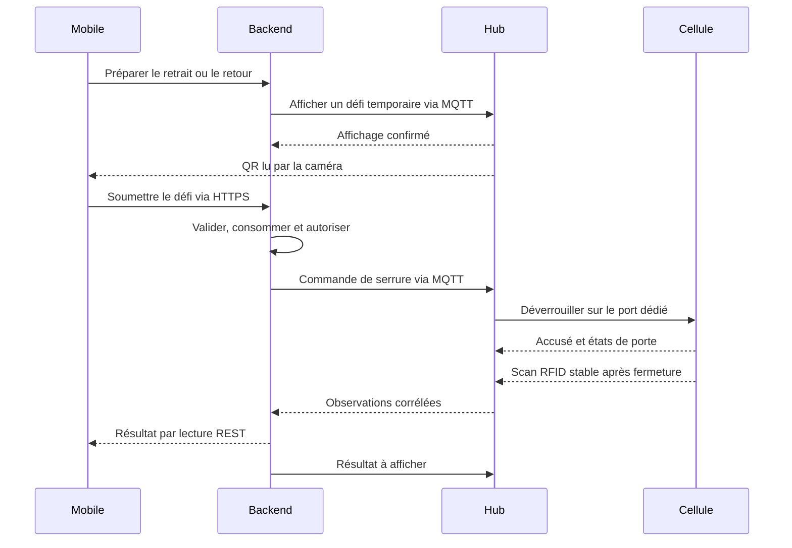

# Aegis — Architecture physique et interfaces du prototype

**Cours :** 420-5X7-SO — Écosystème connecté  
**Équipe :** Philippe Jordan Monfouayi Mba et Yoël Jimmy Razafindretsa  
**Date de révision :** 17 septembre 2026  
**Version :** 2.0 — dossier de réalisation, interfaces et responsabilités  
**Statut :** architecture de référence; étoile et deux cellules retenues. Les choix électriques et les résultats de POC restent explicitement ouverts.  
**Références :** [scope](02-scope.md), [contrat MQTT](10-contrats-mqtt.md), [ADRs](13-decisions-architecture.md).

## 1. Périmètre matériel

Le prototype comporte **un hub avec écran et deux cellules indépendantes A1 et A2**. Une cellule correspond à un compartiment. Les modules peuvent être fixés ou empilés mécaniquement; cela n’impose aucune liaison électrique entre cellules.

Chaque cellule rejoint directement le hub par son propre câble. Ce document remplace l’ancienne représentation en chaîne avec bus traversant.

Les dessins mécaniques de Jimmy décrivent l’encombrement, les fixations et le verrou. Ce document fixe les interfaces et conditions de validation nécessaires à la réalisation. Un schéma électrique coté et un brochage approuvé devront correspondre aux composants effectivement retenus.

### 1.1 Décisions et points ouverts

| Sujet | Base de réalisation | État |
|---|---|---|
| Modularité | Un hub et deux cellules; une cellule = un compartiment | Retenu par l’équipe |
| Topologie | Deux départs directs depuis le hub; pas de câble traversant entre cellules | Étoile validée |
| Écran | QR temporaire, consignes et résultat backend | Inclus au P0 |
| Connectique | Cat5e/Cat6 et RJ45 propriétaire | Proposition de Jimmy, dimensionnement à vérifier |
| Transport local | Un segment RS-485 indépendant par départ | Proposition technique, pas une conséquence automatique de l’étoile |
| Protocole local | Modbus RTU minimal ou alternative explicitement documentée | À choisir avec les composants |
| Détection | RFID UHF local, tag propre à chaque actif | Premier choix soumis au POC |
| Verrou | Verrou rotatif à impulsion, candidat 12 V décrit par Jimmy | Fonctionnement et caractéristiques à vérifier |

### 1.2 Responsabilité de réalisation

Jimmy porte la mécanique, les composants, l’alimentation, le câblage et les mesures. Philippe porte l’API, les contrats et le simulateur. **L’hypothèse de partage du firmware reste à confirmer** : Jimmy prend les pilotes de serrure, porte, RFID et liaison locale; Philippe prend MQTT, les messages d’écran et la corrélation logicielle.

L’affichage QR exige les deux parties : Jimmy vérifie le composant, son pilote et la lisibilité; Philippe traite le cycle du défi et le résultat backend. Un seul membre modifie un fichier donné à la fois. La première intégration et la vérification du ciblage A1/A2 se font ensemble.

## 2. Blocs et responsabilités

| Bloc | Éléments | Fonction |
|---|---|---|
| Backend | Spring Boot, PostgreSQL | Autoriser, créer les défis, consommer les QR, confirmer les mouvements |
| Broker | MQTT, TLS, identités et ACL | Acheminer les commandes, événements, statuts et instructions d’écran |
| Hub | ESP32, écran, réseau, alimentation et interfaces de ports | Afficher le QR, exécuter les commandes backend, cibler une cellule et remonter les observations |
| Cellule A1 | Contrôleur local, serrure, driver, capteur de porte, voyant, lecteur RFID | Une cellule indépendante, reliée au port 1 |
| Cellule A2 | Même fonction | Une cellule indépendante, reliée au port 2 |
| Actif | Tag RFID UHF unique | Identité observée localement |

Le hub ne décide jamais des droits d’ouverture. Les cellules n’ont ni Wi-Fi ni client MQTT. Le téléphone utilise son appareil photo; aucun lecteur de QR supplémentaire n’est nécessaire dans le hub.

## 3. Un câble dédié : définition concrète

| Départ | Arrivée | Contenu dans la gaine | Partage avec l’autre cellule |
|---|---|---|---|
| Port 1 du hub | A1 | Alimentation et signaux de sa liaison locale | Aucun tronçon ni connecteur de cellule partagé |
| Port 2 du hub | A2 | Alimentation et signaux de sa liaison locale | Aucun tronçon ni connecteur de cellule partagé |

Les cellules peuvent partager l’alimentation principale dans le hub. Un câble dédié n’implique ni isolation galvanique ni alimentation indépendante. La protection d’un départ doit limiter les conséquences d’un défaut sur l’autre.

Ajouter une troisième cellule exige un port, les interfaces et la capacité d’alimentation correspondants. La modularité n’implique pas un nombre illimité de cellules sans changement du hub.

## 4. Ce que signifie RJ45 ici

Jimmy propose un câble à paires torsadées Cat5e/Cat6 avec connecteurs couramment appelés **RJ45 (8P8C)**. Il fournit huit conducteurs. Le connecteur ne choisit ni le protocole ni les tensions.

La réalisation proposée transporte :

- une paire torsadée réservée à RS-485 A/B;
- des conducteurs distincts pour l’alimentation et son retour;
- d’éventuels conducteurs restants affectés seulement après dimensionnement.

**Cette prise Aegis n’est pas un port Ethernet et n’utilise pas le PoE standard.** Ne pas la raccorder à un switch, routeur, ordinateur ou injecteur PoE. Étiqueter les deux extrémités, employer des câbles dédiés et différencier les prises du réseau. Si le risque de confusion reste important, choisir un connecteur physiquement incompatible.

Le brochage n’est pas fixé dans cette révision. Il dépend de la section réelle du câble, du courant des deux cellules et du lecteur RFID, de la longueur, des contacts et de l’alimentation. Le marquage Cat5e/Cat6 ne garantit pas à lui seul la capacité à alimenter la serrure.

## 5. RS-485 dans une étoile

La topologie en étoile ne supprime pas RS-485. Pour la réaliser simplement et proprement avec deux cellules, la proposition est **deux liaisons point à point indépendantes** :

| Port | Côté hub | Côté cellule | Domaine électrique |
|---|---|---|---|
| 1 | Interface/transceiver RS-485 du port 1 | Transceiver de A1 | Segment 1 |
| 2 | Interface/transceiver RS-485 du port 2 | Transceiver de A2 | Segment 2 |

Les sorties A/B des deux ports ne sont pas raccordées ensemble pour créer une étoile passive sur un seul bus. Terminaison et polarisation sont étudiées séparément sur chaque segment, selon composants, longueur et débit. Le nombre de canaux série disponibles sur le contrôleur du hub doit être vérifié en tenant compte de l’écran et des autres périphériques.

Modbus RTU minimal reste une proposition applicative de départ à confirmer au POC. La trame exacte ou la table de registres doit être documentée avant implémentation; une trame personnalisée avec CRC ne doit pas être appelée Modbus sans conformité au protocole.

Les contraintes de topologie et de terminaison RS-485 sont décrites dans le [guide de conception de Texas Instruments](https://www.ti.com/lit/an/slla272d/slla272d.pdf). Les deux segments indépendants sont notre proposition d’implémentation de votre étoile.

## 6. Rôle de l’écran au P0

| Moment | Affichage |
|---|---|
| Attente | Locker disponible ou indisponible; consigne d’utiliser le mobile |
| Préparation admise | Action « retrait » ou « retour », cellule concernée, QR et délai restant |
| Après validation | Consigne d’ouvrir, retirer/déposer puis refermer |
| Pendant les observations | Vérification en cours |
| Décision backend | Succès, refus, expiration ou anomalie |

Le QR est renouvelé pour chaque nouvelle opération, utilisable une fois, et valable au plus 60 secondes (paramètre proposé). Le backend le borne aussi par les horaires et la réservation. Le hub ne fournit pas de fonction autonome de réservation, d’authentification ou d’autorisation.

Un écran lisible permettant un QR complet est nécessaire : contraste, taille, marge blanche, angle et éclairage seront testés avec l’iPhone utilisé à la démo. Un écran uniquement textuel ne suffit pas.

Le QR concerne l’accès local à la commande. Le RFID reste la preuve d’identité et de mouvement de l’actif. Une photo relayée du QR reste une limite de ce mécanisme.

## 7. Parcours matériel et logiciel

Les 120 secondes du workflow physique commencent après autorisation QR. Ni un scan QR ni un accusé de serrure ne crée ou ne termine un prêt.

## 8. Serrure et alimentation

Le mécanisme décrit par Jimmy est un verrou rotatif libéré par une impulsion, mécaniquement verrouillé au repos, avec secours manuel. Le fonctionnement exact, l’ouverture effective de la porte et le courant restent à vérifier sur le composant choisi.

| Élément | Exigence de conception |
|---|---|
| Alimentation | Tension conforme au verrou retenu; budget de puissance incluant écran, contrôleurs, lecteurs et actionnement |
| Sortie de commande | Driver adapté; aucune serrure alimentée directement par un GPIO |
| Charge inductive | Protection compatible avec le verrou et son mode d’impulsion |
| Départ de cellule | Protection contre surintensité et court-circuit, câblage et contacts dimensionnés |
| Actionnement | Durée maximale issue de la spécification et des essais; pas de maintien prolongé supposé acceptable |
| Porte | Capteur et voyant sur le cadre si possible, sans fil mobile dans la charnière |
| Repos/redémarrage | Sorties inactives; un redémarrage n’entraîne aucune impulsion |

La porte « fermée » ne prouve pas à elle seule le verrouillage mécanique, ni la présence de l’actif. Le modèle distingue ces observations. Le secours manuel ne contourne pas la traçabilité : toute discordance physique doit être réconciliée.

## 9. Essais requis avant intégration

| Essai | Preuve attendue |
|---|---|
| Ciblage | Une commande pour A1 n’actionne jamais A2, et inversement |
| Alimentation | Mesures de courant, tension au hub et dans chaque cellule pendant l’actionnement |
| Câble/connecteurs | Brochage documenté, continuité vérifiée, aucun contact surchargé selon ses caractéristiques |
| Communication | Trames correctement attribuées; erreurs, délais et doublons gérés sur chaque segment |
| Déconnexion | Une cellule débranchée est signalée; pas de fausse confirmation d’opération |
| Reprise | Aucun ancien défi affiché après redémarrage, aucune seconde impulsion sur rejeu |
| RFID | Localisation, orientation, cellule voisine et tag extérieur testés; lectures stables après fermeture |
| Écran | QR lisible sur le téléphone réel, effacé après usage/expiration; absence d’écran = refus d’ouverture |
| Budget | Deux lecteurs/antennes, écran, alimentation, câbles, protections et mécanique inclus dans les 500 $ CA |

Le choix matériel et le protocole exact restent conditionnés aux mesures. Les résultats seront ajoutés au dossier de POC; aucune valeur électrique non mesurée n’est présentée comme validée.

Chaque essai consigne la configuration, les références de composants, la longueur du câble, les conditions, les résultats et la conclusion. Un essai non réalisé reste « non mesuré ». Une rupture de lecture RFID ne devient pas une preuve d’absence simplement parce qu’un délai s’est écoulé.

## 10. Repli

Si les contrôleurs et liens locaux compromettent budget ou délai, le repli reste un hub pilotant directement deux compartiments. Ce changement requiert un ADR; il conserve les identités A1/A2, l’écran QR, l’autorité du backend et les preuves physiques.

Le RFID peut également être remplacé par le fallback d’identification et de présence prévu au scope, après POC. Le QR d’autorisation locale ne remplace pas ce capteur d’actif.

## 11. Nomenclature de réalisation

Cette nomenclature compte les deux cellules. Jimmy complète les références et prix **avant achat**, en intégrant taxes, livraison, matériel déjà disponible et éléments fournis par le laboratoire. Les quantités électroniques dépendent de la réalisation RS-485 proposée.

| Ensemble | Quantité cible | Information à obtenir |
|---|---:|---|
| Contrôleur du hub | 1 | Référence, interfaces série, GPIO disponibles et compatibilité écran |
| Écran graphique | 1 | Résolution, pilote, tension, courant et essai de scan réel |
| Contrôleur local de cellule | 2 si segments intelligents retenus | Entrées/sorties et mémoire nécessaires |
| Transceivers RS-485 | 4 si deux segments retenus | Un à chaque extrémité de chaque segment; niveaux et protections |
| Verrous avec mécanisme | 2 | Tension, impulsion admissible, courant et secours manuel |
| Drivers et protection des charges | 2 ensembles | Compatibilité avec le verrou et état au redémarrage |
| Capteurs de porte | 2 | Type, montage sur cadre et comportement en rupture de fil |
| Voyants | 2 | Pilotage et indication des états |
| Lecteurs/antennes RFID locaux | 2 ensembles | Lecture UHF compatible avec les tags et budget par cellule |
| Tags | Au moins 2 | Identification unique des actifs de démonstration |
| Câbles et prises de cellule | 2 départs complets | Longueur, section, contacts et repérage propriétaire |
| Alimentation, conversion et protections | 1 ensemble dimensionné | Somme des charges, actionnement et protection de chaque départ |
| Mécanique et fixations | 1 hub + 2 cellules | Porte, cadre, fixation et accès au secours manuel |

Le total documenté doit rester inférieur ou égal à **500 $ CA**. Un devis dépassant cette limite déclenche un arbitrage avant commande; aucune économie supposée n’est imputée à un matériel non identifié.

## 12. Interface entre firmware et matériel

| Fonction locale | Entrée ou sortie attendue | Propriétaire provisoire | Validation |
|---|---|---|---|
| Actionner une cellule | Cible, identifiant de commande, durée bornée; résultat d’acceptation ou refus | Jimmy pour le pilote; Philippe pour l’adaptation MQTT | Ciblage et absence de deuxième impulsion sur rejeu |
| Lire la porte | État et qualité de l’observation | Jimmy | Ouverture, fermeture et défaut détectables |
| Observer le RFID | Tag, cellule, fenêtre, qualité et statut du lecteur | Jimmy | Voisin, tag extérieur, orientations et scan interrompu |
| Publier les observations | Événements du document 10, identifiants et session du device | Philippe | Contrats respectés avec simulateur puis hub réel |
| Afficher un défi | Charge privée, révision, expiration et acquittement d’affichage | Philippe pour le cycle; Jimmy pour le pilote écran | QR lisible et effacé après usage/expiration |
| Reprendre après coupure | Nouvelle session, sorties inactives, resynchronisation | Les deux, fichiers répartis avant travail | Aucun ancien QR ni commande rejouée |

Le nom exact des fonctions C++ sera défini lors de l’initialisation du firmware. Cette table fixe leurs responsabilités sans inventer une API déjà implémentée. L’adaptateur matériel doit permettre au simulateur et au hub de produire les mêmes messages métier normalisés.

## 13. Pièces de validation du dossier physique

| Pièce | Contenu minimal | Responsable |
|---|---|---|
| Vue générale et mécanique | Hub, A1, A2, fixations, portes, capteurs et accès manuel | Jimmy |
| Connectivité | Deux ports, deux câbles et distinction avec les prises réseau | Jimmy |
| Schéma électrique | Alimentation, protections, drivers, retours, signaux et brochage versionné | Jimmy |
| Banc du verrou | Montage, matériel de mesure, impulsion testée, courant et conclusion | Jimmy |
| Relevés POC | Conditions, répétitions, échecs et choix RFID/liaisons motivé | Jimmy, revue Philippe |
| Essai écran–mobile | QR affiché sur le composant réel et scanné par l’iPhone de démonstration | Philippe et Jimmy |

Les vues SVG déjà préparées par Jimmy sont réutilisables après vérification contre cette architecture. Leur présence et leurs résultats ne sont pas attestés par ce document. Le cahier académique doit contenir des figures légendées et lisibles; les sources éditables restent dans le dépôt.
