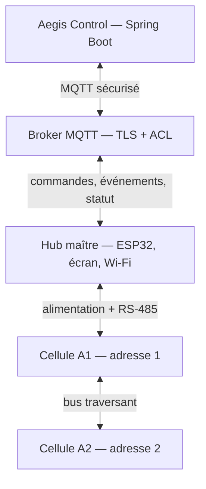
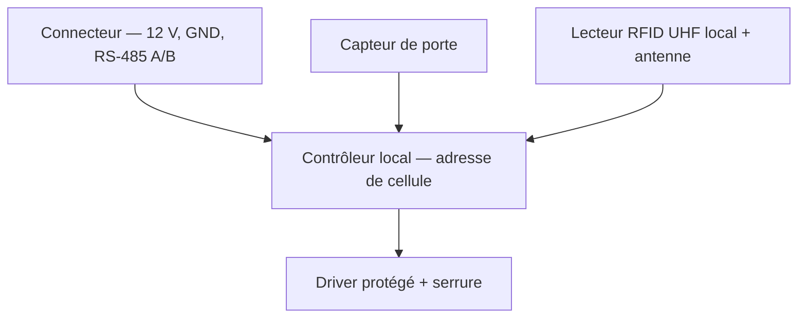
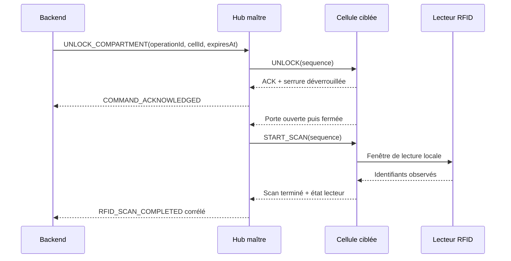
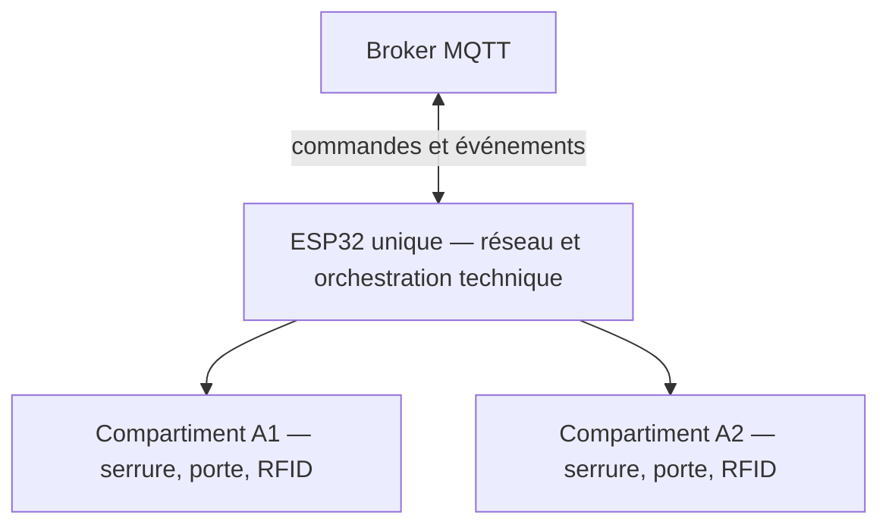

# Aegis — Blueprint minimal d’architecture physique

**Cours :** 420-5X7-SO — Écosystème connecté  
**Session :** Automne 2026  
**Équipe :** Philippe Jordan Monfouayi Mba et Yoël Jimmy Razafindretsa  
**Date :** 16 septembre 2026  
**Version :** 0.1 — base de travail pour le POC avec Jimmy  
**Statut :** Proposition; les composants exacts restent à valider expérimentalement

---

## 1. Décision de portée

L’architecture physique ne peut pas être supprimée du cahier de conception : elle est demandée dans le cours et elle porte des risques centraux du P0 — alimentation des serrures, localisation RFID, adressage des cellules, déconnexion et reprise.

En revanche, Aegis n’a pas besoin maintenant d’un plan industriel, d’un PCB final ou d’un dessin mécanique coté. Le livrable minimal attendu est un **blueprint vérifiable** qui fixe :

- les blocs matériels et leurs responsabilités;
- les liaisons d’alimentation et de données;
- les frontières entre backend, hub et cellule;
- les protections électriques minimales;
- les points à mesurer durant les POC;
- le fallback si l’option modulaire n’est pas assez fiable.

---

## 2. Option de référence

**Option A retenue pour le POC :** un hub maître connecté au réseau et une pile de cellules adressables. Une cellule représente exactement un compartiment. Chaque actif possède un tag RFID UHF et la lecture est locale à la cellule.

Le bus est représenté en chaîne physique pour faciliter l’empilage. Logiquement, le hub reste le seul maître et toutes les cellules partagent le même bus multidrop.

---

## 3. Responsabilités matérielles

| Bloc | Contenu minimal | Responsabilité | Interdiction |
|---|---|---|---|
| Backend | Spring Boot et base métier | Autoriser, corréler, confirmer ou refuser l’opération | Ne pilote pas directement une broche ou une serrure |
| Broker | MQTT authentifié, TLS à distance, ACL | Transporter commandes, événements et statut | Ne décide aucune transition métier |
| Hub maître | ESP32, Wi-Fi, écran, watchdog, horloge, transceiver RS-485 | Client MQTT unique; interroger les cellules; relayer les commandes et observations | Ne décide jamais si un utilisateur a le droit d’ouvrir |
| Cellule | Contrôleur local, adresse, transceiver RS-485, driver serrure, capteur de porte, lecteur RFID UHF, indicateur | Exécuter une instruction technique ciblée et rapporter ses mesures | Aucun Wi-Fi, MQTT, rôle ou état métier |
| Actif | Tag RFID UHF unique | Fournir l’identité physique observée | Le tag seul ne prouve ni autorisation ni chaîne de possession |

---

## 4. Intérieur d’une cellule

L’indicateur visuel peut être piloté directement par le contrôleur local et n’est pas représenté afin de garder le schéma lisible.

### 4.1 Proposition d’alimentation

| Élément | Proposition de départ | Raison | À confirmer |
|---|---|---|---|
| Distribution principale | 12 V CC dans le câble commun | Réduit la chute de tension et correspond souvent aux serrures | Tension et courant réels de la serrure choisie |
| Logique cellule | Convertisseur local 12 V → 5 V/3,3 V | Isole la logique de la charge de serrure | Besoin du lecteur RFID et du microcontrôleur |
| Serrure | Rail 12 V commuté par MOSFET | Évite de faire passer le courant dans une sortie logique | Courant d’appel et durée maximale |
| Protection inductive | Diode de roue libre ou protection adaptée au modèle | Protège le driver lors de la coupure | Type exact de serrure |
| Protection bus | Fusible principal et protection par cellule | Limite les conséquences d’un court-circuit | Valeurs après mesure |
| Référence électrique | Masse commune dimensionnée | Nécessaire à l’alimentation et au transceiver | Section et connecteurs |

Le câble unique signifie une seule gaine/connectique entre modules, pas une seule paire électrique. Un prototype raisonnable part d’au moins quatre conducteurs (`+12 V`, `GND`, `A`, `B`), avec deux conducteurs de réserve si le connecteur et le budget le permettent.

---

## 5. Liaison hub-cellules : meilleur compromis P0

### 5.1 Couche physique recommandée

**RS-485 half-duplex multidrop** est le meilleur compromis actuel :

- plusieurs cellules sur un même bus;
- bonne tolérance au bruit par rapport à une liaison logique directe;
- adressage explicite;
- câblage et composants abordables;
- bibliothèques disponibles sur microcontrôleurs;
- déconnexion et reprise observables par le hub.

Règles électriques initiales :

- paire torsadée pour `A/B`;
- terminaison seulement aux deux extrémités physiques du bus;
- polarisation fail-safe à un seul endroit, normalement au hub;
- topologie principale en bus, sans longues branches;
- connecteur empêchant autant que possible l’inversion alimentation/données;
- mesure de tension à la dernière cellule pendant l’actionnement d’une serrure.

### 5.2 Protocole applicatif recommandé

Pour le P0, utiliser un protocole **maître/interrogé à trames courtes avec CRC**, inspiré de Modbus RTU :

| Champ | Fonction |
|---|---|
| `address` | Identifie la cellule; `1` et `2` pour le prototype |
| `sequence` | Déduplique et corrèle localement la requête/réponse |
| `type` | `PING`, `GET_STATE`, `UNLOCK`, `START_SCAN`, `STOP_SCAN`, `RESET_FAULT` |
| `length` | Longueur du payload |
| `payload` | Paramètres ou mesures techniques |
| `crc` | Détecte une trame corrompue |

Le hub conserve la relation entre `sequence` local et `operationId` métier. La cellule n’a pas besoin de connaître l’utilisateur, la réservation, le prêt ni le UUID complet de l’opération.

**Compromis :** Modbus RTU complet apporte un standard et des outils, mais son modèle de registres est moins naturel pour les scans RFID. Un petit protocole encadré est plus direct, au prix d’exiger des tests de framing, CRC, timeout et reprise. L’équipe doit valider ce choix dans l’ADR matériel après le POC initial.

---

## 6. Séquence physique d’un retrait

Le backend confirme le retrait seulement après la fermeture de porte et une fenêtre RFID saine ne contenant plus le tag attendu. Une absence de message n’est jamais une preuve d’absence.

---

## 7. Comportement sûr

| Situation | Comportement minimal attendu |
|---|---|
| Perte MQTT | Le hub ne crée aucune autorisation locale; une commande déjà expirée est rejetée. |
| Perte RS-485 | La cellule est déclarée indisponible; aucune nouvelle ouverture n’est tentée. |
| Redémarrage du hub | Sorties de serrure inactives; reconnexion, annonce `ONLINE`, nouvel état technique; aucune opération présumée réussie. |
| Redémarrage d’une cellule | Serrure inactive; état `UNKNOWN` jusqu’au nouvel inventaire de porte/RFID. |
| Porte laissée ouverte | Événement et timeout; l’opération ne peut pas être confirmée. |
| Lecteur RFID en panne | Observation `UNKNOWN`; ni retrait ni retour confirmé automatiquement. |
| Commande dupliquée | Même séquence/commande = réponse rejouée, sans nouvelle impulsion de serrure. |
| Court-circuit cellule | Protection locale ou principale; autres éléments ne doivent pas être détruits. |

Les serrures doivent être configurées de manière à revenir dans l’état mécanique jugé sûr après perte d’alimentation. Le choix fail-safe/fail-secure dépend du modèle acheté et doit être explicitement validé avec l’enseignant.

---

## 8. Points de mesure du POC

### 8.1 RFID UHF local

1. Mesurer le taux de détection du bon tag dans chaque cellule.
2. Répéter selon plusieurs orientations et positions de l’actif.
3. Mesurer les lectures de la cellule voisine et d’un tag hors locker.
4. Mesurer la durée nécessaire pour obtenir trois lectures cohérentes.
5. Répéter porte ouverte, porte fermée et pendant un retrait/retour.
6. Consigner faux positifs, faux négatifs et état du lecteur.

### 8.2 Bus, puissance et modularité

1. Adresser séparément les cellules `1` et `2`.
2. Envoyer 100 cycles `PING/STATE` sans trame mal attribuée.
3. Actionner chaque serrure et mesurer courant d’appel et tension au hub/à la dernière cellule.
4. Débrancher/rebrancher une cellule et mesurer le délai de détection/reprise.
5. Redémarrer le hub et une cellule pendant une opération simulée.
6. Vérifier qu’un doublon `UNLOCK` n’actionne pas deux fois la serrure.
7. Calculer le coût réel contre le budget total de 500 $ CA.

### 8.3 Porte de décision

La décision doit être prise au plus tard à la fin de la semaine 6 :

- **conserver Option A** si les deux cellules sont adressées de manière répétable, si la tension reste suffisante pendant l’actionnement, si la lecture RFID est localisable et si le coût/calendrier restent acceptables;
- **déclencher le fallback** si un de ces risques menace le parcours P0 ou le gel fonctionnel de la semaine 12.

Les seuils numériques finaux doivent être écrits dans le rapport de POC avant les essais afin d’éviter de déplacer les critères après coup.

---

## 9. Fallback monolithique

Le fallback retire le bus et les contrôleurs de cellule, mais ne change pas :

- les contrats REST;
- les topics et enveloppes MQTT;
- l’autorité du backend;
- les états métier;
- l’exigence de preuve physique;
- l’identification logique `A1` et `A2`.

Cette stabilité empêche le risque matériel de forcer une réécriture du cœur logiciel.

---

## 10. Livrables que Jimmy peut préciser

À partir de ce blueprint, l’architecture physique finale peut ajouter :

- le schéma électrique avec références et valeurs exactes;
- le modèle de serrure, de lecteur/antenne RFID, de transceiver et de contrôleur local;
- le brochage des connecteurs et la section des conducteurs;
- le plan mécanique et la façon d’empiler/verrouiller les cellules;
- le budget quantifié;
- les résultats mesurés des deux POC;
- la décision finale dans les ADR correspondants.

Ces précisions complètent le blueprint; elles ne doivent pas modifier silencieusement les frontières d’autorité ou les contrats déjà définis.
