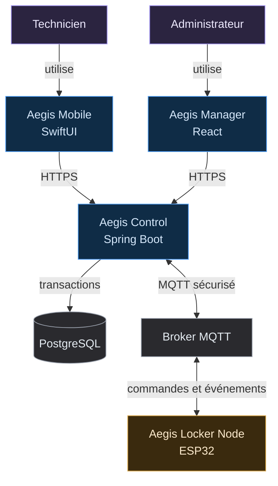
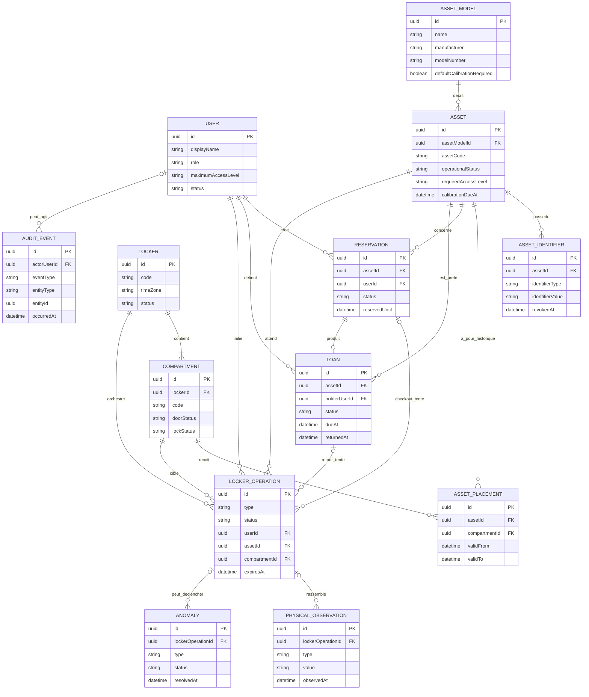
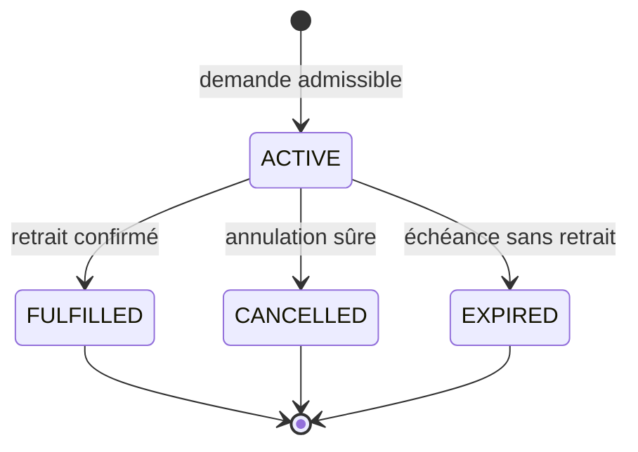
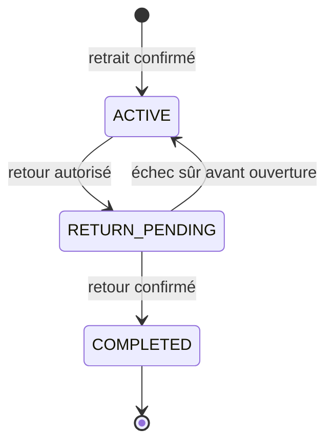
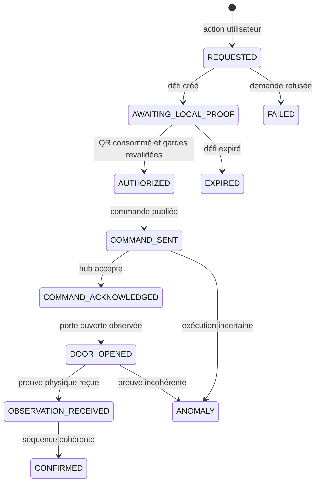
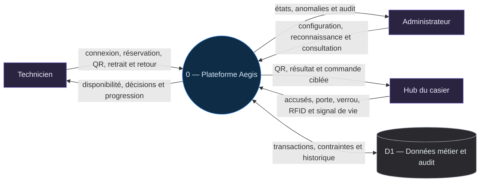
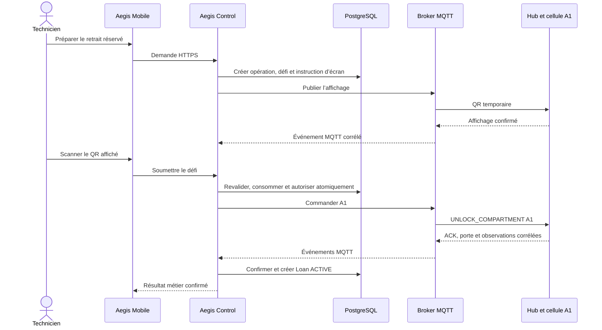
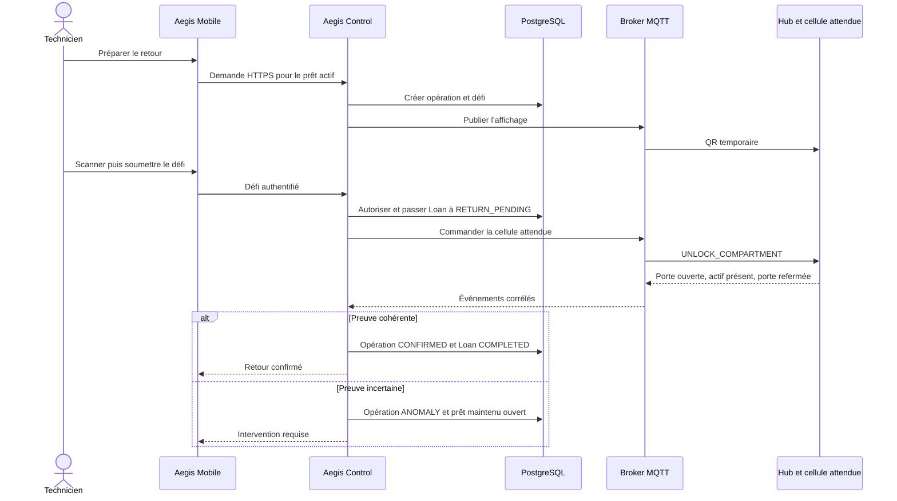

# Identification

**Tableau 1 — Identification du projet et de l’équipe.**

| Élément | Information |
|---|---|
| Projet | Aegis — plateforme de disponibilité opérationnelle et de chaîne de possession |
| Cours | 420-5X7-SO — Écosystème connecté |
| Session | Automne 2026 |
| Établissement | Cégep de Sorel-Tracy |
| Équipe | Philippe Jordan Monfouayi Mba et Yoël Jimmy Razafindretsa |
| Enseignants | Alexandre Vovan, Jean-Philippe Hébert et Jordan Rioux-Leclair |
| Date du document | 23 septembre 2026 |
| Statut | Conception du P0; choix matériels à confirmer après les POC |

> **Statut du document.** Ce cahier synthétise la conception du P0 avant le
> développement. Les décisions acceptées sont distinguées des propositions et
> des résultats encore attendus. Aucun POC non réalisé n’est présenté comme
> concluant.

# 1. Résumé du projet

Aegis est un prototype de **plateforme de disponibilité opérationnelle et de
chaîne de possession pour des équipements critiques partagés**. Il relie une
application iOS, une administration Web, un service central Spring Boot,
PostgreSQL, un courtier MQTT et un casier connecté composé d’un concentrateur
avec écran et de deux cellules
indépendantes.

Le système ne cherche pas seulement à indiquer où se trouve un équipement. Il
doit déterminer si cet équipement est réellement prêt, conforme, disponible et
autorisé pour une personne donnée au moment de la demande. La réponse du service
central est une **disponibilité opérationnelle** (*readiness*) explicite :
`READY`, `BLOCKED` ou `UNKNOWN`, accompagnée d’une raison compréhensible.

Le P0 démontre un parcours complet et traçable : configuration d’un actif,
évaluation de sa disponibilité opérationnelle, réservation, contrôle local par
QR, ouverture du bon
compartiment, confirmation physique du retrait, création du prêt, retour et fin
de la chaîne de possession. Les actions sensibles sont auditables et résistent
aux doublons, aux expirations et aux événements désordonnés.

Le laboratoire du Cégep sert de terrain de validation. Le marché de référence
est celui des petites et moyennes équipes de maintenance, d’inspection et de
services techniques qui partagent des appareils coûteux, spécialisés ou soumis
à des règles de calibration.

# 2. Problématique et contexte

Un inventaire classique peut déclarer un outil disponible alors qu’il est
emprunté, absent de son compartiment, endommagé, non calibré ou inaccessible au
technicien qui le demande. L’écart entre l’état informatique et la réalité
physique crée plusieurs risques : déplacement inutile, intervention retardée,
utilisation d’un appareil non conforme et perte de traçabilité sur le dernier
détenteur.

Aegis aborde ce problème par trois distinctions fondamentales :

1. la présence physique n’est pas la disponibilité opérationnelle;
2. une intention utilisateur n’est pas une preuve de mouvement;
3. une réservation n’est pas un prêt.

Le service central combine donc les faits connus sur l’actif, l’utilisateur, la
calibration, l’état opérationnel, les réservations, les prêts et le casier. Il
autorise une opération seulement si les gardes applicables sont satisfaites. Il
ne confirme ensuite le retrait ou le retour qu’à partir d’observations physiques
cohérentes et corrélées à cette opération.

Le projet s’inscrit dans le cours Écosystème connecté, qui exige l’intégration de
l’Internet des objets, d’une application mobile et d’une application Web ou d’un
service. Le cahier prépare le prototype fonctionnel qui sera développé et
présenté au cours de la session.

# 3. Objectifs et limites du P0

## 3.1 Objectifs obligatoires

Le P0 doit permettre de :

- gérer des comptes de démonstration pour les techniciens et administrateurs;
- configurer deux actifs et leur affectation aux cellules A1 et A2;
- calculer la disponibilité opérationnelle selon la présence, la disponibilité, l’état, la
  calibration et le niveau d’accès;
- réserver un actif admissible dans une plage d’exploitation valide;
- exiger un QR temporaire affiché localement avant chaque ouverture métier;
- cibler uniquement le compartiment attendu;
- créer un prêt après un retrait physiquement confirmé;
- terminer un prêt après un retour physiquement confirmé;
- traiter les expirations, doublons, pertes de connexion et incohérences;
- fournir une piste d’audit permettant de reconstruire chaque opération;
- fonctionner avec un simulateur IoT afin de ne pas bloquer le logiciel sur les
  POC matériels;
- être lancé et démontré à partir d’une procédure reproductible.

## 3.2 Invariants structurants

- La disponibilité opérationnelle est calculée; elle n’est jamais modifiée comme un simple booléen.
- Un actif possède au plus une réservation active et un prêt actif.
- Un technicien possède au plus une réservation active.
- Une réservation ou un QR ne commande jamais seul une ouverture.
- Un ACK du hub ne prouve ni un retrait ni un retour.
- Une commande ou un événement dupliqué ne produit pas un second effet métier.
- Une opération expirée, consommée ou destinée à une autre cellule est refusée.
- Un prêt en retard garde l’actif indisponible.
- Le retour d’un actif emprunté reste possible même si cet actif n’est plus
  `READY` pour un nouvel emprunt.
- Une anomalie n’est résolue qu’avec une preuve corrective cohérente.

## 3.3 Limites assumées

Le P0 couvre un casier, deux cellules, deux actifs principaux et quelques
comptes préparés. Il ne prétend pas démontrer une fiabilité industrielle, une
disponibilité 24/7 ou un gain financier mesuré chez un client réel.

L’autorisation métier hors ligne, Android, AI Vision, le multi-site, les
intégrations ERP/CMMS, les analyses prédictives, les réservations récurrentes et
une garantie anti-relais du QR sont hors périmètre. Ces limites protègent le parcours
central et la date de livraison.

# 4. Scénario de démonstration

## 4.1 Préparation

Deux équipements comparables sont configurés :

**Tableau 2 — Conditions initiales du scénario de démonstration.**

| Actif | Situation initiale | Résultat attendu |
|---|---|---|
| A1 | Présent, disponible, fonctionnel, calibré et accessible | `READY` |
| A2 | Présent et disponible, mais calibration expirée | `BLOCKED` avec `CALIBRATION_EXPIRED` |

Un administrateur prépare les actifs, les tags, les cellules, l’horaire et les
comptes. Le hub est en ligne, l’écran fonctionne et les deux cellules sont
fermées.

## 4.2 Démonstration nominale

1. Le technicien se connecte à Aegis Mobile.
2. Il voit A1 prêt et A2 bloqué avec une raison explicite.
3. Il réserve A1 jusqu’à une heure permise par l’horaire.
4. Il prépare le retrait; aucune serrure ne s’ouvre à cette étape.
5. Le hub affiche un QR temporaire propre à l’opération.
6. Le technicien scanne le QR avec l’iPhone.
7. Le service central revalide les droits et consomme le défi une seule fois.
8. Une commande MQTT cible uniquement la cellule A1.
9. Le hub accuse la commande, ouvre A1 et remonte les observations de porte et
   d’actif.
10. Après une séquence cohérente, le service central confirme le retrait et crée le prêt.
11. Le technicien exécute un nouveau parcours local pour le retour.
12. La présence de l’actif attendu et la fermeture de porte terminent le prêt.

## 4.3 Refus et robustesse démontrés

La présentation inclut au minimum :

- le refus de réserver A2 en raison de sa calibration;
- le refus d’un QR expiré, rejoué ou soumis par un autre compte;
- l’absence de double effet lors de la rediffusion d’un message MQTT;
- le ciblage exclusif de A1 ou A2;
- une anomalie ou une perte de connexion visible et auditable;
- le maintien de l’indisponibilité d’un actif dont le prêt est en retard.

L’objectif final de répétabilité est de réussir **10 retraits et 10 retours
consécutifs**, sans modification manuelle de PostgreSQL et sans double traitement
causé par un rejeu.

# 5. Utilisateurs et principaux parcours

**Tableau 3 — Acteurs et parcours couverts par le P0.**

| Acteur | Besoin principal | Parcours P0 |
|---|---|---|
| Technicien | Obtenir rapidement un équipement prêt et autorisé | Connexion, consultation, réservation, scan QR, retrait, suivi du prêt et retour |
| Administrateur | Maintenir les données fiables et traiter les situations anormales | Catalogue, calibration, placements, horaires, supervision, audit et reconnaissance d’anomalie |
| Aegis Control | Appliquer une interprétation unique des règles | Disponibilité opérationnelle, autorisation, transactions, corrélation, audit et publication des commandes |
| Casier connecté | Exécuter une commande limitée et produire des observations | Affichage, ciblage de cellule, serrure, porte, RFID, signal de vie et erreurs |

## 5.1 Parcours du technicien

Le mobile présente l’état fourni par le service central, mais ne décide jamais qu’un
actif est prêt. Une réservation peut être effectuée à distance; l’ouverture exige
ensuite la preuve locale. Pendant une opération, l’application consulte l’état de
`LockerOperation` et affiche la décision serveur plutôt qu’un succès anticipé.

## 5.2 Parcours de l’administrateur

L’administration Web prépare le catalogue, les règles de calibration, les
affectations physiques et les horaires. Elle permet d’observer les casiers, les
prêts, les anomalies et l’audit. Un administrateur peut reconnaître une anomalie
et documenter son intervention, mais ne peut pas la marquer arbitrairement comme
résolue.

## 5.3 Aperçu des interfaces


**Figure 1 — Maquettes fonctionnelles du P0.** L’application iOS privilégie
l’action immédiate du technicien : comprendre pourquoi un actif est disponible
ou bloqué, réserver, scanner puis suivre l’opération. L’administration Web
privilégie la densité utile : état des casiers, anomalies, prêts et actions de
configuration. La couleur n’est jamais l’unique porteur d’information; chaque
statut comporte un libellé et un symbole. Ces maquettes fixent la hiérarchie et
les états essentiels, pas la finition graphique définitive.

# 6. Architecture globale et frontières de confiance



**Figure 2 — Architecture logique du P0.** Le service central Spring Boot est l’unique
autorité métier. Les interfaces et le casier transmettent des intentions ou des
faits; ils ne confirment pas seuls une transition métier.

## 6.1 Responsabilités

**Tableau 4 — Responsabilités et limites de confiance des composantes.**

| Composante | Responsabilité | Limite de confiance |
|---|---|---|
| Aegis Mobile | Authentification, consultation, réservation, scan et suivi | Aucun accès direct à MQTT, PostgreSQL ou au casier |
| Aegis Manager | Configuration et supervision | Aucun contournement des autorisations serveur |
| Aegis Control | Décisions métier, transactions, contrats et audit | Ne transforme pas une intention en fait physique |
| PostgreSQL | Contraintes, atomicité, historique, déduplication et boîte d’envoi transactionnelle | Ne décide pas qu’un mouvement a eu lieu |
| Broker MQTT | Authentification, ACL et transport | Ne transforme pas les messages et n’accorde aucun droit |
| Hub ESP32 | Affichage, contrôles techniques, ciblage et acquisition | N’évalue ni l’utilisateur ni la disponibilité opérationnelle |
| Cellule | Actionnement et observation locale | Aucun réseau IP, MQTT ou droit métier |

## 6.2 Frontières et flux interdits

Les frontières principales sont le réseau HTTPS des clients, l’entrée de l’API,
la connexion privée à PostgreSQL, le courtier MQTT et la liaison physique entre le
hub et chaque cellule.

Les flux suivants sont interdits :

- iOS ou React vers PostgreSQL;
- iOS ou React vers MQTT ou une serrure;
- hub ou cellule vers PostgreSQL;
- cellule vers Internet;
- création d’une commande avant la validation du contrôle local;
- confirmation d’un prêt à partir d’un ACK ou d’un simple délai;
- exposition du secret du QR dans une réponse REST, une trace ou une vue Web.

# 7. Modèle de données et machines à états essentielles

## 7.1 Vue logique avec attributs essentiels



**Figure 3 — Relations et attributs métier essentiels.** Le diagramme rend le
cahier autonome pour comprendre les identifiants, états et échéances qui portent
le parcours. Les types SQL, contraintes et attributs techniques complets sont
précisés dans le modèle PostgreSQL détaillé.

Le modèle sépare notamment :

- l’actif physique (`Asset`) de sa catégorie (`AssetModel`);
- l’emplacement attendu (`AssetPlacement`) de la présence observée;
- la réservation (`Reservation`) de la possession réelle (`Loan`);
- l’opération orchestrée (`LockerOperation`) des faits physiques reçus;
- l’anomalie active (`Anomaly`) de l’historique immuable (`AuditEvent`).

## 7.2 Reservation



**Figure 4 — Cycle de vie d’une réservation.** Une réservation demeure une
intention exclusive; elle ne devient accomplie qu’avec le retrait confirmé.

Une réservation active ne devient `FULFILLED` que dans la transaction qui crée
le prêt. Elle n’expire pas pendant une opération de retrait déjà autorisée ou
physiquement incertaine.

## 7.3 Loan



**Figure 5 — Cycle de vie d’un prêt.** L’état `RETURN_PENDING` protège la chaîne
de possession pendant une restitution en cours ou physiquement incertaine.

Le dépassement de `dueAt` ne modifie pas le statut. Il produit une information
de retard, tandis que l’actif demeure `BORROWED` jusqu’à un retour confirmé.

## 7.4 LockerOperation



**Figure 6 — Chemin principal d’une opération de casier.** Les sorties anormales
complètes sont résumées au tableau 5.

Le diagramme montre le chemin nominal et les sorties anormales les plus
représentatives. Toute étape non terminale peut être interrompue selon les règles
suivantes :

**Tableau 5 — Sorties anormales d’une opération de casier.**

| Situation | État terminal | Condition de sûreté |
|---|---|---|
| Refus métier avant une commande | `FAILED` | Aucune ouverture n’a pu se produire |
| Défi local arrivé à échéance | `EXPIRED` | Aucune commande de serrure n’a été créée |
| Délai après commande, porte certainement fermée | `EXPIRED` | Le casier est joignable et confirme l’absence d’exécution |
| Appareil hors ligne ou résultat physique incertain | `ANOMALY` | Une ouverture a pu se produire ou la preuve est incomplète |
| Mauvais actif ou porte non refermée | `ANOMALY` | Une intervention et une nouvelle preuve sont nécessaires |

`CONFIRMED`, `FAILED`, `EXPIRED` et `ANOMALY` sont terminaux pour une opération.
Une nouvelle tentative crée un nouvel identifiant; elle ne réactive jamais une
ancienne opération.

## 7.5 Anomaly

Une anomalie peut passer de `OPEN` à `ACKNOWLEDGED` lorsque l’administrateur en
prend connaissance. Elle passe de `OPEN` **ou** de `ACKNOWLEDGED` à `RESOLVED`
seulement lorsqu’une observation corrective cohérente est disponible : la
reconnaissance n’est donc pas une étape obligatoire avant la résolution. Une
récidive crée une nouvelle anomalie. L’historique précédent n’est ni rouvert ni
supprimé.

# 8. Flux de données et parcours retrait/retour

## 8.1 Diagramme de flux de données de niveau 0



**Figure 7 — DFD-0 du P0.** Tous les échanges métier passent par Aegis Control.
Les interfaces humaines et le hub ne communiquent jamais directement avec le
magasin de données et ne s’accordent aucune transition métier.

## 8.2 Données échangées

**Tableau 6 — Canaux, données et protections.**

| Canal | Flux principal | Protections attendues |
|---|---|---|
| HTTPS | Intentions, lectures métier et scan QR entre clients et API | Authentification, autorisation, validation DTO, idempotence et erreurs stables |
| PostgreSQL | État métier, contraintes, audit, déduplication et boîte d’envoi transactionnelle | Accès privé, transactions, contraintes uniques et migrations Flyway |
| MQTT | Affichage, commandes, ACK, observations, signal de vie et erreurs | TLS, identité par appareil, ACL, QoS adapté, expiration et `messageId` |
| RS-485 local | Commandes et observations entre le hub et une cellule | Segment dédié, ciblage, contrôle d’intégrité et paramètres issus du POC |
| Optique | QR temporaire affiché par le hub et lu par l’iPhone | Secret éphémère, usage unique, liaison à l’opération et à l’initiateur |

## 8.3 Retrait



**Figure 8 — Séquence de retrait.** Le courtier transporte les commandes et les
observations; PostgreSQL porte la décision durable et la déduplication.

Le QR et l’accusé de commande sont des étapes nécessaires, mais insuffisantes.
Le prêt est créé avec la confirmation de l’actif attendu, dans la bonne cellule,
après la séquence de porte requise.

## 8.4 Retour



**Figure 9 — Séquence de retour.** Le prêt n’est terminé que lorsque les
événements corrélés prouvent le retour de l’actif attendu et la fermeture.

Un actif endommagé ou non calibré peut être retourné. Après la restitution, sa
non-conformité continue toutefois de bloquer un nouvel emprunt.

## 8.5 Contrats de service essentiels

Le contrat REST utilise le préfixe `/api/v1`. Les mutations sensibles exigent
une clé `Idempotency-Key`; les erreurs suivent `application/problem+json` avec un
code métier stable. Les routes suivantes suffisent à comprendre le parcours sans
consulter le catalogue complet :

**Tableau 7 — Routes REST essentielles au scénario.**

| Intention | Route principale | Autorisation et résultat |
|---|---|---|
| Ouvrir une session | `POST /auth/login` | Compte préparé; retourne un jeton expirant |
| Consulter les actifs | `GET /assets` | Technicien; disponibilité contextualisée |
| Réserver | `POST /reservations` | Technicien; crée une réservation `ACTIVE` ou refuse |
| Préparer le retrait | `POST /reservations/{id}/checkout` | Titulaire; crée une opération en attente de preuve locale |
| Autoriser localement | `POST /locker-operations/{id}/authorize-local` | Initiateur; consomme le défi QR et retourne `202` |
| Suivre une opération | `GET /locker-operations/{id}` | Initiateur; état serveur jusqu’au terminal |
| Préparer le retour | `POST /loans/{id}/return` | Titulaire; crée une opération de retour |
| Superviser les anomalies | `GET /admin/anomalies` et `POST /admin/anomalies/{id}/acknowledge` | Administrateur; lecture et reconnaissance seulement |

Le rail MQTT est versionné sous `aegis/v1/lockers/{lockerId}`. QoS 1 autorise
des doublons : le service central et le micrologiciel dédupliquent avec
`messageId`, `operationId`, l’expiration et l’état courant.

**Tableau 8 — Sujets MQTT du P0.**

| Suffixe du sujet | Sens | QoS / rétention |
|---|---|---|
| `/commands` | `UNLOCK_COMPARTMENT` du service central vers le hub | 1 / non retenu |
| `/events` | Accusés, porte, verrou, RFID et erreurs du hub | 1 / non retenu |
| `/display` | Défi QR et résultat temporaire vers l’écran | 1 / non retenu |
| `/status` | Signal de vie, `ONLINE` et Last Will `OFFLINE` | 0 pour le signal de vie; 1 et retenu pour la disponibilité |

Exemple abrégé d’une commande après consommation valide du défi QR :

```json
{
  "schemaVersion": "1.0",
  "messageId": "55c71961-21a3-4b2e-8b92-7f237e881a20",
  "type": "UNLOCK_COMPARTMENT",
  "operationId": "2f38d3b6-c18f-4a74-aa9a-2d574286013f",
  "lockerId": "d46a74ae-39dc-460b-8af0-38fc791b376a",
  "compartmentId": "1ae77ae3-8490-4f09-9412-a7816b77bff9",
  "issuedAt": "2026-09-16T14:31:00Z",
  "expiresAt": "2026-09-16T14:33:00Z"
}
```

Chaque hub possède une identité et des listes de contrôle d’accès limitées à son
propre casier. TLS est obligatoire pour le hub réel. Un acquittement MQTT ou une
confirmation d’affichage ne constitue jamais une preuve de retrait ou de retour.

# 9. Architecture physique du prototype

## 9.1 Forme du prototype


**Figure 10 — Prototype P0.** Le concentrateur porte l’écran, le calcul et la connexion
réseau. Chaque cellule correspond à un compartiment complet et ne possède ni
écran ni client MQTT.

## 9.2 Topologie retenue


**Figure 11 — Étoile à deux départs indépendants.** ADR-002 accepte deux ports,
deux câbles et deux segments RS-485 indépendants. Le brochage, les protections,
le protocole local et le budget de puissance restent soumis au POC.

## 9.3 Composition d’une cellule


**Figure 12 — Responsabilités locales.** Le M12 codé A à 5 contacts est la
recommandation actuelle pour la revue d’équipe. Il n’est pas accepté tant que la
référence, le courant, le câble, le brochage et les protections ne sont pas
validés. Le RJ45 propriétaire demeure une option initiale de repli économique,
avec un risque de confusion Ethernet/PoE à maîtriser.

# 10. Choix technologiques et ADR importants

## 10.1 Technologies

Les technologies ne sont pas justifiées par préférence. Pour chaque décision,
l’équipe part du besoin observable du P0, relève les contraintes qui empêchent
une solution plus simple, compare les options, puis fixe une preuve capable de
réfuter le choix. Les termes « retenu » et « proposé » conservent ici le statut
des ADR : une solution proposée doit encore réussir son arbitrage ou son POC.

**Tableau 9 — Besoins, alternatives et solutions techniques.**

| Besoin à satisfaire | Contraintes du P0 | Options examinées et limites | Solution retenue ou proposée | Preuve attendue |
|---|---|---|---|---|
| Guider le technicien lors d’une opération physique et lire le QR du hub | L’équipement de démonstration est un iPhone; Android est hors P0; le jeton doit être protégé; caméra, taille dynamique et accessibilité doivent rester cohérentes | Une PWA donne moins de maîtrise sur l’expérience caméra et le stockage sécurisé. Flutter ajoute une couche multiplateforme sans deuxième plateforme à livrer | **Swift et SwiftUI**, base technique du client iOS | Scan sur l’iPhone réel, refus de caméra géré, jeton dans Keychain, états lisibles avec taille de texte agrandie |
| Administrer un catalogue et superviser les anomalies depuis un poste courant | Parcours denses, clavier, navigateur et accessibilité Web; aucune connexion directe à PostgreSQL ou MQTT | Une application de bureau ajoute une plateforme de déploiement. Des vues servies par Spring coupleraient davantage l’interface à l’autorité métier | **React et TypeScript**, base technique du client Web | Parcours réalisables au clavier, focus visible, erreurs nommées et accès uniquement par l’API |
| Appliquer une seule décision métier aux clients et au casier | Réservation, prêt, autorisation, audit et idempotence doivent rester cohérents et transactionnels; équipe de deux personnes | Des règles dans iOS, React ou le firmware seraient contournables et divergentes. Des microservices ajouteraient des pannes et déploiements distribués sans besoin de charge démontré | **Spring Boot en monolithe modulaire**, retenu par l’ADR-001 | Un client contourné reste refusé par le serveur; les gardes et transitions sont testées atomiquement |
| Conserver contraintes, historique et concurrence sans perte silencieuse | Une seule réservation et un seul prêt actifs par actif; migrations reproductibles; historique non destructif | Une base embarquée ne joue pas correctement le rôle d’autorité centrale concurrente. Un stockage documentaire demanderait de reconstruire les contraintes relationnelles | **PostgreSQL avec Flyway** | Migrations sur base vierge et existante, contraintes d’unicité et test de concurrence sur deux réservations |
| Échanger commandes, événements et disponibilité avec un hub qui peut se déconnecter | Communication bidirectionnelle, reconnexion, messages tardifs, doublons et identité propre au hub; le téléphone n’est jamais le canal d’ouverture | BLE relierait l’ouverture au téléphone proche, avec permissions et portée variables, et contournerait le rail backend–hub. LoRa n’est pas requis à l’échelle du laboratoire et ne remplace pas le chemin IP vers l’autorité. HTTP direct rend les événements descendants et la disponibilité moins naturels | **Wi-Fi pour l’accès réseau et MQTT pour le rail IoT**, paramètres encore proposés par l’ADR-004 | ACL et TLS, Last Will, reconnexion, message expiré et rediffusion QoS 1 sans second effet |
| Relier le hub aux deux cellules en transportant données et alimentation sur un câble dédié | Un départ direct par cellule, environnement câblé, diagnostic A1/A2 et absence de radio ou d’autorité dans une cellule | BLE ou Wi-Fi imposeraient radio, configuration et alimentation dans chaque cellule sans transporter la puissance. I²C ou UART logique sont plus sensibles hors carte. Une étoile RS-485 passive avec A/B réunis crée un seul bus et ne fournit pas l’isolation attendue | **Deux segments RS-485 point à point indépendants**, topologie retenue par l’ADR-002; connectique et protection proposées | A1 n’actionne jamais A2; mesures d’erreurs, chute de tension, déconnexion et reprise sur chaque départ |
| Contrôler l’écran, le réseau et les E/S sans système d’exploitation généraliste | Démarrage rapide, sorties sûres, Wi-Fi, ressources graphiques et coût énergétique limité | Un Raspberry Pi ajoute système, stockage, temps de démarrage et entretien sans besoin Linux. Un microcontrôleur sans Wi-Fi ou sans capacité d’affichage demanderait des modules supplémentaires | **ESP32**, référence exacte conditionnée aux broches et aux essais | Sorties inactives au démarrage, QR affiché, deux liaisons locales disponibles et reconnexion réseau maîtrisée |
| Prouver la présence du technicien devant le hub avant l’ouverture | Un code distant ou réutilisable ne suffit pas; le hub ne décide jamais du droit; aucun canal téléphone–serrure | Un QR statique est rejouable. BLE de proximité reste relayable et ajoute appairage et permissions. NFC exigerait un lecteur supplémentaire sur le hub et un geste de très courte portée | **Défi QR éphémère, lié à l’opération et à usage unique**, principe P0; paramètres proposés par l’ADR-009 | Mauvais utilisateur, expiration et rejeu refusés; lecture mesurée sur l’écran et l’iPhone réels |
| Identifier automatiquement l’actif observé dans la bonne cellule | L’utilisateur ne doit pas pouvoir confirmer librement la présence; la cellule voisine et un tag extérieur ne doivent pas être confondus avec la cible | QR ou NFC sur l’actif exigent une lecture manuelle. Un tag BLE exige pile et gestion radio. Un lecteur UHF global identifie des tags, mais localise mal le compartiment | **RFID UHF local par cellule à éprouver**, proposé par l’ADR-003; repli QR/NFC d’identité avec mesure de présence | POC avec orientations, matériaux, cellule voisine, tag extérieur, faux positifs, faux négatifs et seuils fixés avant l’essai |
| Reproduire l’environnement sur les deux postes et le jour de la démonstration | PostgreSQL, courtier et service doivent démarrer avec des versions et secrets contrôlés | Les installations manuelles dérivent entre postes et rendent le diagnostic de la démonstration dépendant de la machine | **Docker Compose** pour les services de développement et de démonstration | Démarrage documenté depuis un poste préparé, migrations appliquées et vérifications de santé réussies |
| Faire évoluer ensemble les contrats et leurs consommateurs | Les tranches traversent API, Web, iOS, firmware, tests et documentation; petite équipe | Des dépôts séparés multiplient les versions de contrat, les dépendances entre revues et les changements synchronisés | **Monorepo Git**, retenu par l’ADR-010 | Un changement transversal reste révisable dans un même historique avec tests et documentation associés |

## 10.2 Décisions acceptées

**Tableau 10 — Décisions d’architecture acceptées.**

| ADR | Décision | Conséquence principale |
|---|---|---|
| ADR-001 | Spring Boot est l’unique autorité métier | Les clients et le casier n’accordent aucun droit |
| ADR-002 | Hub et deux cellules en étoile avec segments RS-485 indépendants | Un port et un câble par cellule; réalisation électrique à qualifier |
| ADR-008 | Réservation et durée réelle de possession sont distinctes | Un retard ne termine pas un prêt et ne libère pas l’actif |
| ADR-010 | Monorepo pour le P0 | Les changements transversaux restent révisables dans un même historique |

## 10.3 Propositions à arbitrer ou mesurer

Les choix suivants forment une base recommandée, mais leur statut reste
`PROPOSED` jusqu’à une validation explicite de Philippe et Jimmy. Cette
distinction permet de démarrer le squelette technique sans faire passer une
hypothèse pour une décision d’équipe.

**Tableau 11 — Base recommandée pour les ADR encore proposés.**

| ADR | Base recommandée | Preuve ou décision exigée avant de figer |
|---|---|---|
| ADR-003 | RFID UHF local par cellule | POC de localisation, seuils, référence, coût et repli |
| ADR-004 | MQTT 3.1.1, QoS 1 critique, identité par hub, TLS et ACL | Essais de doublon, reconnexion, Last Will et refus d’accès |
| ADR-005 | Boîte d’envoi transactionnelle et traitement idempotent | Test de panne entre validation SQL et publication MQTT |
| ADR-006 | Interrogation REST environ chaque seconde pendant une opération | Mesure de latence et arrêt propre en état terminal |
| ADR-007 | Jeton signé de 60 minutes, sans renouvellement au P0 | Choix d’équipe sur jeton ou session, puis tests d’autorisation |
| ADR-009 | Défi QR aléatoire, lié à l’opération, à usage unique et valide au plus 60 secondes | Essai écran–iPhone et validation commune des paramètres |

Le contrôle local par QR appartient déjà au P0; seuls sa réalisation et ses
paramètres demeurent proposés. Aucun de ces arbitrages ne doit produire une
variante différente dans iOS, le Web, le service central ou le micrologiciel.

# 11. Sécurité, fiabilité et gestion des anomalies

## 11.1 Défense en profondeur

- Le service central vérifie l’identité, le rôle, la propriété et les gardes métier.
- HTTPS protège les échanges des clients; TLS protège le hub réel sur MQTT.
- Chaque appareil possède une identité MQTT et des ACL limitées à son casier.
- Les secrets ne sont jamais versionnés ni retournés par les API.
- Le QR est éphémère, lié à une opération et consommé atomiquement.
- Le firmware refuse une mauvaise cible, une commande expirée ou déjà exécutée.
- Les sorties de serrure restent inactives au démarrage.
- Le circuit de commande et les protections électriques empêchent de piloter directement le
  verrou depuis un GPIO.

Le QR réduit l’utilisation d’un code ancien, mais ne garantit pas qu’une photo
ou une vidéo ne soit jamais relayée. Cette limite est assumée pour le P0.

## 11.2 Idempotence et cohérence

Les appels sensibles utilisent une clé d’idempotence. Les messages IoT portent
un `messageId`, une cible, une opération et une expiration. PostgreSQL impose les
unicités finales, tandis que le service central effectue la transition dans la même
transaction que la déduplication et l’audit.

MQTT QoS 1 permet une rediffusion. Le système ne suppose donc jamais une
livraison « exactement une fois ». La stratégie proposée de boîte d’envoi
transactionnelle doit couvrir les interruptions entre la validation SQL et la
publication MQTT.

## 11.3 Gestion d’une réalité incertaine

Une panne avant toute possibilité d’ouverture peut terminer l’opération en
`FAILED` ou `EXPIRED`. Si une commande a pu être exécutée, si la porte s’est
ouverte ou si l’appareil disparaît pendant l’opération, le résultat devient
`ANOMALY`. Le système conserve alors le prêt ou la réservation dans un état
protecteur plutôt que d’inventer un succès.

L’administrateur peut reconnaître le problème. La résolution exige cependant
une observation cohérente : actif attendu présent ou absent selon le parcours,
porte refermée et nouvelle opération si nécessaire.

## 11.4 Déploiement de développement et de démonstration

Le déploiement P0 vise une démonstration reproductible, pas une exploitation
publique. Un ordinateur de l’équipe exécute PostgreSQL, le courtier MQTT et
Aegis Control dans Docker Compose. Aegis Manager est servi localement; l’iPhone
et le hub rejoignent les services par une adresse réseau documentée. Les secrets
réels proviennent de variables locales non versionnées et les migrations Flyway
s’exécutent au démarrage contrôlé du service central.

Le Wi-Fi du Cégep constitue un risque à valider : un réseau WPA2-Enterprise peut
demander une configuration de certificat au hub et l’isolation des clients peut
empêcher les échanges directs nécessaires à la démonstration. Avant de dépendre
de ce réseau, l’équipe doit vérifier avec le personnel autorisé que l’ESP32 peut
s’y authentifier et atteindre le courtier. Le repli est un réseau de laboratoire
ou un routeur de voyage autorisé par le Cégep, préconfiguré et testé; un partage
de connexion improvisé le jour de la démonstration n’est pas le plan principal.

La procédure de démonstration précisera les versions, les commandes de démarrage,
les comptes préparés, l’adresse des services, la remise à zéro des données de
démonstration et la vérification de santé. Aucune dépendance à un service
infonuagique non testé n’est introduite sur le chemin critique.

## 11.5 Stratégie de vérification

**Tableau 12 — Niveaux de vérification et preuves attendues.**

| Niveau | Cible | Preuves attendues |
|---|---|---|
| Unitaire | Calcul de disponibilité, gardes et transitions | Cas nominal, limites, refus et états terminaux |
| Base de données | Contraintes, migrations et concurrence | Deux réservations simultanées, unicités actives et reprise Flyway |
| Contrat REST | Autorisation, idempotence et erreurs | Mauvais rôle, autre titulaire, clé rejouée et réponse stable |
| Contrat MQTT | ACL, expiration, doublons et reconnexion | Mauvaise cible refusée, rediffusion sans second effet et Last Will |
| Micrologiciel | Sorties sûres, ciblage et redémarrage | A1 n’actionne jamais A2; sortie inactive après coupure |
| Interface | États d’attente, erreur et accessibilité | Texte avec statut, focus visible, taille dynamique et reprise réseau |
| Intégration | Retrait et retour complets | Simulateur d’abord, puis matériel réel sans modification manuelle de la base |
| Acceptation | Scénario de cours | 10 retraits et 10 retours consécutifs, refus et anomalie consignés |

Un contrôle n’est déclaré réussi qu’avec la commande, le résultat et
l’environnement consignés. Une compilation seule ne prouve ni l’autorisation,
ni la cohérence transactionnelle, ni le mouvement physique.

# 12. POC matériels et critères de validation

**Tableau 13 — POC matériels, critères de décision et replis.**

| POC | Mesures ou essais | Critère de décision | Repli prévu |
|---|---|---|---|
| RFID local | Orientations, matériaux, voisin, tag extérieur, répétitions, faux positifs/négatifs, délai | Changement attendu identifié de manière répétable dans la bonne cellule, selon des seuils fixés avant l’essai | QR/NFC d’identité + porte + présence ou poids |
| Verrou rotatif | Courant, durée d’impulsion, ouverture, échauffement et repos sans tension | Actionnement répétable dans les limites de la fiche et sans commande GPIO directe | Changer le verrou ou son circuit de commande avant intégration |
| Alimentation et connecteur | Courant par cellule, chute de tension, contacts, polarité, court-circuit et protection par départ | Deux cellules alimentées sans surcharge; un défaut ne crée pas d’action sur l’autre | Simplifier la réalisation et réviser la connectique |
| RS-485 et ciblage | A1/A2, erreurs, délais, déconnexion, reprise, doublon et redémarrage | A1 n’actionne jamais A2; reprise sans ancienne impulsion | Un ESP32 pilote directement les deux compartiments |
| Écran et QR | Contraste, taille, éclairage, angle, expiration, effacement et caméra iPhone | QR lisible sur le matériel réel et inutilisable après expiration ou redémarrage | Changer l’écran ou sa disposition; aucun contournement du contrôle local |
| Nomenclature complète | Deux cellules, écran, RFID, câbles, interfaces, alimentation, protections, mécanique, taxes et livraison | Chaque fonction possède une quantité et un coût; les provisions sont identifiées; l’inventaire et les paniers réels remplacent les hypothèses avant achat | Ajuster les références ou l’architecture seulement après comparaison des POC, du matériel fourni, du coût et du délai |

## 12.1 Estimation avant sélection

La nomenclature candidate complète, conservée dans
`docs/research/nomenclature-materielle-candidate.md` et datée du 23 septembre
2026, couvre le hub, les deux cellules, les tags, les pilotes de serrure, les
protections, la conversion de tension, le câblage interne et la mécanique. Elle
totalise **714,02 $ CA avant taxes et livraison** : 622,02 $ de lignes sourcées
et 92,00 $ de provisions encore à remplacer. Avec les taxes québécoises
indicatives, le total avant livraison est de **820,94 $**. Une provision de
40,00 $ pour la livraison porte l’enveloppe de planification à **860,94 $**.

Ces montants sont une vue de travail, pas un devis ni une limite d’acceptation.
Le repère initial de 500 $ était une estimation préliminaire. Il permet de voir
l’écart entre l’intuition de départ et une liste plus complète, mais il ne décide
pas à lui seul de l’architecture. Le coût d’achat baissera si le laboratoire
fournit des pièces; il changera aussi après la sélection des références réelles.

Les deux lecteurs UHF candidats représentent 225,72 $ et annoncent une portée de
1,5 à 2 m. Le point à démontrer n’est pas seulement leur prix : il faut surtout
prouver qu’ils distinguent la bonne cellule de sa voisine. Le loquet candidat
n’est pas non plus le verrou rotatif décrit initialement. Sa mécanique, son
courant, son échauffement et son accès de secours doivent être comparés sur le
banc d’essai.

Avant tout achat, Philippe et Jimmy inventorieront le matériel disponible,
remplaceront chaque provision par une référence, exécuteront les POC qui peuvent
changer l’architecture, puis consolideront les paniers avec taxes et livraisons
réelles. Un repli sera retenu s’il répond mieux au besoin technique, au délai et
aux ressources disponibles — pas automatiquement parce qu’un total franchit
500 $.

## 12.2 Bancs d’essai et preuves


**Figure 13 — Banc de caractérisation du verrou.** Le schéma illustre la méthode;
les valeurs finales proviendront de la fiche du composant et des mesures réelles.

Chaque rapport de POC consignera la date, les références, le montage, les
conditions, le nombre de répétitions, les données brutes, les échecs et la
décision. Un essai non effectué restera indiqué « non mesuré ».

# 13. Organisation de l’équipe et plan de réalisation

## 13.1 Répartition

**Tableau 14 — Responsabilités principales et revues croisées.**

| Domaine | Responsable principal | Revue ou collaboration |
|---|----------------------|---|
| Backend, contrats, PostgreSQL et simulateur | Philippe             | Revue de Jimmy sur l’intégration physique |
| Administration Web et application iOS | Philippe             | Validation des parcours par les deux membres |
| Mécanique, composants, câblage et mesures | Jimmy                | Revue de Philippe sur les événements produits |
| Pilotes serrure, porte, RFID et liaison locale | Jimmy                | Interfaces firmware définies ensemble |
| MQTT, affichage logique et corrélation | Équipe               | Essais sur le hub avec Jimmy |
| Intégration, ciblage A1/A2 et démonstration | Équipe               | Exécution et explication par les deux membres |

La responsabilité principale indique qui prépare le travail, pas une zone que
l’autre membre peut ignorer. Philippe prend principalement le service central,
PostgreSQL, le Web, iOS et le simulateur. Jimmy prend principalement la
mécanique, le câblage et les pilotes matériels. Les contrats REST/MQTT,
l’intégration, les POC, les revues et la démonstration sont expliqués et validés
par les deux membres.

La capacité garantie est de **18 heures-personnes par semaine** : 7 heures de
cours communes pour deux personnes, soit 14 heures-personnes, auxquelles Philippe
ajoute 4 heures hors cours. Aucun temps supplémentaire de Jimmy n’est présumé.
Sur les semaines 4 à 14, cette base représente 198 heures-personnes; la semaine
15 ajoute 18 heures-personnes de présentation et de contingence. Cette capacité
est une limite de planification, pas une obligation de remplir toutes les heures.

## 13.2 Macro-itérations

**Tableau 15 — Objectifs des macro-itérations.**

| Période | Objectif | Porte de sortie |
|---|---|---|
| Semaines 4 à 7 | Réduire les risques et rendre un actif prêt/réservable | Environnement reproductible, POC décidés, A1 `READY`, A2 bloqué |
| Semaines 8 à 11 | Livrer la chaîne de possession complète | Réservation, retrait et retour de bout en bout |
| Semaines 12 à 15 | Geler, durcir, mesurer et présenter | Refus, anomalies, sécurité, 10 + 10 répétitions et démo maîtrisée |

Le travail avance par tranches verticales. Le maximum de travail en cours est de deux récits utilisateur,
une par personne. Chaque cycle se termine par une intégration, des tests, une
mini-démonstration et une entrée de journal. Les semaines 13 et 14 servent à la
stabilisation, pas à l’ajout tardif d’une fonctionnalité P1.

# 14. Risques, replis et éléments hors périmètre

## 14.1 Registre synthétique des risques

**Tableau 16 — Risques, signaux d’alerte et replis.**

| Risque | Signal d’alerte | Réduction ou repli |
|---|---|---|
| RFID mal localisé | Lectures voisines ou résultats instables | POC borné dans le temps, seuils préalables, repli QR/NFC + présence |
| Alimentation ou bus trop complexe | Surchauffe, chute de tension, commandes croisées | Protection par port; repli vers un contrôleur direct à deux compartiments |
| Écran ou caméra non compatible | QR illisible sur l’iPhone de démonstration | Essai anticipé du matériel réel; changement d’écran ou de disposition |
| Wi-Fi du Cégep incompatible avec le hub | WPA2-Enterprise, certificat ou isolation des clients | Validation avec le personnel autorisé; réseau de laboratoire ou routeur autorisé testé d’avance |
| Courbe d’apprentissage Spring et sécurité | Squelette exécutable ou autorisation en retard | Monolithe modulaire, tranches courtes, tests ciblés et usage du simulateur |
| Accès limité aux Macs | Compilation iOS non vérifiée hors cours | Réserver les séances à la compilation, à la caméra et aux tests sur appareil |
| Intégration tardive logiciel–matériel | Contrats ou événements encore instables en semaine 10 | Simulateur fidèle dès le départ et contrats versionnés avant intégration |
| Absence ou capacité réduite | Stories bloquées par une seule personne | Documentation continue, branches courtes, revue croisée et réduction de la finition |
| Écart entre l’estimation et le coût d’achat | Prix et stocks variables, provisions à remplacer, taxes, livraisons et matériel du laboratoire encore inconnus | Nomenclature complète versionnée, inventaire, POC RFID et paniers consolidés avant commande |
| Croissance du périmètre | Travail P1 alors qu’un jalon P0 manque | Porte de changement, gel semaine 12 et réduction de la finition non essentielle |

## 14.2 Replis approuvés en principe

- Si le RFID UHF ne localise pas suffisamment, utiliser une identification
  QR/NFC de l’actif avec porte et présence ou poids.
- Si l’étoile à contrôleurs locaux compromet la livraison, utiliser un ESP32 qui
  pilote directement deux compartiments en conservant A1/A2 et les contrats.
- Si un service matériel n’est pas disponible, poursuivre les parcours avec le
  simulateur sans présenter celui-ci comme une preuve de fonctionnement réel.

Tout déclenchement de repli matériel important produit un ADR de remplacement.

## 14.3 Éléments explicitement hors périmètre

- AI Vision, reconnaissance d’image et recommandations intelligentes;
- application Android;
- multi-site, ERP, CMMS et API publique d’intégration;
- notifications avancées, statistiques prédictives et maintenance complète;
- autorisation métier autonome lorsque le service central est indisponible;
- interface tactile complète sur le hub;
- industrialisation, certification et déploiement client réel;
- garantie absolue contre le relais visuel du QR.

# 15. Conclusion

Aegis propose une réponse cohérente à un problème qui dépasse l’inventaire :
savoir si un équipement critique est réellement prêt pour une personne et
maintenir une chaîne de possession vérifiable lorsqu’il quitte son compartiment.

La conception repose sur une autorité métier unique, des états explicites, des
contrats idempotents et une séparation stricte entre intentions numériques et
preuves physiques. Le prototype reste volontairement limité à deux cellules,
mais ses identifiants et frontières permettent d’envisager une extension sans
compromettre le P0.

La prochaine étape consiste à valider ce cahier en équipe, terminer les POC les
plus risqués, puis construire le produit par tranches verticales. La réussite ne
sera pas mesurée par le nombre de fonctionnalités, mais par la capacité des deux
membres à expliquer et répéter un retrait et un retour fiables, sécurisés et
traçables.

# Annexes

## Annexe A — Glossaire court

**Tableau 17 — Glossaire du cahier.**

| Terme | Définition |
|---|---|
| Disponibilité opérationnelle (*readiness*) | Décision contextuelle indiquant si un actif est prêt pour un utilisateur |
| Chaîne de possession | Historique vérifiable de la responsabilité d’un actif |
| Concentrateur (*hub*) | Contrôleur central avec écran, réseau et ports de cellules |
| Cellule | Compartiment physique indépendant relié au hub |
| Défi local | Secret QR temporaire requis avant une ouverture métier |
| Observation physique | Fait normalisé provenant de la porte, du verrou ou de l’identification d’actif |
| Idempotence | Propriété empêchant un doublon de produire un second effet |
| ADR | Trace d’une décision d’architecture, de ses alternatives et conséquences |
| POC | Expérience bornée qui produit une mesure avant un choix matériel |
| P0 | Périmètre obligatoire nécessaire à la démonstration évaluée |
| ACK | Accusé technique de réception ou d’acceptation; jamais une preuve de mouvement |
| ACL | Liste de contrôle limitant les sujets MQTT accessibles à une identité |
| QoS | Niveau de service de livraison MQTT; le niveau 1 peut produire des doublons |
| TLS | Chiffrement et authentification du canal réseau |
| RS-485 | Couche électrique différentielle utilisée entre le hub et une cellule |
| Boîte d’envoi (*outbox*) | Registre transactionnel des messages à publier après une décision SQL |
| DTO | Représentation validée utilisée à la frontière d’une API |

## Annexe B — Traçabilité documentaire

**Tableau 18 — Correspondance entre le cahier et ses sources normatives.**

| Sujet du cahier | Sources de référence |
|---|---|
| Périmètre, objectifs et acceptation | Document 02 — `docs/cahier-conception/02-scope.md` |
| Vocabulaire et modèle | Documents 03 et 04 — dictionnaire et modèle logique |
| États et algorithmes | Documents 05 et 06 — machines à états et flux fonctionnels |
| Flux et confiance | Document 07 — flux de données |
| PostgreSQL | Document 08 — modèle physique PostgreSQL |
| REST et MQTT | Documents 09 et 10 — contrats détaillés |
| Parcours et récits utilisateur | Document 11 — carte des récits du P0 |
| Matériel et POC | Document 12 et `docs/research/nomenclature-materielle-candidate.md` |
| Décisions | Document 13 et les ADR acceptés dans `docs/adr/` |
| Planification | Document 14 — semaines 4 à 15 |

## Annexe C — Références

- Vovan, Alexandre; Hébert, Jean-Philippe; Rioux-Leclair, Jordan. *Plan d’étude —
  420-5X7-SO Écosystème connecté*. Cégep de Sorel-Tracy, automne 2026.
- Équipe Aegis. [*Dépôt de travail et documents normatifs*](https://github.com/PhilJordan18/aegis),
  révision consultée le 23 septembre 2026. L’accès dépend des droits accordés au
  correcteur.
- Texas Instruments. [*The RS-485 Design Guide*](https://www.ti.com/lit/an/slla272d/slla272d.pdf),
  consulté le 23 septembre 2026.
- OWASP Foundation. [*Transaction Authorization Cheat Sheet*](https://cheatsheetseries.owasp.org/cheatsheets/Transaction_Authorization_Cheat_Sheet.html),
  consulté le 23 septembre 2026.
- Internet Engineering Task Force. [RFC 8628, section 5.4](https://www.rfc-editor.org/rfc/rfc8628.html#section-5.4),
  consulté le 23 septembre 2026.
- TE Connectivity. [Connecteurs M12 à montage sur circuit imprimé](https://www.te.com/en/product-CAT-M1-B8722.html),
  consulté le 23 septembre 2026.
- Apple. [*Human Interface Guidelines*](https://developer.apple.com/design/human-interface-guidelines/),
  consulté le 23 septembre 2026.
- W3C. [*Web Content Accessibility Guidelines 2.2*](https://www.w3.org/TR/WCAG22/),
  consulté le 23 septembre 2026.

## Annexe D — Assistance par intelligence artificielle

Claude Code et Codex ont contribué à la recherche, à la structuration, à la
révision linguistique, à l’analyse de cohérence et à la production de diagrammes
et de maquettes. Claude Opus a été utilisé comme contre-relecteur du présent
cahier; ses remarques ont été vérifiées contre le scope, les ADR, les contrats et
le plan d’étude avant intégration. Aucune mesure matérielle ni réussite de test
n’a été inventée.

Philippe et Jimmy demeurent responsables des décisions, des sources, des
mesures, de la validation du contenu et de leur capacité à expliquer chaque
partie du projet. Les interventions matérielles et les changements significatifs
assistés par IA sont consignés dans le journal de bord. Le format final de
déclaration et les logos exigés seront alignés sur les consignes écrites propres
à l’activité dès qu’elles seront confirmées par les enseignants.
