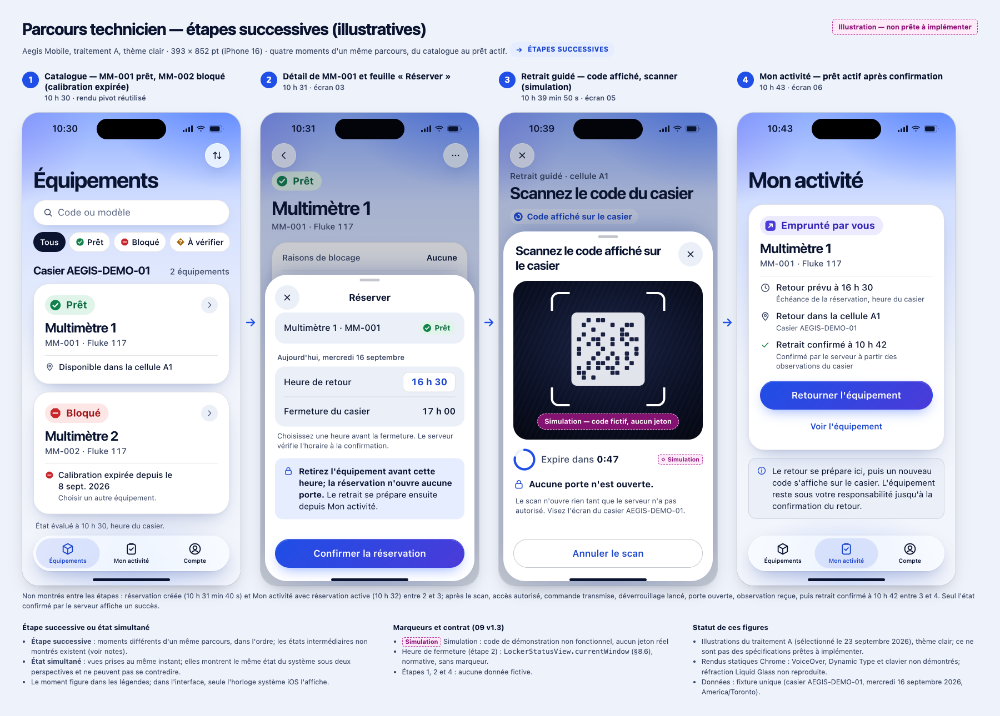
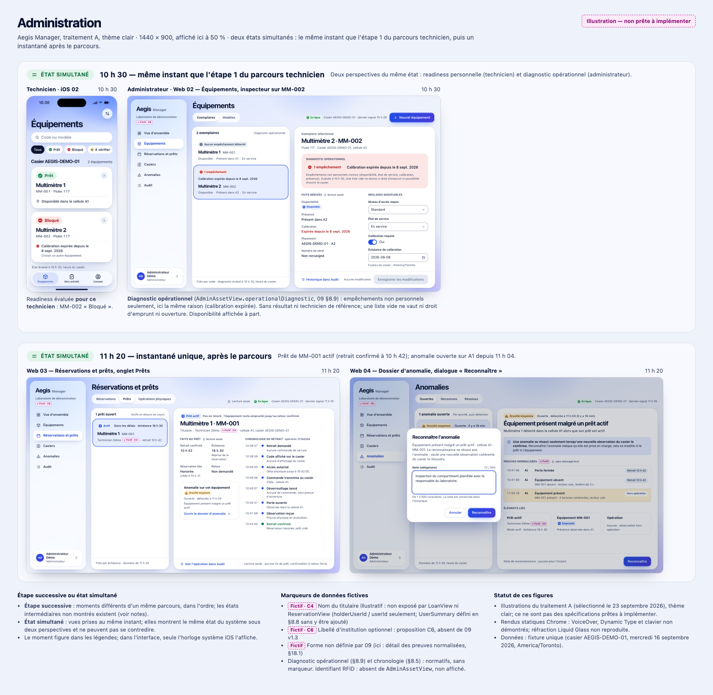

# Aegis — jeu d'illustrations pour le cahier de conception

Mode : Prototype. Date : 23 septembre 2026 (alignement sur `09` v1.3). Texte
prêt à coller dans le cahier. Les chemins des figures sont relatifs à ce
fichier; depuis `docs/cahier-conception/`, préfixez-les par
`../design/asset-lifecycle/`.

## Sélection

Le 23 septembre 2026, après la comparaison visuelle de deux traitements de
l'identité bleu–indigo, Philippe a retenu le **traitement A — Verre
lumineux** pour l'application iOS et pour la console Web. La décision est
consignée dans `sections.md` et `direction-validee.md`.

Ce qu'elle tranche, pour les écrans comparés :

- **H1 :** le statut précède l'identité; il ouvre la carte sur iOS et la
  rangée de la liste Web.
- **H2 :** la gestion des équipements Web suit une composition « liste
  maîtresse et dossier large ». Les figures appliquent ce modèle aux prêts
  et aux anomalies à titre d'illustration; les autres sections gardent les
  hypothèses de `sections.md` §5.

Le traitement B (« Opérationnel précis ») et les rendus sombres restent comme
**comparaison historique** dans `prototype/compare.html`; ce n'est pas un
choix ouvert. Les tokens définitifs et la police Web ne sont pas validés par
ce choix.

## Contrat : trois niveaux

1. **Besoins approuvés le 23 septembre 2026 :** P1, C1 à C8 et §7.1
   (`sections.md` §9), en tant que besoins.
2. **Champs devenus normatifs dans `09` v1.3 :**
   - P1 : actifs `RESTRICTED` visibles avec `ACCESS_DENIED` (§11.1);
   - C1 : `AdminAssetView.operationalDiagnostic {evaluatedAt, reasons}`
     (§8.9, §12.2), qui porte des raisons non personnelles, sans résultat,
     sans technicien de référence et jamais `ACCESS_DENIED`;
   - C2 : `LockerStatusView.currentWindow {timeZone, open, closesAt,
     nextOpensAt}` (§8.6);
   - C3 : `currentOperationId` (§8.3–8.4, §15.4);
   - C4 en partie : `AssetSummary {id, assetCode, model, placement}` et
     `UserSummary {id, displayName}` (§8.8). `AnomalyView.acknowledgedBy` est
     un `UserSummary`.
3. **Propositions restantes, non normatives :**
   - le nom du titulaire dans `LoanView` et `ReservationView`, qui ne portent
     que `holderUserId` / `userId`;
   - C5 (notes et `resolutionNote`), C6 (libellé d'institution), C7
     (pagination des listes §17), C8 (motifs d'échec);
   - la forme détaillée des preuves d'anomalie.

**Reprise (C3) :**

- `currentOperationId` est une référence de suivi calculée. Pour une
  réservation `ACTIVE`, elle désigne la dernière tentative de retrait; pour
  un prêt `ACTIVE` ou `RETURN_PENDING`, la dernière tentative de retour.
- Elle peut désigner une tentative **terminale** tant que le parent reste
  ouvert, pour expliquer un échec ou une anomalie.
- Une tentative non terminale est prioritaire. La référence vaut `null` sans
  tentative ou quand le parent est clos.
- `returnOperationId` désigne seulement le retour confirmé.
- Reprendre signifie relire, jamais redéclencher (§15.4).

## Figures

Les **captures individuelles** sont les figures à utiliser dans le document.
Les deux planches ci-dessous sont des aperçus de lecture; voir « Mise en page
PDF ».

**Figure A — Parcours technicien, étapes successives (illustratives).**

Quatre moments successifs d'un même parcours sur Aegis Mobile :

1. **10 h 30** — catalogue : MM-001 est prêt, MM-002 est bloqué
   (calibration expirée).
2. **10 h 31** — détail de MM-001 et feuille « Réserver ». La fermeture à
   17 h 00 vient de `currentWindow`.
3. **10 h 39** — retrait guidé : code affiché sur le casier, scanner en
   simulation, aucune porte ouverte.
4. **10 h 43** — prêt actif après la confirmation du serveur (10 h 42).

Les états intermédiaires existent mais ne sont pas montrés : réservation
active, puis autorisation, commande, déverrouillage lancé, porte ouverte et
observation.

**Figure B — Administration, états simultanés.**

Deux états simultanés sur Aegis Manager :

1. **10 h 30, même instant que l'étape 1 de la figure A.** Le même état est
   vu sous deux perspectives :
   - la readiness évaluée pour le technicien : MM-002 « Bloqué »;
   - le diagnostic opérationnel administrateur (§8.9) : les mêmes
     empêchements non personnels (calibration expirée), sans résultat ni
     valeur d'autorisation.
2. **11 h 20, instantané unique après le parcours.** Réservations et prêts
   (prêt actif, chronologie du retrait) et dossier de l'anomalie ouverte,
   avec le dialogue « Reconnaître ».

*Légende :*

- **Étape successive :** moments différents d'un même parcours, dans
  l'ordre.
- **État simultané :** vues prises au même instant, qui montrent le même
  état du système sous deux perspectives et ne peuvent pas se contredire.

## Écrans

| Écran | Moment | Rôle dans le jeu | Contrats et références |
|---|---|---|---|
| iOS 02 Catalogue (pivot) | 10 h 30 | Readiness personnelle, état bloqué avec raison actionnable | `GET /assets` (`09` §11.1, §8.1–8.2); `sections.md` §4.1, §1.2–1.3 |
| iOS 03 Détail + « Réserver » | 10 h 31 | Heure de retour 16 h 30, fermeture 17 h 00; la réservation n'ouvre aucune porte | `GET /assets/{id}` (§11.2), `currentWindow` (§8.6, §16.1), `POST /reservations` (§14.1); U8 |
| iOS 05 Retrait guidé + scanner | 10 h 39 min 50 s | Code affiché, « Expire dans 0:47 » (60 s depuis la création), « Aucune porte n'est ouverte »; scanner en simulation | §15.1, §15.4, §15.5; `sections.md` §1.4, §6 |
| iOS 06 Mon activité — prêt actif | 10 h 43 | « Emprunté par vous », retour prévu à 16 h 30, « Retourner l'équipement » | `GET /me/loan` (§15.3), `POST /loans/{id}/return` (§15.2); `dueAt` = `reservedUntil` (`03` §4.13) |
| Web 02 Équipements + inspecteur (pivot) | 10 h 30 | « Diagnostic opérationnel » dérivé de `reasons`, faits dérivés en lecture seule, réglages modifiables | `GET /admin/assets[/{id}]` → `AdminAssetView` (§8.9, §12.2); C6 |
| Web 03 Réservations et prêts — Prêts | 11 h 20 | Prêt actif, chronologie du retrait (« Déverrouillage lancé » distinct de « Porte ouverte »), lien vers l'anomalie; aucune action forcée | `GET /admin/loans[/{id}]`, `/admin/locker-operations/{id}` (§17), `LockerOperationView` (§8.5), `GET /admin/anomalies?assetId=` (§18.1); C4 |
| Web 04 Dossier d'anomalie + « Reconnaître » | 11 h 20 | `ASSET_PRESENT_WITH_ACTIVE_LOAN` sur A1 à 11 h 04; preuves normalisées; le prêt reste actif; note obligatoire; la reconnaissance ne clôt ni l'anomalie ni le prêt | §18.1–18.2; `03` §5.11; `05` §6; `06` §12.4; `10` §20; C4 |

Rendus individuels : `prototype/renders/ios/a/light/0{2,3,5,6}-*.png` et
`prototype/renders/web/a/light/0{2,3,4}-*.png`.

## Données fictives et hypothèses

Les données fictives restantes portent à l'écran une étiquette tiretée
magenta. Toutes les valeurs viennent de `prototype/data/fixture.js`, où chaque
champ est étiqueté.

| Marqueur | Donnée | Écrans |
|---|---|---|
| Fictif · C4 | Nom « Technicien Démo » : nom du titulaire non exposé par `LoanView` (`holderUserId` seulement) | Web 03, Web 04 |
| Fictif · C6 | Libellé d'institution « Laboratoire de démonstration » | Web 02, 03, 04 |
| Fictif | Forme détaillée des preuves normalisées, non définie par `09` §18.1 | Web 04 |
| Simulation | Viseur et code du scanner : motif décoratif, aucun jeton | iOS 05 |

Sans marqueur, car normatifs :

- le diagnostic opérationnel (§8.9);
- l'heure de fermeture (§8.6);
- la chronologie issue de `LockerOperationView` (§8.5).

L'identifiant RFID n'est pas affiché : il est absent de `AdminAssetView`.

Hypothèses de valeur, sans marqueur à l'écran :

- code `MM-002`, modèle Fluke 117 et échéance du 8 septembre 2026;
- compte « Administrateur Démo »;
- numéro de série non renseigné;
- gravité `MEDIUM` et libellé du résumé de l'anomalie;
- déclenchement de l'anomalie par une lecture RFID hors opération;
- lien entre l'anomalie et le prêt par l'actif (`GET /admin/loans?assetId=`).

## Mise en page PDF

Cette section donne des consignes; aucun PDF n'est produit ici.

- **Figures :** utiliser les captures individuelles. Les planches
  servent d'aperçu seulement.
- **Ne pas réduire les planches sur A4 portrait comme seules illustrations :**
  à 170 mm de large, le texte tomberait à environ 4,6 pt sur la planche iOS
  et 2,6 pt sur la planche Web (estimation de la revue du 23 septembre, pas
  une mesure de PDF).
- **iOS :** deux écrans par rangée au plus, puis vérifier la taille réelle
  du texte.
- **Web :** une vue par page paysage, ou une vue d'ensemble accompagnée
  d'un détail agrandi.
- **Légendes :** les mettre en vrai texte du document, pas seulement dans
  les images.
- **Vérification :** rendre et inspecter le PDF à sa taille de lecture avant
  la remise.

## Limites

- **Rendus statiques :** images Chrome, et non UIKit ou SwiftUI. Le jeu est
  en thème clair seulement; la preuve clair/sombre repose sur les pivots.
- **Non démontré :** VoiceOver, Dynamic Type et navigation clavier réelle.
  L'anneau de focus est dessiné, pas exercé.
- **Liquid Glass :** l'effet de flou est rendu, mais pas la réfraction ni la
  dynamique; les icônes sont des substituts aux SF Symbols.
- **Polices :** SF Pro est rendue localement; elle ne convient qu'à iOS et
  n'est pas licenciée pour une console Web publique. Une police Web reste à
  choisir.
- **Fixture :** `AG.at` fusionne les entités complètes dans chaque
  instantané. Des champs postérieurs au moment peuvent y figurer, mais ne sont
  jamais affichés. Ce ne sont pas des réponses d'API réutilisables en test.
- **Illustrations :** ce ne sont ni une couverture complète ni des
  spécifications prêtes à implémenter.
- **Web 04 :** le dialogue est décalé au-dessus de la liste pour garder les
  preuves lisibles; une implémentation peut le centrer.

## Écrans, états et constats restant à traiter

**iOS**

- Connexion : identifiants refusés, trop d'essais, serveur injoignable.
- Mon activité : réservation active; aucune activité.
- Étapes intermédiaires de l'opération (accès autorisé, commande transmise,
  déverrouillage lancé, porte ouverte, vérification) et ses issues
  `FAILED`, `EXPIRED` et `ANOMALY`, y compris la reprise par
  `currentOperationId` vers une tentative terminale.
- Parcours de retour complet (préparation, scan, retour en cours, retour
  confirmé).
- Erreurs de scan : code non Aegis, autre opération, code refusé, expiré,
  déjà utilisé, invalidé, trop d'essais.
- Caméra refusée.
- Casier hors ligne.
- Session expirée.
- Compte et apparence.
- Mauvais rôle.
- Actif `RESTRICTED` visible avec « Niveau d'accès insuffisant » (§11.1).

**Web**

- Vue d'ensemble.
- Casiers et horaire d'exploitation.
- Audit.
- Modèles.
- Formulaires de création et de modification, erreurs 409.
- Placement.
- États vides, chargement et erreur partielle.
- Casier hors ligne.
- Pagination.
- Variante plus dense de la liste Web A pour un parc plus grand.

**Constat de contrat (observation seulement) :** les identifiants physiques
s'assignent et se révoquent (`09` §12.3), mais aucune route ne les lit et
`AdminAssetView` ne les contient pas. La révocation exige un `identifierId`
que le client ne peut pas obtenir.

**Transverse**

- Tokens définitifs.
- Police Web licenciée.
- Libellé « Aucun empêchement détecté », à valider.
- Propositions restantes à arbitrer : nom du titulaire, C5 à C8, §7.1.
