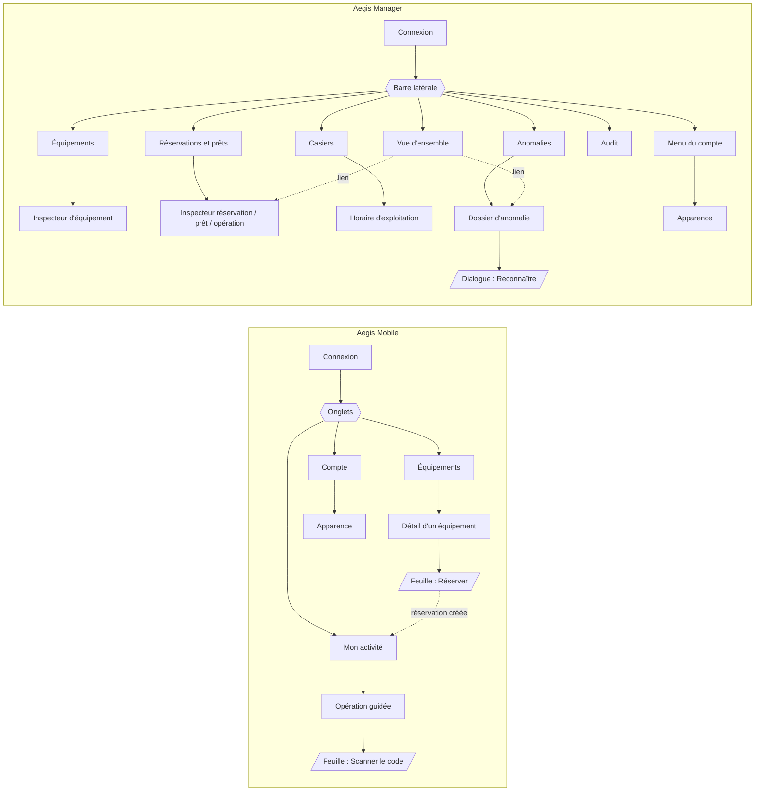
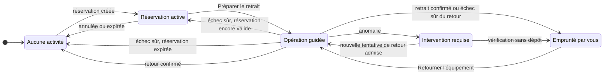

# Aegis — Spécification des sections et des écrans

Mode : Discovery. Date : 23 septembre 2026 (révision 2).

**Statut : approuvé le 23 septembre 2026** (approbation humaine communiquée
par Philippe dans la session de conception) pour :

- la structure et le contenu des sections (§1 à §6);
- les recommandations UX U1 à U8 (§8);
- les recommandations produit : P1 et les besoins exprimés par C1 à C8 et
  par §7.1 (§9).

**Sélection visuelle du 23 septembre 2026 (Philippe) :** traitement A
« Verre lumineux » retenu pour iOS et pour le Web (`prototype/`). H1 et H2
sont tranchées en sa faveur pour les écrans comparés : sur iOS, statut
au-dessus de l'identité; sur le Web (Équipements), liste maîtresse avec
statut en tête et dossier dominant.

**Trois niveaux à ne pas confondre (mise à jour : `09` v1.3) :**

1. **Besoins approuvés le 23 septembre 2026 :** P1, C1 à C8 et §7.1, en tant
   que besoins.
2. **Champs devenus normatifs dans `09` v1.3 :**
   - P1 (§11.1);
   - C1, sous la forme `AdminAssetView.operationalDiagnostic` (§8.9), qui
     diffère de la proposition initiale;
   - C2, `LockerStatusView.currentWindow` (§8.6);
   - C3, `currentOperationId` (§8.3–8.4, §15.4);
   - C4 en partie : `AssetSummary` et `UserSummary` (§8.8) sont définis, mais
     aucun nom n'est ajouté à `LoanView` ou `ReservationView`.
3. **Propositions restantes, non normatives :** le reste de C4 (nom du
   titulaire dans les vues §17), C5 à C8 et §7.1.

**Non approuvés :** les valeurs définitives des jetons, la police Web, le
libellé « Aucun empêchement détecté » (proposition d'affichage du diagnostic
vide) et toute maquette comme spécification prête pour l'implémentation.

## 0. Cadre

**Décisions confirmées (non rediscutées ici) :** une institution par
déploiement P0, comptes préparés partageant le même parc sous autorisation
backend; ni inscription publique, ni choix d'institution, ni approbation par
connexion, ni invitation, ni multi-tenant; iOS : Équipements, Mon activité,
Compte; Web : Vue d'ensemble, Équipements, Réservations et prêts, Casiers,
Anomalies, Audit; thèmes clair et sombre cohérents, sémantique bleu, bleu
profond et indigo, formes arrondies, verre mesuré.

**Hypothèses visuelles :** H1 (place du statut par rapport à l'identité de
l'équipement) et H2 (composition de chaque section Web) sont tranchées en
faveur du traitement A pour le catalogue iOS et la gestion des équipements
Web (voir le statut). Pour les autres sections, les compositions du §5
restent des hypothèses.

**Artefacts antérieurs :** `wireframes/*.svg`, `directions/*.svg` et
`../aegis-parcours-ui.svg` sont **non approuvés et remplacés** par ce
document pour la structure (défauts listés dans `directions.md`, en tête).

**Sources :** `02-scope.md` §8, §9, §11.1, §11.3–11.14; `03` §4.13, §4.18,
§5; `05` §4–6; `06` §4.4; `09` §4–5, §7–19, §22, §25, §27; `10` §10.1;
`15` ch. 5.

Légende : **✔** route existante (§ de `09-contrats-rest.md`); **⚠** contrat
manquant ou ambigu, renvoyé à une décision du §9. Aucune route n'est
inventée.

## 1. Règles de présentation communes

### 1.1 Codes bruts

Les libellés principaux sont en français courant. Les codes (`READY`,
`CALIBRATION_EXPIRED`, `AWAITING_LOCAL_PROOF`…) n'apparaissent qu'en contexte
technique secondaire : détail d'audit Web, info-bulle ou champ « code »
d'une erreur transmise au support. Jamais dans un badge, un titre ou un
bouton, ni sur iOS.

### 1.2 Identité et statut d'un actif (défaut « emprunté affiché Prêt » corrigé)

L'identité de l'équipement (modèle et code, p. ex. « Multimètre 1 ·
MM-001 ») reste toujours proéminente; le statut l'accompagne dans la même
zone de lecture. H1 est tranchée : le statut précède le nom (traitement A).

La readiness est évaluée pour l'utilisateur (`09` §8.1). Un actif emprunté,
en retard ou non, ou réservé par un tiers est `BLOCKED` avec `NOT_AVAILABLE`
(`03` §4.13; `06` §4.4). Règle d'affichage défensive : **si `availability`
vaut `BORROWED`, le statut n'est jamais « Prêt », quelle que soit la valeur
reçue.**

| Données API | Libellé de statut | Ligne secondaire (exemple) |
|---|---|---|
| `READY` · `AVAILABLE` | **Prêt** | Disponible dans la cellule A1 |
| `READY` · `RESERVED`, réservation = `GET /me/reservation` | **Réservé pour vous** | À retirer avant 16 h 30 |
| `BLOCKED` (`NOT_AVAILABLE`) · `RESERVED` | **Déjà réservé** | Indisponible pour le moment |
| `BORROWED`, prêt = `GET /me/loan` | **Emprunté par vous** | Retour prévu à 16 h 30 · *ou* En retard depuis 16 h 30 |
| `BORROWED`, autre titulaire | **Emprunté** | Indisponible jusqu'au retour (aucun détail sur le titulaire) |
| `BLOCKED` · `UNAVAILABLE` | **Indisponible** | Retiré de la circulation par l'administration |
| `BLOCKED`, autre raison | **Bloqué** | Raison principale (§1.3) |
| `UNKNOWN` | **À vérifier** | Présence non confirmée par le casier |

Chaque statut porte aussi un symbole et une forme; jamais la couleur seule.

### 1.3 Raisons de blocage en français (ordre proposé de la raison principale)

| Ordre | Code (secondaire) | Libellé | Suite actionnable (technicien) |
|---:|---|---|---|
| 1 | `NOT_AVAILABLE` | voir §1.2 (Emprunté / Déjà réservé / Indisponible) | Choisir un autre équipement |
| 2 | `NOT_PRESENT` | Absent de sa cellule | Prévenir un administrateur |
| 3 | `DAMAGED` | Endommagé | Prévenir un administrateur |
| 4 | `MAINTENANCE` | En maintenance | Choisir un autre équipement |
| 5 | `CALIBRATION_EXPIRED` | Calibration expirée depuis le 8 sept. 2026 | Choisir un autre équipement |
| 6 | `ACCESS_DENIED` | Niveau d'accès insuffisant | Demander l'accès à un administrateur |
| 7 | `UNKNOWN_PHYSICAL_STATE` | Présence non confirmée | Réessayer plus tard |

Plusieurs raisons : afficher la première, puis « + 1 autre raison »; le
détail les liste toutes (`03` §5.1).

### 1.4 Progression d'une opération physique (défaut « ouvrir à `AUTHORIZED` » corrigé)

La consigne d'ouvrir n'apparaît qu'à partir de `COMMAND_ACKNOWLEDGED`. Cet
accusé garantit seulement que le hub a validé la commande, que la cellule
l'a acceptée et que l'actionnement est lancé ou confirmé techniquement
(`10` §10.1) : il ne prouve ni le déverrouillage effectif, ni l'ouverture.
L'interface ne dit donc jamais « déverrouillée »; seule l'observation
`DOOR_OPENED` confirme une ouverture. Si la porte reste fermée, le backend
termine en `EXPIRED` (casier en ligne, porte certainement restée fermée) ou
en `ANOMALY` (exécution indéterminée) (`05` §5.4).

| État backend | Titre iOS | Consigne |
|---|---|---|
| `REQUESTED` | Demande envoyée | Patientez. |
| `AWAITING_LOCAL_PROOF`, `localProofDisplayedAt` nul | Le code s'affiche sur le casier | Approchez-vous de l'écran du casier. |
| `AWAITING_LOCAL_PROOF`, code affiché | Scannez le code du casier | Expire dans 0:47. Aucune porte n'est ouverte. |
| `AUTHORIZED` | Accès autorisé | Déverrouillage de A1 en préparation. **N'ouvrez pas encore.** |
| `COMMAND_SENT` | Commande transmise au casier | Attendez le signal de la cellule A1. |
| `COMMAND_ACKNOWLEDGED` | Déverrouillage lancé | Ouvrez la porte A1 et retirez le multimètre *(retour : déposez)*. Si elle reste fermée, ne forcez pas et attendez le message suivant. |
| `DOOR_OPENED` | Porte ouverte | Retirez l'équipement, puis refermez la porte. *(retour : déposez)* |
| `OBSERVATION_RECEIVED` | Vérification en cours | Gardez la porte fermée. |
| `CONFIRMED` | Retrait confirmé / Retour confirmé | Seul état qui affiche un succès. |
| `FAILED` | Opération arrêtée sans ouverture | Vous pouvez recommencer. |
| `EXPIRED` | Délai dépassé | Aucune porte n'a été ouverte. Recommencez la préparation. |
| `ANOMALY` | Intervention requise | Ne réessayez pas. Un administrateur doit vérifier la cellule A1. |

Compte à rebours de 120 s affiché dès `AUTHORIZED` (depuis `expiresAt`).
L'écran du casier donne la même consigne localement; le mobile interroge
l'API chaque seconde (`09` §15.4) et peut sauter un état intermédiaire.

## 2. Carte de navigation

Le scan n'est pas une section : il s'ouvre depuis l'opération guidée
lorsque `requiredAction = SCAN_HUB_QR`.

## 3. Entrée — connexion (iOS et Web)

| Élément | Spécification |
|---|---|
| Objectif | Ouvrir une session avec un compte préparé, sans choix d'institution. |
| Point d'entrée | Lancement sans jeton valide; `401 AUTH_TOKEN_EXPIRED` ou `AUTH_TOKEN_INVALID`. |
| Hiérarchie | Marque Aegis → « Connexion » → Adresse courriel → Mot de passe → bouton. Mention : « Compte fourni par votre administrateur. » Pas de libellé d'institution avant connexion (C6). |
| Action principale | **Se connecter** |
| Secondaires | Afficher/masquer le mot de passe. Aucun « Créer un compte », « Mot de passe oublié » ni choix d'institution (`02` §11.1). |
| Reprise | iOS : jeton au Keychain, `GET /auth/me` au lancement, puis Mon activité si une réservation ou un prêt existe. Web : jeton en mémoire, donc reconnexion après rechargement (`09` §4.2). |
| États défavorables | Identifiants refusés : « Adresse courriel ou mot de passe incorrect. » · Trop d'essais : « Trop de tentatives. Réessayez dans une minute. » · Session expirée : « Votre session a expiré. Reconnectez-vous. Vos réservations et prêts sont conservés. » · Serveur injoignable : « Connexion au service impossible. Vérifiez le réseau. » · Mauvais rôle : U6. |
| Contrats | ✔ `POST /auth/login`, `GET /auth/me` (§10.2–10.3); erreurs §21. Déconnexion : suppression locale du jeton, pas de route serveur (§4.2). |

## 4. iOS — Aegis Mobile (technicien)

`TabView` natif à trois onglets; grands titres; le scan et l'opération
guidée sont présentés dans le contexte de Mon activité.

### 4.1 Équipements

| Élément | Spécification |
|---|---|
| Objectif | Trouver un équipement et savoir immédiatement s'il est prêt **pour moi**, sinon pourquoi. |
| Point d'entrée | Onglet par défaut sans activité en cours. |
| Hiérarchie (liste) | Recherche → filtres (Prêt · Bloqué · À vérifier) → cartes : statut, puis identité (modèle, code) → raison principale ou cellule. Heure d'évaluation en pied de liste. |
| Action principale | Ouvrir le détail. |
| Détail | Identité (modèle, code, fabricant) et statut → toutes les raisons → calibration (date, fuseau du casier) → niveau d'accès requis → cellule (`A1`) → bouton **Réserver**, actif seulement si `READY`, sinon désactivé avec la raison. |
| Feuille « Réserver » | Heure de retour (`reservedUntil`), rappel « Retirez l'équipement avant cette heure; la réservation n'ouvre aucune porte. » → **Confirmer la réservation**. La borne supérieure vient de `LockerStatusView.currentWindow.closesAt` (`09` §8.6, affichage seulement : le serveur revalide); un pas de 15 min n'est qu'un confort de saisie (U8). |
| Secondaires | Tirer pour actualiser; tri par code ou modèle. |
| États défavorables | Chargement (squelette natif) · Vide : « Aucun équipement ne correspond. » · Hors ligne/serveur · `403 ASSET_ACCESS_DENIED` : « Votre niveau d'accès ne permet pas cet équipement. » · `422 ASSET_NOT_READY` : raison du moment · `409 ASSET_ALREADY_RESERVED` : « Quelqu'un vient de le réserver. » · `409 USER_ALREADY_HAS_ACTIVE_RESERVATION` : « Vous avez déjà une réservation active. » + lien Mon activité · `422 OUTSIDE_OPERATING_HOURS` : « Le casier est fermé. » · `422 RESERVATION_END_AFTER_CLOSING` : « Choisissez une heure avant la fermeture. » |
| Contrats | ✔ `GET /assets` (q, readiness, availability, tri, §11.1), `GET /assets/{id}` (§11.2), `POST /reservations` (§14.1). ✔ heure de fermeture : `GET /lockers/{id}/status` → `currentWindow {timeZone, open, closesAt, nextOpensAt}` (§8.6, §16.1). ✔ actifs `RESTRICTED` visibles avec `ACCESS_DENIED` (§11.1, P1). |

### 4.2 Mon activité

| Élément | Spécification |
|---|---|
| Objectif | Suivre ma réservation ou mon prêt et réaliser le retrait ou le retour guidé. |
| Point d'entrée | Onglet; ouverture automatique après une réservation créée ou une reconnexion avec activité. |
| Hiérarchie | Une carte d'état unique : équipement (modèle, code) et état dans la même zone → cellule → échéance → action principale. Pas d'historique en P0 (P1). |
| Actions principales | Réservation active : **Préparer le retrait** · Prêt actif : **Retourner l'équipement** · Opération en cours : **Reprendre**, qui relit `currentOperationId` (§8.3–8.4) sans redéclencher d'ouverture (§15.4) |
| Secondaires | Annuler la réservation (confirmation : « Annuler la réservation de Multimètre A1 ? ») · Voir l'équipement. |
| Opération guidée | Vue plein écran, étapes du §1.4, compte à rebours, consigne unique. Pas de bouton « Terminer » : seul `CONFIRMED` conclut. |
| Feuille « Scanner le code » | Voir §6. |
| États défavorables | Aucune activité : « Aucune réservation ni prêt en cours. » + lien Équipements · Réservation expirée : « Votre réservation a expiré à 16 h 30. » · Prêt en retard : « En retard depuis 16 h 30 — rapportez l'équipement. » (l'actif reste emprunté) · `409 RESERVATION_NOT_CANCELLABLE` · `409 LOCKER_OPERATION_IN_PROGRESS` : « Le casier est occupé par une autre opération. » · `503 LOCKER_OFFLINE` : « Le casier est hors ligne. Réessayez plus tard. » · `409 LOAN_NOT_RETURNABLE` · Retour en attente après anomalie : « Retour en attente de vérification. » |
| Contrats | ✔ `GET /me/reservation`, `POST .../cancel`, `POST .../checkout` (§14.2, §14.4, §15.1); `GET /me/loan`, `POST /loans/{id}/return` (§15.2–15.3); `GET /locker-operations/{id}` (§15.4); `GET /lockers/{id}/status` (§16.1). ✔ reprise : `currentOperationId` (§8.3–8.4, §15.4). ⚠ motifs d'échec (C8). |

**Reprise (`09` §8.3–8.4, §15.4) :**

- `currentOperationId` est une référence de suivi calculée, pas un état.
- Pour une réservation `ACTIVE`, elle désigne la dernière tentative de
  retrait. Pour un prêt `ACTIVE` ou `RETURN_PENDING`, elle désigne la
  dernière tentative de retour.
- Elle peut désigner une tentative **terminale** tant que la réservation ou
  le prêt reste ouvert, pour expliquer un échec ou une anomalie.
- Une tentative non terminale est prioritaire. La référence vaut `null` sans
  tentative ou quand la ressource parente est close.
- `returnOperationId` désigne seulement le retour **confirmé**.
- Reprendre signifie relire l'opération, jamais la redéclencher.

La carte du prêt affiche toujours « Emprunté par vous », avec ou sans
retard. L'intervention requise suit `05` §4.6 : le technicien ne relance un
retour que si le backend l'admet.

### 4.3 Compte

| Élément | Spécification |
|---|---|
| Objectif | Vérifier mon identité et mes droits; régler l'apparence; me déconnecter. |
| Hiérarchie | Nom → adresse courriel → libellé d'institution s'il est configuré (C6) → Rôle : « Technicien » → Niveau d'accès : « Standard » ou « Restreint » → **Apparence** → Déconnexion. |
| Apparence | Système (par défaut) · Clair · Sombre. Réglage local, appliqué immédiatement, non synchronisé. |
| Déconnexion | Confirmation : « Vous déconnecter ? Votre réservation et votre prêt restent actifs. » |
| États défavorables | Profil non chargé : valeurs du dernier `login` + « Informations non actualisées ». |
| Contrats | ✔ `GET /auth/me` (§4.4, §10.3). Apparence : préférence client sans contrat. ⚠ libellé d'institution (C6). |

## 5. Web — Aegis Manager (administrateur)

Barre latérale fixe aux six sections; menu du compte en pied de barre;
navigation clavier complète. Équipements suit la composition retenue
(traitement A) : liste maîtresse, statut en tête de rangée, et dossier large
qui porte le détail. Ailleurs, la composition reste une hypothèse (H2) :
liste et dossier pour Réservations et prêts et pour Anomalies (illustrés
dans `jeu-cahier.md`); modules prioritaires pour la Vue d'ensemble; vue du
casier pour Casiers; chronologie pour Audit.

### 5.1 Vue d'ensemble

| Élément | Spécification |
|---|---|
| Objectif | Savoir en moins de dix secondes ce qui exige une intervention. |
| Hiérarchie | 1. Anomalies ouvertes (gravité, cellule, âge) · 2. Prêts en retard · 3. État du casier (en ligne, dernier signal, portes) · 4. Opération en cours · 5. Réservations actives. Aucun graphique ni indicateur décoratif. |
| Actions | Chaque ligne ouvre le dossier correspondant. Aucune action corrective ici. |
| États défavorables | Tout est normal : « Aucune anomalie ouverte. Aucun prêt en retard. » · Casier hors ligne : bandeau persistant « Casier AEGIS-DEMO-01 hors ligne depuis 14 h 32 » · Données périmées : heure de mise à jour visible · Liste incomplète : « Au moins N » et erreur partielle (§7.1) · Erreur partielle : bloc concerné en erreur, les autres restent lisibles. |
| Contrats | ✔ `GET /admin/anomalies?status=OPEN` (§18.1), `GET /admin/loans?status=ACTIVE` et `?status=RETURN_PENDING` avec le booléen `overdue` calculé par le serveur (§17, §8.4), `GET /admin/lockers`, `GET /lockers/{id}/status` (§16.1), `GET /admin/locker-operations` (§17), `GET /admin/reservations?status=ACTIVE`. ⚠ pagination et filtres (§7.1, C7). |

### 5.2 Équipements

| Élément | Spécification |
|---|---|
| Objectif | Gérer modèles et exemplaires, et diagnostiquer pourquoi un équipement n'est pas utilisable. |
| Hiérarchie (liste) | Rangée : diagnostic opérationnel (`operationalDiagnostic.reasons`, §8.9) et raison principale → modèle et code → **disponibilité** (Disponible, Réservé, Emprunté, Emprunté · en retard, Indisponible) · présence et cellule · état de service. |
| Dossier (inspecteur) | Diagnostic opérationnel : empêchements non personnels seulement; une liste vide s'affiche « Aucun empêchement détecté » et ne vaut ni droit d'emprunt ni ouverture; ni `READY`, ni technicien de référence, ni `ACCESS_DENIED`; le Web ne calcule aucune autorisation → faits dérivés en lecture seule (disponibilité, présence, calibration, numéro de série) → réglages modifiables (niveau requis, état de service, calibration) → placement → historique récent (lien Audit). L'identifiant physique n'est pas lisible (voir Contrats). |
| Action principale | **Nouvel équipement** · dans l'inspecteur : **Enregistrer les modifications** |
| Secondaires | Modèles (onglet interne), archiver, assigner ou révoquer un identifiant, définir le placement. Jamais de champ « readiness » ni « disponibilité » éditable. |
| États défavorables | `409 ASSET_OPERATION_IN_PROGRESS`, archivage ou placement refusé pendant une réservation, un prêt ou une opération : « Impossible pendant un emprunt en cours. » · `409 IDENTIFIER_ALREADY_ASSIGNED` · `409 ASSET_MODEL_IN_USE` · `409 CONCURRENT_MODIFICATION` : « Modifié entre-temps. Rechargez. » · Erreurs de champ associées au champ. |
| Contrats | ✔ `/admin/asset-models` et `/admin/assets` (§9.3, §12.1–12.2); ✔ `GET /admin/assets[/{id}]` → `AdminAssetView` avec `serialNumber` et `operationalDiagnostic {evaluatedAt, reasons}` (§8.9, §12.2); identifiants en écriture seulement (§12.3); placement (§12.4). ⚠ aucune lecture des identifiants : `AdminAssetView` ne les contient pas, et la révocation exige un `identifierId` qu'aucune route ne fournit. |

### 5.3 Réservations et prêts

| Élément | Spécification |
|---|---|
| Objectif | Suivre qui détient ou a réservé quoi, jusqu'à quand, et reconstituer une opération. |
| Hiérarchie | Onglets **Réservations** · **Prêts** · **Opérations physiques** (U5). Prêts : titulaire → équipement → retrait → échéance → retard → statut (Actif, Retour en cours, Terminé). |
| Inspecteur | Chronologie de l'objet → opérations liées → anomalie liée → lien Audit filtré par `operationId`. |
| Actions | Lecture seule : filtrer, ouvrir, suivre les liens. Aucune fin de prêt, confirmation ni retour forcé (`09` §17, §25). |
| États défavorables | Vide par filtre · Prêt en retard : « En retard depuis 16 h 30 » (reste emprunté) · Retour en cours après anomalie · Liste périmée : heure visible. |
| Contrats | ✔ `GET /admin/reservations[/{id}]`, `GET /admin/loans[/{id}]`, `GET /admin/locker-operations[/{id}]` (§17). ⚠ nom du titulaire absent : `LoanView` et `ReservationView` ne portent que `holderUserId` / `userId` (§8.3–8.4); `UserSummary` est défini (§8.8) sans y être ajouté (reste de C4). |

### 5.4 Casiers

| Élément | Spécification |
|---|---|
| Objectif | Vérifier que le casier et ses deux cellules peuvent servir, et régler l'horaire. |
| Hiérarchie | Vue du casier plutôt qu'une table : casier (connexion, dernier signal) → cellules A1, A2 : porte, serrure, lecteur, dernière observation, équipement placé → opération en cours → horaire de la semaine et fuseau. |
| Action principale | **Modifier l'horaire** (sept jours, une plage par jour, pas de nuit). |
| Secondaires | Voir les opérations de ce casier. **Aucune ouverture à distance** (`09` §25). |
| États défavorables | Hors ligne ou inconnu, avec heure du dernier signal · Cellule ou lecteur indisponible · Porte ouverte hors opération · Horaire invalide : erreur par jour. |
| Contrats | ✔ `GET /admin/lockers`, `GET /lockers/{id}/status` (§16.1), horaire (§13.1–13.2), opérations filtrées par `lockerId` (§17). Équipement placé : jointure avec la liste d'équipements. Liste brute des observations : **non exposée**, seulement via anomalie et audit. |

### 5.5 Anomalies

| Élément | Spécification |
|---|---|
| Objectif | Comprendre une incohérence physique, la reconnaître et suivre sa résolution par preuve. |
| Hiérarchie | Liste : gravité → résumé en français → cellule et équipement → détection → statut (Ouverte, Reconnue, Résolue). Dossier : résumé → preuves normalisées → opération et prêt liés → note de reconnaissance → preuve de résolution. |
| Action principale | **Reconnaître** : dialogue avec note obligatoire (1 à 500 caractères). |
| Rappel permanent | « Une anomalie se résout seulement lorsqu'une nouvelle observation du casier le confirme. » Aucun bouton « Résoudre ». |
| États défavorables | `409 ANOMALY_ALREADY_RESOLVED` · `409 ANOMALY_NOT_ACKNOWLEDGEABLE` · Note vide ou trop longue · Résolue pendant la lecture : bandeau de mise à jour. |
| Contrats | ✔ `GET /admin/anomalies[/{id}]`, `POST .../acknowledge` (§18); `acknowledgedBy` est un `UserSummary` (§8.7–8.8) : le nom de l'acteur de la reconnaissance est normatif. ⚠ notes après reconnaissance et source de `resolutionNote` (C5). ⚠ forme détaillée des preuves (§18.1). |

### 5.6 Audit

| Élément | Spécification |
|---|---|
| Objectif | Reconstituer qui a fait quoi, quand et avec quel résultat. |
| Hiérarchie | Filtres (période, type, sujet, opération, acteur) → chronologie : heure → événement en français → acteur → sujet → de/vers → résultat. Détail : codes et champs filtrés (seul endroit où les codes sont visibles). |
| Actions | Filtrer, charger la suite, ouvrir le sujet lié. Aucune modification ni suppression. |
| États défavorables | Vide pour ces filtres · `400 INVALID_CURSOR` : « La liste a changé. Recommencez depuis le début. » · Fin atteinte. |
| Contrats | ✔ `GET /admin/audit-events` avec curseur (§19.1, §22.2). |

### 5.7 Menu du compte (Web)

Nom, rôle « Administrateur », **Apparence** (Système, Clair, Sombre;
préférence locale au navigateur, jamais le jeton), **Se déconnecter**. Le
libellé d'institution, s'il est configuré (C6), s'affiche en tête de la
barre latérale, sous la marque. Ce n'est pas une section métier.

## 6. Étape contextuelle — scan du code du casier

| Élément | Spécification |
|---|---|
| Déclencheur | Opération guidée `AWAITING_LOCAL_PROOF` avec `requiredAction = SCAN_HUB_QR`. |
| Présentation | Feuille caméra; titre « Scannez le code affiché sur le casier »; échéance issue de `localProofExpiresAt`; rappel « Le scan n'ouvre rien tant que le serveur n'a pas autorisé. » |
| Avant affichage | `localProofDisplayedAt` nul : « Le code s'affiche sur l'écran du casier… », scan désactivé. |
| Après lecture | Vérification locale du format Aegis et du `challengeId`, puis `POST /locker-operations/{id}/authorize-local`; retour à l'opération guidée (état `AUTHORIZED`, sans consigne d'ouverture). |
| États défavorables | Caméra refusée : « Autorisez l'appareil photo dans Réglages pour scanner le code. » + lien Réglages, aucun contournement · Code illisible ou non Aegis : « Ce code n'est pas un code Aegis. » · `LOCAL_PROOF_CONTEXT_MISMATCH` : « Ce code correspond à une autre opération. » · `LOCAL_PROOF_INVALID` : « Code refusé. Scannez à nouveau l'écran du casier. » · `LOCAL_PROOF_NOT_DISPLAYED` : « Le casier n'a pas encore confirmé l'affichage. » · `LOCAL_PROOF_EXPIRED` : « Le code a expiré. Recommencez la préparation. » · `LOCAL_PROOF_ALREADY_USED` · `LOCAL_PROOF_INVALIDATED` · `LOCAL_PROOF_RATE_LIMITED` : « Trop d'essais. Réessayez dans … » |
| Contrats | ✔ `09` §15.5 (erreurs stables), §15.1 (pas d'image ni de jeton QR dans l'API). |

## 7. Capacités existantes et contrats manquants

| Besoin d'écran | Existant (`09`) | Manquant ou ambigu |
|---|---|---|
| Connexion, profil, déconnexion | §10.2, §10.3, §4.2 | Libellé d'institution (C6) |
| Catalogue et détail technicien | §11.1–11.2 (actifs `RESTRICTED` visibles avec `ACCESS_DENIED`, P1) | — |
| Réserver, annuler | §14.1–14.4; heure de fermeture `currentWindow` (§8.6, C2) | — |
| Retrait, retour, suivi, scan | §15.1–15.5; reprise `currentOperationId` (§8.3–8.4, §15.4, C3) | Motifs d'échec (C8) |
| Statut du casier | §16.1, §8.6 | — |
| Liste d'équipements administrateur | §9.3, §12.2; `AdminAssetView` et `operationalDiagnostic` (§8.9, C1) | Lecture des identifiants physiques (aucune route; révocation par `identifierId` inconnu) |
| Réservations, prêts, opérations | §17; `AssetSummary` (§8.8) | Nom du titulaire (reste de C4); pagination et filtres (C7) |
| Casiers et horaire | §13, §16.1, `GET /admin/lockers` | Observations brutes non exposées (accepté) |
| Anomalies | §18; `acknowledgedBy` en `UserSummary` (§8.7–8.8) | Notes et `resolutionNote` (C5); forme détaillée des preuves |
| Audit | §19.1, §22.2 | — |
| Apparence | Aucun contrat nécessaire | — |

### 7.1 Exigences de pagination avant tout filtrage côté client

Constat dans `09` : seul `GET /assets` documente son enveloppe (`items`,
`page`, `size`, `totalItems`, `totalPages`) et `size` 1 à 100, défaut 20
(§11.1). Les listes du §17 acceptent `page` et `size` sans enveloppe, taille
maximale ni tri principal documentés; §22.1 impose seulement `id` comme
second critère stable; `status` y est à valeur unique. `LoanView.overdue`
est calculé par le serveur (§8.4).

Un compteur « prêts en retard » calculé par le client n'est correct que si :

1. l'enveloppe des listes du §17 est celle du §11.1;
2. la taille maximale est documentée et le client parcourt toutes les pages
   jusqu'à `totalPages`;
3. le tri principal est documenté (prêts : `dueAt` croissant, puis `id`) et
   le client dédoublonne par `id`;
4. le client interroge `ACTIVE` puis `RETURN_PENDING` tant que `status` est
   à valeur unique;
5. le filtre porte sur le booléen `overdue` reçu, jamais sur l'horloge du
   client;
6. le compteur ne s'affiche que si le parcours est complet; sinon « Au
   moins N » et erreur partielle.

Borne P0 : un actif a au plus un prêt ouvert, donc le nombre de prêts non
terminés est au plus égal au nombre d'actifs (deux dans la démonstration);
une page suffit. **Recommandation :** filtrage client admis en P0 une fois
les points 1 à 3 inscrits au contrat (C7); filtre serveur `overdue=true` dès
que le parc peut dépasser une page. Pour les opérations en cours (sept états
non terminaux), le filtrage client obligerait à lire tout l'historique : un
`status` multivalué est nécessaire (C7).

## 8. Décisions UX (approuvées le 23 septembre 2026)

| # | Décision | Résolution appliquée |
|---|---|---|
| U1 | Statut d'un équipement non disponible | « Emprunté », « Emprunté par vous », « Déjà réservé »; jamais « Prêt » si `BORROWED` (§1.2). |
| U2 | Identité et statut | Identité proéminente, statut dans la même zone de lecture; ordre tranché : statut en tête (traitement A). |
| U3 | Compositions Web | Équipements : liste maîtresse et dossier large (traitement A). Autres sections : hypothèses H2 (§5); aucune composition unique imposée. |
| U4 | Consigne à `COMMAND_ACKNOWLEDGED` | « Déverrouillage lancé », consigne d'ouvrir avec repli « Si elle reste fermée, ne forcez pas »; jamais « déverrouillée » (§1.4). |
| U5 | Opérations physiques sur le Web | Onglet de Réservations et prêts, avec lien filtré depuis Casiers. |
| U6 | Mauvais rôle pour l'application | Après connexion, sans charger de données : « Ce compte administrateur s'utilise dans Aegis Manager sur le Web. » / « Ce compte technicien s'utilise dans l'application Aegis. » |
| U7 | Apparence | Système par défaut, Clair, Sombre; préférence locale par appareil ou navigateur. |
| U8 | Sélecteur d'heure de retour | Pas de 15 min comme confort de saisie seulement; il ne remplace pas la borne serveur (`currentWindow.closesAt`, `09` §8.6, revalidée au `POST`). |

## 9. Décisions produit et contrat

Besoins produit et recommandation P1 approuvés le 23 septembre 2026. La
colonne « Statut » indique ce que `09` v1.3 a formalisé; le reste demeure une
**proposition non normative**. Une maquette qui s'appuie sur une proposition
restante marque la donnée comme fictive. La colonne « Clarification » garde
la proposition d'origine comme trace; quand elle diffère, le texte normatif
de `09` prévaut.

| # | Besoin | Clarification minimale recommandée (proposition d'origine) | Sans elle | Statut (`09` v1.3) |
|---|---|---|---|---|
| P1 | Actifs `RESTRICTED` pour un technicien `STANDARD` (`02` §8.1 ambigu) | Visibles et bloqués « Niveau d'accès insuffisant » : la raison `ACCESS_DENIED` n'a de sens que si l'actif est visible. Préciser `02` §8.1. | Catalogue iOS non finalisable. | Formalisé dans `09` §11.1. |
| C1 | Diagnostic administrateur (`02` §11.10, RDY-02; `09` §5 l'exclut) | Définir la réponse de `GET /admin/assets[/{id}]` : champs d'`AssetView`, numéro de série, archivage, et `readinessDiagnostic {result, reasons, evaluatedAt}` évalué pour un technicien ayant le niveau requis (jamais `ACCESS_DENIED`). `ReadinessAssessment` et la matrice technicien restent inchangés; ajouter la ligne au §5. | Le Web n'affiche que des faits bruts; RDY-02 non satisfaite. | Formalisé dans `09` v1.3 **sous une autre forme** : `AdminAssetView` (§8.9, §12.2) avec `serialNumber` et `operationalDiagnostic {evaluatedAt, reasons}`, raisons non personnelles, sans résultat, sans technicien de référence, jamais `ACCESS_DENIED`; ligne ajoutée au §5. Identifiants physiques non inclus. |
| C2 | Heure de fermeture lisible par le technicien | Ajouter à `LockerStatusView` (§8.6, déjà lisible par le technicien) `currentWindow {timeZone, open, closesAt, nextOpensAt}`. Le serveur reste juge (`422`). | Borne du sélecteur inconnue; seul un refus la révèle : écran incomplet. | Formalisé dans `09` v1.3 §8.6 (`open=true` ⇒ `nextOpensAt` null). |
| C3 | Retrouver l'opération en cours après relance | Ajouter `currentOperationId` (UUID ou null, opération non terminale liée) à `ReservationView` et `LoanView`; préciser quand `returnOperationId` est renseigné. Aucune nouvelle route. | Un identifiant stocké localement n'est qu'un cache : perdu à la réinstallation, sur un autre appareil ou si l'app s'arrête avant de l'enregistrer. | Formalisé dans `09` v1.3 §8.3–8.4, §15.4 : dernière tentative, éventuellement terminale tant que le parent est ouvert; `returnOperationId` = retour confirmé seulement. |
| C4 | Titulaire lisible par l'administrateur | Définir `AssetSummary {id, assetCode, modelName}` *(forme d'origine inexacte : `09` §8.8 retient `model`, objet de §8.2, et `placement`)* et `UserSummary {id, displayName}` (§8); les réponses des routes §17 et §18 ajoutent `user` ou `holder` à côté des identifiants. Vues technicien inchangées (§8.2). | Identifiants UUID dans Réservations et prêts et Anomalies. | En partie : `AssetSummary {id, assetCode, model, placement}` et `UserSummary {id, displayName}` définis (§8.8); `AnomalyView.acknowledgedBy` est un `UserSummary`. **Pas** de titulaire nommé dans `LoanView` ni `ReservationView` : reste une proposition. |
| C5 | Notes d'anomalie | P0 : une seule note, saisie à la reconnaissance (§18.2); aligner `05` §6.2; préciser la source de `resolutionNote` (générée par le backend depuis l'observation résolutive, ou nulle en P0). Notes ultérieures en ajout seul : P1. | Contradiction documentaire; `resolutionNote` sans source d'écriture. | Proposition. |
| C6 | Libellé d'institution optionnel | Propriété de déploiement exposée en lecture comme `institutionLabel` (texte ou null) dans le profil (§4.4 : `login` et `/auth/me`). Aucun identifiant d'institution, aucun choix, aucun cloisonnement de données. Affiché après connexion seulement. | Aucun libellé : acceptable. | Proposition. |
| C7 | Listes administratives paginées | Au §17 : enveloppe du §11.1, `size` 1 à 100 (défaut 20), tri principal par ressource puis `id`, `status` multivalué; `overdue=true` si le parc dépasse une page (§7.1). | Compteurs de la Vue d'ensemble non garantis complets. | Proposition (§22.1 : `id` second critère seulement). |
| C8 | Motifs d'échec d'une opération | Remplacer `failureReason: string` (§8.5) par une énumération stable avant d'écrire les messages. | Messages d'échec génériques seulement. | Proposition (`failureReason` reste une chaîne). |

## 10. Défauts relevés dans les documents normatifs (signalés, non corrigés)

Corrigés par `09` v1.3 et retirés de cette liste : résumés `AssetSummary` et
`UserSummary` (§8.8); réponse de `GET /admin/assets` et diagnostic
administrateur face à RDY-02 (§8.9, §12.2); ambiguïté de visibilité des actifs
`RESTRICTED` (§11.1).

- `09` §12.3 : les identifiants physiques s'assignent et se révoquent, mais
  aucune route ne les lit et `AdminAssetView` ne les contient pas. La
  révocation exige un `identifierId` que le client ne peut pas obtenir.
  Constat seulement.
- `05` §6.2 permet d'« ajouter une note » en `ACKNOWLEDGED` et `03` §4.19
  reste ambigu; `09` §18 n'offre qu'une note, à la reconnaissance, et aucune
  route n'écrit `resolutionNote` (C5).
- `09` §17 : enveloppe, taille maximale et tri principal des listes non
  documentés (C7).
- `15` §5.3 publie encore `../design/aegis-parcours-ui.svg` comme figure;
  le texte la qualifie d'historique, mais elle contient « Atelier principal »
  et une navigation non retenue.

## 11. Références visuelles (pour la passe suivante)

| Réf. | À étudier | À écarter |
|---|---|---|
| 1 — Fractal Glass (seule attribution visible : « Lay – UX/UI and branding for Humbleteam ») | Dégradés blanc → bleu saturé, profondeur optique | Navigation abstraite, étiquettes minuscules espacées, cadres de sélection décoratifs |
| 2 — Tableau de bord sombre | Hiérarchie de barre latérale, panneaux étagés, bordures fines | Métriques financières, générateur IA |
| 3 — Analytique clair | Surfaces claires teintées, regroupement modulaire | Textes secondaires gris à faible contraste, graphiques sans rapport |
| 4 — Application mobile orange | Grands titres sans empattement serrés, rayons généreux, profondeur lumineuse transposée en bleu–indigo | Chat, voix, sphère animée, crypto |

**Typographie :** aucune des quatre captures n'identifie sa police et aucune
URL d'origine n'est connue. La famille de la référence 4 n'est pas
identifiée ici. Proposition : comparer côte à côte deux ou trois familles
candidates sur le même texte français (titres, accents, chiffres tabulaires,
`MM-002`, longue raison de blocage, grande taille Dynamic Type), avec pour
chacune la licence (Web et intégration iOS) et sa source. Sur iOS, la police
système reste la référence pour les contrôles natifs.
