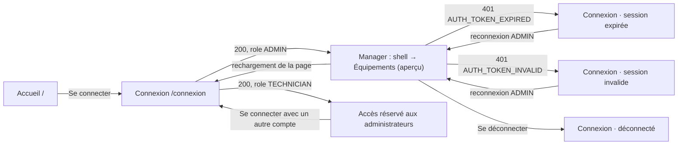

# Aegis Manager — parcours et états de l'entrée

Mode : Prototype. Date : 30 septembre 2026. Complète `brief.md`.

**Légende des textes :**

- **[A]** : texte approuvé (`../asset-lifecycle/sections.md` §3 ou U6),
  repris mot pour mot;
- **[P]** : texte proposé, à approuver par Philippe;
- **[A→P]** : texte approuvé que ce document propose d'adapter (voir
  « Changements de texte à approuver »).

Les identifiants d'état (*slugs*) sont ceux de l'aperçu d'`apps/admin-web`
(`/connexion?apercu=<slug>`), plus `erreur-service` et `deconnecte`, ajoutés
ici.

## 1. Parcours

- **Accueil → Connexion :** lien normal. L'accueil ne charge aucune donnée et
  n'appelle aucune route.
- **Connexion réussie :**
  1. `POST /auth/login` retourne 200.
  2. Le client lit `user.role` dans la réponse.
  3. Si le rôle est `ADMIN`, le jeton est gardé **en mémoire** (`09` §4.2) et
     le client navigue vers la route de retour (voir plus bas), sinon vers
     `/apercu/equipements`, seul écran construit dans cette tranche.
  4. Aucun appel à `/auth/me` n'est nécessaire : la réponse contient déjà le
     profil.
- **Rôle non autorisé (U6) :**
  1. Si le rôle vaut autre chose que `ADMIN`, le jeton est **effacé avant
     tout rendu**.
  2. Aucune route n'est appelée.
  3. Le formulaire est remplacé par l'état `role-non-autorise`.
- **Session expirée ou invalide :**
  1. Toute réponse 401 d'une route protégée, avec `AUTH_TOKEN_EXPIRED` ou
     `AUTH_TOKEN_INVALID`, efface le jeton.
  2. Le client navigue vers `/connexion` avec un **état de routeur en
     mémoire** `{ reason, returnTo, email }`, jamais une requête d'URL.
  3. `returnTo` est un chemin interne du Manager, validé contre la liste des
     routes connues : pas de redirection ouverte.
  4. Après reconnexion d'un compte `ADMIN`, retour à `returnTo`.
- **Déconnexion :** le jeton est effacé localement; aucune route serveur
  n'existe (`09` §4.2). Navigation vers `/connexion` avec
  `{ reason: 'deconnecte' }`. Aucune confirmation n'est demandée : sur le
  Web, rien de physique ne dépend de la session.
- **Rechargement :** le jeton en mémoire est perdu. La page arrive sur
  `/connexion` sans message (point ouvert Q4).
- **Route protégée sans jeton :** redirection vers `/connexion` avec
  `returnTo`, sans message.

## 2. Règles communes à tous les états de connexion

- **Structure :** le formulaire est un vrai `<form method="post" novalidate>`.
  Le champ courriel est `type=email`, `autocomplete=username`,
  `autocapitalize=none` et `spellcheck=false`. Le mot de passe est
  `autocomplete=current-password`, sans `maxlength` : pas de troncature
  silencieuse, le serveur valide.
- **Zone d'alerte :** unique, entre le titre et le premier champ. Elle est
  vide au repos, sans hauteur réservée, et apparaît avec un fondu et une
  translation de 4 px en 200 ms, sans animation en mouvement réduit. Les
  erreurs utilisent `role="alert"`, les informations `role="status"`.
- **Envoi :** un seul envoi à la fois. Tout nouvel envoi pendant une requête
  est ignoré.
- **Délai :** au-delà de 15 s, la requête est abandonnée et l'état passe à
  `service-injoignable`.
- **Valeurs conservées :**
  - après un refus d'identifiants, le courriel est conservé et le mot de
    passe effacé;
  - après une erreur réseau ou serveur, les deux valeurs sont conservées
    (rien n'a été vérifié);
  - le mot de passe revient à l'état masqué avant chaque envoi.
- **Aucun message serveur (`detail`, `title`) n'est affiché tel quel.**
  Seuls le `code` et le `traceId` sont utilisés.
- **Toujours présent sous le bouton :** « Compte fourni par votre
  administrateur. » [A]
- **Jamais :** « Créer un compte », « Mot de passe oublié », choix ou nom
  d'institution.

## 3. Matrice des états de connexion

| Slug | Déclencheur (API) | Traitement visuel | Texte | Focus | Annonce | Actions |
|---|---|---|---|---|---|---|
| `inactif` | Arrivée sans raison | Formulaire vide, zone d'alerte absente | Titre « Connexion » [A] | Champ courriel (`autofocus`, page à usage unique) | Aucune | **Se connecter**; « Afficher » dans le champ mot de passe; « ← Accueil » |
| `validation` (client) | Envoi avec un champ vide ou un courriel mal formé; aucune requête | Champ en erreur : bordure 1,5 px `--ag-blocked-icon`, message sous le champ avec symbole. Pas de résumé (deux champs) | Courriel vide : « Saisissez votre adresse courriel. » [P] · Courriel invalide : « Saisissez une adresse courriel valide, par exemple nom@example.com. » [P] · Plus de 320 caractères : « L'adresse courriel ne peut pas dépasser 320 caractères. » [P] · Mot de passe vide : « Saisissez votre mot de passe. » [P] | Premier champ invalide | Aucune live region : le focus et `aria-describedby` portent le message | Corriger. Revalidation à la saisie après le premier envoi seulement |
| `validation` (serveur) | 400 `VALIDATION_ERROR`, `violations[].field` = `email` ou `password` | Idem, sur le champ désigné | Le message client si la validation locale signale aussi le champ; sinon courriel : « Saisissez une adresse courriel valide… », mot de passe : « Ce mot de passe n'est pas accepté. Vérifiez-le, puis réessayez. » [P, revue R5]. Jamais `message`. Champ ou code inconnu : alerte d'erreur « Vérifiez les champs indiqués, puis réessayez. » [P] | Premier champ désigné, sinon le champ courriel | Si alerte : `role="alert"` | Idem |
| `envoi` | Requête en cours | Bouton : indicateur rotatif et « Connexion… »; `aria-disabled="true"` (et non `disabled`, pour garder le focus). Champs en `readOnly` sur fond `--ag-surface-sunken` | « Connexion… » [P] | Inchangé | Texte masqué `role="status"` : « Connexion en cours. » [P] | Aucune (envoi ignoré) |
| `identifiants-refuses` | 401 `AUTH_INVALID_CREDENTIALS` (même réponse pour compte absent, désactivé ou mot de passe faux, `09` §10.2) | Alerte d'erreur (`--ag-blocked-*`, octogone avec « ! ») | Titre : « Adresse courriel ou mot de passe incorrect. » [A] · Corps : « Vérifiez les deux champs, puis réessayez. » [P] | Champ mot de passe (vidé); son `aria-describedby` inclut l'alerte | `role="alert"` | Ressaisir, **Se connecter** |
| `trop-de-tentatives` | 429 `RATE_LIMITED`, en-tête `Retry-After` en secondes (implémenté par l'API, test à « 55 »; non documenté par `09` §10.2, voir Q1) | Alerte d'avertissement (`--ag-unknown-*`, losange avec horloge). Bouton verrouillé jusqu'à l'échéance : apparence désactivée, `aria-disabled="true"` (le focus est gardé; écart 1 accepté le 1er oct.); sans `Retry-After`, aucun verrou; sous le bouton, indice « Disponible dans 0:55 » en chiffres tabulaires, mis à jour chaque seconde, **hors** live region | Titre : « Trop de tentatives. » [A] · Corps avec `Retry-After` : « Réessayez dans 55 secondes. » [A→P], valeur fixée à la réception · Sans en-tête : « Réessayez dans une minute. » [A] | Inchangé | Alerte `role="alert"` annoncée une fois. À l'échéance : bouton réactivé, **alerte retirée** (retour à l'état `inactif`, sans réannonce; revue R4) et `role="status"` : « Vous pouvez réessayer. » [P] | Attendre, puis **Se connecter**. Les refus ne comptent pas dans la fenêtre (API) |
| `service-injoignable` | Erreur réseau, CORS, délai de 15 s dépassé ou 5xx sans corps problem+json | Alerte d'avertissement (losange avec signal barré) | Titre : « Connexion au service impossible. » · Corps : « Vérifiez le réseau, puis réessayez. » [A, découpé en titre et corps; « puis réessayez » ajouté, P] | Inchangé | `role="alert"` | **Se connecter** (réessai); valeurs conservées |
| `erreur-service` | 5xx avec corps problem+json (`INTERNAL_ERROR`…), ou statut ou code inattendu à la connexion (403, 404…) | Alerte d'erreur; `traceId` en Geist Mono 13 px, sélectionnable, coupure libre | Titre : « Le service n'a pas pu traiter la connexion. » [P] · Corps : « Réessayez dans un instant. Si le problème persiste, transmettez ce code au support : » [P], puis le `traceId`. Sans `traceId` : « Réessayez dans un instant. » seul [P, écart 4] | Inchangé | `role="alert"` | **Se connecter**; valeurs conservées |
| `session-expiree` | Arrivée après un 401 `AUTH_TOKEN_EXPIRED` sur une route protégée | Alerte d'information (`--ag-info-*`, losange avec horloge). Courriel prérempli depuis la mémoire | Titre : « Votre session a expiré. Reconnectez-vous. » [A] · Corps : « L'expiration ne modifie ni les réservations, ni les prêts, ni les opérations en cours. » [A→P, remplace « Vos réservations et prêts sont conservés. »] | Champ mot de passe; `aria-describedby` = alerte, lue avec le champ | `role="status"` (le focus suffit à la lecture) | **Se connecter** → retour à `returnTo` |
| `session-invalide` | Arrivée après un 401 `AUTH_TOKEN_INVALID` (clé changée, jeton altéré…) | Alerte d'information (cercle « i ») | Titre : « Votre session n'est plus valide. Reconnectez-vous. » [P] · Corps : « Aucune réservation, aucun prêt ni aucune opération n'a été modifié. » [P] | Champ mot de passe | `role="status"` | Idem |
| `deconnecte` | Arrivée après « Se déconnecter » | Alerte d'information, titre seul. Champs vides | « Vous êtes déconnecté. » [P] | Champ courriel | `role="status"` | **Se connecter** |
| `role-non-autorise` | 200 avec `user.role` ≠ `ADMIN` (U6). Jeton effacé immédiatement | Le formulaire est remplacé : h1, alerte d'avertissement (carré avec silhouette), ligne « Compte utilisé », bouton principal | h1 : « Accès réservé aux administrateurs » [P] · Titre de l'alerte : « Ce compte technicien s'utilise dans l'application Aegis. » [A, U6] · Corps : « Aegis Manager est réservé aux comptes administrateur. Aucune donnée n'a été chargée et la session a été fermée. » [P] · « Compte utilisé : technician@aegis.demo » [P] | h1 (`tabindex="-1"`), car le contenu est remplacé | Lecture par le focus; alerte `role="alert"` | **Se connecter avec un autre compte** [P] : formulaire vide, focus sur le courriel. « ← Accueil » |
| `connecte` | Aperçu seulement : connexion simulée | Navigation vers `/apercu/equipements` avec la bande d'aperçu | — | h1 de la page | Titre du document mis à jour | — |

Rôle inattendu, autre que `ADMIN` ou `TECHNICIAN` : même état, avec le titre
d'alerte « Ce compte ne peut pas utiliser Aegis Manager. » [P].

## 4. États du shell et de l'aperçu Équipements

| État | Traitement | Texte |
|---|---|---|
| Section courante | Surface opaque, texte accent, repère lumineux de 4 × 16 px à gauche, `aria-current="page"` | — |
| Section à venir | Texte `--ag-text-3` (5,20:1 mesuré sur le verre), cellule vide en tirets à droite. Élément non focusable, `aria-disabled="true"`, texte masqué « , à venir ». Légende sous la liste | Légende : « Section à venir » [P] |
| Menu du compte fermé ou ouvert | Bouton de divulgation (`aria-expanded`, `aria-controls`) et panneau opaque au-dessus. Échap ferme et rend le focus au bouton; un clic extérieur ferme | Nom, courriel, « Apparence », « Système · Clair · Sombre » [A, §5.7], « Se déconnecter » [A] |
| Aperçu Équipements | Bande « Aperçu visuel » sous l'en-tête. Actions `aria-disabled` et décrites par la bande. Données de la fixture MM-001 et MM-002 (10 h 30) | « Aperçu visuel » · « Données illustratives, sans lien avec l'API; les actions sont inactives. La liste réelle arrive avec CAT-01. » [P] |
| Mode aperçu (dev seulement) | Bande dans le flux, en haut du document, magenta en tirets | « Mode aperçu — aucune connexion réelle, données fictives » [P] |
| Tiroir de navigation (< 1024 px) | `<dialog>` modal, focus piégé, Échap et retour du focus | Titre « Menu » [P], bouton « Fermer le menu » [P] (écart 4) |
| Page introuvable | Panneau de la connexion, sans formulaire; focus sur le h1 | « Page introuvable » [P] · « Cette adresse ne correspond à aucune page d'Aegis Manager. » [P] · **Retour à l'accueil** [P] (écart 6) |

Les états de chargement, liste vide, erreur, casier hors ligne et données
périmées d'Équipements relèvent de la tranche CAT-01. Ils ne sont pas simulés
par l'aperçu statique : voir `../asset-lifecycle/sections.md` §5.2.

## 5. Changements de texte à approuver (Philippe)

| # | Approuvé | Proposé | Raison |
|---|---|---|---|
| T1 | « Trop de tentatives. Réessayez dans une minute. » | « Trop de tentatives. Réessayez dans 55 secondes. » quand `Retry-After` est reçu; l'approuvé sinon | L'API fournit le délai réel; « une minute » est faux après 5 s d'attente. Dépend de Q1 |
| T2 | « Votre session a expiré. Reconnectez-vous. Vos réservations et prêts sont conservés. » | Web : « Votre session a expiré. Reconnectez-vous. » + « L'expiration ne modifie ni les réservations, ni les prêts, ni les opérations en cours. » | L'administrateur n'a ni réservation ni prêt. ADR-007 : l'expiration ne termine aucun prêt, ne libère aucun actif et n'interrompt aucune opération autorisée. Texte iOS inchangé |
| T3 | « Connexion au service impossible. Vérifiez le réseau. » | Titre « Connexion au service impossible. » et corps « Vérifiez le réseau, puis réessayez. » | Structure titre et corps commune à toutes les alertes; action explicite |
| T4 | — | Tous les textes marqués [P] ci-dessus, y compris ceux ajoutés par la revue du 1er octobre (R5, tiroir, page introuvable) | Nouveaux états ou détails non couverts par §3 |
