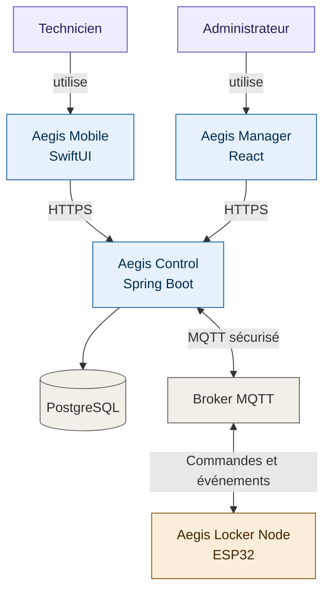

# Architecture globale

Acteurs et grands blocs du système Aegis : technicien, administrateur, application iOS, administration React, backend Spring Boot, PostgreSQL, broker MQTT et le locker ESP32.

Ce diagramme est la version canonique — la même que celle intégrée dans la section « Architecture du système » du [`README.md`](../../README.md). Style et palette définis dans le skill [`aegis-hardware-diagrams`](../../.claude/skills/aegis-hardware-diagrams/SKILL.md) (section « System / actor architecture style »); ne pas renommer les blocs sans mettre à jour les deux emplacements.

## Légende des catégories

| Catégorie | Contenu |
|---|---|
| Persona (violet) | Technicien, Administrateur |
| Logiciel (bleu) | Aegis Mobile, Aegis Manager, Aegis Control |
| Infra (gris) | PostgreSQL, Broker MQTT |
| Matériel (ambre) | Aegis Locker Node (ESP32) |

## Règles de confiance représentées

- Le Web et le mobile ne parlent qu'à `Aegis Control` — jamais directement à PostgreSQL ni au locker.
- `Aegis Control` est la seule autorité métier; le broker et le locker ne font que transporter et exécuter des commandes déjà autorisées.
- Le nœud reste nommé « Aegis Locker Node » plutôt que « hub/cellule » : cette architecture matérielle est encore soumise au POC de [`scope.md` §17.5](../cahier-conception/scope.md) et n'est pas un engagement du P0.
