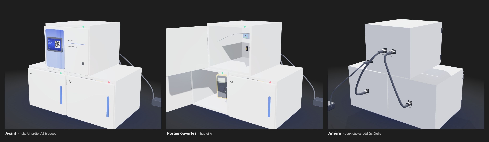

# Architecture physique du prototype Aegis

Ces figures consolident les vues et recherches matérielles de Jimmy avec le
périmètre P0, le [document 12](../../cahier-conception/12-architecture-physique.md)
et [ADR-002](../../adr/ADR-002-etoile-rs485.md). Elles distinguent la topologie
acceptée des composants et paramètres qui doivent encore être qualifiés.

## Vue du prototype

La vue avant/arrière conserve les choix de présentation de Jimmy : écran dans
le hub, trappe complète et voyant sur chaque cellule, connecteurs regroupés à
l'arrière. La disposition illustre un hub avec exactement deux compartiments
A1/A2 sans figer les dimensions ni la fixation mécanique.

- Une cellule correspond exactement à un compartiment.
- Le hub porte l'écran, le calcul et le réseau; les cellules n'ont pas d'écran.
- Chaque cellule possède un connecteur arrière dédié vers le hub.
- Les dimensions, l'empilage et la fixation restent à valider avec le prototype.

## Topologie en étoile

La topologie P0 utilise deux départs directs depuis le hub. Les segments A1 et
A2 ne partagent ni câble de cellule ni lignes RS-485; seul le hub communique
avec le broker MQTT.

- Deux ports, deux câbles et deux segments RS-485 indépendants sont retenus.
- Les cellules n'ont ni identité IP, ni Wi-Fi, ni client MQTT.
- Un M12 codé A à 5 contacts est recommandé à la revue comme connecteur de cellule.
- Son brochage, les protections, le protocole local et la puissance exigent encore un POC.

## Composition fonctionnelle d'une cellule

Cette vue borne les responsabilités locales sans choisir prématurément le
microcontrôleur, le brochage ou les protections. Le bloc de connecteur se trouve
bien entre le câble dédié du hub et l'interface RS-485 de la cellule. Le
contrôleur reçoit une commande ciblée, actionne le verrou et produit des
observations; il ne décide jamais si l'utilisateur est autorisé.

- Le verrou est actionné par un driver adapté, jamais directement par un GPIO.
- Le M12 codé A à 5 contacts est une proposition verrouillable, pas une décision acceptée.
- Le capteur de porte et le RFID produisent des observations distinctes.
- Le RFID local reste le premier choix soumis au POC et à son fallback documenté.
- Une perte de lecteur ou de liaison ne constitue jamais une preuve d'absence.

## Banc d'essai du verrou

Le banc caractérise le verrou candidat avant son intégration dans une cellule.
Le schéma montre le principe de mesure, non un câblage final approuvé.

- L'ampèremètre est placé en série dans la boucle d'actionnement.
- L'interrupteur est momentané et l'impulsion reste volontairement contrôlée.
- La protection exacte dépend de la fiche du composant et des mesures réelles.
- Courant, durée, ouverture, échauffement et repos sans tension sont consignés.

## Rendu 3D d'intention

Rendu Three.js du prototype P0 : trois modules de même gabarit, le hub portant
l'écran sur une porte de service, A1 et A2 reliées chacune au hub par leur
propre câble M12. Illustration de conception, non un résultat de POC.

- Le modèle [`casier-p0.stl`](rendu-3d/casier-p0.stl) se consulte en 3D directement dans GitHub.
- La page [`casier-3d.html`](rendu-3d/casier-3d.html) est interactive : portes, vues, M12 ou RJ45, pose murale.
- Le gabarit de 300 × 260 × 340 mm et le hub au même format que les cellules sont des propositions à valider.
- Les motifs à quatre modules sont hors P0 et restent dans [`docs/research/rendu-3d-motifs.md`](../../research/rendu-3d-motifs.md).

## Légende commune

| Style | Sens |
|---|---|
| Vert | Hub ou élément retenu de l'architecture |
| Gris | Cellule, interface ou composant générique |
| Bleu | Données, réseau ou liaison locale |
| Ambre | Actionnement ou choix soumis à qualification |
| Pointillé | Composant, protection ou technologie encore à confirmer |

## Statut

**Architecture P0 acceptée; disposition, composants électriques, brochage,
puissance et performance RFID à qualifier par POC.**
