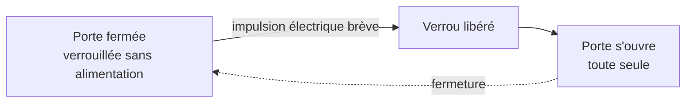

# Architecture physique du locker (prototype)

Diagrammes conceptuels, niveau prototype — pas des plans côtés. Ils traduisent les décisions prises en discussion sur le hub/cellule : vues, mécanisme de verrouillage, test du verrou et connectivité.

## Vues du hub et des cellules

Vue d'ensemble du matériel, pour qui découvre le projet : le hub (écran, calcul, réseau) commande une ou plusieurs cellules — chaque cellule est un casier verrouillé indépendant, pas une sous-partie du hub.

- Points de fixation inter-cubes intégrés à chaque face, bouchon amovible si inutilisés — un seul modèle de panneau latéral, réutilisé sur les quatre faces verticales de chaque cube.

## Mécanisme de verrouillage

Cycle simplifié, pour qui découvre le projet : au repos la porte est verrouillée sans alimentation; une brève impulsion électrique libère le verrou, la porte s'ouvre alors toute seule; la refermer la reverrouille automatiquement.

- Solénoïde à impulsion sur un cliquet à ressort (fail-secure) : la fermeture arme le ressort du verrou rotatif, le cliquet le retient verrouillé sans alimentation; une impulsion brève libère le cliquet, le verrou pivote et la porte s'ouvre seule (déverrouillage manuel disponible en secours). Satisfait l'invariant firmware « état sûr par défaut » ([`aegis-esp32-mqtt`](../../../.claude/skills/aegis-esp32-mqtt/SKILL.md)) au niveau matériel.
- Capteur de porte et voyant montés sur le cadre, jamais sur la trappe — évite tout câblage traversant la charnière.
- Composant retenu : verrou rotatif électrique Sutertech 12 V, 330 lbs de force de maintien, acier robuste, déverrouillage manuel — [fiche produit](https://www.amazon.com/Generic-Electric-Electromagnetic-Control-Solenoid/dp/B0CRDTS1PV).

## Test du verrou (banc d'essai)

Montage électrique minimal pour valider le verrou rotatif seul avant de l'intégrer au casier : confirme le fonctionnement en 12 V par impulsion brève, et mesure le courant réel — seules la tension et la force de maintien sont documentées pour ce composant, pas le courant d'appel.

- Alimentation 12 V, jamais maintenue : reproduire une impulsion brève (quelques centaines de ms), pas un maintien sous tension.
- L'ampèremètre en série donne le courant d'appel réel, utile pour dimensionner le câblage une fois mesuré.

## Connectivité

Topologie étoile : un port et un câble dédiés par cellule depuis le hub.

| Catégorie | Contenu |
|---|---|
| Hub (vert) | Écran + calcul + réseau MQTT |
| Cellule (gris) | Lock + sensor |
| Câble (bleu) | `power + data`, un par cellule, aucun câble partagé |

- Topologie étoile inchangée : un port et un câble dédiés par cellule, aucun câble partagé — voir [`aegis-hardware-diagrams`](../../../.claude/skills/aegis-hardware-diagrams/SKILL.md) pour le style de référence.

## Statut

Prototype / exploratoire. Le mécanisme physique n'est pas encore figé (voir [`scope.md` §17.5](../../cahier-conception/scope.md)) : si la conception change, régénérer le `.svg` (ou le `.drawio` source, pour les vues) plutôt que de garder un historique séparé. Palette dark-only (fixe, pas de variante claire) définie dans le skill [`aegis-hardware-diagrams`](../../../.claude/skills/aegis-hardware-diagrams/SKILL.md).
