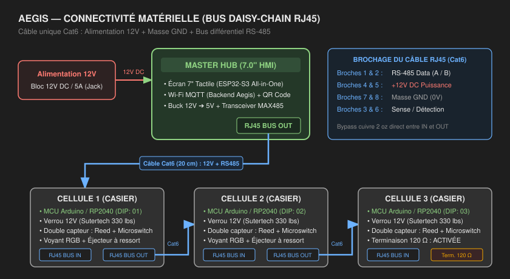
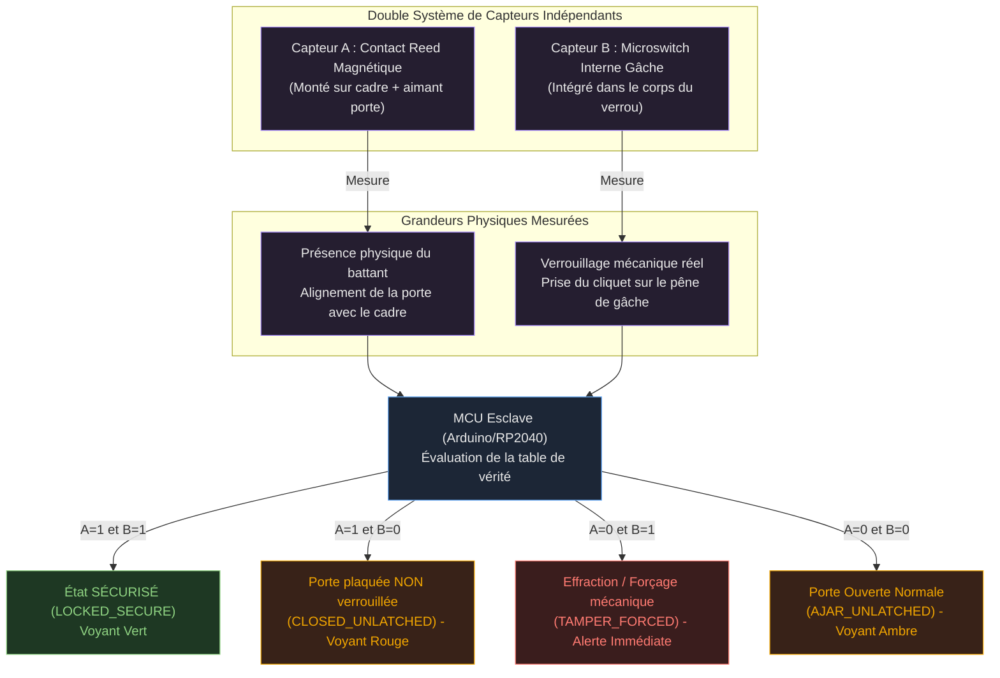

# Architecture physique du système Aegis (Hub & Cellules Modulaires)

Ce document décrit l'architecture matérielle retenue pour le système Aegis : le Master Hub (écran 7.0" tactile + ESP32-S3), les Cellules modulaires de casiers (Arduino + verrou rotatif 12V) et leur interconnexion en bus série RJ45 unifié.

---

## 1. Vue d'ensemble du matériel

Le système physique se compose de deux types de modules :
* **Master Hub (7.0" HMI)** : Module central d'affichage et de communication réseau. Il pilote la liaison Wi-Fi / MQTT avec le backend, génère le QR code dynamique et injecte l'alimentation et les ordres sur le bus.
* **Cellules Modulaires (Casiers)** : Nœuds esclaves autonomes empilables/interverrouillables par pions de centrage, chaînés en cascade (Daisy-Chain) via un câble réseau unique.

---

## 2. Spécifications du matériel par module

### 2.1 Master Hub (Le Cerveau)
* **Écran & Processeur :** Module tout-en-un HMI 7.0" capacitif (800 × 480) avec **ESP32-S3** intégré (Wi-Fi 802.11 b/g/n, Bluetooth BLE, 16 Mo Flash, 8 Mo PSRAM).
* **Alimentation externe :** Prise Jack DC 5.5 × 2.1 mm recevant du **12V DC / 5A** (bloc secteur 60W).
* **Régulation interne :** Convertisseur DC-DC Buck (12V ➔ 5V 3A) alimentant l'écran et la logique.
* **Communication bus :** Transceiver différentiel **MAX485** relié à l'UART de l'ESP32-S3.
* **Sortie Bus :** 1 port femelle **RJ45 (`BUS OUT`)** injectant la puissance 12V et les signaux RS-485.

### 2.2 Cellule Modulaire (Le Casier)
* **Microcontrôleur local :** **Arduino Nano** (ou RP2040 Pico) dédié au décodage de trames, à la commande du verrou et à la lecture des capteurs.
* **Ports d'interconnexion :** 2 embases **RJ45 (`BUS IN` et `BUS OUT`)** avec pistes de cuivre directes pour faire passer le 12V et le GND sans interruption vers le casier suivant.
* **Adressage matériel :** **DIP Switch 4 positions** permettant de définir manuellement l'adresse du casier de 1 à 16 sur le bus.
* **Actuateur :** Verrou rotatif électrique **Sutertech 12V** (force de retenue 330 lbs / 1500 N, électromécanique *fail-secure*, déverrouillage manuel de secours).
* **Éjecteur mécanique :** Poussoir à ressort interne comprimé à la fermeture qui projette la porte vers l'avant de 10 à 15 mm dès l'ouverture du loquet.
* **Driver de puissance :** Transistor **MOSFET canal N** (AO3400 ou IRLZ44N) + diode de roue libre **1N4007** + condensateur tampon **470 µF / 25V** (amortit l'appel de courant sans creux de tension sur le bus).
* **Voyant de façade :** LED RGB en façade (Vert = Prêt/Verrouillé, Bleu/Ambre = Déverrouillé, Rouge = Alarme/Mal fermé).

---

## 3. Le Câble RJ45 Tout-en-un (Brochage unifié)

Un seul câble réseau Cat6 standard relie chaque module au suivant, transportant à la fois l'électricité et les signaux différentiels (style Passive PoE) :

| Broches RJ45 | Paire de fils | Signal / Fonction | Rôle |
|:---:|:---:|:---:|:---|
| **1 & 2** | Paire Orange | **RS-485 Data (A / B)** | Ligne série différentielle semi-duplex (ordres & statuts) |
| **4 & 5** | Paire Bleue | **+12V DC (Power Bus)** | Alimentation partagée pour les solénoïdes (conducteurs doublés) |
| **7 & 8** | Paire Marron | **GND (Masse retour)** | Retour de masse commun (conducteurs doublés) |
| **3 & 6** | Paire Verte | **Sense / Détection** | Ligne auxiliaire de détection de boucle de continuité |

> **Note :** La dernière cellule de la chaîne active un cavalier de résistance de terminaison de **120 Ω** entre les lignes A et B pour éviter les échos sur le signal.

---

## 4. Système Double Capteur & Logique de Sécurité

Chaque casier dispose de **deux capteurs physiques indépendants** pour éliminer tout faux positif et certifier la tenue mécanique :

### Table de vérité des capteurs

| Capteur A (Reed) | Capteur B (Microswitch) | État Casier | Diagnostic & Comportement Système |
|:---:|:---:|:---:|:---|
| **1 (Fermé)** | **1 (Engagé)** | `LOCKED_SECURE` | **Verrouillage effectif.** Battant plaqué et verrou enclenché. Voyant Vert fixe. |
| **0 (Ouvert)** | **0 (Dégagé)** | `AJAR_UNLATCHED` | **Ouverture nominale.** Porte libérée suite à déverrouillage autorisé. Voyant Ambre clignotant. |
| **1 (Fermé)** | **0 (Dégagé)** | `CLOSED_UNLATCHED` | **Porte mal claquée.** Battant contre le montant mais loquet non pris. Voyant Rouge (l'utilisateur doit appuyer fermement). |
| **0 (Ouvert)** | **1 (Engagé)** | `TAMPER_FORCED` | **ALERTE EFFRACTION.** Loquet armé mais battant écarté du cadre (pied de biche). Alerte MQTT critique immédiate. |

### Traitement anti-rebond (Debounce)
* **Matériel (Filtre RC) :** Résistance de rappel $10\text{ k}\Omega$ + condensateur $100\text{ nF}$ ($\tau = 1\text{ ms}$) éliminant les étincelles de contact.
* **Logiciel (Hystérésis) :** Scrutation toutes les 10 ms. Un état n'est validé par l'Arduino que s'il reste **stable pendant 40 ms consécutives**.

---

## 5. Invariants et Sécurité Électromécanique

1. **Sécurité passive (*Fail-Secure*) :** Le verrou rotatif reste bloqué mécaniquement sous ressort en l'absence totale de tension. Une coupure de courant ne libère aucun casier.
2. **Protection thermique du solénoïde :** Le firmware de la cellule coupe impérativement le MOSFET après **200 ms** (coupure matérielle de sécurité à 250 ms) avec une période de repos forcé de 1.5 s, empêchant la destruction thermique de la bobine 12V.
3. **Bypass de puissance :** Le passage du courant 12V/GND entre les ports `BUS IN` et `BUS OUT` d'une cellule s'effectue directement sur le PCB, garantissant l'alimentation des casiers suivants même si le microcontrôleur d'une cellule est réinitialisé.

