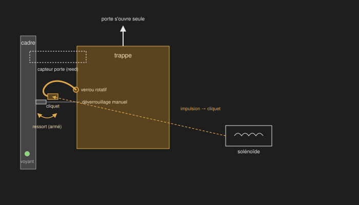

# Architecture physique du locker (prototype)

Diagrammes conceptuels, niveau prototype — pas des plans côtés. Ils traduisent les décisions prises en discussion sur le hub/cellule : vues, mécanisme de verrouillage et connectivité.

## Vues du hub et des cellules

Vue avant (écran + hub + cellule avec voyant de disponibilité) et arrière (connecteurs + alimentation) du prototype, niveau conceptuel — pas de plan coté.

| Catégorie | Contenu |
|---|---|
| Hub (vert) | Écran (bleu, encart) + calcul + réseau |
| Cellule (ambre) | Trappe + voyant de disponibilité |
| Connecteur (gris) | Connecteurs et alimentation en face arrière |

- Points de fixation inter-cubes intégrés à chaque face, bouchon amovible si inutilisés — un seul modèle de panneau latéral, réutilisé sur les quatre faces verticales de chaque cube.

## Mécanisme de verrouillage

Coupe conceptuelle du verrou : verrou rotatif à ressort armé à la fermeture, retenu par un cliquet que le solénoïde à impulsion libère — la porte s'ouvre alors seule sous l'action du ressort. Déverrouillage manuel disponible en secours; capteur de porte et voyant restent montés sur le cadre fixe.

| Catégorie | Contenu |
|---|---|
| Trappe (ambre) | Verrou rotatif, ressort, cliquet |
| Cadre (gris) | Fixe — capteur de porte, voyant |

- Solénoïde à impulsion sur un cliquet à ressort (fail-secure) : la fermeture arme le ressort du verrou rotatif, le cliquet le retient verrouillé sans alimentation; une impulsion brève libère le cliquet, le verrou pivote et la porte s'ouvre seule (déverrouillage manuel disponible en secours). Satisfait l'invariant firmware « état sûr par défaut » ([`aegis-esp32-mqtt`](../../../.claude/skills/aegis-esp32-mqtt/SKILL.md)) au niveau matériel.
- Capteur de porte et voyant montés sur le cadre, jamais sur la trappe — évite tout câblage traversant la charnière.
- Composant retenu : verrou rotatif électrique Sutertech 12 V, 330 lbs de force de maintien, acier robuste, déverrouillage manuel — [fiche produit](https://www.amazon.com/Generic-Electric-Electromagnetic-Control-Solenoid/dp/B0CRDTS1PV).

## Connectivité

Topologie étoile : un port et un câble dédiés par cellule depuis le hub, un fusible réarmable (PTC) par port.

| Catégorie | Contenu |
|---|---|
| Hub (vert) | Écran + calcul + réseau MQTT |
| Cellule (gris) | Lock + sensor |
| PTC (ambre) | Fusible réarmable, un par port |
| Câble (bleu) | `power + data`, un par cellule, aucun câble partagé |

- Topologie étoile inchangée : un port et un câble dédiés par cellule, aucun câble partagé — voir [`aegis-hardware-diagrams`](../../../.claude/skills/aegis-hardware-diagrams/SKILL.md) pour le style de référence.
- Fusible réarmable (PTC), pas un fusible à usage unique : le solénoïde tire un courant d'appel bref à chaque impulsion (~0.5–1 A, estimation provisoire — fiche technique du composant retenu non disponible); le PTC tolère l'appel et se réarme seul après un vrai défaut.

## Statut

Prototype / exploratoire. Le mécanisme physique n'est pas encore figé (voir [`scope.md` §17.5](../../cahier-conception/scope.md)) : si la conception change, régénérer le `.svg` (ou le `.drawio` source, pour les vues) plutôt que de garder un historique séparé. Palette dark-only (fixe, pas de variante claire) définie dans le skill [`aegis-hardware-diagrams`](../../../.claude/skills/aegis-hardware-diagrams/SKILL.md).
