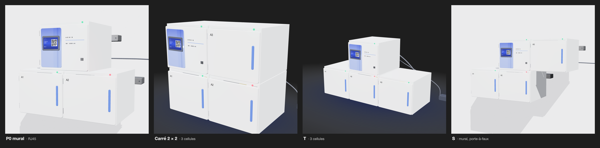

# Rendu 3D — motifs d'assemblage hors P0

Exploration de l'assemblage des modules Aegis au-delà du P0 : pose murale du
P0 en RJ45, puis trois motifs à quatre modules. Ces vues servent à discuter de
la modularité; elles ne modifient ni le scope ni l'étoile à deux départs
acceptée par ADR-002.

- Chaque motif garde l'étoile : un port du hub et un câble dédié par cellule.
- Une troisième cellule exige un troisième port, son interface RS-485 et la capacité d'alimentation correspondante (document 12 §3).
- Un motif en porte-à-faux, comme le S, impose la pose murale.
- Au mur, les câbles passent dans un espace de 70 mm derrière les modules, entre les tasseaux; cette fixation n'est pas dimensionnée.

## Statut

Exploratoire, hors P0. Source interactive :
[`casier-3d.html`](../diagrams/architecture-physique/rendu-3d/casier-3d.html).
